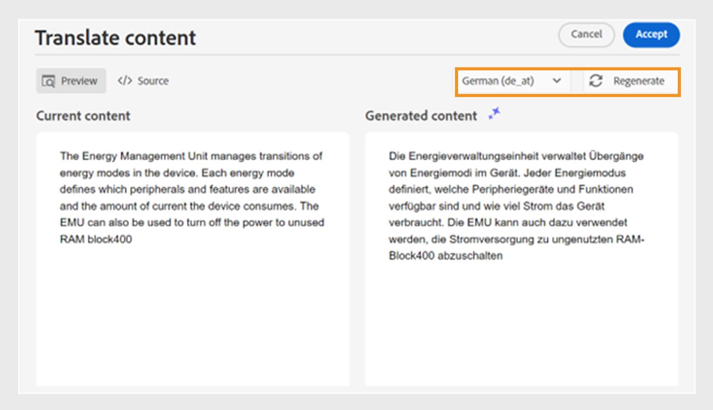

# 효율적인 문서 작성을 위한 AI Assistant

Experience Manager Guides은 보다 스마트하고 빠르게 작성할 수 있도록 도와주는 AI Assistant 도구를 제공합니다. 지능적인 제안 및 최적화를 통해 간소화된 문서 처리를 경험할 수 있습니다. 이 도구를 사용하여 기존 콘텐츠 저장소의 콘텐츠를 재사용하기 위한 스마트 제안을 봅니다. 텍스트 프롬프트 기능을 사용하여 프롬프트를 제공하고 콘텐츠를 변경하거나 요구 사항에 따라 출력을 생성합니다. AI Assistant를 사용하여 단락을 목록으로 스마트 변환합니다. 현재 주제에 대한 간단한 설명을 만들 수 있습니다. 이 기능을 사용하면 선택한 콘텐츠를 쉽게 개선하고 번역할 수도 있습니다.

>[!NOTE]
>
> 오른쪽 패널에 AI Assistant 기능을 추가하려면 시스템 관리자가 **Workspace 설정** **Workspace 설정 아이콘**&#x200B;의 **패널** 탭에서  옵션을 선택해야 합니다.
> &#x200B;> 또한 AI Assistant 아이콘을 보려면 문서를 체크아웃해야 합니다.

이 기능은 DITA 주제에만 사용할 수 있습니다. 항목에서 텍스트를 선택한 후 AI Assistant 작업을 수행하도록 선택할 수 있습니다.

## 재사용 가능한 콘텐츠 제안

**재사용 가능한 콘텐츠 제안**  기능을 사용하여 일관되고 정확하게 콘텐츠를 작성합니다. 콘텐츠를 선택할 수 있으며 Experience Manager Guides에서는 저장소의 기존 콘텐츠를 재사용하는 방법에 대한 제안 사항을 제공합니다.
[AI 기반의 스마트 제안을 사용하여 콘텐츠를 작성하는 방법](authoring-ai-based-smart-suggestions.md)에 대해 자세히 알아보세요.

## 텍스트 프롬프트 사용

텍스트 프롬프트는 특정 응답이나 출력을 생성할 때 AI Assistant를 안내하는 지침, 질문 또는 명령문입니다.

텍스트 프롬프트를 사용하여 콘텐츠를 변경하고 출력을 생성할 수 있습니다.  예를 들어 제품의 기능 요약을 생성하여 보고서에 사용하여 제품을 표시할 수 있습니다. 이 기능을 사용하여 두 제품을 비교할 수도 있습니다. 예를 들어 두 제품의 기능에 대한 비교 표를 만들 수도 있습니다.

1. 텍스트 프롬프트를 사용할 텍스트를 선택합니다.
1. **AI Assistant** 패널에서  **ai 텍스트 프롬프트 사용 아이콘**&#x200B;을 선택합니다.
1. 다음 방법 중 하나로 프롬프트를 제공합니다.

   - 제안된 프롬프트 중에서 프롬프트를 선택합니다.
   - 제안 프롬프트를 수정하거나 편집하여 요구 사항에 따라 사용자 정의 프롬프트를 만듭니다.

     >[!NOTE]
     >
     > 제안된 프롬프트는 관리자가 `ui_config.json`에 구성했습니다.

   - 텍스트 상자에 프롬프트를 입력합니다.

1. AI 도구와 같은 프롬프트에 따라 다른 응답 또는 출력을 위해 **다시 생성** 을 선택합니다.

1. (선택 사항) **확장** 을 선택하여 **텍스트 프롬프트 사용** 편집기를 엽니다. 현재 콘텐츠와 생성된 콘텐츠를 표시합니다. 소스 레이아웃 콘텐츠를 편집하고 미리보기를 확인할 수 있습니다.

   >[!NOTE]
   >
   > 응답은 선택한 콘텐츠를 기반으로 생성됩니다.

1. 편집기에서 프롬프트를 편집하고 응답을 재생성할 수도 있습니다. 예를 들어 프롬프트를 변경하여 텍스트를 약 40단어로 간결하게 만들 수 있습니다.

   

1. 생성된 콘텐츠의 소스를 확인하고 필요한 경우 편집할 수 있습니다.

1. **수락**&#x200B;을 선택하여 항목에서 선택한 콘텐츠를 생성된 콘텐츠로 바꿉니다.
1. **취소**: 텍스트 프롬프트 작업을 취소합니다. 패널의 초기 상태로 돌아갑니다.

   >[!NOTE]
   >
   > 기능 패널에서 **취소** 아이콘을 선택하면 초기 상태로 돌아갑니다.

## 콘텐츠 개선

선택한 콘텐츠를 개선합니다. 맞춤법, 언어 및 문법 구조를 확인하고 더 나은 버전의 콘텐츠를 제안합니다. 그것은 또한 문장의 질을 향상시켜줍니다.

1. 콘텐츠를 선택합니다.
1. 개선된 콘텐츠에 대한 제안을 찾으려면 **콘텐츠 개선** 을 선택하세요.
1. 개선된 콘텐츠에 대한 다른 제안을 보려면 **다시 생성**&#x200B;을 선택하십시오.

1. (선택 사항) 개선된 콘텐츠 편집기를 열려면 **확장**&#x200B;을 선택합니다. 현재 및 생성된 콘텐츠가 표시됩니다. 소스 레이아웃에서 콘텐츠를 편집하고 미리보기를 확인할 수도 있습니다.

제안을 수락하거나 다른 응답을 위해 재생성하거나 작업을 취소하여 이전 상태로 돌아갑니다.

## 단축키 만들기

30~50단어 정도에서 선택한 콘텐츠를 기반으로 주제에 대한 간단한 설명을 만듭니다. 짧은 설명은 사용자가 관련 콘텐츠를 검색하고 찾는 데 도움이 됩니다.
예를 들어 시스템 요구 사항을 나열하고 그에 따라 간단한 설명을 생성할 수 있습니다.

1. 콘텐츠를 선택합니다.
1. 현재 주제에 대한 간단한 설명을 만들려면 **간단한 설명 만들기** 을 선택하십시오.
1. 짧은 설명이 없는 경우 **승인**&#x200B;을 선택하여 짧은 설명을 새로 만드십시오. 짧은 설명이 있는 경우 새로 추가된 짧은 설명으로 대체하기 전에 확인해야 합니다.

다음 작업도 수행할 수 있습니다.

- AI 도구와 같은 주제에 대한 다른 간단한 설명을 생성하려면 **다시 생성**&#x200B;을 선택하십시오.
- **확장**&#x200B;을 선택하여 **바로 가기 만들기** 편집기를 엽니다.

## 컨텐츠 항목화

이 기능은 선택한 단락을 목록으로 지능적으로 변환합니다.  콘텐츠를 분석하고 항목의 논리적 목록을 만듭니다. 항목을 수동으로 만들 필요가 없습니다. 예를 들어 사용자 계정을 만드는 단계를 자세히 설명하는 단락이 있는 경우 도구에서 이 단원을 단계별 목록으로 변형하여 항목을 하나씩 수동으로 만들 필요가 없습니다.

1. 콘텐츠를 선택합니다.
1. **콘텐츠 항목** 을 선택하여 선택한 콘텐츠를 목록으로 변환합니다.
AI 지원 도구는 콘텐츠를 스마트 항목 목록으로 변환합니다.
1. (선택 사항) **확장**&#x200B;을 선택하여 **항목별 콘텐츠** 편집기를 엽니다.
1. 목록이 준비되면 생성된 콘텐츠의 변경 사항을 적용합니다. 그러면 생성된 콘텐츠가 선택한 콘텐츠를 대체합니다.

## 콘텐츠 번역

이 지능형 기능을 사용하여 선택한 콘텐츠를 타겟 언어로 번역합니다. 예를 들어, 영어로 된 콘텐츠를 추가하고 독일어로 빠르게 번역할 수 있습니다.
콘텐츠를 번역하려면 다음 단계를 수행하십시오.

1. 번역할 콘텐츠를 선택합니다.
1. AI Assistant 패널에서 **콘텐츠 번역** 을 선택합니다.
1. 드롭다운에서 타겟 언어를 선택합니다. 번역된 콘텐츠가 AI 지원 패널에 표시됩니다.

1. (선택 사항) **확장**&#x200B;을 선택하여 **콘텐츠 번역** 편집기를 엽니다.
1. 드롭다운 메뉴에서 다른 언어를 선택하고 선택한 언어로 콘텐츠를 재생성할 수도 있습니다. 예를 들어 프랑스어를 선택한 다음 **재생성**&#x200B;을 선택하면 콘텐츠가 프랑스어로 번역됩니다.

