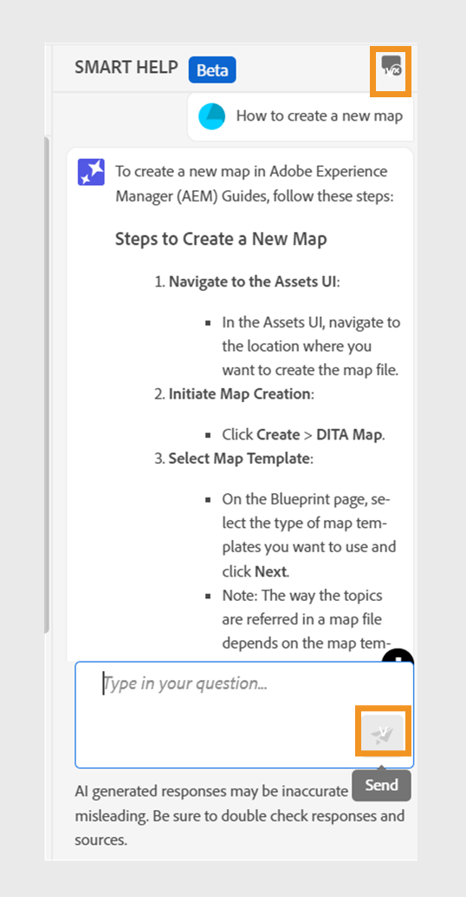

# 콘텐츠 검색에 대한 AI 기반 스마트 도움말

Experience Manager Guides은 [Adobe Experience Manager Guides 설명서](https://experienceleague.adobe.com/en/docs/experience-manager-guides/using/overview)에서 관련 콘텐츠를 찾는 데 도움이 되는 대화형 검색 기능인 GenAI 기반 스마트 도움말을 제공합니다.
질문을 하고 유익한 방법으로 답변을 얻을 수 있다. 쿼리에 대한 답변은 제품 설명서의 콘텐츠를 기반으로 합니다. 이 검색은 완전히 대화형입니다. 질문을 한 다음 응답을 기반으로 추가 질문을 할 수도 있습니다. 이 응답에는 소스 문서에 대한 링크도 포함되어 있습니다. 자세한 내용은 을 참조하십시오.

예를 들어, Experience Manager Guides에서 설명서에 대한 주제를 만들 수 있습니다. *주제를 만드는 방법을 물어볼 수 있습니다.* 응답 및 관련 문서에 대한 링크를 받습니다. 그런 다음 문서에 대한 PDF 출력을 생성하는 방법을 배우려면 관련 질문을 할 수 있습니다. 예를 들어 *PDF에 항목을 게시하는 방법* 또는 *주제에 대한 PDF 출력을 생성하는 방법*

웹 편집기를 열면 오른쪽에 **스마트 도움말** 패널이 나타납니다.

>[!NOTE]
>
> 관리자가 **스마트 도움말** 기능을 구성해야 합니다. 자세한 내용은 클라우드 서비스 설치 및 구성 안내서의 [콘텐츠를 검색하도록 AI 기반 스마트 도움말 구성](/help/product-guide/cs-install-guide/conf-smart-help.md) 섹션을 참조하십시오.

{width="300" align="left"}

***스마트 도움말**패널을 봅니다.*

대화형 검색을 사용하여 적절한 콘텐츠를 찾고 쿼리를 해결하려면 다음 단계를 수행하십시오.

1. **스마트 도움말** 을 선택하여 패널을 엽니다.

   >[!NOTE]
   >
   > [전역 또는 폴더 수준 프로필](/help/product-guide/cs-install-guide/conf-folder-level.md#conf-ai-guides-assistant)에서 관리자는 패널에 표시되는 기본 질문을 정의해야 합니다.

1. 질문을 입력하여 Experience Manager Guides 설명서에서 관련 콘텐츠를 찾습니다. 패널에서 기본 질문을 선택하거나 텍스트 상자에 질문을 입력할 수 있습니다.

1. 질문에 대한 응답을 보려면 **보내기** 을 선택하거나 **Enter**&#x200B;를 누르십시오.

   질문에 따라 콘텐츠, 적용 가능한 이미지 및 기사 링크를 볼 수 있습니다.

   {width="300" align="left"}

   *샘플 질문을 선택하고 응답으로 콘텐츠와 이미지를 봅니다.*

1. 끝에 있는 문서에 대한 링크를 선택하고 질문에 대한 자세한 정보를 확인합니다.

1. 패널에서 대화 기록을 제거하려면 **대화 지우기** 를 선택하십시오. 그런 다음 새로운 대화를 시작하고 관련 콘텐츠를 찾을 수 있습니다.

이 스마트 기능을 사용하면 신속하게 솔루션을 찾고 설명서에 집중하여 작업을 효율적으로 완료할 수 있습니다.
