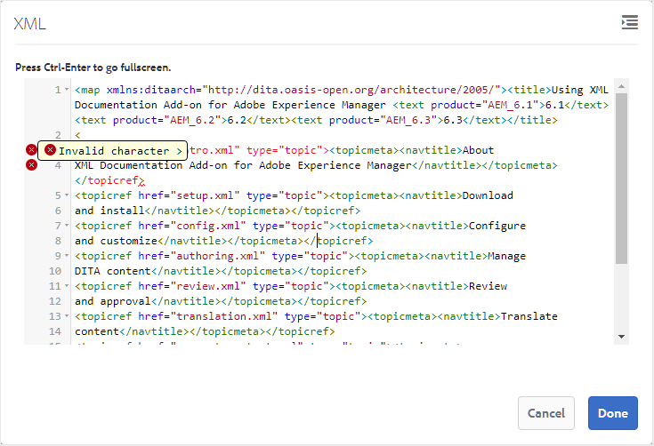
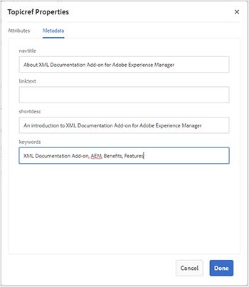
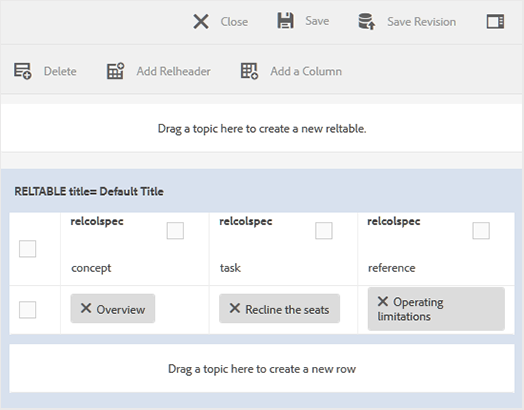

# Work with the Basic Map Editor {#id1942CM005Y4}

>[!NOTE]
>
> The Basic Map Editor, previously available in Experience Manager Guides, has been deprecated starting from version 4.3 and 2307. You can&#39;t access the Basic Map Editor to create and manage DITA maps.
>You are recommended to use the Advanced Map Editor. The Advanced Map Editor offers enhanced features and better customization options. Explore more about how to work with the [Advanced Map Editor](../user-guide/map-editor-advanced-map-editor.md).

The Basic Map Editor provides an easy drag-and-drop feature to add topics from your AEM repository to create the DITA map or bookmap. You can add nested topics, relationship tables \(reltable\), attributes and metadata information, and also validate the map for correctness.

>[!NOTE]
>
> If your administrator has enabled the Advanced Map Editor option, then you will not have access to the Basic Map Editor. All map files will open in the Advanced Map Editor by default.

The following sections describe the various functions available in the Basic Map Editor.

## 맵 파일에 주제 추가 {#id193CBL0505Z}

Once a map file is created, you need to add topics to the map file. Using the Basic Map Editor, you can add topics, relationship tables, or other map files.

Perform the following steps to build your map file:

1. Assets UI에서 편집할 맵 파일로 이동합니다.

1. 맵 파일에서 단독 잠금을 설정하려면 맵 파일을 선택하고 **체크 아웃**&#x200B;을 클릭하세요.

   >[!NOTE]
   >
   > 맵 파일에 대해 배타적 잠금 기능이 있는 경우 다른 사용자는 맵을 편집할 수 없습니다. 그러나 맵 파일 내의 주제에 대해서는 작업할 수 있습니다.

1. With the map file selected, click **Edit**.

   The map file is opened for editing in the Map Editor. Using the Map Editor, you build a map by using the currently available topics that are displayed in the References rail.

   {width="800" align="left"}

1. Using the **References** rail, navigate to the folder that contains the topics or sub-maps that you want to add.

   >[!NOTE]
   >
   > You can add topics or sub-maps from any folder in the References rail.

1. To add the first topic to the map, drag-and-drop the topic onto the Basic Map Editor.

   >[!NOTE]
   >
   > After adding the first link, the Add New Reference link is available when you hover your mouse over an existing topic in the map.

1. To add subsequent topics or a sub-map, drag-and-drop the topic or sub-map to the required location in the map.

   If you add a sub-map to your DITA map, the sub-map is shown as a link in the DITA map. To view all the topics of the sub-map, click the sub-map link. The content of the sub-map are shown in a new tab.

   >[!NOTE]
   >
   > If you drop a new topic on an existing topic in the map, you get a message about replacing the topic. Click Yes if you want to replace the topic, click No if you do not want to replace the topic. You can use CTRL+Z and CTRL+Y to undo or redo any change in the map.

1. **저장**&#x200B;을 클릭합니다.

## Features available in the Basic Map Editor&#39;s toolbar

The main toolbar in the Basic Map Editor allows you to perform the following tasks:

{width="800" align="left"}

**A: Search**

You can search for and include the required topics from DAM. Clicking on this icon displays the Search dialog:

{width="800" align="left"}

Enter the keywords you want to search for, these keywords are matched in the topic&#39;s filename, content, and even attribute values. Once the search results are available, select the desired topic\(s\) and click the Check button to add the selected files at the end of your map structure. You can filter your search results by specifying Modify Date parameters.

**B: Group**

Click the checkbox to the left of the topics and click Group in the toolbar to group the selected topics. For more information about grouping topics, see the [topicgroup](https://docs.oasis-open.org/dita/v1.0/langspec/topicgroup.html) documentation in OASIS DITA Language Specification.

**C: Delete**

Click the checkbox to the left of a topic and click Delete in the toolbar to remove the selected topics from the map.

**D: Show Numbers/Hide Numbers**

Display \(or hide\) numbering for the topics in the map.

**E: Validate**

Check whether the map is valid or has errors.

**F: Default Mode/XML Mode**

In the **Default Mode**, clicking a topic link shows the preview of the topic in a new tab. Clicking on the **Default Mode** icon changes its mode to **XML Mode**. In **XML Mode**, clicking anywhere in a topic row shows the underlying XML of topic references within the topic. In the source XML view, there is an **Auto Indent** option that reorganizes the XML code in presentable and easily readable format. In case you are editing a map manually, the source view also performs validation checks. In case your XML contains errors, the same gets highlighted in the **XML Mode** and you are not allowed to save the DITA map file. If you want to view the XML for the entire map, click anywhere outside the topic boundary.

**Note:** In the Default Mode you can use the keyboard shortcuts to undo \(`Ctrl+z`\) or redo \(`Ctrl+y`\) the last action.

{width="650" align="left"}

**G: Map Properties**

Display the Map Properties dialog wherein you can set the attributes and metadata information for the map. To add an attribute, click the **Add** button at the bottom-left corner of the dialog to get the **Attribute** drop-down list. From the list, select the attribute that you want to add. If the selected attribute has pre-defined values specified in the DTD, then those values would be presented in a new drop-down list. You can select the desired value from the drop-down list. If there is no pre-defined value, then you will be presented a text box to enter a value for the selected attribute.

{width="300" align="left"}

## Features available at topic level in the Basic Map Editor

When you hover your mouse pointer over a topic or a sub-map file in the Basic Map Editor, you can perform the following tasks:

{width="650" align="left"}

**A: Move Left or Move Right**

왼쪽 또는 오른쪽 화살표 아이콘 을 클릭하여 항목을 왼쪽 또는 오른쪽으로 이동합니다. 이러한 방식으로 항목을 이동하면 해당 항목 위의 항목에 대해 하위 \(nest\) 또는 동위 \(nesting\ 제거)가 됩니다.

**B: 속성**

속성 아이콘을 클릭하여 Topicref 속성 대화 상자를 엽니다. 이 대화 상자를 사용하면 주제 속성 및 메타데이터 정보를 설정할 수 있습니다. 표준 주제 특성 및 메타데이터에 대한 자세한 내용은 OASIS DITA 언어 사양의 [topicref](https://docs.oasis-open.org/dita/v1.2/os/spec/langref/topicref.html) 설명서를 참조하십시오.

{width="350" align="left"}

**C: 새 참조 추가**

새 참조 추가 아이콘을 클릭하여 새 참조를 현재 주제의 동위 멤버로 추가합니다.

**D: 새 키 정의 추가**

키 아이콘을 클릭하여 새 키 정의를 추가합니다. 재정의된 모든 키 또는 맵에서 이미 정의된 키가 빨간색으로 표시됩니다. 키 정의에서 속성 아이콘을 클릭하면 Keydef 속성 대화 상자가 표시됩니다.

## 기본 맵 편집기에서 관계 테이블 작업 {#id1944B0I0COB}

AEM Guides 맵 편집기에는 DITA 맵에서 관계 테이블을 만들고 편집할 수 있는 강력한 기능이 제공됩니다.

기본 맵 편집기에서 관계 테이블로 작업하려면 다음 단계를 수행하십시오.

1. Assets UI에서 관계 테이블을 만들 DITA 맵으로 이동합니다.

1. DITA 맵을 클릭하여 DITA 맵 콘솔에서 엽니다.

1. DITA 맵에서 사용할 수 있는 주제 목록을 보려면 **주제** 탭을 선택하십시오.

   >[!TIP]
   >
   > 항목 탭에서는 맵 파일을 해당 종속 항목과 함께 다운로드할 수 있는 옵션이 제공됩니다. 자세한 내용은 [DITA 맵 파일 내보내기](authoring-download-assets.md#id218UBA00IXA)를 참조하십시오.

1. 기본 도구 모음에서 **편집**&#x200B;을 클릭합니다.

   기본 맵 편집기에서 맵 파일을 엽니다.

1. 도구 모음에서 **Relable**&#x200B;을(를) 선택합니다.

   {width="650" align="left"}

1. 주제 목록에서 관련 있는 편집기로 주제를 드래그 앤 드롭합니다.

   >[!NOTE]
   >
   > 참조 레일의 모든 폴더에서 주제를 추가할 수 있습니다.

   {width="550" align="left"}

1. To add a header to your relationship table, click **Add Relheader**.

1. To add a column to your relationship table, click **Add a Column**.

   {width="550" align="left"}

1. **저장**&#x200B;을 클릭합니다.

You can also perform the following actions from the relationship table editor:

**Delete rows or columns**

If you want to delete a column from your table, select the checkbox in the column header and click Delete. If you want to remove a row from table, select the checkbox in the first column of the respective row and click Delete.

**Delete a topic**

If you want to delete a topic from your table, click the cross icon next to the topic.

**Delete the relationship table**

If you want to delete the relationship table, click anywhere outside the relationship table and click Delete.

**상위 항목:**[&#x200B;맵 편집기 작업](map-editor.md)
