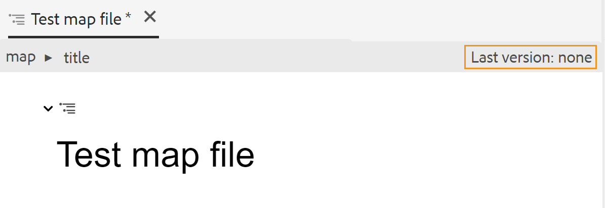

# 맵 만들기 {#id176FEN0D05Z}

AEM Guides은 DITA 맵과 북맵이라는 두 가지 기본 맵 템플릿을 제공합니다. 또한 고유한 맵 템플릿을 만들고 이를 작성자와 공유하여 맵 파일을 만들 수도 있습니다.

맵 파일을 만들려면 다음 단계를 수행하십시오.

1. Assets UI에서 맵 파일을 만들 위치로 이동합니다.

1. **만들기** \> **DITA 맵**&#x200B;을 클릭합니다.

1. 블루프린트 페이지에서 사용할 맵 템플릿의 유형을 선택하고 **다음**&#x200B;을 클릭합니다.

   >[!NOTE]
   >
   > 맵 파일에서 주제가 참조되는 방식은 맵 템플릿에 따라 다릅니다. 예를 들어 맵 템플릿을 선택하면 항목 참조 \(`topicref`\)가 항목을 참조하는 데 사용됩니다. 북맵의 경우 DITA의 `chapter` 요소를 사용하여 주제 참조를 만듭니다.

   {width="650" align="left"}

1. 속성 페이지에서 맵 **제목**&#x200B;을 지정하십시오.

1. \(선택 사항\) **Name** 파일을 지정합니다.

   관리자가 UUID 설정을 기반으로 자동 파일 이름을 구성한 경우 파일 이름을 지정하는 옵션이 표시되지 않습니다. UUID 기반 파일 이름은 파일에 자동으로 할당됩니다.

   파일 이름 지정 옵션을 사용할 수 있으면 맵의 제목 을 기반으로 이름이 자동으로 제안됩니다. 맵 파일 이름을 수동으로 지정하려면 파일 이름에 공백, 아포스트로피 또는 중괄호가 포함되어 있지 않고 `.ditamap`(으)로 끝나는지 확인하십시오.

1. **만들기**&#x200B;를 클릭합니다.

   맵이 생성됨 메시지가 나타납니다.

   Assets UI **만들기** \> **DITA 맵** 또는 웹 편집기에서 만드는 모든 새 맵 파일에는 고유한 맵 ID가 할당됩니다. 또한 새 맵이 DAM에 최신 작업 복사본으로 저장됩니다. 새로 생성된 맵의 개정 버전을 저장하기 전까지는 버전 기록에 버전 번호가 표시되지 않습니다. 편집할 맵을 열면 맵 파일의 탭 오른쪽 상단 모서리에 버전 정보가 표시됩니다.

   {width="650" align="left"}

   새로 만든 맵의 버전 정보가 *없음*(으)로 표시됩니다. 새 버전을 저장하면 버전 번호가 1.0으로 지정됩니다. 새 버전을 저장하는 방법에 대한 자세한 내용은 [새 버전으로 저장](web-editor-features.md#save-as-new-version-id209ME400GXA)을 참조하십시오.

   구성된 맵 편집기에서 편집할 맵을 열거나 AEM 저장소에 맵 파일을 저장하도록 선택할 수 있습니다.

   >[!NOTE]
   >
   > 고급 맵 편집기를 사용하려면 웹 편집기에서 맵 파일에 액세스합니다. 관리자가 고급 맵 편집기를 맵 파일의 기본 편집기로 구성한 경우 맵 파일은 편집을 위해 고급 맵 편집기에서 직접 열립니다. Adobe Experience Manager Guides as a Cloud Service 설치 및 구성에서 *고급 맵 편집기를 기본값으로 설정* 섹션을 참조하십시오.

**상위 항목:**[&#x200B;맵 편집기 작업](map-editor.md)
