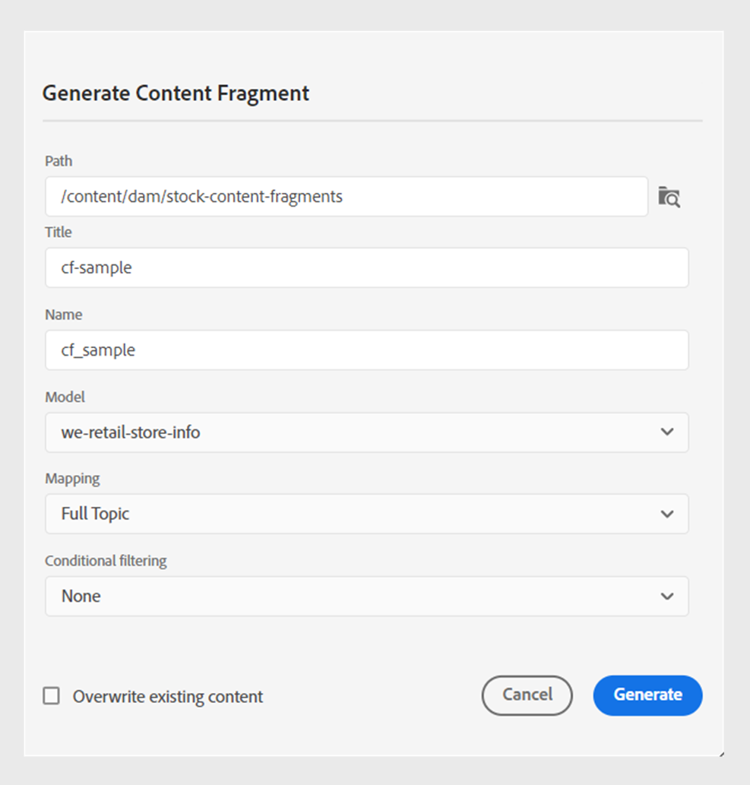

# Publish 컨텐츠 조각

컨텐츠 조각은 Adobe Experience Manager에서 개별 컨텐츠 조각입니다. 이는 콘텐츠 모델을 기반으로 하는 구조화된 콘텐츠입니다. 콘텐츠 조각 은 디자인 또는 레이아웃 정보가 없는 순수 콘텐츠입니다. Adobe Experience Manager가 지원하는 채널과 독립적으로 작성 및 관리할 수 있습니다. 콘텐츠 조각은 모듈식이며, 콘텐츠는 더 작은 구성 요소로 분류됩니다.

Adobe Experience Manager Guides을 사용하면 주제 또는 주제 내의 요소를 콘텐츠 조각에 게시할 수 있습니다. 주제와 콘텐츠 조각 모델 간에 JSON 기반 매핑을 만들 수 있습니다. 이 매핑을 사용하여 주제 또는 주제 내의 요소를 콘텐츠 조각에 게시합니다. 그런 다음 Adobe Experience Manager 사이트에서 콘텐츠 조각을 사용하거나 콘텐츠 조각에서 지원하는 API를 통해 세부 정보를 추출할 수 있습니다.

콘텐츠 조각을 만들려면 다음 단계를 수행하십시오.

1. Adobe Experience Manager Assets에서 [콘텐츠 조각 모델](https://experienceleague.adobe.com/docs/experience-manager-65/assets/content-fragments/content-fragments-models.html?lang=ko)을(를) 만듭니다.
1. 콘텐츠 조각 모델을 기반으로 만든 콘텐츠 조각을 저장할 폴더를 만듭니다. 예: &quot;stock-content-fragments&quot;.
1. 폴더의 속성(예: &quot;stock-content-fragments&quot;)을 편집하고 클라우드 구성에서 콘텐츠 조각 모델을 포함하는 폴더의 경로를 추가합니다.
예를 들어 클라우드 구성에 `/conf/we-retail`을(를) 추가합니다. 이 구성은 모든 콘텐츠 조각 모델을 폴더와 연결합니다.\
   {width="650" align="left"}
   *폴더 속성에 클라우드 구성을 추가하여 조각 모델과 연결합니다.*

1. 콘텐츠 조각을 생성하려면 주제의 **파일 속성**&#x200B;에서 **출력** 섹션에서 **새 출력** 을 선택하십시오.
1. **콘텐츠 조각**&#x200B;을 선택합니다.\
   {width="300" align="left"}

   *주제의 파일 속성에서 새 콘텐츠 조각을 추가합니다*.

1. **콘텐츠 조각 생성** 대화 상자에서 다음 세부 정보를 입력합니다.
   {width="500" align="left"}
   *경로, 모델 및 매핑 세부 정보를 추가하여 주제 또는 해당 요소를 콘텐츠 조각으로 게시합니다. 기존 콘텐츠 조각을 덮어쓸 수 있습니다.*

   >[!NOTE]
   >
   >**저장소 보기**&#x200B;에서 콘텐츠 조각을 게시할 수도 있습니다. 콘텐츠 조각으로 게시할 주제를 선택합니다. 그런 다음 **옵션** 메뉴에서 **Publish 형식** > **콘텐츠 조각**&#x200B;을 선택합니다.

   * **경로**: 콘텐츠 조각을 게시할 폴더의 경로를 찾아 선택합니다. 기존 콘텐츠 조각을 선택하면 매핑된 필드의 콘텐츠가 덮어쓰기됩니다.
   * **제목**: 콘텐츠 조각의 제목을 입력합니다. 기본적으로 제목은 주제의 제목으로 채워집니다. 편집할 수 있습니다. 이 제목은 콘텐츠 조각의 이름을 생성하는 데 사용됩니다.
   * **이름**: 콘텐츠 조각의 이름을 입력합니다. 기본적으로 이름은 주제의 제목으로 채워지고 공백은 &#39;_&#39;로 바뀝니다. 예: *sample_content_fragment*. 편집할 수 있습니다.  이 이름은 콘텐츠 조각의 URL을 생성하는 데 사용됩니다.
   * **모델**: 콘텐츠 조각을 만드는 데 사용할 콘텐츠 조각 모델을 선택합니다. 모델은 클라우드 서비스에서 구성한 폴더에서 선택됩니다.
   * **매핑**: 드롭다운에서 매핑을 선택합니다. *contentFragmentMapping.json* 파일에서 매핑을 선택합니다.

     관리자가 *contentFragmentMapping.json* 파일에 매핑을 추가할 수 있습니다. 설치 및 구성 안내서에서 [주제와 콘텐츠 조각 간의 매핑을 만들기](/help/product-guide/cs-install-guide/conf-content-fragment-mapping-cs.md)하는 방법에 대해 자세히 알아보십시오.

   * 다른 조건을 선택하여 콘텐츠를 게시할 수도 있습니다.  다음 옵션 중 하나를 선택합니다.

      * **없음**: 게시된 출력에 조건을 적용하지 않으려면 이 옵션을 선택하십시오.
      * **DITAVAL 사용**: 특정 콘텐츠가 포함된 출력을 생성할 DITAVAL 파일을 선택하십시오. 찾아보기 대화 상자를 사용하거나 파일 경로를 입력하여 DITAVAL 파일을 선택할 수 있습니다.
      * **특성 사용**: DITA 주제에 조건 특성을 정의할 수 있습니다. 그런 다음 조건 속성을 선택하여 관련 콘텐츠를 게시합니다.
     >[!NOTE]
     > 
     >조건은 조건 속성이 주제에 정의된 경우에만 활성화됩니다.

   * 콘텐츠 조각이 이미 있고 덮어쓰려면 **기존 콘텐츠 덮어쓰기**&#x200B;를 선택합니다. 확인란을 선택하지 않았는데 컨텐츠 조각이 이미 존재하는 경우 Experience Manager Guides에 오류가 표시됩니다.
1. 콘텐츠 조각을 게시하려면 **생성**&#x200B;을 클릭하십시오.

1. **파일 속성**&#x200B;의 **출력** 섹션 아래에서 주제에 대한 콘텐츠 조각을 볼 수 있습니다.

   {width="300" align="left"}

   *주제에 대한 콘텐츠 조각을 보고 다시 게시합니다.*

콘텐츠 조각을 게시하면 모든 Adobe Experience Manager 사이트에서도 사용할 수 있습니다.

## 콘텐츠 조각에 대한 옵션 메뉴

**옵션** 메뉴에서 콘텐츠 조각에 대해 다음 작업을 수행할 수도 있습니다.

* **생성**: 콘텐츠 조각을 다시 게시하여 DITA 주제의 최신 콘텐츠로 업데이트합니다. 출력을 재생성할 때 콘텐츠 조각의 경로, 이름, 제목, 모델 및 매핑을 변경할 수 없습니다. 그러나 출력을 재생성하는 동안 다른 조건을 선택할 수 있습니다.

* **복제**: 콘텐츠 조각을 복제합니다. 경로, 이름, 제목, 모델 및 매핑을 변경할 수 있습니다. 콘텐츠 조각을 복제할 때 다른 조건을 선택할 수도 있습니다.

* **제거**: 출력 목록에서 콘텐츠 조각을 제거합니다. 확인 프롬프트가 나타납니다. 확인되면 콘텐츠 조각이 **출력** 목록에서 제거됩니다.

  >[!NOTE]
  >
  > 이 작업으로 콘텐츠 조각에서 콘텐츠가 삭제되지 않습니다.

* **보기**: 콘텐츠 조각 편집기를 봅니다. 변경 작업을 수행한 후 저장할 수도 있습니다.

