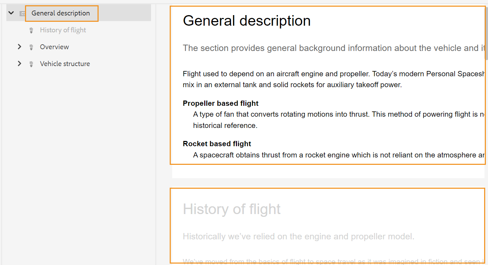
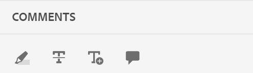
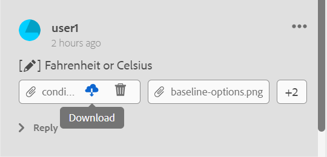

# 주제 검토 {#id2056B0W0FBI}

검토자인 경우 검토 주제에 대한 링크가 포함된 검토 요청 이메일을 받게 됩니다. 링크를 클릭하면 공유 주제에 대한 피드백을 추가할 수 있는 검토 페이지로 이동합니다.

항목을 검토하려면 다음 단계를 수행하십시오.

1. 검토 요청 이메일에 제공된 직접 링크를 클릭합니다.

   주제 또는 맵 링크가 브라우저에서 열립니다.

   >[!NOTE]
   >
   > AEM 사용자 인터페이스의 받은 편지함 알림 영역에서 주제 검토 링크에 액세스할 수도 있습니다.

1. 주제 검토를 시작하는 방법에 따라 다음 두 화면 중 하나를 볼 수 있습니다.

   >[!NOTE]
   >
   > 다음에서 검토를 만든 경우 UI가 다를 수 있습니다.
   >
   > - AEM Guides as a Cloud Service 2022년 11월 릴리스 또는 이전
   > - AEM Guides 버전 4.1 이하

   DITA 맵을 사용하여 검토 워크플로우를 시작하면 다음 화면이 나타납니다.

   {width="800" align="left"}

   이 화면에서는 다음 옵션을 사용할 수 있습니다.

   - **A**: 검토 작업의 이름입니다.
   - **B**: [항목 보기] 아이콘을 클릭하여 항목 패널을 표시하거나 숨깁니다.

   - **C**: 검색 창에서 제목 또는 파일 경로의 일부 텍스트를 입력하여 필요한 항목을 검색할 수 있습니다.

     검색 창 근처에 있는 을(를) 선택하여 모든 항목을 보거나 의견이 있는 항목을 봅니다. 기본적으로 검토 작업에 있는 모든 주제를 볼 수 있습니다.

   - **D**: ***F***&#x200B;로 강조 표시된 숫자는 여기에서 원하는 필터 옵션을 선택하여 필터링할 수 있습니다. 해당 유형, 상태, 검토자 또는 버전별로 주석을 필터링할 수 있습니다. 예를 들어, 아래의 각 검토 항목에서 취소선 댓글이 몇 개나 작성되었는지 확인하려면 필터 아이콘을 클릭한 다음 **검토 유형** \> **삭제**&#x200B;를 선택하십시오.

     >[!NOTE]
     >
     > 필터를 적용하면 선택한 필터와 일치하는 주석만 [주석] 패널에 표시됩니다. 필터링된 주석 수는 주제 패널의 왼쪽에 표시됩니다.

   - **E**: 현재 검토자에게 검토하도록 할당된 주제가 검정색으로 표시되며 클릭할 수 있습니다. 검토자가 주제 링크를 클릭하면 해당 주제가 화면 맨 위로 이동됩니다.
   - **상태**: 검토할 수 없는 항목이 회색으로 표시됩니다. 주제가 읽기 전용 모드로 표시되며, 이러한 주제에 대한 검토 설명을 추가할 수 없습니다.

   - **G**: 주제에 대해 받은 댓글 수입니다. 이 숫자는 적용하는 필터에 따라 변경됩니다.

   맵의 모든 주제가 하나의 복합 문서로 표시됩니다. 검토자가 검토할 수 있는 주제가 정상적으로 표시됩니다. 검토가 허용되지 않는 항목은 표시되지 않습니다.

   {width="800" align="left"}

   위의 스크린샷에서는 현재 검토자를 검토하기 위해 일반 설명 주제가 공유되며 이는 정상적으로 표시됩니다. 그러나 다음 항목인 비행 기록 컨텐츠는 검토를 위해 공유되지 않으며 읽기 전용 모드로 표시됩니다. 현재 초점이 맞춰진 주제는 목차에도 강조 표시되어 있습니다.

   검토를 위해 하나 이상의 주제를 선택하고 공유할 때 다음 화면이 나타납니다.

   {width="800" align="left"}

   >[!NOTE]
   >
   > 여러 주제의 경우 문서 보기에서 하나의 복합 문서로 표시됩니다. 위의 스크린샷은 단일 보기에서 차례로 제공된 두 개의 서로 다른 주제를 강조 표시합니다.

1. 도구 모음의 오른쪽 상단에 있는 **댓글** 아이콘을 클릭하여 [댓글] 패널을 엽니다.

   도구 모음에서 적절한 설명 유형을 선택하여 검토 설명을 제공하고 Enter 키를 눌러 설명을 제출합니다.

   >[!NOTE]
   >
   > [주석] 패널에는 현재 주제에 지정된 주석만 표시됩니다. 포커스를 다른 주제로 이동하면 다른 주제에 제공된 주석이 표시됩니다.

1. 주제 검토를 마치면 **닫기** 단추를 클릭하십시오. **닫기** 단추를 클릭하면 검토 주제에 액세스한 페이지로 리디렉션됩니다.

## 검토 화면에서 사용할 수 있는 추가 기능

**문서 보기 및 주제 보기** - 기본적으로 검토를 위해 여러 주제를 공유하는 경우 주제의 복합 문서 보기가 검토자에게 표시됩니다. DITA 맵 검토의 경우 맵의 모든 주제가 책 보기와 유사하게 단일 문서 형태로 표시됩니다. 원하는 경우 특정 주제를 클릭하면 해당 주제만 검토 화면에 표시됩니다.

단일 항목을 보면 문서 보기로 다시 전환하는 추가 옵션이 제공됩니다. 다음 스크린샷에서는 맵 파일의 특정 주제가 검토를 위해 열립니다. 강조 표시된 옵션 **문서 보기 표시**&#x200B;를 사용하면 맵 파일의 문서 보기로 다시 전환할 수 있습니다.

{width="800" align="left"}

**다른 종류의 댓글 도구 작업** - 텍스트를 강조 표시하거나, 텍스트를 취소하거나, 텍스트를 삽입하거나, 댓글 메모를 추가하여 인라인 댓글을 추가할 수 있습니다. [주석] 도구 모음에 제공된 다양한 유형의 주석 도구가 아래에 설명되어 있습니다.

{width="350" align="left"}

- **강조 표시** \(\): 강조 표시 설명을 추가하려면 텍스트를 선택하고 강조 표시 아이콘을 클릭합니다. 또는 강조 표시 아이콘을 클릭하고 원하는 텍스트를 선택합니다.

  {width="650" align="left"}

  [주석] 패널에 강조 표시된 콘텐츠에 대한 주석을 추가할 수 있는 팝업이 나타납니다.

- **취소선** \(\): 컨텐츠 제거를 제안하려면 컨텐츠를 선택하고 취소선 아이콘을 클릭하면 됩니다. 또는 원하는 텍스트를 선택하고 Delete 키를 클릭합니다.

  [주석] 패널에 팝업이 나타나며, 팝업에서 삭제된 콘텐츠에 대한 주석을 추가할 수 있습니다.

- **텍스트 삽입** \(\): 텍스트를 삽입하려면 텍스트 삽입 아이콘을 클릭하고 텍스트를 삽입하려는 위치에 커서를 놓고 정보를 입력합니다. 또는 텍스트를 삽입할 위치에 커서를 놓고 입력을 시작합니다. 추가된 정보는 녹색으로 표시됩니다.

- **댓글 추가**\(\): 스티커 메모 유형의 댓글을 추가하려면 [댓글 추가] 아이콘을 클릭하고 팝업에 댓글을 입력합니다.

**상황별 도구 모음**

상황별 도구 모음을 사용하여 텍스트를 빠르게 강조 표시하거나 취소하여 표시할 수도 있습니다. 상황별 도구 모음을 사용하여 댓글을 달려면 다음 단계를 수행하십시오.

1. 강조하거나 취소하려는 텍스트를 선택합니다. 상황별 도구 모음이 나타납니다.

   {width="550" align="left"}

1. **강조 표시** 또는 **취소선** 아이콘을 클릭합니다.
1. 설명 패널에서 강조 표시 또는 취소선 작업에 대한 설명을 추가할 수 있습니다.

**댓글 패널을 사용하여 검토** - [댓글] 패널에 현재 주제에 지정된 댓글 목록이 표시됩니다. 주제가 여러 검토자에게 전송된 경우 이 패널에는 다른 검토자의 주석도 나열됩니다. [주석] 패널의 각 주석은 현재 주제의 해당 텍스트에 연결됩니다. 주석을 단 텍스트를 식별하는 데 도움이 됩니다. 각 주석은 타임스탬프와 함께 주석을 추가한 검토자의 이름을 표시합니다.

주석은 문서에 있는 주석 텍스트 순서대로 표시됩니다. 예를 들어 첫 번째 문장에 강조 표시 주석이 있고 첫 번째 단락의 두 번째 문장에 텍스트 삽입 주석이 있으면 강조 표시 텍스트 주석이 삽입된 텍스트 주석 앞에 표시됩니다.

설명 패널을 사용하여 수행할 수 있는 작업은 아래에 설명되어 있습니다.

- 주석을 클릭하면 문서에서 해당 주석의 위치가 강조 표시되고 표시됩니다.
- 댓글에 답글을 추가할 수 있습니다.
- [주석] 패널에서 주석 텍스트를 클릭한 다음 [옵션] 메뉴에서 **편집**&#x200B;을 선택하여 주석을 편집할 수 있습니다.
- [댓글] 패널에서 댓글을 클릭한 다음 [옵션] 메뉴에서 **삭제** 옵션을 선택하면 자신의 댓글을 삭제할 수 있습니다.

  {width="300" align="left"}

  >[!NOTE]
  >
  > 옵션 메뉴는 자신의 댓글 위에 마우스를 올려 놓을 때만 나타납니다. 다른 검토자의 주석에는 표시되지 않습니다.

- 모든 참여 사용자는 다른 사용자가 제출한 의견에 응답할 수 있습니다. 댓글에서 **답글**&#x200B;을 클릭하고 Enter 키를 눌러 응답을 제출합니다.

**미리보기 모드**

- 미리보기 모드에서 주제를 열면 모든 변경 사항을 적용한 후 작성자가 주제를 볼 때 주제가 표시되는 방식이 표시됩니다. 예를 들어, 삽입된 모든 텍스트는 일반 텍스트로 표시되며 모든 스트라이크된 \(삭제된\) 텍스트는 콘텐츠에서 제거됩니다.

- 다음 스크린샷은 *검토* 모드의 콘텐츠를 보여 줍니다.

{width="550" align="left"}

다음 스크린샷은 *미리 보기* 모드의 콘텐츠를 보여 줍니다.

{width="550" align="left"}

**댓글에 첨부 파일 추가** -   일부 다른 파일에서 사용 가능한 추가 정보를 제공하여 댓글을 보완하려는 경우 댓글과 함께 첨부하면 됩니다. 검토자는 로컬 시스템에서 하나 이상의 파일을 주석에 쉽게 추가할 수 있습니다. 강조, 취소선, 텍스트 삽입 또는 댓글과 같이 지원되는 모든 형식의 댓글에 파일을 추가할 수 있습니다.

주석을 삽입하면 주석 팝업이 나타납니다. 팝업에 추가 의견이나 정보를 제공한 후 Enter 키를 눌러 제출합니다. 댓글이 추가되면 해당 댓글에 첨부 파일을 추가할 수 있는 옵션이 제공됩니다.

{width="800" align="left"}

위의 스크린샷에서 문서에는 강조 표시 주석의 팝업이 포함되어 있으며 주석은 [주석] 패널에도 추가됩니다. 첨부 파일 아이콘 을(를) 두 위치에서 댓글과 함께 사용할 수 있습니다.

Perform the following steps to add attachment to your comment:

1. Click the *Add Attachment* icon  on the comment with which you want to add an attachment.

   The file Open dialog appears.

1. Select one or multiple files you want to attach.

   The selected files are shown along with the comment in the Comments panel.

   In the Comments panel you can see the file name and its size. You also have an option to remove a file by clicking the delete icon  associated with the file name.

1. **제출**&#x200B;을 클릭합니다.

   The attachments are uploaded and added to the comment.

**Additional notes on working with attachments:**

- By default, only two files attached with a comment are shown. If there are more files, then **View Attachment** button on the right shows the number of all attachments \(which are more than two\) associated with the comment. You can click the number to view all attachments. For example, if you have four attachments with a comment, you will see +2 on the button.

{width="550" align="left"}

- Hovering the mouse pointer over an attachment gives the options to download or remove the attachment. Removing the attachment is available only if the current reviewer has added that comment, as shown the following screenshot:

{width="550" align="left"}

The other reviewers or authors get only the download attachment option.

{width="550" align="left"}

- You can download all attachments associated with a comment from the **View Attachments** dialog. Select the attachments and click the **Download** icon at the comment level.

- You can also delete the attachments associated with a comment from the **View Attachments** dialog. Select the attachments and click the **Delete** icon.

{width="550" align="left"}

**Conditions panel** -   If your topic has conditional content, then you will see the **Conditions** \(\) icon on the right. Clicking on **Conditions** icon opens the Conditions panel that allows you to highlight the content as per the available conditions in the topic.

:   By default **Highlight All Conditions** option is enabled, all conditions are selected, the entire content is displayed, and the conditionalized content is shown as highlighted both in review and preview mode.

:   You can disable **Highlight All Conditions** option and see all the content present in the topic as normal text without any highlights.

{width="350" align="left"}

You can choose to hide or show a specific condition.

- If you hide a condition, the content having that condition is not highlighted in the review mode.
- If you show a condition conditionalized content is highlighted in the review mode. For example, in the following screenshot, only the content uses two conditions - `win` and `mac` is highlighted.

{width="650" align="left"}

In the preview mode, the non-conditionalized content and the conditionalized content that uses the two shown conditions - `win` and `mac` is displayed. The remaining conditionalized content for which the conditions are hidden is not displayed.

**Real-time review** -   The Comments panel updates in real time with comments and the feedback or action taken by the author on the comments.

- Multiple reviewers will be able to leave comments or reply to comments simultaneously on the same document. You can find out who is currently reviewing the document by hovering the mouse over the user icon at the top-right corner of the screen.

- If a topic is a part of multiple review tasks, then the comments made in one task are not shown in the other task.

- Clicking Outdated Comment icon \(\) displays the differences in between the latest and the commented version of the document. The version numbers \(of the versions that are being compared\) are displayed at the top of the documents.

  {width="800" align="left"}

  >[!NOTE]
  >
  > When you hover over the Outdated Comment icon, the version number of the topic on which the comment was added, is displayed. For example, if a comment was given on version 1.0, the same is displayed.

- Clicking an outdated comment opens the version of that comment in the left panel. The previous version is shown in the left panel and the current version is displayed in the right panel. All comments on the outdated version are imported on the left side. You can compare the previous version with the current version.

**Filter comments** -   You can filter comments in a document to view specific comments as required. To filter comments, click the **Filter** icon \(\) that appears in the menu on the right of the Search Comments text box in the Comments panel.

Select one or more of the following filtering options from the **Filter Type** dialog and click **Apply**.

- **Review Type** - Filter on the basis of the comments type – Highlight, Deletion, Insertion, or Comment.
- **Review Status** - Filter on the basis of the status of the comment like Accepted, Rejected, or None.
- **Reviewers** - Filter on the basis of the reviewer&#39;s name.

- **Versions** - Filter on the basis of the comments received on a particular version of the topic.

  On using the filters the comments on the right panel get filtered according to the selection, and the number of comments in the left panel is updated accordingly.

To remove the filter and view all the comments, deselelect all filters from the **Filter Type** dialog and click **Apply**.

**상위 항목:**[&#x200B;항목 또는 맵 검토](review.md)
