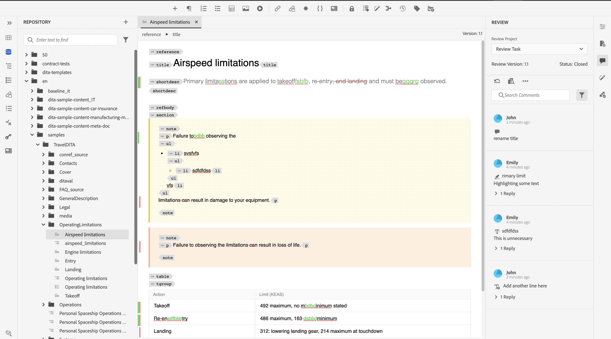

# 완료된 검토 작업 보기

작성자(또는 개시자)가 되는 프로젝트에 대한 검토 작업을 완료할 수 있습니다. 검토 작업이 완료되면 사용자 및 모든 검토자가 읽기 전용 모드로 액세스할 수 있습니다.

## 검토자로

검토자인 경우 댓글 패널에 검토가 종료되었음을 나타내는 표시기가 표시됩니다. 주석 도구 모음이 표시되지 않으므로 강조 표시, 취소선, 텍스트 삽입 또는 주석을 추가할 수 없습니다. 댓글을 읽을 수는 있지만 편집하거나 삭제할 수는 없습니다. 댓글에 회신을 추가할 수도 없습니다. 상황별 도구 모음(텍스트를 강조 표시하거나 취소하는 데 사용됨)은 표시되지 않습니다. 오래된 설명 아이콘도 완료된 검토 작업에 표시되지 않습니다.

그러나 모든 주석을 검색하거나 필터링할 수 있습니다. 조건을 표시하거나 숨기고 그에 따라 조건화된 콘텐츠를 표시하도록 선택할 수도 있습니다. 첨부 파일은 다운로드할 수 있지만 댓글에 대한 첨부 파일은 업로드하거나 삭제할 수 없습니다.

{width="800"}

## 작성자

작성자는 [검토] 패널에서 상태를 [닫힘]으로 볼 수 있습니다. 댓글을 읽을 수는 있지만 댓글을 수락하거나 거부할 수는 없습니다. 댓글은 편집하거나 삭제할 수 없습니다. 댓글에 대한 회신을 추가할 수도 없습니다. [오래된 설명] 아이콘 및 [작성자 보기로 주석 가져오기] 아이콘은 완료된 검토 작업에 표시되지 않습니다.

그러나 모든 주석을 검색하거나 필터링할 수 있습니다. 첨부 파일은 다운로드할 수 있지만 댓글에 대한 첨부 파일은 업로드하거나 삭제할 수 없습니다.

{width="800"}

따라서 검토자 또는 작성자 모두 댓글과 함께 검토된 콘텐츠를 볼 수는 있지만 완료된 검토 작업에서는 변경할 수 없습니다.
