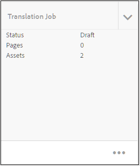

# 수정된 주제 번역 {#id16A5A0B6072}

일부 주제를 변경하는 경우 해당 주제를 다시 번역해야 합니다. DITA 맵에서 수정된 주제를 계속 추적할 수 있습니다. 소스 언어 복사 폴더에서 DITA 맵 파일을 클릭하고 번역 탭을 클릭합니다. 재번역이 필요한지 여부에 따라 각 항목의 상태를 확인할 수 있습니다.

재번역을 위해 수정된 주제를 보내려면 다음 단계를 수행하십시오.

1. 소스 언어 복사 폴더에서 DITA 맵 파일을 클릭합니다.

1. **번역** 탭을 클릭합니다.

1. 왼쪽의 **필터** 패널에서 상태를 확인할 **언어 번역**&#x200B;을 선택하고 **완료**&#x200B;를 클릭합니다.

   각 항목의 번역 상태를 확인할 수 있습니다. 번역을 위해 전송된 항목 외에 다른 항목 수정이 있는 항목에는 **최신 상태가 아님**&#x200B;이 표시됩니다.

   >[!NOTE]
   >
   > 번역 워크플로우는 소스 언어 폴더에 마지막으로 저장된 주제 파일의 수정 버전을 번역된 버전과 비교합니다.

   화살표를 클릭하여 자세한 내용을 확인합니다. 오래된 특정 언어 사본을 볼 수 있습니다.

   {width="800" align="left"}

1. 재번역을 위해 전송할 항목을 선택하려면 확인란을 클릭하십시오.

   동기화 중단 날짜를 선택하면 **언어 사본 만들기/업데이트** 옵션이 참조 패널에 나타나고 **필터** 아이콘 위에 있는 **동기화 중단 상태 무시** 단추가 표시됩니다.

   **동기화 중단 해제** 단추를 사용하여 DITA 맵의 주제에 대한 오래된 상태를 재정의할 수 있습니다. 예를 들어 번역이 필요하지 않은 영어 버전의 주제를 일부 변경한 경우 이 버튼을 사용하여 선택한 주제에 대한 최신 상태가 아닌 상태를 변경할 수 있습니다.

   >[!NOTE]
   >
   > **동기화 중단 상태 무시** 단추를 클릭하면 선택한 최신 상태가 아닌 주제에 대해 [최신 상태]로 설정됩니다.

1. **언어 사본 업데이트**&#x200B;를 클릭하고 번역 작업을 구성합니다.

1. 새 번역 프로젝트를 만들거나 기존 번역 프로젝트에 주제를 추가할 수 있습니다. 번역 프로젝트를 구성하는 데 필요한 세부 정보를 제공합니다.

1. **시작**&#x200B;을 클릭합니다.

   주제가 번역을 위해 전송되었음을 나타내는 확인 메시지가 표시됩니다.

1. 프로젝트 콘솔에서 번역 프로젝트로 이동합니다. 새 번역 작업 카드가 폴더에 생성됩니다. 폴더의 자산을 보려면 줄임표를 클릭하십시오.

   {width="300" align="left"}

1. 번역을 시작하려면 번역 작업 카드에서 화살표를 클릭하고 목록에서 **시작**&#x200B;을 선택합니다. 작업이 시작되었음을 알리는 메시지가 표시됩니다.

   번역 작업 카드 하단의 생략 부호를 클릭하면 번역되는 주제의 상태를 볼 수도 있습니다.

   >[!NOTE]
   >
   > 사람 번역 서비스를 사용하는 경우 번역을 위해 콘텐츠를 내보내야 합니다. 번역된 콘텐츠를 가져온 다음에는 번역 프로젝트로 다시 가져와야 합니다.

1. 번역이 완료되면 상태가 **검토 준비됨**(으)로 변경됩니다. 줄임표를 클릭하여 주제 세부 정보를 확인하고 도구 모음에서 다음 중 하나를 수행합니다.

   - **Assets에 표시**&#x200B;를 클릭하여 번역을 확인하고 확인하십시오.

   - 변경 사항이 올바르게 번역되었다고 생각되면 **번역 수락**&#x200B;을 클릭합니다. 확인 메시지가 표시됩니다.

   - 작업을 다시 수행해야 한다고 생각되면 **번역 거부**&#x200B;를 클릭하십시오. 거부 메시지가 표시됩니다.

   >[!NOTE]
   >
   > 번역된 에셋을 수락 또는 거부하는 것이 중요합니다. 그렇지 않으면 파일이 임시 위치에 있고 DAM에 복사되지 않습니다.

1. Assets UI의 소스 언어 폴더에서 DITA 맵 파일로 다시 이동합니다. 다시 번역된 주제가 이제 동기화되었습니다.

**상위 항목:**[&#x200B;콘텐츠 번역](translation.md)
