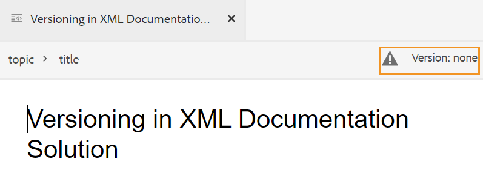

# 주제 만들기 {#id2056AL00O5Z}

AEM Guides을 사용하면 주제, 작업, 개념, 참조, 용어집, DITAVAL 등 유형의 DITA 주제를 만들 수 있습니다. 기본 제공 템플릿을 기반으로 주제를 만드는 것 외에도 사용자 지정 템플릿을 정의할 수도 있습니다. 템플릿 선택 블루프린트 및 웹 편집기에 표시하려면 이러한 템플릿을 폴더 프로필에 추가해야 합니다.

전역 및 폴더 프로필 구성은 폴더 수준 관리 사용자만 사용할 수 있습니다. 전역 및 폴더 수준 프로필을 설정하는 방법에 대한 자세한 내용은 설치에 있는 Adobe Experience Manager Guides 구성 및 설치에서 *작성 템플릿 구성*&#x200B;을 참조하십시오.

항목을 만들려면 다음 단계를 수행하십시오.

1. Assets UI에서 주제를 만들 위치로 이동합니다.

1. 새 주제를 만들려면 **만들기** \> **DITA 주제**&#x200B;를 클릭합니다.

1. 블루프린트 페이지에서 만들려는 DITA 문서의 유형을 선택하고 **다음**&#x200B;을 클릭합니다.

   {width="800" align="left"}

   기본적으로 AEM Guides은 가장 일반적으로 사용되는 DITA 주제 템플릿을 제공합니다. 조직 요구 사항에 따라 더 많은 주제 템플릿을 구성할 수 있습니다. 설치에 있는 Adobe Experience Manager Guides 구성 및 설치에서 *작성 템플릿 구성*&#x200B;을 참조하십시오.

   >[!NOTE]
   >
   > Assets UI의 목록 보기에서 DITA 주제 유형은 유형 열에 주제, 작업, 개념, 참조, 용어 또는 DITAVAL로 표시됩니다. DITA 맵은 맵으로 표시됩니다.

1. 속성 페이지에서 **제목** 문서를 지정하십시오.

1. \(선택 사항\) **Name** 파일을 지정합니다.

   관리자가 UUID 설정을 기반으로 자동 파일 이름을 구성한 경우 파일 이름을 지정하는 옵션이 표시되지 않습니다. UUID 기반 파일 이름은 파일에 자동으로 할당됩니다.

   파일 이름 지정 옵션을 사용할 수 있으면 문서의 **제목**&#x200B;을 기반으로 이름이 자동으로 제안됩니다. 문서 이름을 수동으로 지정하려면 **Name**&#x200B;에 공백, 아포스트로피, 중괄호가 포함되어 있지 않고 .xml 또는.dita로 끝나는지 확인하십시오. 기본적으로 AEM Guides은 모든 특수 문자를 하이픈으로 바꿉니다. DITA 파일 이름 지정에 대한 우수 사례를 알려면 우수 사례 안내서의 파일 이름 섹션을 참조하십시오.

1. **만들기**&#x200B;를 클릭합니다. Topic Created 메시지가 나타납니다.

   편집할 주제를 웹 편집기에서 열거나 주제 파일을 AEM 저장소에 저장하도록 선택할 수 있습니다.

   Assets UI **만들기** \> **DITA 주제** 또는 웹 편집기에서 만드는 모든 새 주제에는 고유한 주제 ID가 할당됩니다. 이 ID의 값은 파일 이름 자체입니다. 또한 새 문서는 DAM에 항목의 최신 작업 복사본으로 저장됩니다. 새로 만든 항목의 개정을 저장할 때까지 버전 내역에 버전 번호가 표시되지 않습니다. 편집할 항목을 열면 항목 파일의 탭 오른쪽 상단 모서리에 버전 정보가 표시됩니다.

   {width="550" align="left"}

   새로 만든 항목의 버전 정보가 *없음*(으)로 표시됩니다. 새 버전을 저장하면 버전 번호가 1.0으로 지정됩니다. 새 버전을 저장하는 방법에 대한 자세한 내용은 [새 버전으로 저장](web-editor-features.md#save-as-new-version-id209ME400GXA)을 참조하십시오.

>[!NOTE]
>
> 관리자가 편집하기 전에 파일을 체크 아웃하도록 웹 편집기를 구성한 경우 파일을 체크 아웃할 때까지 편집할 수 없습니다. 마찬가지로 구성된 경우 파일을 닫기 전에 체크 아웃하라는 메시지가 표시됩니다.

>[!IMPORTANT]
>
> DITA 주제를 생성한 후에는 작업 복사본에 변경 사항을 계속 저장하고 주제에 대한 업데이트를 완료한 후 새 버전을 만듭니다.

**상위 항목:**[&#x200B;항목 만들기 및 미리 보기](create-preview-topics.md)
