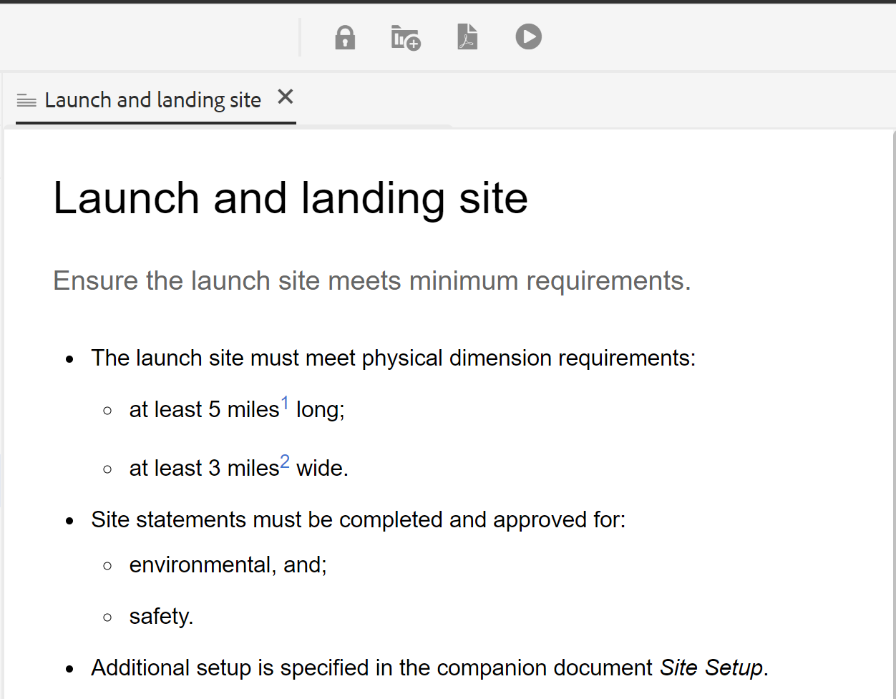

# 문서 상태 {#id1821HC00URO}

문서 준비를 관리하기 위해 AEM Guides에서는 문서의 현재 상태를 나타내는 문서 상태 속성을 제공합니다. 문서 상태는 문서가 새로 작성되었는지, 검토 중인지 또는 검토 완료 상태인지 여부를 신속하게 확인하는 데 도움이 됩니다.

## 문서 상태 유형

문서에는 문서 상태 프로파일에 정의된 모든 문서 상태가 있을 수 있습니다. 예를 들어 문서의 상태는 다음 중 하나일 수 있습니다.

- 초안 - 문서가 새 변경 사항과 함께 작성 및 저장되었음을 나타냅니다.
- 검토 중 - 문서에 대해 검토 워크플로우가 시작되었음을 나타냅니다.
- 검토됨 - 의도한 사용자가 문서를 검토했음을 나타냅니다.

이러한 상태는 문서 상태 프로파일 설정에 따라 수동 또는 자동으로 설정됩니다. 예를 들어 문서 상태 프로파일이 시작 상태를 초안으로 구성한 경우 검토 중인 문서에 대해 검토 중 상태가 정의됩니다. 그런 다음 문서를 만들 때 문서 상태가 *초안*(으)로 설정됩니다. 검토 작업을 시작하면 문서의 상태가 검토 중으로 변경됩니다.

단일 또는 여러 문서의 문서 상태를 수동으로 변경할 수도 있습니다. 그러나 여러 문서에 대한 문서 상태를 변경하도록 선택하면 허용된 상태는 선택한 문서에 허용된 일반적인 상태에 의해 결정됩니다. 예를 들어 문서 상태를 동일한 순서로 초안, 검토 중, 검토됨 및 게시 준비됨으로 정의했다고 가정해 보겠습니다. 문서 1.dita에서는 상태가 *초안*(으)로 설정되고, 문서 2.dita에서는 상태가 검토됨으로 설정됩니다. one.dita와 two.dita를 모두 선택하면 허용된 문서 상태는 *게시 준비*&#x200B;가 됩니다. two.dita가 *검토됨* 상태이므로 two.dita에 대해 다음으로 가능한 상태는 *게시 준비됨*&#x200B;입니다. 이 상태는 두 문서를 모두 선택할 때 표시됩니다.

>[!NOTE]
>
> 문서는 한 번에 하나의 상태로만 존재할 수 있습니다.

## 문서 상태 변경

문서의 상태를 변경하려면 다음 단계를 수행합니다.

1. Assets UI에서 문서 상태를 변경할 문서를 하나 이상 선택합니다.
1. 기본 도구 모음에서 **속성**&#x200B;을 클릭합니다.
1. **문서 상태** 드롭다운에서 새 상태를 선택합니다. 문서 상태 프로파일의 상태 변환(State Transition) 섹션에서 사용할 수 있는 문서 상태만 선택할 수 있습니다.

   >[!NOTE]
   >
   >관리자는 모든 문서 상태를 보고 가능한 모든 상태로 문서를 변경할 수 있습니다.

1. **저장 및 닫기**&#x200B;를 클릭합니다.

## 문서 상태 보기

Assets UI의 카드 보기에는 해당 DITA 주제 또는 DITA 맵의 생성 날짜 및 크기와 함께 현재 상태가 표시됩니다.

{width="800" align="left"}

## DLC에서 문서 상태 사용

문서 상태는 DDLC에서 문서의 라이프사이클을 관리하는 데 중요한 역할을 합니다. 조직에서 DLC를 엄격하게 따르는 경우 상태를 기반으로 문서 편집을 제어하는 메커니즘을 사용하는 것이 필수 기능이 됩니다. 예를 들어 문서가 *초안* 또는 *검토 중* 상태일 때 문서 편집을 허용할 수 있습니다. 그러나 문서를 검토하고 게시할 준비가 되면 추가 문서 수정을 방지할 수 있는 방법이 있어야 합니다.

AEM Guides은 문서 개발 프로세스의 라이프사이클을 제어하는 데 도움이 되는 문서 승인 워크플로를 제공합니다. 문서를 게시할 준비가 되었거나 최종 상태에 도달하면 승인됨으로 표시할 수 있습니다. 문서가 승인되면 AEM Guides은 문서의 새 버전을 만들고 읽기 전용으로 만듭니다. 그런 다음 문서를 게시용으로 이동하거나 추가 처리를 위한 베이스라인을 만들 수 있습니다.

승인됨으로 표시된 문서에서 새 릴리스를 시작하려면 작성자가 새 릴리스를 시작해야 합니다. 새 릴리스를 시작하면 문서 상태가 다시 *초안*(으)로 변경됩니다. 문서 상태를 *초안*(으)로 변경하면 문서를 다시 편집할 수 있게 되므로 다음 릴리스에서 작업을 계속할 수 있습니다.

문서 승인 기능을 사용하려면 다음 단계를 수행하십시오.

>[!NOTE]
>
> 관리자가 승인 작업 과정 기능을 활성화해야 합니다. 자세한 내용은 Adobe Experience Manager Guides as a Cloud Service 설치 및 구성 섹션의 *승인 워크플로 사용* 섹션을 참조하십시오.

1. 웹 편집기에서 승인을 위해 표시할 문서를 엽니다.

1. **승인됨으로 표시**&#x200B;아이콘을 클릭합니다.

1. 문서가 승인됨으로 표시된 상태일 경우 다음과 같은 대화 상자가 나타납니다.

   {width="300" align="left"}

   문서를 승인됨으로 표시할 수 없는 경우 다음과 같은 메시지가 표시됩니다.

   {width="300" align="left"}

1. 문서를 승인됨으로 표시할 준비가 되었으면 드롭다운 목록에서 레이블을 선택하고 **승인**&#x200B;을 클릭합니다.

   >[!NOTE]
   >
   > 관리자가 사전 정의된 레이블 목록을 구성하지 않은 경우 레이블을 입력할 자유 형식 텍스트 필드가 표시됩니다.

1. 문서가 승인된 것으로 표시되면 문서의 **미리 보기**&#x200B;가 읽기 전용 모드로 표시됩니다.

   {width="650" align="left"}

   >[!NOTE]
   >
   > 미리보기 모드에서는 모든 편집 옵션이 도구 모음에서 제거됩니다. 또한 문서의 작성자 및 Source 보기도 상단 탐색에서 제거되었습니다.

문서가 승인된 것으로 표시되면 더 이상 편집할 수 없습니다. 다음 릴리스에서 문서를 사용하려면 문서를 *초안* 상태로 다시 가져와야 합니다. 승인된 문서의 문서 상태를 *초안* 모드로 다시 변경하려면 다음 단계를 수행하십시오.

1. 승인된 문서에서 **새 릴리스 시작** 아이콘 을(를) 클릭합니다.

   Start New Release 메시지가 나타납니다.

1. **확인**&#x200B;을 클릭합니다.

   문서의 상태가 초안으로 변경되고 웹 편집기에서 편집 모드로 문서가 열립니다.

**상위 항목:**&#x200B;[&#x200B;웹 편집기에서 작업](web-editor.md)
