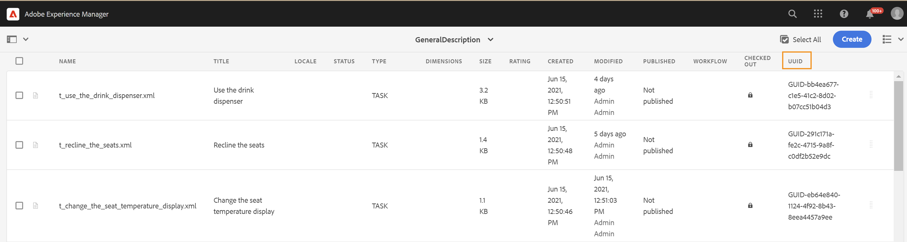

# 웹 편집기 실행 {#id2056B0140HS}

다음 위치에서 웹 편집기를 실행할 수 있습니다.

- [AEM 탐색 페이지](#id2056BG00RZJ)
- [AEM ASSETS UI](#id2056BG0307U)
- [DITA 맵 콘솔](#id2056BG090BF)

다음 섹션에서는 다양한 위치에서 웹 편집기에 액세스하고 실행할 수 있는 방법에 대한 세부 정보를 다룹니다.

## AEM 탐색 페이지 {#id2056BG00RZJ}

AEM에 로그인하면 탐색 페이지가 표시됩니다.

{width="800" align="left"}

**안내서** 링크를 클릭하면 웹 편집기로 바로 이동합니다.

{width="800" align="left"}

파일을 선택하지 않고 웹 편집기를 시작하면 빈 웹 편집기 화면이 표시됩니다. AEM 저장소 또는 즐겨찾기 컬렉션에서 편집할 파일을 열 수 있습니다.

- AEM 탐색 페이지로 돌아가려면 **안내서** 아이콘()을 클릭하십시오.

- **닫기** 단추를 사용하면 설정에 따라 대상으로 이동합니다.

  

  
 클라우드 서비스 

  Cloud Service을 사용하는 경우 **닫기** 단추를 클릭하여 AEM 탐색 페이지로 돌아갑니다.
  

  

  
 On-premise Software

  AEM Guides On-premise Software(4.2.1 이상)를 사용 중인 경우 오른쪽의 **닫기** 단추를 클릭하여 Assets UI의 현재 파일 경로로 돌아갑니다.

  

## AEM ASSETS UI {#id2056BG0307U}

웹 편집기를 실행할 수 있는 다른 위치는 AEM Assets UI에서 가져온 것입니다. 하나 이상의 주제를 선택하여 웹 편집기에서 직접 열 수 있습니다. 웹 편집기에서 항목을 열려면 다음 단계를 수행합니다.

1. Assets UI에서 편집할 항목으로 이동합니다.

   >[!NOTE]
   >
   > 주제의 UUID도 확인할 수 있습니다.

   .

   {width="800" align="left"}

   >[!IMPORTANT]
   >
   > 편집할 주제가 포함된 폴더에 대한 읽기 및 쓰기 권한이 있는지 확인합니다.

1. 주제를 단독으로 잠그려면 주제를 선택하고 **체크 아웃**&#x200B;을 클릭합니다.

   >[!IMPORTANT]
   >
   > 관리자가 **체크아웃하지 않고 편집 사용 안 함** 옵션을 구성한 경우 편집하기 전에 파일을 체크 아웃해야 합니다. 파일을 체크 아웃하지 않으면 편집 옵션이 표시되지 않습니다.

1. 에셋 선택 모드를 닫고 편집할 항목을 클릭합니다.

   주제의 미리보기가 표시됩니다.

   목록 보기, 카드 보기 및 미리보기 모드에서 웹 편집기를 열 수 있습니다.

   >[!IMPORTANT]
   >
   > 편집할 여러 주제를 열려면 에셋 UI에서 원하는 주제를 선택하고 편집을 클릭합니다. 브라우저에 팝업 차단이 활성화되어 있지 않은지, 그렇지 않으면 선택한 목록의 첫 번째 주제만 편집을 위해 열려 있습니다.

   {width="800" align="left"}

   항목을 미리 보지 않고 웹 편집기에서 직접 열려면 카드 보기의 빠른 작업 메뉴에서 편집 아이콘을 클릭합니다.

   {width="800" align="left"}

1. **편집**&#x200B;을 클릭하여 웹 편집기에서 주제를 엽니다.

   {width="800" align="left"}

## DITA 맵 콘솔 {#id2056BG090BF}

DITA 맵 콘솔에서 웹 편집기를 열려면 다음 단계를 수행합니다.

1. Assets UI에서 로 이동하고 편집할 주제가 포함된 DITA 맵 파일을 클릭합니다.

   DITA 맵 콘솔이 표시됩니다.

1. **주제**&#x200B;를 클릭합니다.

   맵 파일의 주제 목록이 표시됩니다. 주제의 UUID는 주제 제목 아래에 표시됩니다.

1. 편집할 주제 파일을 선택합니다.

1. **주제 편집**&#x200B;을 클릭합니다.

   {width="800" align="left"}

1. 웹 편집기에서 주제가 열립니다.

   >[!IMPORTANT]
   >
   > 관리자가 **체크아웃하지 않고 편집 사용 안 함** 옵션을 구성한 경우 편집하기 전에 파일을 체크 아웃해야 합니다. 파일을 체크 아웃하지 않으면 문서가 편집기에서 읽기 전용 모드로 열립니다.

**상위 항목:**[&#x200B;웹 편집기에서 작업](web-editor.md)
