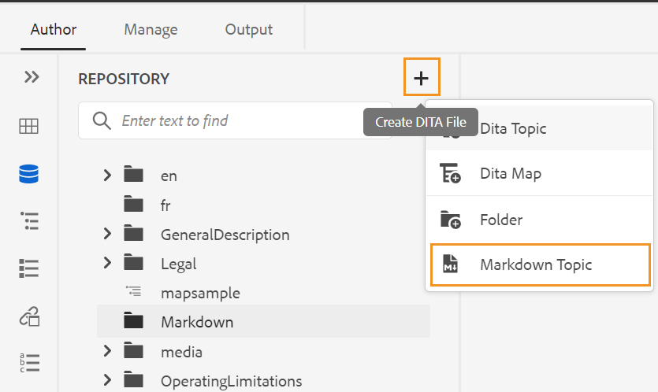

# 웹 편집기에서 Markdown 문서 작성 {#id223MIE0B079}

Markdown은 일반 텍스트 문서에 서식 요소를 추가하는 데 도움이 되는 간단한 마크업 언어입니다. AEM Guides은 웹 편집기에서 Markdown \(.md\) 주제를 만들고, 작성하고, 미리 보는 기능을 제공합니다. 기존 Markdown 문서를 업로드하고 웹 편집기에서 편집할 수도 있습니다.

## Markdown 항목 만들기

웹 편집기에서 Markdown 주제를 만들려면 다음 단계를 수행하십시오.

1. 저장소 보기에서 폴더를 선택합니다.
1. 다음 방법 중 하나로 **Markdown 항목**&#x200B;을 만듭니다.
   1. 저장소 패널의 오른쪽 상단에 있는 **DITA 파일 만들기** 아이콘을 클릭한 다음 드롭다운에서 **Markdown 항목**&#x200B;을 선택합니다.

   {width="550" align="left"}

   1. 선택한 폴더의 옵션 메뉴에서 **만들기**&#x200B;를 선택한 다음 드롭다운에서 **Markdown 항목**&#x200B;을 선택합니다.

   {width="550" align="left"}

1. **새 Markdown 항목 만들기** 대화 상자에 Markdown 항목의 이름과 경로를 입력합니다.

{width="350" align="left"}

1. **만들기**&#x200B;를 클릭합니다.

선택한 경로에 Markdown 주제가 만들어지고 편집을 위해 열려 있습니다.

## Markdown 주제 작성 및 미리보기

웹 편집기에서 Markdown 주제를 작성하려면 다음 단계를 수행하십시오.

1. 저장소 보기에서 기존 Markdown 주제\(.md\)를 선택합니다.
1. 항목을 두 번 클릭하여 편집 창에서 엽니다.

   주제가 Source 모드로 열립니다.

1. Markdown 주제의 내용을 업데이트합니다.
1. 항목을 미리 보려면 오른쪽 상단의 **미리 보기**&#x200B;를 클릭하십시오.

   >[!NOTE]
   >
   > 미리보기 모드는 사용자가 브라우저에서 주제를 볼 때 표시되는 방식을 보여 줍니다.

1. 주 도구 모음에서 **새 버전으로 저장**&#x200B;을 사용하여 주제의 변경 사항을 저장하고 주제의 새 버전을 만드십시오. 기본 도구 모음에서 **모두 저장**&#x200B;을 사용하여 열려 있는 모든 항목에서 변경 내용을 저장할 수도 있습니다.

1. Markdown 주제를 닫으려면 오른쪽 상단의 **닫기**&#x200B;를 클릭합니다.

>[!NOTE]
>
> 변경 사항을 저장하지 않은 경우 팝업이 표시되고, 닫기 전에 항목을 저장하라는 메시지가 표시됩니다.

**상위 항목:**[&#x200B;웹 편집기에서 작업](web-editor.md)
