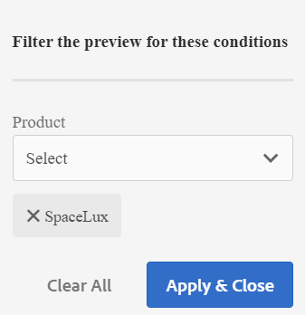
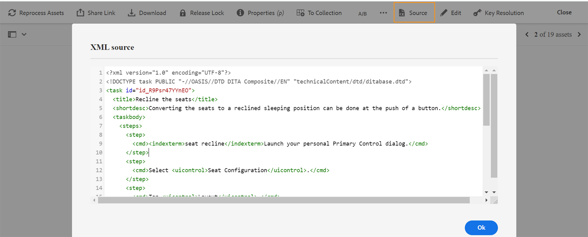
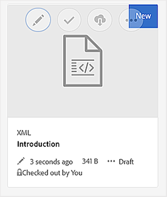
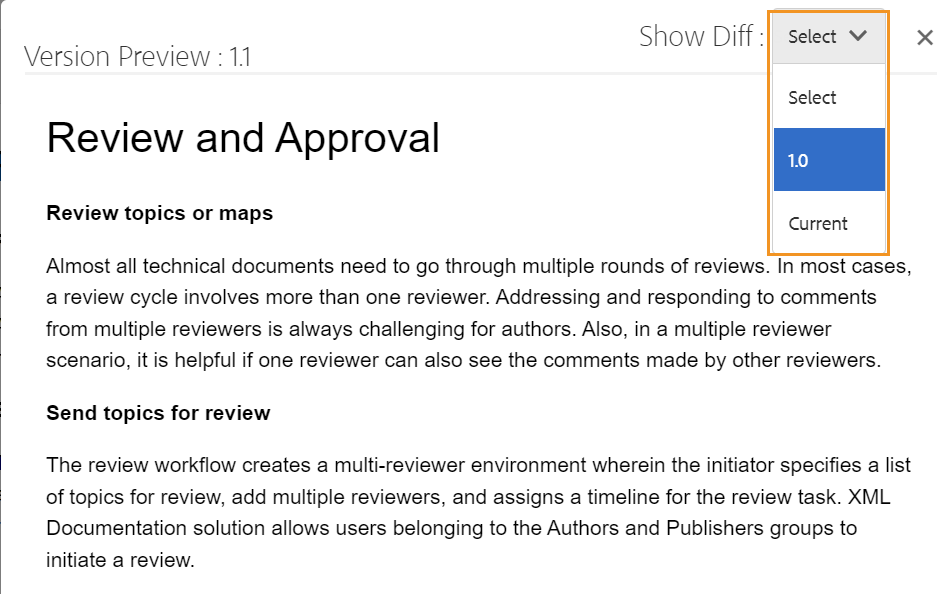
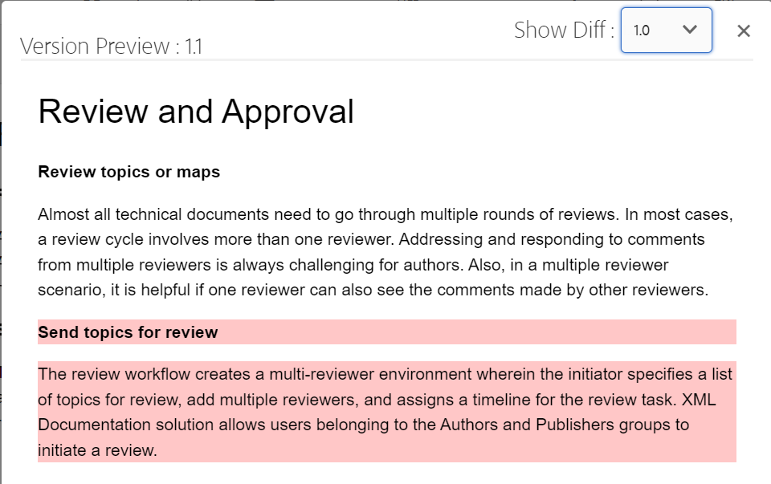
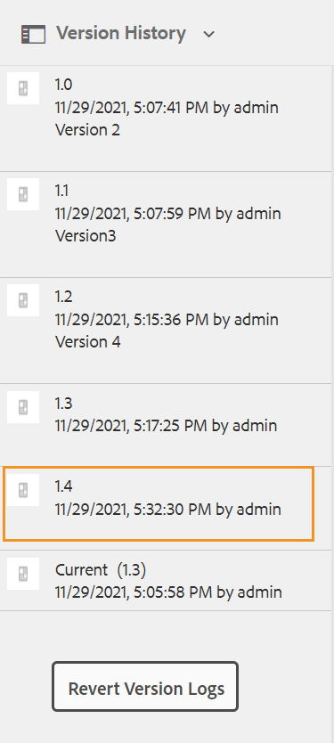
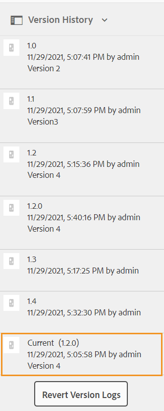

# 주제 미리 보기 {#id1696II000QR}

주제가 만들어지면 AEM Guides에서 주제의 미리보기를 생성합니다. 미리보기 모드에서는 문서 작업에 사용할 수 있는 다양한 기능을 제공합니다.

항목을 미리 보려면 다음 단계를 수행하십시오.

1. Assets UI에서 보려는 주제로 이동합니다.
1. 보려는 항목을 클릭합니다.

   Assets UI에 주제 미리보기가 표시됩니다.

   >[!NOTE]
   >
   > 주제의 파일 탭 오른쪽 상단 모서리에서 활성 주제 또는 DITA 맵의 버전을 볼 수 있습니다.

   >[!IMPORTANT]
   >
   > 미리 보기 도구 모음에서 다음 기능의 위치는 AEM 서버의 설정에 따라 다를 수 있습니다. 일부 기능은 기본 도구 모음에서 사용할 수 있고, 다른 기능은 기타 메뉴에서 사용할 수 있습니다.

## 미리보기 모드에서 사용 가능한 기능

{width="800" align="left"}

미리보기 모드에서 도구 모음에서 다음 작업을 수행할 수 있습니다.

**속성**

선택한 주제의 속성을 봅니다. AEM 버전을 기반으로 메타데이터, 일정 \(de\) 활성화, 참조, 문서 상태 등의 속성을 볼 수 있습니다.

>[!NOTE]
>
> 주제의 제목 속성은 DITA 주제 또는 맵의 `title` 태그에서 자동으로 채워집니다. 속성 창을 사용하여 제목을 변경하면 변경 내용이 손실됩니다. 제목 속성을 업데이트하려면 웹 편집기를 사용해야 합니다.

속성 페이지에는 맵 또는 주제가 사용되는 위치나 문서에 포함된 참조 등 참조에 대한 유용한 정보가 포함되어 있습니다. 속성 페이지에는 문서에 대한 두 가지 참조 유형(**다음에서 사용** 및 **발신 참조**)이 나열됩니다.

**Used In** 참조는 현재 파일이 참조되거나 사용되는 문서를 나열합니다. **발신 참조**&#x200B;에 현재 문서에서 참조되는 문서가 나열됩니다.

The \(+\) icon in the **Used In** references section allows you to further navigate upwards to find where that topic is being used or referred.

{width="800" align="left"}

Clicking the icon next to a document shows the map or topic files where that document is being further referred.

**Conditional Filtering \(A/B\)**

If your topic has conditional content, then you will see the A/B icon on the toolbar. Clicking on this icon opens a pop-up that allows you to filter the content as per the available conditions in the topic.

>[!NOTE]
>
> The conditional content is highlighted using light background color in the Web Editor.

{width="300" align="left"}

**편집**

- Open the topic for editing in the Web Editor. The **Edit** option will not be available if your administrator has enabled the **Disable Edit Without Checkout** option. With the option enabled, you will see the **Edit** option only after checking out a topic file.

**Key Resolution**

- If you want to use a keyspace file for the topic, click the Key Resolution icon. You can then choose a key space from the Key Resolution pop-up.

**소스**

- Open the XML source code of a file. You can view the underlying XML code of a map, topic or DITAVAL file by opening the file in the Preview mode and clicking the Source icon. The XML Source pop-up displays the XML source code. You can select a specific code from the file or press `Ctrl`+`a` to select the entire content.

  >[!NOTE]
  >
  > To get the source code view of a DITA map file, select the file in Assets UI and click Source.

  {width="800" align="left"}

**Share UUID Link**

- AEM Guides allows you to share the UUID-based links for DITA maps, topics, and image files from the following places:

   - Assets UI
   - DITA map&#39;s console
   - Topic or image&#39;s Preview

A new option **Share UUID Link** is shown in the toolbar of the above-mentioned areas. The following screenshot shows the **Share UUID Link** option in the Preview mode of a topic:

{width="800" align="left"}

In the Asset UI, this option is visible when you select a file. While in the Preview mode, this option is available in the main toolbar by default. In a DITA map console, this option is visible in the Output Presets section.

Once you have copied the URL, the same can be shared with other users to give them direct access to the file. This link remains valid even when the file is moved to some other location in the repository. The only time the link will fail is when the file is deleted from the repository.

If you share the link from DITA map console or a file&#39;s preview mode, then the user taken to same view of file. However, when you share a map file&#39;s link from the Assets UI, then the user is taken to the map&#39;s console. Similarly, for a topic or image file, the file&#39;s preview is shown.

>[!IMPORTANT]
>
> The link cannot be used as a reference link in other topic, it only gives direct access to the file in the repository. Also, the link remains valid as long as the file is available in the repository. Even if the file is moved to some other location in the repository, the link remain valid. The link will fail only when the file is deleted from the repository.

**Check Out/Check In**

- Toggles the Check Out and Check In features. When a file is checked out, the current user gets an exclusive write permission on the file. A checked out file can be opened in the Web Editor for editing. Once you have made the required changes, click the Check In icon to save the file in DAM.

When you check out a topic, the status of the file is shown as checked out in the card view and in the list view.

Checked out file in the card view:

{width="300" align="left"}

Checked out file in the list view:

{width="550" align="left"}

If the Checked Out column is not visible, select **View Settings** under **List View** and select the **Checked Out** status in the **Configure Columns** dialog.

{width="800" align="left"}

>[!TIP]
>
> See the Versioning of content section in the Best practices guide for best practices around working with file check-out and check-in.

**Web-based version difference**

- If your topic has undergone some changes, you can easily find out the changes made in different versions of that topic. To find out changes in different versions of a topic:

  >[!IMPORTANT]
  >
  > 다음 절차에 설명된 메서드는 DITA 파일에만 적용할 수 있습니다. 비 DITA 파일의 경우 타임라인 보기를 사용하여 버전을 생성하거나 파일의 기존 버전을 복원합니다.

   1. 미리보기 모드에서 주제를 엽니다.

   1. 왼쪽 레일에서 **버전 기록**&#x200B;을 클릭하고 버전을 선택합니다.

      {width="800" align="left"}

   1. 나열된 버전에서 기본 버전으로 사용할 버전을 선택하고 **버전 미리 보기**&#x200B;를 클릭합니다. 선택한 버전의 미리보기가 버전 미리보기 창에 표시됩니다.

   1. **차이점 표시** 목록에서 기본 버전을 비교할 버전을 선택합니다.

      {width="800" align="left"}

      변경된 내용은 주제 미리 보기에서 강조 표시됩니다. 녹색에서 강조 표시된 콘텐츠는 새로 추가된 콘텐츠를 의미하며 빨간색으로 표시된 콘텐츠는 삭제된 콘텐츠입니다.

      {width="800" align="left"}

### 분기, 되돌리기 및 후속 버전 관리 {#id193PG0Y051X}

- 일반적인 작성 환경에서는 특정 릴리스를 충족하기 위해 주제의 새 분기를 만들어야 합니다. 다른 버전 관리 시스템과 마찬가지로 AEM Guides을 사용하면 기존 버전의 주제에서 분기를 만들거나 이전 버전의 주제로 되돌릴 수 있습니다. AEM Guides에서 제공하는 버전 관리 기능을 사용하여 다음 작업을 수행할 수 있습니다.

   - 기존 버전의 주제에서 분기 만들기
   - 새 분기에서 후속 버전 만들기
   - 주제의 특정 버전으로 되돌리기

  다음 그림은 일반적인 분기 및 후속 버전 관리 시스템을 보여 줍니다.

  {width="550" align="center"}

  새 항목의 경우 첫 번째 버전은 1.0으로 번호가 매겨집니다. 그런 다음 항목의 모든 새 버전이 1.1, 1.2 등과 같은 증분 숫자와 함께 저장됩니다. 주제의 분기를 만들면 분기가 만들어지는 위치의 버전 번호를 사용하고 버전 끝에 .0을 추가하는 새 분기가 만들어집니다. 그림에서 볼 수 있듯이 주제의 버전 1.1에서 새 분기가 생성됩니다. 새 분기의 버전은 1.1.0입니다. 그런 다음 이 분기에 새 버전의 항목을 저장할 때마다 1.1.1, 1.1.2 등과 같은 증분 버전 번호가 부여됩니다.

  분기 와 유사하게 작업 또는 현재 버전을 저장소에 있는 모든 버전으로 되돌릴 수도 있습니다. 버전으로 되돌리려면 원하는 버전의 항목을 선택하고 **버전 기록** 패널에서 **이 버전으로 되돌리기**&#x200B;를 클릭하면 됩니다.

  Perform the following steps to create a branch, revert to a version, and maintain subsequent versions of a topic:

  >[!IMPORTANT]
  >
  > 다음 절차에 설명된 메서드는 DITA 파일에만 적용할 수 있습니다. 비 DITA 파일의 경우 타임라인 보기를 사용하여 버전을 생성하거나 파일의 기존 버전을 복원합니다.

   1. Access the topic in Assets UI.

      >[!NOTE]
      >
      > You can also open the topic in Preview mode and proceed with Step 3.

   1. Select the topic for which you want to create a branch.

   1. In the left rail, click **Version History**.

      >[!NOTE]
      >
      > A list of versions available for the selected topic is displayed. Each version contains the timestamp, user name, version comment, and [label](web-editor-use-label.md#) information.

   1. Select a version from where you want to create a branch. In the following screenshot, version 1.2 is selected for creating a branch.

      {width="300" align="left"}

      >[!NOTE]
      >
      > The current version of a topic contains *\(Current\)* mentioned next to the version number.

   1. Click **Revert to This Version**.

      A message appears asking you to confirm the creation of a new branch.

   1. *\(Optional\)* In the message prompt, you get an option to select the **Save The Current Working Copy As A New Version**. The following two actions are possible based on the selection of this option:

      - If you select this option, then a branch is created from version 1.1. And, a new version of the topic is also created from the current working copy of the topic and saved as the next version – 1.4.

        {width="300" align="left"}

        Version 1.2 becomes your current working copy of the topic. Any version saved after this is created under the new branch of 1.1. For example, the subsequent version of a new topic in this branch will be saved as 1.2.0.

        {width="300" align="left"}

      - If you do not select this option, then no new version from the current working copy of the topic is created. A new branch is created from version 1.2 of the topic. Any subsequent version of the topic is saved under the 1.2 branch as 1.2.0, 1.2.1, and so on.

        {width="300" align="left"}

   1. **확인**&#x200B;을 클릭합니다.

  A new branch is created from the selected version of the topic. 위의 프로세스는 주제의 특정 버전으로 되돌리는 데에도 적용할 수 있습니다. 특정 버전으로 되돌린다는 것은 기술적으로 선택한 버전에서 새 분기를 만들고 해당 버전을 주제의 현재 작업 복사본으로 만든다는 것을 의미합니다. 버전 되돌리기 기록 보고서에서 복구된 파일의 기록을 볼 수도 있습니다. 이 보고서에 대한 자세한 내용은 [되돌려진 파일 버전 기록 보고서](reports-reverted-file-version-history.md#)를 참조하십시오.

**상위 항목:**&#x200B;[&#x200B;항목 만들기 및 미리 보기](create-preview-topics.md)
