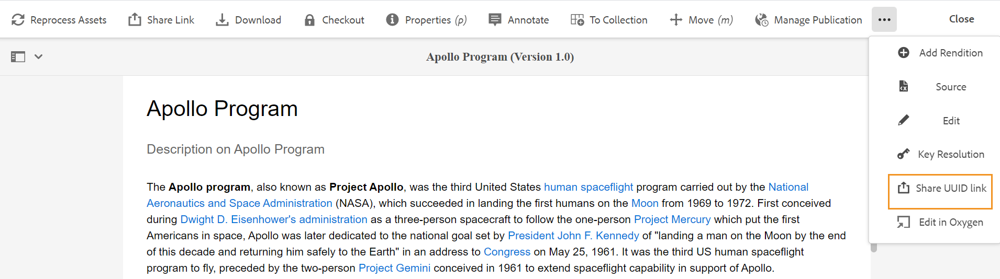
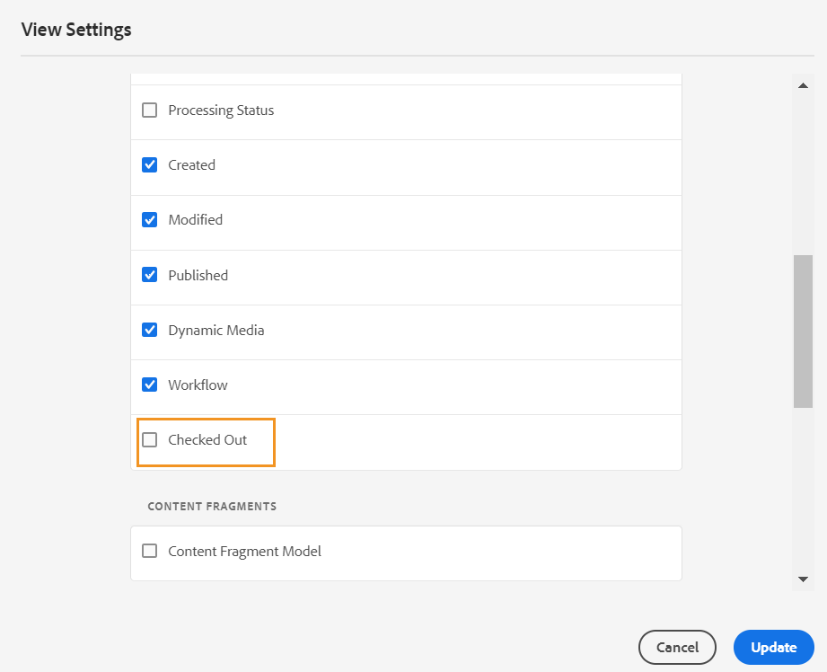

# 주제 미리 보기 {#id1696II000QR}

주제가 만들어지면 AEM Guides에서 주제의 미리보기를 생성합니다. 미리보기 모드에서는 문서 작업에 사용할 수 있는 다양한 기능을 제공합니다.

항목을 미리 보려면 다음 단계를 수행하십시오.

1. Assets UI에서 보려는 주제로 이동합니다.
1. 보려는 항목을 클릭합니다.

   Assets UI에 주제 미리보기가 표시됩니다.

   >[!NOTE]
   >
   > 주제의 파일 탭 오른쪽 상단 모서리에서 활성 주제 또는 DITA 맵의 버전을 볼 수 있습니다.

   >[!IMPORTANT]
   >
   > 미리 보기 도구 모음에서 다음 기능은 AEM 서버의 설정에 따라 위치가 다를 수 있습니다. 일부 기능은 기본 도구 모음에서 사용할 수 있고, 다른 기능은 기타 메뉴에서 사용할 수 있습니다.

## 미리보기 모드에서 사용 가능한 기능

{width="800" align="left"}

미리보기 모드에서 도구 모음에서 다음 작업을 수행할 수 있습니다.

**속성**

선택한 주제의 속성을 봅니다. AEM 버전을 기반으로 메타데이터, 일정 \(de\) 활성화, 참조, 문서 상태 등의 속성을 볼 수 있습니다.

>[!NOTE]
>
> 주제의 제목 속성은 DITA 주제 또는 맵의 `title` 태그에서 자동으로 채워집니다. 속성 창을 사용하여 제목을 변경하면 변경 내용이 손실됩니다. 제목 속성을 업데이트하려면 웹 편집기를 사용해야 합니다.

속성 페이지에는 맵 또는 주제가 사용되는 위치나 문서에 포함된 참조 등 참조에 대한 유용한 정보가 포함되어 있습니다. 속성 페이지에는 문서에 대한 두 가지 참조 유형(**다음에서 사용** 및 **발신 참조**)이 나열됩니다.

**Used In** 참조는 현재 파일이 참조되거나 사용되는 문서를 나열합니다. **발신 참조**&#x200B;에 현재 문서에서 참조되는 문서가 나열됩니다.

**다음에서 사용됨** 참조 섹션의 \(+\) 아이콘을 사용하면 위로 이동하여 해당 주제가 사용되거나 참조되는 위치를 찾을 수 있습니다.

{width="800" align="left"}

문서 옆에 있는  아이콘을 클릭하면 해당 문서가 추가로 참조되는 맵 또는 주제 파일이 표시됩니다.

**조건부 필터링 \(A/B\)**

주제에 조건부 콘텐츠가 있는 경우 도구 모음에 A/B 아이콘이 표시됩니다. 이 아이콘을 클릭하면 항목의 사용 가능한 조건에 따라 콘텐츠를 필터링할 수 있는 팝업이 열립니다.

>[!NOTE]
>
> 조건부 콘텐츠는 웹 편집기에서 밝은 배경색을 사용하여 강조 표시됩니다.

{width="300" align="left"}

**편집**

- 웹 편집기에서 편집할 항목을 엽니다. 관리자가 **체크아웃하지 않고 편집 사용 안 함** 옵션을 사용하도록 설정한 경우 **편집** 옵션을 사용할 수 없습니다. 이 옵션을 활성화하면 주제 파일을 체크 아웃한 후에만 **편집** 옵션이 표시됩니다.

**키 확인**

- 항목에 대해 키 공간 파일을 사용하려면 키 해상도 아이콘을 클릭합니다. 그런 다음 키 해상도 팝업에서 키 공간을 선택할 수 있습니다.

**소스**

- 파일의 XML 소스 코드를 엽니다. 미리 보기 모드에서 파일을 열고 Source 아이콘을 클릭하여 맵, 주제 또는 DITAVAL 파일의 기본 XML 코드를 볼 수 있습니다. XML Source 팝업에 XML 소스 코드가 표시됩니다. 파일에서 특정 코드를 선택하거나 `Ctrl`+`a`을 눌러 전체 콘텐츠를 선택할 수 있습니다.

  >[!NOTE]
  >
  > DITA 맵 파일의 소스 코드 보기를 가져오려면 Assets UI에서 파일을 선택하고 Source을 클릭합니다.

  {width="800" align="left"}

**UUID 링크 공유**

- AEM Guides을 사용하면 다음 위치에서 DITA 맵, 주제 및 이미지 파일에 대한 UUID 기반 링크를 공유할 수 있습니다.

   - ASSETS UI
   - DITA 맵의 콘솔
   - 주제 또는 이미지의 미리 보기

위에서 언급한 영역의 도구 모음에 새 옵션 **UUID 링크 공유**&#x200B;가 표시됩니다. 다음 스크린샷은 주제의 미리 보기 모드에서 **UUID 링크 공유** 옵션을 보여 줍니다.

{width="800" align="left"}

에셋 UI에서 이 옵션은 파일을 선택할 때 표시됩니다. 미리보기 모드에 있는 동안 이 옵션은 기본적으로 기본 도구 모음에서 사용할 수 있습니다. DITA 맵 콘솔에서 이 옵션은 [출력 사전 설정] 섹션에 표시됩니다.

URL을 복사하면 동일한 내용을 다른 사용자와 공유하여 해당 사용자에게 파일에 대한 직접 액세스 권한을 제공할 수 있습니다. 이 링크는 파일을 저장소의 다른 위치로 이동하더라도 유효합니다. 링크가 실패하는 유일한 때는 파일이 저장소에서 삭제될 때입니다.

DITA 맵 콘솔 또는 파일의 미리보기 모드에서 링크를 공유하는 경우 사용자는 동일한 파일 보기로 이동됩니다. 그러나 Assets UI에서 맵 파일의 링크를 공유하면 사용자가 맵의 콘솔로 이동합니다. 마찬가지로 주제 또는 이미지 파일의 경우 파일의 미리 보기가 표시됩니다.

>[!IMPORTANT]
>
> 링크는 다른 항목에서 참조 링크로 사용할 수 없으며 저장소의 파일에 대한 직접 액세스만 제공합니다. 또한 파일을 저장소에서 사용할 수 있는 한 링크는 유효한 상태로 유지됩니다. 파일이 저장소의 다른 위치로 이동되더라도 링크는 유효한 상태로 유지됩니다. 파일이 저장소에서 삭제될 때만 링크가 실패합니다.

**체크아웃/체크인**

- 체크아웃 및 체크인 기능을 전환합니다. 파일을 체크 아웃하면 현재 사용자는 파일에 대한 단독 쓰기 권한을 받습니다. 체크 아웃된 파일은 웹 편집기에서 열어서 편집할 수 있습니다. 필요한 사항을 변경한 후 체크 인 아이콘을 클릭하여 파일을 DAM에 저장합니다.

항목을 체크 아웃하면 파일 상태가 카드 보기와 목록 보기에서 체크 아웃됨으로 표시됩니다.

카드 보기에서 체크 아웃한 파일:

{width="300" align="left"}

목록 보기에서 체크 아웃된 파일:

{width="550" align="left"}

체크 아웃된 열이 표시되지 않으면 **목록 보기**&#x200B;에서 **설정 보기**&#x200B;를 선택하고 **열 구성** 대화 상자에서 **체크 아웃** 상태를 선택하십시오.

{width="800" align="left"}

>[!TIP]
>
> 파일 체크아웃 및 체크인 작업에 대한 우수 사례는 우수 사례 안내서의 콘텐츠 버전 관리 섹션을 참조하십시오.

**웹 기반 버전 차이점**

- 주제가 일부 변경된 경우 해당 주제의 다른 버전에서 변경된 내용을 쉽게 확인할 수 있습니다. 주제의 다른 버전에서 변경 사항을 확인하려면 다음을 수행합니다.

  >[!IMPORTANT]
  >
  > 다음 절차에 설명된 메서드는 DITA 파일에만 적용할 수 있습니다. 비 DITA 파일의 경우 타임라인 보기를 사용하여 버전을 생성하거나 파일의 기존 버전을 복원합니다.

   1. 미리보기 모드에서 주제를 엽니다.

   1. 왼쪽 레일에서 **버전 기록**&#x200B;을 클릭하고 버전을 선택합니다.

      {width="800" align="left"}

   1. 나열된 버전에서 기본 버전으로 사용할 버전을 선택하고 **버전 미리 보기**&#x200B;를 클릭합니다. 선택한 버전의 미리보기가 버전 미리보기 창에 표시됩니다.

   1. **차이점 표시** 목록에서 기본 버전을 비교할 버전을 선택합니다.

      {width="800" align="left"}

      변경된 내용은 주제 미리 보기에서 강조 표시됩니다. 녹색에서 강조 표시된 콘텐츠는 새로 추가된 콘텐츠를 의미하며 빨간색으로 표시된 콘텐츠는 삭제된 콘텐츠입니다.

      {width="800" align="left"}

### 분기, 되돌리기 및 후속 버전 관리 {#id193PG0Y051X}

- 일반적인 작성 환경에서는 특정 릴리스를 충족하기 위해 주제의 새 분기를 만들어야 합니다. 다른 버전 관리 시스템과 마찬가지로 AEM Guides을 사용하면 기존 버전의 주제에서 분기를 만들거나 이전 버전의 주제로 되돌릴 수 있습니다. AEM Guides에서 제공하는 버전 관리 기능을 사용하여 다음 작업을 수행할 수 있습니다.

   - 기존 버전의 주제에서 분기 만들기
   - 새 분기에서 후속 버전 만들기
   - 주제의 특정 버전으로 되돌리기

  다음 그림은 일반적인 분기 및 후속 버전 관리 시스템을 보여 줍니다.

  {width="550" align="center"}

  새 항목의 경우 첫 번째 버전은 1.0으로 번호가 매겨집니다. 그런 다음 항목의 모든 새 버전이 1.1, 1.2 등과 같은 증분 숫자와 함께 저장됩니다. 주제의 분기를 만들면 분기가 만들어지는 위치의 버전 번호를 사용하고 버전 끝에 .0을 추가하는 새 분기가 만들어집니다. 그림에서 볼 수 있듯이 주제의 버전 1.1에서 새 분기가 생성됩니다. 새 분기의 버전은 1.1.0입니다. 그런 다음 이 분기에 새 버전의 항목을 저장할 때마다 1.1.1, 1.1.2 등과 같은 증분 버전 번호가 부여됩니다.

  분기 와 유사하게 작업 또는 현재 버전을 저장소에 있는 모든 버전으로 되돌릴 수도 있습니다. 버전으로 되돌리려면 원하는 버전의 항목을 선택하고 **버전 기록** 패널에서 **이 버전으로 되돌리기**&#x200B;를 클릭하면 됩니다.

  분기를 만들고, 버전으로 되돌리고, 주제의 후속 버전을 유지 관리하려면 다음 단계를 수행하십시오.

  >[!IMPORTANT]
  >
  > 다음 절차에 설명된 메서드는 DITA 파일에만 적용할 수 있습니다. 비 DITA 파일의 경우 타임라인 보기를 사용하여 버전을 생성하거나 파일의 기존 버전을 복원합니다.

   1. Assets UI의 주제에 액세스합니다.

      >[!NOTE]
      >
      > 미리보기 모드에서 항목을 열고 3단계를 진행할 수도 있습니다.

   1. 분기를 만들 항목을 선택합니다.

   1. 왼쪽 레일에서 **버전 기록**&#x200B;을 클릭합니다.

      >[!NOTE]
      >
      > 선택한 주제에 사용할 수 있는 버전 목록이 표시됩니다. 각 버전에는 타임스탬프, 사용자 이름, 버전 설명 및 [label](web-editor-use-label.md#) 정보가 포함되어 있습니다.

   1. 분기를 만들 위치에서 버전을 선택합니다. 다음 스크린샷에서는 분기를 만들기 위해 버전 1.2가 선택되어 있습니다.

      {width="300" align="left"}

      >[!NOTE]
      >
      > 주제의 현재 버전에는 버전 번호 옆에 *\(Current\)*&#x200B;이(가) 있습니다.

   1. **이 버전으로 되돌리기**&#x200B;를 클릭합니다.

      새 분기 만들기를 확인하라는 메시지가 나타납니다.

   1. *\(선택 사항\)* 메시지 프롬프트에서 **현재 작업 복사본을 새 버전으로 저장**&#x200B;을 선택할 수 있습니다. 이 옵션의 선택을 기준으로 다음 두 가지 작업이 가능합니다.

      - 이 옵션을 선택하면 버전 1.1에서 분기가 생성됩니다. 또한 주제의 현재 작업 복사본에서 주제의 새 버전이 만들어지고 다음 버전인 1.4로 저장됩니다.

        {width="300" align="left"}

        버전 1.2가 주제의 현재 작업 복사본이 됩니다. 이후 저장된 모든 버전은 1.1의 새 분기에 생성됩니다. 예를 들어 이 분기에 있는 새 주제의 후속 버전은 1.2.0으로 저장됩니다.

        {width="300" align="left"}

      - 이 옵션을 선택하지 않으면 주제의 현재 작업 복사본에서 새 버전이 만들어지지 않습니다. 주제의 버전 1.2에서 새 분기가 만들어집니다. 항목의 후속 버전은 1.2 분기 아래에 1.2.0, 1.2.1 등으로 저장됩니다.

        {width="300" align="left"}

   1. **확인**&#x200B;을 클릭합니다.

  선택한 버전의 주제에서 새 분기가 만들어집니다. 위의 프로세스는 주제의 특정 버전으로 되돌리는 데에도 적용할 수 있습니다. 특정 버전으로 되돌린다는 것은 기술적으로 선택한 버전에서 새 분기를 만들고 해당 버전을 주제의 현재 작업 복사본으로 만든다는 것을 의미합니다. 버전 되돌리기 기록 보고서에서 복구된 파일의 기록을 볼 수도 있습니다. 이 보고서에 대한 자세한 내용은 [되돌려진 파일 버전 기록 보고서](reports-reverted-file-version-history.md#)를 참조하십시오.

**상위 항목:**[&#x200B;항목 만들기 및 미리 보기](create-preview-topics.md)
