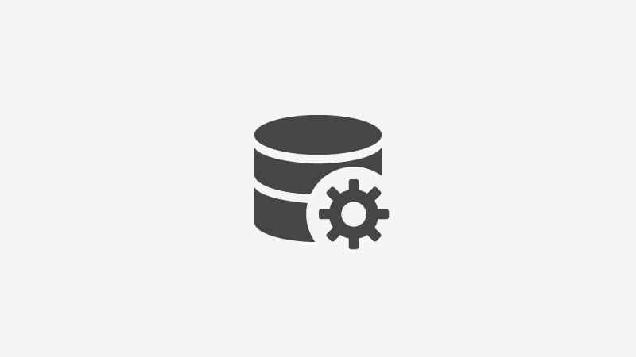
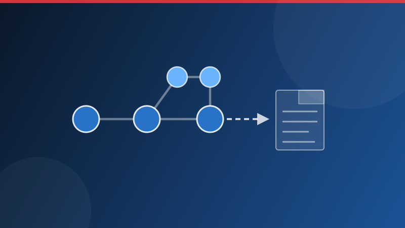

# Experience Manager Guides 설명서

Experience Manager Guides은 구조화된 작성, 다중 채널 게시 및 컨텐츠 수명주기 관리를 위한 기본 DITA 지원을 제공하는 엔터프라이즈급 CCMS입니다.

**배포:** [!BADGE Cloud Service]{type=Positive} [!BADGE 온-프레미스]{type=Informative}

## 역할로 시작

::::landing-cards-container
:::card

관리자

폴더 프로필, 권한, 워크플로 설정 및 출력 템플릿을 구성합니다.

[관리 안내서](./install-conf-guide/introduction.md)
:::

:::card

작성자

DITA 주제, 맵, 콘텐츠 재사용 및 검토 워크플로우를 만들고 관리합니다.

[작성 개요](./user-guide/authoring-content.md)
:::

:::card

게시자

출력 사전 설정을 설정하고, 기준선을 관리하고, 채널 간에 출력을 생성합니다.

[맵 관리 및 게시](./user-guide/map-console-overview.md)
:::

::::

<!--
:::card

Architects

Design DITA specializations, schemas, and content architecture for your implementation.

[DITA specialization](./install-conf-guide/dita-ot-specialization.md)
:::

::::
-->

## 기능 영역별 탐색

<!-- Author note: Six cards wrap to two rows of three in production. The landing-cards-container component is in beta — verify rendering in production before publishing. -->

::::landing-cards-container

:::card

작성

웹 편집기, FrameMaker 통합, 재사용 가능한 콘텐츠 및 검토 주기.

[콘텐츠 작성](./user-guide/web-editor.md)
:::

:::card

검토

항목을 검토하고, 검토 작업을 관리하고, 알림을 검토합니다.

[리뷰 소개](./user-guide/review.md)
:::

:::card

게시

PDF, AEM Sites, HTML5, EPUB 및 JSON 출력 유형.

[콘텐츠 게시](./user-guide/generate-output.md)
:::

:::card

번역

다국어 콘텐츠를 위한 사람 및 기계 번역 워크플로.

[콘텐츠 번역](./user-guide/translation.md)
:::

:::card

보고서

주제 목록, 멀티미디어, 끊어진 링크 및 메타데이터 보고서.

[보고서 생성](./user-guide/reports-intro.md)
:::

:::card

구성

폴더 프로파일, DITA-OT 사용자 정의 및 출력 템플릿.

[폴더 프로필 구성](./install-conf-guide/conf-profiles.md)
:::

::::

## 새로운 기능

<!-- Author note: Update images, badge labels, feature titles, descriptions, and links each release cycle. Images are stored in /assets/. The shade box with a borderless HTML table provides the three-column layout. Blank lines inside each <td> are required for ExL to process badge and bold-link markdown syntax. -->

>[!BEGINSHADEBOX]

<table>
<tr style="border: 0;">
<td>

**[Git 커넥터를 사용하여 콘텐츠 가져오기](./user-guide/web-editor-git-connector.md)**

Git 저장소에서 바로 안내서로 콘텐츠를 가져옵니다.

</td>
<td>

**[새 맵 컬렉션](./user-guide/generate-output-use-new-map-collection-output-generation.md)**

맵 관리 및 출력 게시를 위한 통합 인터페이스.

</td>
<td>

**[검토 작업 위임](./user-guide/review-complete-review-tasks.md#delegate-a-review-task-to-another-reviewer)**

검토자는 다른 검토자에게 검토 작업을 위임할 수 있습니다.

</td>
</tr>
</table>

>[!ENDSHADEBOX]

## 추가 리소스

* [Cloud Service 릴리스 노트](./release-info/latest-release-info-cs.md)
* [온-프레미스용 릴리스 정보](./release-info/latest-release-info.md)
* [AEM Guides 커뮤니티](https://experienceleaguecommunities.adobe.com/adobe-experience-manager-guides-11){target="_blank"}
* [GitHub 저장소](https://github.com/AdobeDocs/experience-manager-guides.en){target="_blank"}
* [지원](https://experienceleague.adobe.com/support/v2/en/){target="_blank"}
* [비디오 자습서](https://experienceleague.adobe.com/en/docs/experience-manager-guides-learn/videos/getting-started/overview){target="_blank"}
