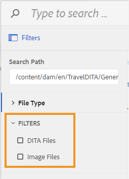

# 파일 찾아보기 대화 상자에 대한 필터 구성 {#id20CIL7009GN}

웹 편집기에서 작업하는 동안 파일 찾아보기 대화 상자를 사용하여 이미지, 참조 또는 키 참조와 같은 요소를 삽입해야 합니다. 기본 파일 찾아보기 대화 상자에는 파일 필터링 옵션이 없습니다. 필요한 파일에 쉽고 빠르게 액세스할 수 있는 필터를 직접 추가할 수 있습니다.

다음 단계를 수행하여 파일 찾아보기 대화 상자에 사용자 정의 파일 필터링 옵션을 추가합니다.

1. UI 구성 파일을 다운로드하려면 Adobe Experience Manager에 관리자로 로그인합니다.

1. 맨 위에 있는 Adobe Experience Manager 링크를 클릭하고 **도구**&#x200B;를 선택합니다.
1. 도구 목록에서 **안내서**&#x200B;를 선택하고 **폴더 프로필**&#x200B;을 클릭합니다.
1. **전역 프로필** 타일을 클릭합니다.
1. **XML 편집기 구성** 탭을 선택하고 상단의 **편집** 아이콘을 클릭합니다
1. **다운로드** 아이콘을 클릭하여 로컬 시스템에서 ui\_config.json 파일을 다운로드합니다. 그런 다음 파일을 변경한 다음 동일한 파일을 업로드할 수 있습니다.
1. `ui_config.json` 파일에 추가할 필터의 정의를 추가합니다.

   다음 코드 조각은 DITA 파일과 이미지 파일, 이렇게 두 가지 필터링 옵션을 추가하는 방법을 보여 줍니다.

   ```
   "browseFilters": [
                       {
                       "title": "DITA Files",
                       "property": "jcr:content/metadata/dita_class",
                       "operation": "exists"
                       },
                       {
                       "title": "Image Files",
                       "property": "jcr:content/metadata/dc:format",
                       "value": [
                       "image/jpeg",
                       "image/gif",
                       "image/png"
                       ]
                       }
                       ]
   ```

   위의 코드 스니펫에서 첫 번째 필터는 DITA 파일용입니다. 필터 정의는 다음 매개 변수를 사용합니다.

   제목
:   필터의 표시 이름입니다. 이 제목은 파일 찾아보기 대화 상자에 필터링 옵션으로 나타납니다.

   속성
:   파일 메타데이터에서 일치시킬 속성입니다. 예를 들어 속성에 `dita_class` 메타데이터가 있는 파일만 허용하려면 속성 필터에서 &quot; `jcr:content/metadata/dita_class`&quot;을(를) 값으로 사용합니다.

   작업
:   속성 매개 변수에 지정된 값이 있는지 확인하려면 &quot; `exists`&quot;을(를) 지정하십시오.

   두 번째 필터는 이미지 파일에 대한 것입니다. 매개 변수는 `value` 매개 변수를 제외하고 첫 번째 필터와 유사합니다. `value` 매개 변수는 이미지 형식의 배열을 해당 값으로 사용합니다. 값 매개변수에 지정된 모든 파일 유형이 검색되어 파일 찾아보기 대화 상자에 표시되고 다른 모든 파일 유형은 무시됩니다.

1. *ui\_config.json* 파일을 저장하고 업로드하십시오. 그런 다음 웹 편집기를 다시 로드합니다.

   파일 찾아보기 대화 상자를 시작하면 ui\_config.json 파일에 구성된 필터 옵션이 표시됩니다.

   


**상위 항목:**[&#x200B;웹 편집기 사용자 지정](conf-web-editor.md)
