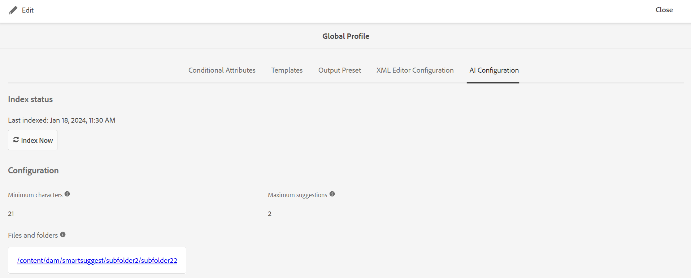

# 전역 또는 폴더 수준 프로필 구성 {#id181AH2003PF}

기업에서는 다른 그룹이나 제품이 다른 작성 템플릿, 출력 템플릿, 조건부 속성 프로필 \(또는 주제 스키마\) 및 웹 편집기 구성을 사용할 수 있습니다. 작성자가 엔터프라이즈 \(또는 글로벌\) 수준에서만 구성하면 작성자와 관련 없는 템플릿 또는 프로필이 표시되므로 작성자가 어려움을 겪을 수 있습니다.

AEM Guides을 사용하면 폴더 수준뿐만 아니라 엔터프라이즈 \(전역\) 수준에서 작성 \(topic 또는 map\) 템플릿, 출력 템플릿, 조건부 속성 및 웹 편집기 구성을 구성할 수 있습니다. 이렇게 하면 기업의 다양한 부서나 제품에 대한 구성을 분리할 수 있습니다.

또한 부서나 제품 관리자에게 폴더별 구성을 위임하여 관리를 분산할 수 있습니다.

안내서 설정의 폴더 프로필 타일을 사용하여 다음 탭에서 설정을 구성할 수 있습니다.

{width="800" align="left"}

- **일반**: 일반 탭은 폴더 수준 \(또는 프로젝트/제품\) 설정을 구성하는 경우에만 사용할 수 있습니다. 설정을 적용할 폴더 경로와 구성을 만들거나 업데이트할 관리 권한이 있는 사용자와 같은 설정을 구성할 수 있습니다.

- **조건부 특성**: 이 탭을 사용하여 전역 또는 폴더 수준에서 조건부 특성을 구성합니다. 조건부 속성은 속성 이름과 값의 조합이며 레이블을 정의할 수도 있습니다. 표준 DITA 속성이나 사용자 지정 속성을 사용할 수 있습니다. 글로벌 수준에서 정의하는 조건부 속성은 프로젝트의 모든 사용자가 사용할 수 있게 됩니다. 폴더 수준 조건부 속성을 정의한 경우 전역적으로 정의된 조건부 속성과 병합됩니다.

- **템플릿**: 작성자가 DITA 콘텐츠를 만들거나 게시하는 데 사용할 템플릿을 구성하려면 이 탭을 사용합니다. 다음 주제 템플릿은 즉시 사용할 수 있습니다.

   - 용어 설명

   - 참조

   - 주제

   - 개념

   - 작업

   - 문제 해결

   - 비어 있음

   - DITAVAL

  >[!NOTE]
  >
  > 기존 템플릿을 기반으로 사용하여 새 템플릿을 만들 수 있습니다. 빈 DITA 템플릿에는 다른 템플릿과 같은 구조나 요소가 포함되어 있지 않습니다. 임의의 OOTB DITA 템플릿을 기반으로 사용하여 수정한 후 다른 이름으로 저장할 수 있습니다. 필요한 변경 작업을 수행한 후 업데이트된 템플릿을 전역 또는 폴더 수준 작성 템플릿 구성에 추가하면 작성에 사용할 수 있게 됩니다.

  주제 템플릿과 함께 작성자가 사용할 수 있는 맵 템플릿을 정의할 수도 있습니다. 다음과 같은 맵 템플릿을 즉시 사용할 수 있습니다.

   - 맵

   - 북맵

- **출력 사전 설정**: 템플릿과 마찬가지로 5개의 미리 구성된 출력 사전 설정이 있습니다.

   - AEM 사이트

   - PDF

   - HTML5

   - EPUB

   - 사용자 정의

  게시자는 이러한 기본 출력 사전 설정을 사용하여 콘텐츠를 게시할 수 있습니다. 이러한 사전 설정은 전역 또는 폴더 수준 프로필의 관리자가 구성할 수 있습니다. 구성하고 나면 새로 만든 DITA 맵에 대해 게시자가 게시 사전 설정을 사용할 수 있게 됩니다. 기존 DITA 맵에 게시 사전 설정을 적용할 수도 있습니다. 자세한 내용은 [사전 설정 변경 내용 적용](#id18AGD0K0OHS)을 참조하십시오.

- **XML 편집기 구성**: 이 탭을 사용하여 웹 편집기의 모양과 다양한 기능을 사용자 지정할 수 있습니다. 웹 편집기에서 다음 구성 가능한 설정을 사용할 수 있습니다.

   - XML 편집기 UI 구성
   - XML 편집기 페이지 레이아웃
   - XML 편집기 구성
   - CSS 템플릿 레이아웃
   - XML 편집기 조각
   - XML 콘텐츠 버전 레이블
   - Rootmap \(폴더 수준에서만\)

전역 프로필과 폴더 수준 프로필을 모두 구성할 수 있습니다. 폴더 수준 프로필에서는 설정을 적용할 폴더를 정의할 수 있습니다. 이러한 설정에는 조건부 특성, 템플릿, 출력 사전 설정 및 XML 편집기 설정이 포함됩니다. 구성된 폴더에서 작업하는 작성자는 조건부 사전 설정, 템플릿 및 XML 편집기 구성을 사용할 수 있습니다. 마찬가지로 게시자는 구성된 폴더 내에 정의된 구성된 출력 사전 설정에 액세스할 수 있습니다.

폴더 수준 프로필은 전역 프로필에 구성된 설정을 재정의합니다. 즉, 폴더에 폴더 수준 프로필이 있는 경우 해당 폴더 프로필에 구성된 템플릿, 출력 템플릿 및 XML 편집기 설정이 표시됩니다. 전역 프로필에 구성된 설정은 표시되지 않습니다. 단, 이는 조건부 속성에는 적용되지 않습니다. 조건부 속성의 경우 조건부 속성은 전역 및 폴더 수준에서 병합됩니다.

다음 섹션에서는 글로벌 프로필 및 폴더 수준 프로필을 구성하는 프로세스를 안내합니다.

## 전역 프로필 구성

전역 프로필을 구성하려면 다음 단계를 수행하십시오.

1. 관리자로 Adobe Experience Manager에 로그인합니다.

1. 맨 위에 있는 Adobe Experience Manager 링크를 클릭하고 **도구**&#x200B;를 선택합니다.

1. 도구 목록에서 **안내서**&#x200B;를 선택하고 **폴더 프로필**&#x200B;을 클릭합니다.

   처음으로 [전역 프로필] 타일만 있는 [폴더 프로필] 페이지가 표시됩니다.

   {width="800" align="left"}

1. **전역 프로필** 타일을 클릭합니다.

1. **조건부 특성**&#x200B;을 구성하려면 [전역 또는 폴더 수준 프로필에 대한 조건부 특성 구성](#id1889D0I305Z)을 참조하십시오.

1. **템플릿**&#x200B;을 구성하려면 [저작 템플릿 구성](#id1889D0IL0Y4)을 참조하십시오.

1. **출력 사전 설정**&#x200B;을 구성하려면 [출력 사전 설정 구성](#id18AGD0IH0Y4)을 참조하십시오.

1. XML 편집기 구성을 구성하려면 [XML 편집기 구성 및 사용자 지정](#id2065G300O5Z)을 참조하십시오.

1. 필요한 모든 업데이트를 수행한 후 **전역 프로필**&#x200B;을(를) 저장하고 닫습니다.


## 폴더 수준 프로필 만들기 및 구성

폴더 수준 프로필을 구성하려면 다음 단계를 수행하십시오.

1. 관리자로 Adobe Experience Manager에 로그인합니다.

1. 맨 위에 있는 Adobe Experience Manager 링크를 클릭하고 **도구**&#x200B;를 선택합니다.

1. 도구 목록에서 **안내서**&#x200B;를 선택하고 **폴더 프로필** 타일을 클릭합니다.

   처음으로 폴더 프로필 페이지가 기본 전역 프로필 타일만 표시됩니다.

1. **만들기**&#x200B;를 클릭합니다.

   {width="300" align="left"}

1. **폴더 프로필 만들기** 대화 상자에 다음 세부 정보를 입력하십시오.
   - 폴더 프로필의 이름입니다.
   - 프로필을 적용할 수 있는 폴더의 경로입니다.

     >[!NOTE]
     >
     > 한 폴더에 여러 개의 폴더 프로필을 적용할 수 없습니다. 여기에서 선택하는 폴더에 다른 프로필이 적용되지 않았는지 확인하십시오. 자체 특정 프로필이 있는 상위-하위 폴더의 경우 하위 폴더는 자체 프로필의 구성을 사용합니다. 상위 폴더의 구성이 하위 폴더의 구성을 재정의하지 않습니다.

1. **만들기**&#x200B;를 클릭합니다.

   폴더 프로필 페이지의 폴더 프로필 이름으로 새 타일이 만들어집니다

1. 편집할 폴더 프로필 타일을 클릭합니다.

   폴더 프로필의 이름과 구성된 폴더 정보가 있는 일반 탭이 표시됩니다.

1. 폴더 프로필을 수정할 수 있는 관리자 권한을 갖게 될 여러 폴더 및 사용자를 추가하려면 **편집**&#x200B;을 클릭합니다.

   >[!NOTE]
   >
   > 여기에 추가하는 사용자는 이 폴더 프로필에 대해 구성된 조건부 특성, 템플릿 및 출력 사전 설정을 업데이트할 수 있는 관리 권한이 있습니다.

1. 폴더를 추가하려면 폴더 경로에서 찾아보기 아이콘을 클릭하고 폴더로 이동하여 선택한 다음 추가 를 클릭하여 폴더를 이 프로필에 추가합니다.

   >[!NOTE]
   >
   > 여기에서 선택한 폴더에 연결된 다른 폴더 수준 프로필이 없는지 확인합니다.

1. 사용자를 추가하려면 **관리자 사용자** 드롭다운에서 사용자를 선택하고 **추가**&#x200B;를 클릭합니다.

   >[!NOTE]
   >
   > 드롭다운 목록에서 폴더 프로필에 여러 사용자를 추가할 수 있습니다. 사용자 ID 옆에 있는 삭제 아이콘을 클릭하여 목록에서 기존 관리 사용자를 제거할 수도 있습니다.

1. 필요한 모든 폴더와 사용자를 폴더 프로필에 추가한 후 **저장**&#x200B;을 클릭합니다.


이제 조건부 특성, 템플릿, 출력 사전 설정 및 XML 편집기를 구성할 준비가 되었습니다.

>[!IMPORTANT]
>
> 폴더 프로필을 만들 때 기본적으로 템플릿은 포함되지 않습니다. 작성자가 사용할 수 있도록 하려면 폴더 프로필에 필요한 템플릿을 추가해야 합니다.

## 전역 또는 폴더 수준 프로필에 대한 조건부 속성 구성 {#id1889D0I305Z}

글로벌 또는 폴더 수준에서 표준 DITA 지원 조건부 속성을 구성하려면 다음 단계를 수행하십시오.

1. 관리자 또는 폴더 수준 프로필에 대한 관리 권한이 있는 사용자로 Adobe Experience Manager에 로그인합니다.

1. 맨 위에 있는 Adobe Experience Manager 링크를 클릭하고 **도구**&#x200B;를 선택합니다.

1. 도구 목록에서 **안내서**&#x200B;를 선택하고 **폴더 프로필** 타일을 클릭합니다.

1. 구성할 프로필 타일을 클릭합니다.

   >[!NOTE]
   >
   > 전역 프로필 또는 폴더 수준 프로필에서 조건부 속성을 구성하도록 선택할 수 있습니다.

1. 프로필 페이지에서 **조건부 특성** 탭을 클릭합니다.

1. **편집**&#x200B;을 클릭합니다.

1. **추가**&#x200B;를 클릭합니다.

1. 조건부 특성에 대해 **이름**, **값** 및 **레이블**&#x200B;을(를) 입력하십시오.

   속성 이름만으로 프로파일을 저장할 수 있습니다. 그러나 속성에 값이 지정된 경우에만 속성을 사용할 수 있습니다. 속성에 대해 - value와 label을 모두 지정하면 웹 편집기에 조건부 속성의 레이블이 표시됩니다. 또한 조건부 사전 설정을 만들 때 게시 관리자에게 레이블이 표시됩니다.

   다음 스크린샷은 가능한 값 및 레이블이 있는 `platform` 특성에 대한 정의를 보여 줍니다.

   

1. 동일한 특성에 대해 더 많은 값을 추가하려면 **+** 아이콘을 클릭하고 추가 값과 레이블을 입력하십시오.

1. 특성을 더 추가하려면 **추가**&#x200B;를 클릭하세요.

1. **저장**&#x200B;을 클릭합니다.


사용자 지정 속성을 사용하는 경우 DTD에서 지원하는 유효한 DITA 속성이어야 합니다. 표준 DITA 속성이 아닌 속성을 사용하려면 다음 추가 단계를 수행합니다.

1. 사용자 지정 속성을 DTD 파일에 추가합니다. 예를 들어, DTD 파일이 commonElements.mod이면 이 파일은 DTD 디렉토리에서 찾아야 합니다. 시스템 DTD 파일의 기본 경로는

   /libs/fmdita/dita\_resources/DITA-1.3/dtd/base/dtd/commonElements.mod

   >[!IMPORTANT]
   >
   > 특수화된 DTD 파일은 사용자 지정 코드 배포의 일부여야 합니다. /apps 아래의 DTD는 제품 배포의 일부이므로 새 릴리스의 설치로 덮어쓰기됩니다. 프로젝트 폴더 내의 /var/dxml/dita\_resources 아래에 특수화된 DTD를 추가하고 DITA 프로필에 DTD/카탈로그 경로를 포함하는 것이 좋습니다. 자세한 내용은 [DITA 특수화 통합](dita-ot-specialization.md#id211MB0E00XA)을 참조하십시오.

1. 패키지 관리자를 사용하여 /libs/fmdita/config/condAttrList.xml 파일을 다운로드합니다.

1. Cloud Manager의 Git 저장소의 다음 위치에 condAttrList.xml 파일의 복사본을 만듭니다.

   `/apps/fmdfmdita/config/condAttrList.xml`

1. 파일을 저장합니다.

1. 전역 또는 폴더 수준 프로필에 사용자 지정 특성을 추가합니다.


## 템플릿 구성 {#id1889D0IL0Y4}

AEM Guides에는 7개의 기본 항목 템플릿, 2개의 DITA 맵 템플릿 및 3개의 PDF 템플릿이 포함되어 있습니다. 작성자 및 게시자가 사용할 수 있는 템플릿은 일부만 선택할 수 있습니다. 사용자 지정 템플릿을 사용하는 경우 동일한 을 구성하여 작성 및 게시할 수 있도록 할 수 있습니다. 폴더 프로필 구성의 **템플릿** 탭을 사용하여 전역 또는 폴더 수준 프로필에서 주제, 맵 또는 PDF 템플릿을 추가하거나 제거합니다.

전역 또는 폴더 수준에서 주제, 맵 또는 PDF 템플릿을 구성하기 전이라도 사용자 지정 템플릿을 저장할 위치를 정의할 수 있습니다. 템플릿을 저장할 사용자 지정 위치를 구성하려면 [사용자 지정 DITA 템플릿 폴더 경로 구성](conf-template-tags-custom-dita-topic-template.md#id191LCF0095Z)을 참조하십시오.

주제, 맵 또는 PDF 템플릿을 폴더 프로필에 추가하려면 다음 단계를 수행하십시오.

1. 관리자 또는 폴더 수준 프로필에 대한 관리 권한이 있는 사용자로 Adobe Experience Manager에 로그인합니다.

1. 맨 위에 있는 Adobe Experience Manager 링크를 클릭하고 **도구**&#x200B;를 선택합니다.

1. 도구 목록에서 **안내서**&#x200B;를 선택하고 **폴더 프로필** 타일을 클릭합니다.

1. 구성할 프로필 타일을 클릭합니다.

   >[!NOTE]
   >
   > 전역 프로필 또는 폴더 수준 프로필에서 템플릿을 구성하도록 선택할 수 있습니다.

1. 프로필 페이지에서 **템플릿** 탭을 클릭합니다.
1. **편집**&#x200B;을 클릭합니다.

   기본 위치에서 검색하거나 검색하여 주제, 맵 및 PDF 템플릿을 추가할 수 있는 옵션이 제공됩니다.

   >[!NOTE]
   >
   > 기본적으로 모든 템플릿은 /content/dam/dita-templates 폴더에 저장됩니다. `dita-templates` 폴더에는 항목, 맵 및 PDF 템플릿을 저장할 `topics`, `maps` 및 `PDF`개의 하위 폴더가 있습니다. 기본 템플릿 폴더에 사용자 지정 템플릿 \(.dita,.xml 또는 .ditamapfiles\)을 추가할 수 있습니다. 기본 폴더에 템플릿을 추가하면 전역 또는 폴더 프로필에 추가할 수 있습니다. 웹 편집기를 사용하여 사용자 지정 서식 파일을 만드는 방법에 대한 자세한 내용은 [사용자 지정 제작 서식 파일 만들기](#id1917D0EG0HJ)를 참조하십시오.

   {width="800" align="left"}

1. 프로필에 필요한 주제, 맵 및 PDF 템플릿을 추가합니다.

   템플릿을 추가하려면 다음 중 하나를 수행합니다.

   - **검색 또는 유형**&#x200B;을 선택하고 드롭다운 목록에서 템플릿 이름을 입력하거나 선택합니다. 드롭다운 목록은 모든 기본 템플릿과 사용자가 만든 새 템플릿으로 구성됩니다.

     {width="800" align="left"}

   - **찾아보기**&#x200B;를 클릭하고 DAM에서 템플릿을 선택합니다.

1. **추가**&#x200B;를 클릭합니다.

   선택한 템플릿이 템플릿 목록에 추가됩니다.

   {width="800" align="left"}

   >[!NOTE]
   >
   > 목록에서 원하는 위치에 템플릿을 끌어다 놓아 템플릿의 순서를 변경할 수 있습니다. 템플릿 위치는 주제 또는 맵 작성 워크플로우에서 블루프린트 페이지에 표시되는 순서를 제어합니다.

1. 번역 규칙을 설정하려면 SRX 위치를 검색하여 SRX 파일이 포함된 폴더를 찾습니다. SRX \(Segmentation Rules eXchange\) 형식은 서로 다른 사용자와 다른 번역 환경 간에 세그멘테이션 규칙을 교환하는 표준입니다. 폴더를 만들고 이 폴더에 사용자 지정 SRX 파일을 추가할 수 있습니다.

   SRX 파일이 포함된 폴더를 만든 후에는 폴더 프로필 내에 **번역 SRX 위치**&#x200B;구성에 폴더 경로를 추가할 수 있습니다.

   AEM Guides은 번역 프로젝트의 소스 언어에 따라 SRX 규칙을 선택합니다. 언어에 대한 사용자 정의 SRX 파일을 찾고, 사용자 정의 SRX 파일을 정의하지 않으면 기본 번역 규칙에 따라 규칙을 선택합니다.

1. **저장**&#x200B;을 클릭합니다.


폴더 수준 프로필에 템플릿을 구성한 경우 구성된 템플릿이 구성된 폴더와 연결됩니다. 구성된 폴더에 생성된 모든 프로젝트는 폴더 수준 프로필에 구성된 템플릿에만 액세스할 수 있습니다.

## 사용자 지정 작성 템플릿 만들기 {#id1917D0EG0HJ}

AEM Guides에서는 작성 템플릿을 손쉽게 만들 수 있습니다. 시스템 관리자는 웹 편집기를 사용하여 제작 템플릿을 처음부터 만들 수 있습니다. 그런 다음 글로벌 프로필에 새 템플릿을 추가하거나 폴더별 프로필을 사용하여 특정 폴더에 할당할 수 있습니다.

사용자 지정 작성 템플릿을 만들려면 다음 단계를 수행하십시오.

1. 관리자로 Adobe Experience Manager에 로그인합니다.

1. Assets UI에서 템플릿 파일을 저장하도록 구성된 폴더로 이동합니다. 기본적으로 모든 주제 템플릿은 /content/dam/dita-templates/topics 폴더에 저장됩니다.

   >[!NOTE]
   >
   > 주제 또는 맵 템플릿을 저장하도록 사용자 지정 위치를 구성하려면 [사용자 지정 DITA 템플릿 폴더 경로 구성](conf-template-tags-custom-dita-topic-template.md#id191LCF0095Z)을 참조하십시오.

1. **만들기** \> **DITA 템플릿**&#x200B;을 클릭합니다.

1. 블루프린트 페이지에서 만들려는 DITA 주제 템플릿의 유형을 선택합니다.

   >[!NOTE]
   >
   > 빈 템플릿을 사용하여 처음부터 시작할 수 있습니다. 빈 템플릿에는 구조나 요소가 없습니다.

1. **다음**&#x200B;을 클릭합니다.

1. 새 템플릿 속성 페이지에서 템플릿에 대한 **제목**, **이름** 및 **설명**&#x200B;을 입력하십시오.

   >[!NOTE]
   >
   > 템플릿의 제목 을 기반으로 이름이 자동으로 제안됩니다. 이름을 수동으로 지정하려면 이름에 공백, 아포스트로피 또는 중괄호가 포함되어 있지 않고 .dita로 끝나야 합니다.

1. *\(선택 사항\)***썸네일 추가** 단추를 브라우저에서 클릭하고 템플릿과 연결할 썸네일을 선택합니다.

1. **만들기**&#x200B;를 클릭합니다.

   Topic Created 메시지가 나타납니다.

   웹 편집기에서 편집할 템플릿을 열거나 템플릿 저장소 위치에 템플릿 파일을 저장하도록 선택할 수 있습니다. 템플릿이 생성되면 웹 편집기를 사용하여 작성 요구에 따라 템플릿을 사용자 정의할 수 있습니다. 템플릿이 준비되면 전역 또는 폴더 수준 프로필과 연결해야 합니다.


## 출력 사전 설정 구성 {#id18AGD0IH0Y4}

일반적인 엔터프라이즈 설정에서는 제품이나 사용 안내서마다 다른 출력 템플릿을 사용할 수 있습니다. 또한 모든 게시자가 사용해야 하는 몇 가지 일반적인 출력 생성 프로세스와 특정 게시자 그룹 또는 프로젝트에 대한 일련의 특정 출력 생성 프로세스가 있을 수 있습니다.

AEM Guides을 사용하면 관리자가 특정 설정을 사용하여 출력 사전 설정을 만든 다음 모든 게시자 또는 특정 게시자 세트에서 출력을 생성하는 데 사용할 수 있습니다. 예를 들어 관리자는 하나의 출력 사전 설정을 만들어 모든 게시자에서 공통되는 사용자 안내서를 생성할 수 있습니다. 또한 게시자 집합에 고유한 프로그래밍 사용자 설명서를 만드는 또 다른 방법입니다. 이러한 두 사전 설정은 서로 다른 출력 템플릿을 사용하도록 구성할 수 있습니다. 이 예에서 사용 안내서를 생성하기 위한 공통 게시 사전 설정은 전역 수준에서 구성할 수 있습니다. 또한, 프로그래밍 사용자 매뉴얼을 생성하기 위한 출력 사전 설정은 폴더 레벨로 구성될 수 있다.

시스템에 기본 출력 사전 설정이 만들어지면 그 이후에 만들어진 모든 DITA 맵에서 기본 사전 설정을 사용하여 출력을 생성합니다. 그러나 기존의 모든 DITA 맵은 이전에 구성된 출력 사전 설정을 계속 사용합니다. 기존의 모든 DITA 맵에 새 출력 사전 설정을 적용하려면 사전 설정 변경 사항 적용 워크플로우를 실행해야 합니다.

글로벌 또는 엔터프라이즈 수준에서 구성된 사전 설정 외에도 게시자는 여전히 더 많은 출력 사전 설정을 만들 수 있는 권한을 갖습니다. 그러나 이러한 사전 설정은 해당 사전 설정이 생성되는 DITA 맵에 연결되어 있습니다. DITA 맵에 대한 일반 출력 사전 설정을 만드는 방법에 대한 자세한 내용은 Adobe Experience Manager Guides as a Cloud Service 사용 안내서에서 *출력 사전 설정 만들기, 편집, 복제 또는 제거*&#x200B;를 참조하십시오.

전역 또는 폴더별 출력 사전 설정을 구성하려면 다음 단계를 수행하십시오.

1. 폴더별 프로필에 대한 관리자 권한이 있는 사용자 또는 관리자로 Adobe Experience Manager에 로그인합니다.

1. 맨 위에 있는 Adobe Experience Manager 링크를 클릭하고 **도구**&#x200B;를 선택합니다.

1. 도구 목록에서 **안내서**&#x200B;를 선택하고 **폴더 프로필** 타일을 클릭합니다.

1. 구성할 프로필 타일을 클릭합니다.

   >[!NOTE]
   >
   > 전역 프로필 또는 폴더별 프로필에서 출력 사전 설정을 구성하도록 선택할 수 있습니다.

1. 프로필 페이지에서 을 참조하십시오. **출력 사전 설정** 탭을 클릭합니다.

   AEM Site, PDF, HTML5, EPUB 및 CUSTOM을 포함하는 즉시 사용 가능한 출력 사전 설정 목록이 표시됩니다.

1. 출력 사전 설정을 만들거나 편집하려면 다음 중 하나를 수행하십시오.

   - 새 출력 사전 설정을 처음부터 만들려면 **만들기**&#x200B;를 클릭합니다.
   - 복제 를 클릭하여 선택한 출력 사전 설정의 복사본을 만듭니다. 중복 사전 설정을 변경하고 저장할 수 있습니다.

   - 선택한 사전 설정의 편집 구성을 열려면 **편집**&#x200B;을 클릭하세요.

     출력 사전 설정 설정에 대한 자세한 내용은 Adobe Experience Manager Guides as a Cloud Service 사용 안내서에서 *출력 사전 설정 이해*&#x200B;를 참조하십시오.

1. 사전 설정 설정을 저장하려면 **저장**&#x200B;을 클릭하세요.


이후에 만들거나 업로드한 모든 DITA 맵에는 새 출력 사전 설정 또는 업데이트된 출력 사전 설정이 있습니다.

## 사전 설정 변경 사항 적용 {#id18AGD0K0OHS}

전역 수준에서 만든 새 출력 사전 설정은 앞으로 만드는 모든 새 DITA 맵에서 사용할 수 있습니다. 마찬가지로 폴더 수준에서 새 출력 사전 설정을 만들면 구성된 폴더에서 만들 모든 맵에서 해당 사전 설정을 사용할 수 있습니다. 기본적으로 새 출력 사전 설정은 기존 DITA 맵에서 사용할 수 없습니다.

기존 출력 사전 설정을 업데이트했거나 기존 DITA 맵에서 새 출력 사전 설정을 사용할 수 있도록 하려면 다음 단계를 수행합니다.

1. 폴더별 프로필에 대한 관리자 권한이 있는 사용자 또는 관리자로 Adobe Experience Manager에 로그인합니다.

1. 맨 위에 있는 Adobe Experience Manager 링크를 클릭하고 **도구**&#x200B;를 선택합니다.

1. 도구 목록에서 **안내서**&#x200B;를 선택하고 **폴더 프로필** 타일을 클릭합니다.

1. 구성할 프로필 타일을 클릭합니다.

   >[!NOTE]
   >
   > 전역 프로필 또는 폴더별 프로필에서 출력 사전 설정을 구성하도록 선택할 수 있습니다.

1. 프로필 페이지에서 을 참조하십시오. **출력 사전 설정** 탭을 클릭합니다.

   AEM Site, PDF, HTML5, EPUB 및 CUSTOM을 포함하는 즉시 사용 가능한 출력 사전 설정 목록이 표시됩니다.

1. 기존 DITA 맵에 적용할 출력 사전 설정을 선택합니다.

1. 기본 도구 모음에서 **사전 설정 변경 내용 적용**&#x200B;을 클릭합니다.

1. [사전 설정 변경 내용 적용] 대화 상자에서 다음 중 하나를 선택할 수 있습니다.

   - **기존 사전 설정 덮어쓰기 옵션 선택**: 이 옵션을 선택하면 기존 출력 사전 설정에서 업데이트한 내용이 해당 사전 설정이 사용되는 모든 기존 DITA 맵의 설정을 덮어씁니다. 하지만 이렇게 하면 맵과 관련된 기존의 조건부 사전 설정 및 기준선 정보가 손실됩니다.

   - **기존 사전 설정 덮어쓰기 옵션을 선택하지 않음**: 이 옵션을 선택하지 않으면 기존 출력 사전 설정에서 수행한 모든 업데이트가 기존 DITA 맵에 영향을 주지 않습니다. 새로 추가된 사전 설정만 기존 DITA 맵에 추가됩니다. 새로 만든 DITA 맵은 업데이트된 출력 사전 설정과 새로 추가된 사전 설정을 모두 가져옵니다.

1. 기존의 모든 DITA 맵에서 선택한 출력 사전 설정의 변경 내용을 적용하려면 **확인**&#x200B;을 클릭하십시오.


## 스마트 도움말 및 작성을 위한 AI Assistant 구성

Experience Manager Guides as a Cloud Service()용

Adobe Experience Manager Guides의 AI Assistant는 스마트 작성 및 컨텐츠 재사용 경험을 통해 컨텐츠를 향상시키도록 설계된 강력한 AI 기반 도구입니다. 강력한 두 가지 AI 기능(**작성** 및 **도움말**)을 Experience Manager Guides 인터페이스에 통합하므로 문서를 작성하고 보다 빠르고 효율적으로 정보에 액세스할 수 있습니다.

구성 세부 정보는 [AI Assistant 구성](./conf-smart-suggestions.md)을 참조하십시오.

**AI 기반 스마트 제안 구성**

AI 기반의 스마트 제안을 구성하고 작성자가 기존 콘텐츠를 재사용하고 올바르고 일관된 콘텐츠 참조를 쉽게 만들 수 있도록 지원할 수 있습니다. **AI 구성** 탭을 사용하면 웹 편집기의 AI 도우미 패널에서 **재사용 가능한 콘텐츠 제안**&#x200B;의 설정을 제어할 수 있습니다.

글로벌 또는 폴더 수준 프로필에서 표준 AI 구성을 구성하려면 다음 단계를 수행하십시오.
1. 폴더 수준 프로필에 대한 관리자 권한이 있는 관리자 또는 사용자로 Adobe Experience Manager에 로그인합니다.
1. 맨 위에 있는 **Adobe Experience Manager** 링크를 선택하고 **도구**&#x200B;를 선택합니다.
1. 도구 목록에서 **안내서**&#x200B;를 선택하고 **폴더 프로필** 타일을 선택합니다.
1. 구성할 프로필 타일을 선택합니다.

   >[!NOTE]
   >
   >전역 또는 폴더 수준 프로필에 대해 AI 기반 스마트 제안을 구성할 수 있습니다.

1. 프로필 페이지에서 **AI 구성** 탭을 선택합니다.

   글로벌 프로필의  {width="800" align="left"}

1. **편집**&#x200B;을 선택합니다.
1. 관리자는 다음 설정을 구성할 수 있습니다.

   **최소 문자**: 작성자가 제안을 얻기 위해 입력해야 하는 최소 문자 수를 입력합니다. 예를 들어 이 숫자가 7이면 작성자는 최소 7자를 추가하여 스마트 제안을 확인해야 합니다.

   **최대 제안 수**: 작성자가 콘텐츠를 작성하는 동안 얻을 수 있는 최대 제안 수를 입력합니다. 예를 들어 이 숫자가 5이면 작성자는 5개 이하의 스마트 제안을 볼 수 있습니다.

   **파일 및 폴더**: 스마트 제안을 표시할 파일 또는 폴더를 선택하십시오. *내용의 일관성을 위해 목록에 있는 두 항목 사이에 공통 파일이 없는 것이 좋습니다*. 파일과 폴더를 선택하면 해당 파일과 폴더가 나열됩니다.

1. **저장**&#x200B;을 클릭합니다.

   >[!NOTE]
   >
   > 파일을 저장하면 마지막으로 인덱싱된 상태 세부 정보가 맨 위에 표시됩니다.

웹 편집기에서 작성하는 동안 콘텐츠 참조를 추가하기 위해 [AI 기반 스마트 제안](../user-guide/authoring-ai-based-smart-suggestions.md)을 보고 추가하는 방법에 대해 자세히 알아보세요.

**스마트 도움말의 기본 질문 사용자 지정**

Experience Manager Guides as a Cloud Service()용

작성자가 질문을 하고 **Experience Manager Guides 설명서**&#x200B;에서 필요한 콘텐츠를 쉽게 찾을 수 있도록 AI 기반 스마트 [도움말](https://experienceleague.adobe.com/ko/docs/experience-manager-guides/using/overview)을 구성할 수 있습니다.

**XML 편집기 구성** 탭에서 **도움말** 패널의 기본 질문을 구성할 수 있습니다.

>[!NOTE]
>
>최대 10개의 기본 질문을 구성할 수 있습니다.

기본 질문을 구성하려면 다음 단계를 수행하십시오.

1. 폴더 수준 프로필에 대한 관리자 권한이 있는 관리자 또는 사용자로 Adobe Experience Manager에 로그인합니다.
1. 맨 위에 있는 **Adobe Experience Manager** 링크를 선택하고 **도구**&#x200B;를 선택합니다.
1. 도구 목록에서 **안내서**&#x200B;를 선택하고 **폴더 프로필** 타일을 선택합니다.
1. 구성할 프로필 타일을 선택합니다.

   >[!NOTE]
   >
   >전역 또는 폴더 수준 프로필에 대해 **스마트 도움말 패널**&#x200B;에 대한 기본 질문을 구성할 수 있습니다.

1. **XML 편집기 구성** 탭을 선택합니다.

1. 맨 위에 있는 **편집** 아이콘을 클릭합니다.
1. **XML 편집기 UI 구성** 섹션에서 **다운로드** 아이콘을 선택하여 로컬 시스템에서 `ui_config.json` 파일을 다운로드합니다.
1. `ui_config.json` 파일에 샘플 질문을 추가합니다.

   **샘플 질문의 예**:

   ```json
   "assistantSampleQuestions": [
   "How to create a new topic",
   "How to create a new map",
   "What is a baseline" ]
   ```

1. 파일을 저장하고 업로드합니다.

   >[!NOTE]
   >
   > 파일을 저장하면 **스마트 도움말** 패널에 기본 질문이 나타납니다.


[AI 기반 스마트 도움말](../user-guide/ai-based-smart-help.md)을 사용하여 Experience Manager Guides 설명서에서 필요한 콘텐츠를 찾는 방법에 대해 자세히 알아보십시오.


## XML 편집기 구성 및 사용자 지정 {#id2065G300O5Z}

기본적으로 XML 편집기에는 작성자가 DITA 문서를 만드는 데 도움이 되는 많은 기능이 포함되어 있습니다. 제한된 환경에서 작업하는 경우 작성자가 볼 수 있는 기능을 선택할 수 있습니다. XML 편집기 구성 탭에서는 기능을 쉽게 제어하고 편집기의 모양과 느낌을 변경할 수 있습니다. 관리자는 편집기의 다음 구성 요소를 사용자 지정할 수 있습니다.

**XML 편집기 UI 구성**

이 설정을 사용하면 `ui_config.json` 파일에서 수정된 사항을 반영하는 JSON 확장을 만들 수 있습니다. 폴더 프로필 수준에서 이러한 확장을 독립적으로 업로드하여 향상된 유연성과 사용자 지정을 제공할 수 있습니다. 예를들어, 단추를 업데이트하는 등 **XML 편집기 구성**&#x200B;을 변경하면 시스템이 자동으로 차이점을 식별합니다. 이러한 변경 사항을 **XML 편집기 UI 구성**&#x200B;에 업로드하고 **UI 구성을 JSON으로 변환** 단추를 사용하여 JSON 확장으로 변환하면 시스템이 새 기능을 통합하는 확장을 생성합니다.

[JSON 구성 사용자 지정 및 새 AEM Guides 편집기의 UI 구성 전환](https://experienceleague.adobe.com/ko/docs/experience-manager-guides-learn/videos/advanced-user-guide/conver-ui-config)에 대해 자세히 알아보십시오.

>[!NOTE]
>
> 확장 프레임워크를 사용하여 앱을 사용자 지정할 때 배포 중에 문제가 발생하지 않도록 트리, 테이블, 확인란, 라디오 버튼 및 라디오 그룹 등과 같이 지원되는 필수 React 스펙트럼 구성 요소만 사용하는 것이 좋습니다.

**XML 편집기 페이지 레이아웃**

이 기능을 사용하면 CSS 파일을 업로드하여 **XML 편집기 UI 구성**&#x200B;에 업로드된 새 확장의 스타일을 지정할 수 있습니다. 업로드된 CSS는 모든 관련 애플리케이션에 일관되게 적용되어, UI 사용자 정의에 맞게 통일되고 세련된 모양을 보장합니다.

**XML 편집기 구성**

이 설정은 편집기의 도구 모음 및 기타 사용자 인터페이스 요소를 제어합니다. **다운로드** 아이콘을 선택하여 로컬 시스템에서 `ui\_config.json` 파일을 다운로드합니다. 그런 다음 파일을 변경하고 동일한 파일을 업로드할 수 있습니다. 에서 파일을 업로드하는 위치, 글로벌 또는 폴더 수준 프로필에 따라 변경 사항이 적절하게 적용됩니다. `ui\_config.json file`을(를) 사용하여 XML 편집기를 사용자 지정하는 방법에 대한 자세한 내용은 [도구 모음 사용자 지정](conf-web-editor-customize-toolbar.md#)을 참조하십시오.

>[!NOTE]
>
> AEM Guides 2502 릴리스 및 최신 버전의 경우 맞춤화를 위해 `ui_config.json` 대신 확장 JSON을 사용하는 것이 좋습니다. 자세한 내용은 위의 **XML 편집기 UI 구성** 섹션을 참조하십시오.

**CSS 템플릿 레이아웃**

이 섹션에서 사용할 수 있는 파일을 다운로드하여 웹 편집기에서 미리 보거나 편집할 수 있도록 열 때 문서의 디자인을 사용자 지정합니다. 다운로드할 수 있는 기본 CSS 파일은 테스트 파일일 뿐이며, 이는 사용자 지정에 사용하면 안 됩니다. 웹 편집기의 사용자 지정 내용이 포함된 CSS 파일을 만들고 업로드할 수 있습니다. 예를 들어 다음 코드를 사용하여 .css 파일을 만들 수 있습니다.

```
.title {    font-size: 9em;}
```

이 파일을 저장하고 CSS 템플릿 레이아웃 섹션에 업로드합니다. 다음에 파일을 다운로드하면 웹 편집기에서 사용 중인 최신 CSS 파일을 가져옵니다.

**XML 편집기 조각**

이 섹션의 구성 파일을 사용하여 일부 기본 코드 조각을 만들어 작성자와 공유할 수 있습니다. 파일의 기본 구조는 아래에 나와 있습니다.

```
{
   "snippetID": {
      "name": "snippet Name",
      "description": "snippet Description",
      "value": "<i>this is snippet value</i>"
  }
}
```

코드 조각을 만들려면 다음 세부 정보가 필요합니다.

**snippetID** - 스니펫의 고유 ID입니다. 영숫자 값을 사용할 수 있습니다.

**name** - 코드 조각을 식별하는 수사적 이름입니다. 이 이름은 [코드 조각] 패널에 표시됩니다.

**설명** - 코드 조각에 대한 설명 정보를 추가합니다.

**값** - 코드 조각의 XML 코드를 제공합니다.

>[!NOTE]
>
> 코드 조각 정의 끝에 쉼표 \(,\)를 추가하고 다음 코드 조각에 대해 동일한 구조를 반복하여 더 많은 코드 조각을 추가할 수 있습니다.

**XML 콘텐츠 버전 레이블**

기본적으로 작성자는 원하는 레이블을 만들고 주제 파일과 연결할 수 있습니다. 하지만 이렇게 하면 주제의 동일한 단계를 식별하기 위한 &quot;릴리스 1.0&quot;, &quot;릴리스 1.0&quot;, &quot;릴리스 1&quot; 레이블이 있는 등 동일한 레이블의 여러 변형이 발생할 수 있습니다. 시스템에서 일관되지 않은 레이블 지정을 방지하기 위해 작성자가 선택할 수 있는 미리 정의된 레이블 목록을 만들 수 있습니다. 일관된 레이블 지정을 사용하면 시스템의 파일을 보다 효율적으로 관리할 수 있습니다.

버전 레이블 구성을 사용하여 조직에 유효한 레이블 목록을 업로드할 수 있습니다. 기본 label.json 파일을 다운로드하고 아래와 같이 수정합니다.

```
{
"label1":"Draft",
"label2":"PM-Review",
"label3":"Engg-Review",
"label4":"QE-Review",
"label5":"Ready for Loc",
"label6":"Ready for Publish"
}
```

위의 예에서 &quot;label1&quot;은 레이블 시퀀스에 대한 식별자이며 레이블이 필요한 모든 위치에서 작성자에게 표시되는 레이블이 추가됩니다. 이 파일을 저장하고 XML 콘텐츠 버전 레이블 섹션에 업로드합니다.

>[!IMPORTANT]
>
> 폴더 수준 구성을 적용하려면 사용자는 웹 편집기의 사용자 환경 설정에서 프로필을 선택해야 합니다.

**Rootmap**

작성자가 특정 루트 맵으로 작업하는 경우 여기에서 해당 루트 맵을 찾아 선택할 수 있습니다. 폴더 수준 프로필에 대해서만 루트 맵을 정의할 수 있습니다.
