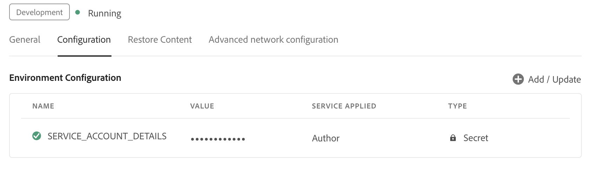

# AI Assistant 구성

관리자는 Experience Manager Guides에서 AI Assistant 기능을 구성할 수 있습니다. AI Assistant는 Adobe IMS 인증 기반 인증을 통해 보호됩니다. Adobe의 보안 토큰 기반 인증 워크플로우와 환경을 통합하고 AI Assistant 기능을 사용해 보십시오. 다음 구성은 폴더 프로필에 **AI 구성** 탭을 추가하는 데 도움이 됩니다. 추가되면 Experience Manager Guides에서 AI Assistant 기능을 사용할 수 있습니다.

AI Assistant를 구성하려면 다음 단계를 수행하십시오.

1. [Adobe Developer Console에서 IMS 구성 만들기](#create-ims-configurations-in-adobe-developer-console).
2. [환경에 IMS 구성 추가](#add-ims-configuration-to-the-environment)
3. [환경에서 AI 플래그 활성화](#enable-ai-flag-in-the-environment)
4. [환경에 변경 사항 적용](#apply-changes-to-the-environment)
5. [폴더 프로필에서 AI Assistant 활성화](#enable-ai-assistant-in-folder-profile)
6. [폴더 프로필에서 스마트 제안 구성](./conf-folder-level.md#configure-ai-assistant-for-smart-help-and-authoring)

## Adobe Developer Console에서 IMS 구성 만들기

Adobe Developer Console에서 IMS 구성을 만들려면 다음 단계를 수행하십시오.

>[!NOTE]
>
>마이크로 서비스 기반 게시를 구성하기 위해 OAuth 프로젝트를 이미 만든 경우 다음 단계를 건너뛰고 프로젝트를 만들 수 있습니다.

1. [Adobe Developer Console](https://developer.adobe.com/console)을(를) 시작합니다.
1. Developer Console에 로그인하면 **홈** 화면이 표시됩니다. **홈** 화면에서 프로젝트 및 다운로드에 대한 위쪽 탐색 링크를 포함하여 정보와 빠른 링크를 쉽게 찾을 수 있습니다.
1. 새 빈 프로젝트를 만들려면 **빠른 시작** 링크에서 **새 프로젝트 만들기**&#x200B;를 선택하십시오.
    {width="550" align="left"}
   *새 프로젝트를 만듭니다.*

1. **프로젝트** 화면에서 **API 추가**&#x200B;를 선택합니다.  **API 추가** 화면이 나타납니다. 이 화면에는 애플리케이션을 개발할 수 있는 Adobe 제품 및 기술에 사용 가능한 모든 API, 이벤트 및 서비스가 표시됩니다.

1. **I/O 관리 API**&#x200B;를 선택하여 프로젝트에 추가하십시오.
   
   *I/O 관리 API를 프로젝트에 추가합니다.*

1. 새 **OAuth 자격 증명**&#x200B;을(를) 만들고 저장하십시오.

   API 구성의 

   *API에 대한 OAuth 자격 증명을 구성합니다.*

1. **프로젝트** 탭에서 **OAuth Server to Server** 옵션을 선택한 다음 새로 만든 자격 증명을 선택합니다.

1. 프로젝트의 자격 증명 세부 정보를 보려면 **OAuth 서버 간** 링크를 선택하십시오.

    {width="800" align="left"}

   *자격 증명 세부 정보를 보려면 프로젝트에 연결하십시오.*

1. **프로젝트** 탭으로 돌아가서 왼쪽의 **프로젝트 개요**&#x200B;를 선택하십시오.

   

   *새 프로젝트를 시작합니다.*

1. 서비스 JSON을 다운로드하려면 맨 위에 있는 **다운로드** 버튼을 선택하십시오.

   

   *JSON 서비스 세부 정보를 다운로드합니다.*

OAuth 인증 세부 사항을 구성하고 JSON 서비스 세부 사항을 다운로드했습니다. 다음 섹션에서 이 파일을 필요로 하므로 이 파일을 가까이에 두십시오.

## 환경에 IMS 구성 추가

다음 단계를 수행하여 환경에 IMS 구성을 추가합니다.

1. Experience Manager을 열고 구성할 환경이 포함된 프로그램을 선택합니다.
1. **환경** 탭으로 전환합니다.
1. 구성할 환경 이름을 선택합니다. **환경 정보** 페이지로 이동해야 합니다.
1. **구성** 탭으로 전환합니다.
1. SERVICE_ACCOUNT_DETAILS JSON 필드를 업데이트합니다. 다음 스크린샷과 동일한 이름과 구성을 사용하고 있는지 확인합니다.

   {width="800" align="left"}

## 환경에서 AI 플래그 활성화

Experience Manager Guides UI에서 AI 도우미 기능을 활성화하려면 환경에 `ENABLES_GUIDES_AI` 플래그를 추가하십시오.

다음 스크린샷과 동일한 이름과 구성을 사용하고 있는지 확인합니다.

{width="800" align="left"}

플래그를 **true**(으)로 설정하면 기능을 사용할 수 있지만 **false**(으)로 설정하면 기능을 사용할 수 없습니다.

## 환경에 변경 사항 적용

IMS 구성을 추가하고 AI Assistant 플래그를 환경에 활성화했으면 다음 단계를 수행하여 OSGi를 사용하여 이러한 속성을 AEM Guides과 연결합니다.

1. Cloud Manager Git 프로젝트 코드에서 아래에 제공된 두 개의 파일을 추가합니다(파일 콘텐츠의 경우 [부록](#appendix) 보기).

   * `com.adobe.aem.guides.eventing.ImsConfiguratorService.cfg.json`
   * `com.adobe.guides.ai.config.service.AiConfigImpl.cfg.json`
1. 새로 추가된 파일에 `filter.xml`이(가) 적용되는지 확인하십시오.
1. Git 변경 사항을 커밋하고 푸시합니다.
1. 파이프라인을 실행하여 환경에 변경 사항을 적용합니다.

## 폴더 프로필에서 AI Assistant 활성화

구성 변경 사항이 적용되면 원하는 폴더 프로필에 대해 AI 도우미 기능을 활성화합니다.

자세한 내용은 [편집기 기능 확인](../user-guide/web-editor-features.md)을 참조하세요.

{width="300" align="left"}

## 폴더 프로필에서 스마트 제안 구성

AI Assistant 기능을 활성화한 후 폴더 프로필에서 스마트 제안 기능을 구성합니다.

자세한 내용은 [폴더 프로필에서 스마트 제안 구성](./conf-folder-level.md#configure-ai-assistant-for-smart-help-and-authoring)을 참조하세요.


## 부록 {#appendix}

**파일**:
`com.adobe.aem.guides.eventing.ImsConfiguratorService.cfg.json`

**컨텐츠**:

```
{
 "service.account.details": "$[secret:SERVICE_ACCOUNT_DETAILS]"
}
```

**파일**: `com.adobe.guides.ai.config.service.AiConfigImpl.cfg.json`

**컨텐츠**:

```
{
  "conref.inline.threshold":0.6,
  "conref.block.threshold":0.7,
  "related.link.threshold":0.5,
  "emerald.url":"https://adobeioruntime.net/apis/543112-smartsuggest/emerald/v1",
  "instance.type":"prod",
  "chat.url":"https://aem-guides-ai.adobe.io"
}
```

## AI Assistant 구성 세부 정보

| 키 | 설명 | 허용된 값 | 기본 값 |
|---|---|---|---|
| conref.inline.threshold | 사용자가 현재 입력 중인 태그에 대해 가져온 제안의 정밀도/회수를 제어하는 임계값입니다. | -1.0부터 1.0까지의 모든 값. | 0.6 |
| conref.block.threshold | 전체 파일에서 태그에 대해 가져온 제안의 정밀도/회수를 제어하는 임계값입니다. | -1.0부터 1.0까지의 모든 값. | 0.7 |
| emerald.url | 스마트 제안 벡터 데이터베이스의 끝점 | [https://adobeioruntime.net/apis/543112-smartsuggest/emerald/v1](https://adobeioruntime.net/apis/543112-smartsuggest/emerald/v1) | [https://adobeioruntime.net/apis/543112-smartsuggest/emerald/v1](https://adobeioruntime.net/apis/543112-smartsuggest/emerald/v1) |
| chat.url | AI 어시스턴트 서비스의 엔드포인트 | [https://aem-guides-ai.adobe.io](https://aem-guides-ai.adobe.io) | [https://aem-guides-ai.adobe.io](https://aem-guides-ai.adobe.io) |
| instance.type | AEM 인스턴스 유형입니다. 스마트 제안이 구성된 각 AEM 인스턴스에 대해 고유한지 확인합니다. 사용 사례는 &quot;instance.type&quot; = &quot;stage&quot;를 사용하여 스테이징 환경에서 피쳐를 테스트하는 것이지만 동시에 피쳐는 &quot;prod&quot;에도 구성됩니다. | 환경을 식별하는 모든 고유 키. *영숫자* 값만 허용됩니다. &quot;dev&quot;/&quot;stage&quot;/&quot;prod&quot;/&quot;test1&quot;/&quot;stage2&quot; | &quot;prod&quot; |

구성하고 나면 Experience Manager Guides 홈 페이지 및 편집기에 AI Assistant 아이콘이 표시됩니다. 자세한 내용은 Experience Manager 사용 안내서의 [AI Assistant](../user-guide/ai-assistant.md) 섹션을 참조하십시오.
