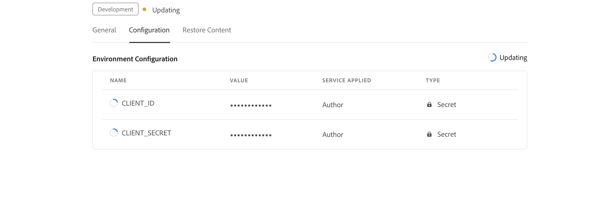

# 작성을 위한 AI 기반 스마트 제안 구성

관리자는 작성자에 대해 스마트 제안 기능을 구성할 수 있습니다. 스마트 제안 서비스는 Adobe IMS 인증 기반 인증을 통해 보호됩니다. Adobe의 보안 토큰 기반 인증 워크플로와 환경을 통합하고 새로운 스마트 제안 기능을 사용하십시오. 다음 구성은 다음을 추가하는 데 도움이 됩니다. **AI 구성** 폴더 프로필에 탭합니다. 추가되면 웹 편집기에서 스마트 제안 기능을 사용할 수 있습니다.

## Adobe Developer 콘솔에서 IMS 구성 만들기

Adobe Developer 콘솔에서 IMS 구성을 만들려면 다음 단계를 수행하십시오.
1. 시작 [Adobe Developer 콘솔](https://developer.adobe.com/console).
1. Developer Console에 로그인하면 **홈** 화면. 다음 **홈** 화면은 프로젝트 및 다운로드에 대한 위쪽 탐색 링크를 포함하여 정보와 빠른 링크를 쉽게 찾을 수 있는 곳입니다.
1. 새 빈 프로젝트를 만들려면  **새 프로젝트 만들기** 다음에서  **빠른 시작** 링크.
    {width="550" align="left"}
   *새 프로젝트를 만듭니다.*

1. 선택  **API 추가**  다음에서  **프로젝트** 화면.  다음 **API 추가** 화면이 나타납니다. 이 화면에는 응용 프로그램을 개발할 수 있는 Adobe 제품 및 기술에 사용 가능한 모든 API, 이벤트 및 서비스가 표시됩니다.

1. 다음 항목 선택 **I/O 관리 API** 프로젝트에 추가합니다.
   
   *프로젝트에 I/O 관리 API를 추가합니다.*

1. 새로 만들기 **OAuth 자격 증명** 구해
    {width="3000" align="left"}
   *API에 대한 OAuth 자격 증명을 구성합니다.*

1. 다음에서  **프로젝트** 탭, 선택 **OAuth 서버-서버** 옵션을 선택한 다음 새로 만든 자격 증명을 선택합니다.

1. 다음 항목 선택 **OAuth 서버 간** 프로젝트의 자격 증명 세부 정보를 보기 위한 링크입니다.

    {width="800" align="left"}

   *자격 증명 세부 정보를 보려면 프로젝트에 연결하십시오.*
1. CLIENT_ID 및 CLIENT_SECRET 키를 복사합니다.

이제 OAuth 인증 세부 사항을 구성했습니다. 다음 섹션에서 이러한 두 키를 필요로 하므로 이 두 키를 가까이에 두십시오.

### 환경에 IMS 구성 추가

다음 단계를 수행하여 환경에 IMS 구성을 추가합니다.

1. Experience Manager을 열고 구성할 환경이 포함된 프로그램을 선택합니다.
1. 다음으로 전환 **환경** 탭.
1. 구성할 환경 이름을 선택합니다. 환경 정보 페이지로 이동합니다.
1. 다음으로 전환 **구성** 탭.
1. 다음 스크린샷과 같이 CLIENT_ID 및 CLIENT_SECRET 키를 추가합니다. 아래에 강조 표시된 것과 동일한 이름 및 구성을 사용하고 있는지 확인하십시오.
    {width="800" align="left"}
   *환경 구성 세부 정보를 추가합니다.*


환경에 IMS 구성을 추가한 후 다음 단계를 수행하여 OSGi를 사용하여 이러한 속성을 AEM Guides와 연결합니다.

1. Cloud Manager Git 프로젝트 코드에서 아래에 주어진 두 개의 파일을 추가합니다(파일 콘텐츠의 경우 보기) [부록](#appendix)).

   * `com.adobe.fmdita.ims.service.ImsOauthUserAccountHeadersImpl.cfg.json`
   * `com.adobe.fmdita.smartsuggest.service.SmartSuggestConfigurationConsumer.cfg.json`
1. 새로 추가된 파일에 다음이 적용되는지 확인합니다. `filter.xml`.
1. Git 변경 사항을 커밋하고 푸시합니다.
1. 파이프라인을 실행하여 환경에 변경 사항을 적용합니다.

이 작업이 완료되면 스마트 제안 기능을 사용할 수 있습니다.


## 부록 {#appendix}

**파일**:
`com.adobe.fmdita.ims.service.ImsOauthUserAccountHeadersImpl.cfg.json`

**콘텐츠**:

```
{
  "client.id": "$[secret:CLIENT_ID]",
  "client.secret": "$[secret:CLIENT_SECRET]",
  "ims.url": "https://ims-na1.adobelogin.com"
}
```

**파일**: `com.adobe.fmdita.smartsuggest.service.SmartSuggestConfigurationConsumer.cfg.json`

**콘텐츠**:

```
{
  "smart.suggestion.flag":true,
  "conref.inline.threshold":0.6,
  "conref.block.threshold":0.7,
  "emerald.url":"https://adobeioruntime.net/apis/543112-smartsuggest/emerald/v1",
  "instance.type":"prod"
}
```

## 스마트 제안 구성 세부 정보

| 키 | 설명 | 허용된 값 | 기본 값 |
|---|---|---|---|
| smart.suggestion.flag | 스마트 제안 사용 여부를 제어합니다. | true/false | false |
| conref.inline.threshold | 사용자가 현재 입력 중인 태그에 대해 가져온 제안의 정밀도/회수를 제어하는 임계값입니다. | -1.0부터 1.0까지의 모든 값. | 0.6 |
| conref.block.threshold | 전체 파일에서 태그에 대해 가져온 제안의 정밀도/회수를 제어하는 임계값입니다. | -1.0부터 1.0까지의 모든 값. | 0.7 |
| emerald.url | Emerald 벡터 데이터베이스의 엔드포인트 | [https://adobeioruntime.net/apis/543112-smartsuggest/emerald/v1](https://adobeioruntime.net/apis/543112-smartsuggest/emerald/v1) | [https://adobeioruntime.net/apis/543112-smartsuggest/emerald/v1](https://adobeioruntime.net/apis/543112-smartsuggest/emerald/v1) |
| instance.type | AEM 인스턴스의 유형입니다. 스마트 제안이 구성된 각 AEM 인스턴스에 대해 고유한지 확인합니다. 사용 사례는 &quot;instance.type&quot; = &quot;stage&quot;를 사용하여 스테이징 환경에서 피쳐를 테스트하는 것이지만 동시에 피쳐는 &quot;prod&quot;에도 구성됩니다. | 환경을 식별하는 모든 고유 키. 전용 *영숫자* 값을 사용할 수 있습니다. &quot;dev&quot;/&quot;stage&quot;/&quot;prod&quot;/&quot;test1&quot;/&quot;stage2&quot; | &quot;prod&quot; |

구성하고 나면 웹 편집기의 오른쪽 패널에 스마트 제안 아이콘이 표시됩니다. 주제를 편집할 때 스마트 제안 목록을 볼 수 있습니다. 자세한 내용은 [작성을 위한 AI 기반 스마트 제안](../user-guide/authoring-ai-based-smart-suggestions.md) Experience Manager 섹션에 자세히 설명되어 있습니다.
