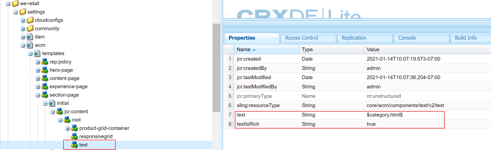

# AEM Sites 템플릿 다운로드 및 설치

Experience Manager Guides에 AEM Sites 템플릿을 다운로드하고 Cloud Service으로 설치하려면 다음 단계를 수행하십시오.

## 패키지 설치{#package-installation}

템플릿을 사용하려면 클라우드 배포를 통해 구성 요소 패키지를 설치하십시오.
- [guides-components-all.zip](https://github.com/adobe/aemg-sites-components/releases/tag/v1.0.0)

템플릿을 사용하여 AEM Sites을 만들려면 다음 단계를 수행하십시오.

1. 템플릿을 사용하여 AEM Sites 만들기:
1. Sites UI 내에서 오른쪽 상단의 **만들기** 단추를 클릭합니다.
1. **만들기** 드롭다운에서 **템플릿의 사이트**&#x200B;를 선택합니다.

1. **가져오기** 옵션을 사용하여 사이트 템플릿 가져오기: [aemg-docs-1.0.0.zip](https://github.com/adobe/aemg-sites-template/releases/tag/v1.0.0).
1. `AEMG Docs 1.0.0`을(를) 선택하고 **다음**&#x200B;을(를) 클릭합니다.
1. `Site title` 및 `Site name`을(를) 입력하십시오.
1. **만들기**&#x200B;를 클릭합니다. 패키지가 설치되고 AEM Sites 템플릿이 만들어집니다.

[AEM에 사이트 템플릿 추가](https://experienceleague.adobe.com/ko/docs/experience-manager-cloud-service/content/sites/administering/site-creation/site-templates#adding)에 대해 자세히 알아보세요.

>[!NOTE]
>
>홈 페이지를 만든 후에는 이 경로를 **Publish 경로**(으)로 사용하여 AEM Sites 사전 설정의 출력을 생성할 수 있습니다. 예: `aemg-docs-en/docs/product-abc`

## AEM Sites 사전 설정에 사용할 템플릿 구성

패키지를 설치하면 Sites UI에 **AEMG**(이)라는 사이트가 만들어집니다. 이 샘플 사이트에서는 AEM Sites 출력을 생성하기 위한 사이트 구조를 설정하는 방법을 보여 줍니다. 이건 그냥 샘플이에요. 요구 사항에 따라 사용자 지정 사이트를 만들 수 있습니다.

**AEMG**&#x200B;에 다음 구성 요소가 포함되어 있습니다.
- **AEMG** 폴더에 영어(en) 언어 폴더가 있습니다. 요구 사항에 따라 유사한 언어 사본을 만들 수 있습니다. 예를 들어 다국어 웹 사이트에는 영어(en), 독일어(de) 및 프랑스어(fr) 언어 사본이 포함되어 있습니다.  [언어 복사 마법사](https://experienceleague.adobe.com/ko/docs/experience-manager-65/content/sites/administering/introduction/tc-wizard)를 사용하여 언어 복사를 만드는 방법에 대해 자세히 알아보세요.
- 영어(en) 언어 폴더에서 Experience Manager Guides은 **검색**, **로그인**, **문서** 및 **지원**&#x200B;과 같은 기본 제공 샘플 페이지를 제공합니다.

- **Docs**&#x200B;은(는) 샘플 설명서 홈 페이지입니다. 모든 제품 관련 설명서의 중앙 위치 역할을 합니다
설명서를 개별 타일로 사용할 수 있는 각 제품을 표시합니다.

- 설명서 홈 페이지와 함께 **검색**, **로그인** 및 **지원**&#x200B;에 대한 샘플 페이지가 있습니다. 요구 사항에 따라 이러한 샘플을 사용자 정의할 수 있습니다.
- Product1과 같은 개별 제품에 대한 홈 페이지가 있을 수 있습니다. 샘플 페이지 **Product1**&#x200B;이(가) 설명서 홈 페이지인 **Docs** 아래에 있습니다.

- Experience Manager Guides은 또한 다음과 같은 사전 정의된 템플릿을 제공합니다.

   - **콘텐츠 페이지** 템플릿: 이 템플릿을 사용하여 대부분의 제품 사이트 콘텐츠가 들어 있는 표준 페이지를 만들 수 있습니다. 여기에는 텍스트, 이미지, 비디오 및 기타 콘텐츠 요소가 포함될 수 있습니다. 이 템플릿에는 머리글과 바닥글만 포함됩니다. 필요에 따라 페이지를 사용자 지정하고 사용하여 만듭니다. 예를 들어 제품에 대한 지원 페이지나 로그인 페이지를 만들 수 있습니다.
   - **홈 페이지** 서식 파일: 개요, 주요 요소 및 기능과 같은 주요 섹션, 탐색 링크가 포함된 웹 사이트의 기본 랜딩 페이지입니다. 예를 들어 제품 ABC의 기본 페이지는 다른 콘텐츠 또는 기능 페이지에 연결됩니다.
   - **주제 페이지** 템플릿: 주제 기반 콘텐츠를 구성하고 제공하는 데 사용되는 페이지입니다. 예를 들어 사용 안내서에는 다양한 주제 페이지가 포함되어 있으며 각 주제 페이지에는 기능 및 문제 해결과 관련된 특정 주제가 포함되어 있습니다.

  

이러한 샘플 및 템플릿을 사용하여 AEM Sites 출력을 생성합니다.
- 제품 홈 페이지는 맵 홈 페이지에 해당하며 홈 페이지 템플릿을 사용하여 만듭니다. AEM Sites 사전 설정에서 이 경로를 선택하여 그 아래에 맵의 콘텐츠를 게시합니다. 제품 홈 페이지에는 다른 홈 페이지가 포함될 수 있습니다.
- 예를 들어 Experience Manager Guides과 같은 제품이 있고 사용자, 관리자 및 개발자를 위한 세 가지 설명서가 필요합니다.  홈 페이지 템플릿을 사용하여 각 매뉴얼의 홈 페이지를 만든 다음 AEM Sites 출력 사전 설정에서 해당 홈 페이지를 선택합니다.

웹 편집기에서 [AEM Sites 사전 설정을 만들고 구성](../user-guide/generate-output-aem-site-web-editor.md)하는 방법에 대해 자세히 알아보세요.

## 템플릿을 사용하여 홈 페이지 만들기{#create-a-home-page-using-the-template}

다음 단계를 수행하여 제품에 대한 홈 페이지를 만듭니다.
1. 패키지가 설치되면 전역 탐색에서 **사이트**&#x200B;를 선택합니다.
1. Sites UI에 설치된 &quot;AEMG Docs&quot; 템플릿을 선택합니다.
1. Sites UI 내에서 오른쪽 상단의 **만들기** 단추를 클릭합니다.
1. **만들기** 드롭다운에서 **페이지**&#x200B;을(를) 선택합니다.
1. **홈 페이지**&#x200B;를 선택한 후 **다음**&#x200B;을 클릭하세요.
1. 사이트 제목과 사이트 이름을 입력하고 오른쪽 상단의 **만들기**&#x200B;를 클릭합니다. **홈 페이지** 사이트 템플릿을 사용하여 AEM 사이트 템플릿을 만듭니다. 예를 들어 제품 `Product ABC`의 홈 페이지를 만들 수 있습니다.

>[!NOTE]
>
>홈 페이지를 만든 후에는 이 경로를 **Publish 경로**(으)로 사용하여 AEM Sites 사전 설정의 출력을 생성할 수 있습니다. 예: `aemg-docs-en/docs/product-abc`

## AEM Sites에 대한 주제 템플릿 편집

AEM Sites에 대한 주제 템플릿을 사용자 지정할 수도 있습니다. 콘텐츠를 편집하거나 주제에서 다른 AEM 구성 요소의 속성을 구성할 수 있습니다. 예를 들어 요구 사항에 따라 구성 요소를 추가하거나 제거할 수 있습니다.\
주제 템플릿을 편집하려면 다음 단계를 수행하십시오.
1. 편집할 템플릿을 선택합니다.
1. 맨 위에 있는 **편집** 아이콘을 선택합니다.

AEM 템플릿 편집기가 열립니다. 주제 템플릿을 편집할 수 있습니다. [페이지 템플릿 만들기](https://experienceleague.adobe.com/ko/docs/experience-manager-65/content/sites/authoring/siteandpage/templates#editing-a-template-structure-template-author)에 대해 자세히 알아보세요.

## 기존 AEM Sites 템플릿 맞춤화 {#customize-existing-aem-sites-templates}

사전 정의된 템플릿 외에 AEM Sites 사전 설정에서 기존 템플릿을 사용할 수도 있습니다. 기존 AEM Sites 템플릿을 사용자 정의하려면 다음 단계를 수행하십시오.

### 템플릿 설정

다음과 같은 두 가지 유형의 템플릿이 필요합니다.

- 카테고리 또는 랜딩 템플릿: 이 템플릿은 제품 설명서 랜딩 페이지에 사용되며 DITA 맵에 해당합니다.  DITA 맵에 대한 AEM 사이트 페이지는 이 템플릿을 사용하여 생성됩니다. 이 템플릿은 모든 수준에서 사용할 수 있습니다.
- 기존 템플릿에 텍스트 구성 요소를 추가합니다. 텍스트 구성 요소에는 필수 속성 `text="$category.html$"`이(가) 있어야 합니다.
- 예를 들어 we-retail 템플릿을 선택하고 섹션 페이지 템플릿을 DITA 맵의 랜딩 페이지 템플릿으로 사용할 수 있습니다. 이렇게 하려면 다음 스크린샷과 같이 변경합니다.
  
   - 세부 사항 페이지 또는 주제 페이지 템플릿: 맵의 주제 컨텐츠에 이 템플릿을 사용합니다. DITA/XML 컨텐트의 모든 Sites 페이지는 주제 페이지 템플릿을 사용하여 작성됩니다. 이러한 템플릿을 만들려면 다음 두 가지 전제 조건이 필요합니다.
      - 필수 속성을 사용하여 컨테이너 구성 요소에 포함된 템플릿에 텍스트 구성 요소를 추가합니다. `text="$topic.content$"`.

        
      - 다음 스크린샷과 같이 동일한 컨테이너 및 텍스트 구성 요소를 동일한 템플릿의 구조에 반영합니다.

        컨테이너 템플릿의 

### 카테고리 페이지를 설명서 컨테이너로 태그 지정

이전 템플릿을 사용하는 문서 페이지에 대해 사이트 계층이 만들어졌다고 가정할 경우 해당 사이트 계층에서 만든 카테고리 페이지 중 하나를 선택합니다. ID를 제공하여 카테고리 페이지에 설명서 컨테이너로 태깅합니다.
이렇게 하려면 해당 속성 `id`에 값 `category-page`을(를) 할당하십시오. 다음 스크린샷을 참조하십시오.

