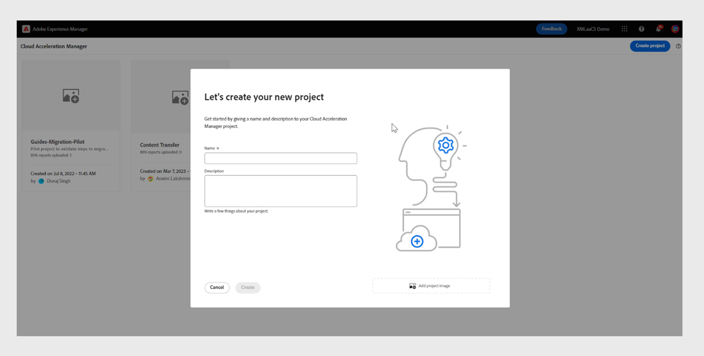
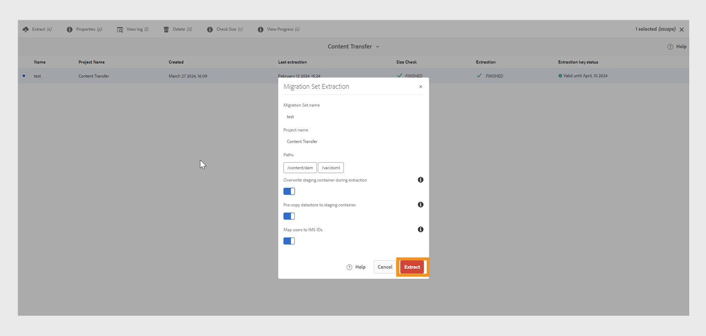

# 온-프레미스에서 Cloud Service으로 콘텐츠 마이그레이션

Experience Manager Assets Forms 및 Screens을 위한 확장 가능하고 안전하며 안전한 기술 기반인 Experience Manager as a Cloud Service 이를 통해 마케터와 IT 전문가는 규모에 맞게 효과적인 경험을 제공하는 데 집중할 수 있습니다.
Experience Manageras a Cloud Service 을 통해 팀은 제품 업그레이드를 계획하는 대신 혁신에 집중할 수 있습니다. 새로운 제품 기능은 중단 없이 철저하게 테스트되고 팀에게 전달되므로 항상 최신 버전의 Adobe Experience Manager에 액세스할 수 있습니다.
이 문서에서는 온프레미스 또는 Managed Services Experience Manager Guides 콘텐츠를 Cloud Service으로 마이그레이션하는 자세한 단계별 프로세스를 제공하므로 클라우드 기반 플랫폼으로 원활하게 전환할 수 있습니다.

## 마이그레이션 프로세스

**컨텐츠 전송 도구**은(는) Adobe에서 개발한 도구로, 원본 Adobe Experience Manager 온-프레미스 또는 Managed Services 인스턴스에서 대상 Experience Manager Cloud Service 인스턴스로 기존 컨텐츠를 마이그레이션하는 데 사용할 수 있습니다.
이 도구는 주체(사용자 또는 그룹)도 자동으로 전송합니다.

**소프트웨어 배포** 포털에서 **콘텐츠 전송 도구**&#x200B;를 ZIP 파일로 다운로드할 수 있습니다.

1. **소프트웨어 배포** 포털에서 **AEM as a Cloud Service** 탭을 선택합니다.
1. **컨텐츠 전송 도구**&#x200B;를 검색합니다.
1. 목록에서 **콘텐츠 전송 도구**&#x200B;을(를) 선택하고 다운로드하십시오.

그런 다음 소스 Adobe Experience Manager 인스턴스에서 **패키지 관리자**를 통해 패키지를 설치합니다. 최신 버전을 다운로드해야 합니다.
최신 버전에 대한 자세한 내용은 [릴리스 정보](https://experienceleague.adobe.com/docs/experience-manager-cloud-service/content/release-notes/release-notes/release-notes-current.html?lang=en)를 참조하세요.

>[!NOTE]
> 
> 버전 2.0.0 이상만 지원되며 최신 버전을 사용하는 것이 좋습니다.

### 전제 조건

* Adobe Experience Manager 6.4 이상 버전
* 최대 20TB의 저장소 크기가 지원됩니다
* 총 Lucene 인덱스 크기 25GB
* 노드 이름의 길이는 150바이트 미만이어야 합니다.

Experience Manager Guides 콘텐츠를 Experience Manager as a cloud service로 마이그레이션하려면 다음 단계를 수행하십시오.

1. [experience.adobe.com](https://experience.adobe.com/)에 로그인하고 **Experience Manager**&#x200B;을 선택합니다.

   

1. **Cloud Acceleration Manager** 타일에서 **시작**을 클릭합니다.
   

1. 첫 번째 프로젝트를 만듭니다.
   

1. 이름과 설명을 추가하고 **만들기**&#x200B;를 클릭합니다. 프로젝트가 생성되었습니다.
1. 생성된 프로젝트를 선택하고 프로젝트 화면을 엽니다.
1. **콘텐츠 전송** 타일에서 **검토**&#x200B;를 클릭합니다.

   

1. **마이그레이션 세트 만들기**&#x200B;를 클릭합니다.

1. 마이그레이션 세트의 이름과 설명을 입력합니다.

   

1. 만든 후 세 점을 선택하고 **추출 키 복사**&#x200B;를 선택합니다.

1. **클립보드에 복사**를 클릭합니다. 첫 번째 프로젝트를 만듭니다.
   

1. 맨 위에서 **Adobe Experience Manager**&#x200B;을(를) 선택한 다음 **소프트웨어 배포** 타일을 선택합니다.
   

1. **소프트웨어 배포** 포털에서 **Adobe Experience Manager을 Cloud Service** 탭으로 선택하고 &quot;컨텐츠 전송 도구&quot;를 검색한 다음 컨텐츠 전송 도구 패키지를 다운로드합니다.

   >[!NOTE]
   >
   >  최신 버전을 다운로드하십시오.

1. 온-프레미스 인스턴스의 **패키지 관리자**&#x200B;에서 `content-transfer.all-3.0.10.zip` 패키지를 업로드하고 설치합니다.
   

1. 온-프레미스 인스턴스에서 **도구** > **작업** > **콘텐츠 마이그레이션** > **콘텐츠 전송**&#x200B;을(를) 선택합니다.

1. **콘텐츠 전송**&#x200B;을(를) 선택하고 마이그레이션 세트를 만든 다음 Cloud Acceleration Manager에서 복사한 추출 키를 붙여넣습니다. 이렇게 하면 소스와 타겟 간의 연결이 설정됩니다. 그런 다음 키를 확인하고 값을 입력한 후 유효성을 표시합니다.

1. 파일 버전을 포함하려면 **버전 포함** 옵션을 활성화하십시오.
   

1. 마이그레이션할 경로를 입력하고 **저장**을 클릭합니다.
예: `/content/we-retail`
또는
   `/content/dam/wknd-events`
   

   >[!NOTE]
   >
   > **Experience Manager Guides** 콘텐츠에 대해 다음 경로를 의무적으로 마이그레이션해야 합니다.

   * `/content/dam`
   * `/var/dxml`

   마이그레이션 세트를 만드는 동안 다음 경로가 제한됩니다.
   * `/apps`
   * `/libs`
   * `/home`
   * `/etc` CTT에서 일부 `/etc` 경로를 선택할 수 있습니다.

1. **저장** 클릭
1. **마이그레이션 세트**&#x200B;를 선택한 다음 맨 위에서 **추출**을 선택하십시오.
   

1. **마이그레이션 세트 추출** 팝업에서 선택한 경로 및 구성에 대한 세부 정보를 확인하고 **추출**을 클릭합니다. 추출은 몇 분 정도 소요되며 상태는 업데이트된 것으로 표시됩니다.
   

1. 추출이 완료되고 `finished` 상태로 표시되면 Cloud Acceleration Manager으로 이동하여 18단계에서 만든 프로젝트를 선택합니다.
자세한 내용을 보려면 세 점을 선택한 다음 **세부 정보 보기**&#x200B;를 선택하십시오.

1. 마이그레이션 세트 세부 정보 팝업에서 마이그레이션 세트 구성을 확인하고 팝업을 닫습니다. 다음 스크린샷과 같이 경로와 기타 설정을 볼 수 있습니다.
   

1. **수집 작업** > **새 수집**&#x200B;을 클릭합니다.
1. 필요한 확인 표시 값을 확인한 다음 **만들기**를 클릭합니다.
   

1. 마이그레이션 세트를 선택하고 환경에 필요한 서버를 선택한 다음 **수집**&#x200B;을 클릭합니다.

   

## Publish 인스턴스에서 컨텐츠 전송 도구 실행

소스 Publish 인스턴스에 컨텐츠 전송 도구 를 설치하여 컨텐츠를 대상 Publish 인스턴스로 이동합니다.
컨텐츠 전송 도구는 Publish 환경으로 컨텐츠를 수집할 때 게시된 컨텐츠와 게시되지 않은 컨텐츠를 구분하지 않습니다. 마이그레이션 세트에 지정된 콘텐츠가 선택한 대상 인스턴스에 수집됩니다. 사용자는 마이그레이션 세트를 작성자 인스턴스, Publish 인스턴스 또는 둘 다로 수집할 수 있습니다.

### 권장 방법

다음 권장 사항을 고려하십시오.

* 작성자 인스턴스에서 사용한 것과 동일한 버전의 **콘텐츠 전송 도구**&#x200B;를 사용합니다.
* Publish으로 수집하는 동안 Publish 계층은 작성자와 달리 축소되지 않습니다.
* 단일 Publish 노드만 마이그레이션합니다. 추출을 시작하기 전에 로드 밸런서에서 제거합니다.

>[!NOTE]
>
> 예방 차원에서 다음과 같은 사용자가 시작한 작업을 포함하여 Publish 인스턴스에서 쓰기 작업이 발생하지 않도록 합니다.
> * 해당 환경에서 AEM as a Cloud Service 작성자에서 Publish으로 컨텐츠 배포
> * Publish 인스턴스 간 사용자 동기화

## 문제 해결

다음 오류로 인해 추출에 실패한 경우 관련 CA 인증서를 가져와 해결할 수 있습니다.

`javax.net.ssl.SSLHandshakeException: sun.security.validator.ValidatorException: PKIX path building failed: sun.security.provider.certpath.SunCertPathBuilderException: unable to find valid certification path to requested target`

**이유**: Adobe Experience Manager 서버에 방화벽 제한이 있으므로 허용 목록에 다음 끝점을 추가하십시오.

`casstorageprod.blob.core.windows.net`

*SSL 로깅을 사용합니다.*

