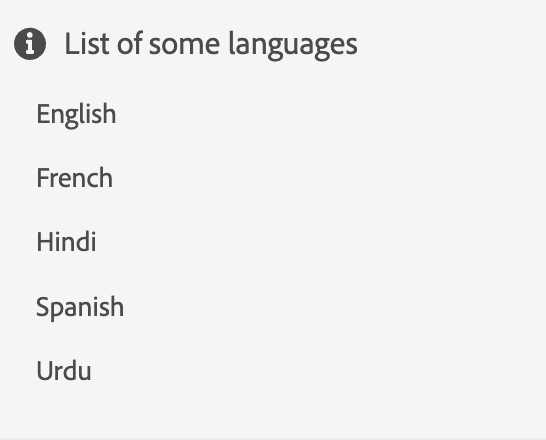

# 위젯

구성 요소 섹션에서 설명한 대로 여러 기본 구성 요소를 결합하여 위젯을 만들 수 있습니다.
위젯을 사용하여 새로운 &quot;더 복잡한&quot; 구성 요소를 만들거나 구성 요소의 항목에 구조를 제공할 수 있습니다.

위젯의 개념에 대해 자세히 알아보겠습니다!

언어 목록을 표시하는 간단한 위젯부터 시작하겠습니다.

```js title="basicWidget.js"
const widgetJSON =  {
    "component": "div", 
    "id": "widget_languages", 
    "items": [ // adding components to the widget
        {
            "component": "div",
            "items": [
                {
                    "component": "icon",
                    "icon": "info"
                },
                {
                    "component": "label",
                    "label": "List of some languages"
                }
            ]
        },
        {
            "component": "list",
            "data": "@languages"
        }
    ]
},
```

여기서 `@languages`은(는) [&quot;English&quot;, &quot;French&quot;, &quot;Hindi&quot;, &quot;Spanish&quot;, &quot;Urdu&quot;]&#x200B;(으)로 `widget_languages`의 모델에 정의된 배열입니다.

렌더링된 기본 위젯은 다음과 같이 표시됩니다.


