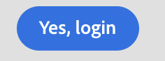

# 버튼

버튼을 표시하려면 구성 요소 버튼을 사용합니다.
JUI의 단추 구성 요소는 html `<button/>`을(를) 나타냅니다.

```js title="buttonJSON.js"
const buttonJSON = {
  "component": "button",//tells the component name
  "label": "Yes, login",//tells the text for the button
  "variant": "cta",//tells the variants for the button which  provides default styles
  "on-click": "done",//tells what function to run after user clicks the button
};
```

레이블이 `Yes, login`인 단추가 생성됩니다. 다른 속성에는 variant,label,on-click이 포함되지만 이에 제한되지 않습니다.
> **_NOTE:_** `on-<events>`은(는) 컨트롤러에서 명령을 호출하는 구문입니다.

렌더링된 버튼은 다음과 같이 표시됩니다.


