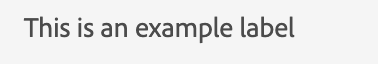

# 레이블

텍스트나 문자열을 표시하기 위해 구성 요소인 레이블을 사용합니다.
JUI의 레이블 구성 요소는 html `<label/>`을(를) 나타냅니다.

다음은 정적 레이블을 추가하는 예제입니다

```js title="staticLabel.js"
const staticLabelJSON =  {
    "component": "label", //tells the component name
    "label": "This is an example label", // the string to be displayed
}
```

JSON 아래에 동적 문자열이 표시됩니다.

```js title="dynamicLabel.js"
const labelJSON =  {
    "component": "label", //tells the component name
    "label": "@name", // the variable storing the text to be displayed
},
```

렌더링된 레이블은 다음과 같이 표시됩니다.


