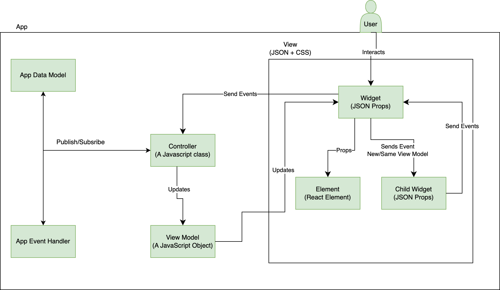

# Jui 프레임워크

확장을 작성하는 방법에 대해 살펴보기 전에 프레임워크의 아키텍처를 이해합니다.
효과적으로 확장할 수 있도록 말입니다.

## 소개

JUI는 React 및 Adobe React Spectrum 구성 요소 위에 있는 MVC 프레임워크입니다. JUI는 JSON 사용자 인터페이스입니다. 여러 git 저장소로 구성됩니다.

JUI-Core는 JSON 구성을 작동하는 반응 구성 요소로 변환하고 관련 컨트롤러 클래스 인스턴스와 연결하는 모든 논리를 갖춘 핵심 라이브러리입니다.
JUI-React-Spectrum 라이브러리에는 Adobe React 스펙트럼 구성 요소의 래퍼 위젯이 있습니다.

## JUI 코어 디자인

### MVC UI 디자인

### 위젯

- 고유 ID가 있습니다.
- 볼 개별 JSON 파일이 있습니다.
- 고유한 또는 공유 컨트롤러가 있을 수 있습니다.
- 상위 모델 또는 새 모델을 사용할 수 있습니다.
- UI 요소(React 구성 요소)가 있을 수 있습니다.
- 다른 위젯이 있을 수 있음
- 앱이 위젯임

### 요소

- HTML/반응 구성 요소입니다.
- 모델이 없으며 상위 위젯 모델을 사용합니다.

### 이벤트 핸들러

- 다음(eventOpts)
   - 일부 옵션을 사용하여 이벤트를 트리거하려면
- Subscribe(callback)
   - 구성과 함께 이벤트가 실행되었다는 알림 받기

### 앱/글로벌 모델

- Next(새 값)
   - 새 값을 게시하려면
- Subscribe(callback)
   - 변경된 값에 대한 알림을 받으려면
   - 처음 이전 값을 가져옵니다.
- GetValue()
   - 현재 값을 가져오려면

### 컨트롤러

- 컨트롤러 클래스에서 확장해야 합니다.
- API
- CreateModel
   - 하위 위젯 개별 모델을 만들려면
- InitEventHandler
   - 하위 위젯 별도의 이벤트 핸들러를 만들려면
- 명령 등록
   - 로컬, 상위 또는 앱 이벤트를 등록하려면
- Next(eventName, eventHandler)
   - 하위 위젯 이벤트 핸들러, 상위 위젯 이벤트 핸들러 또는 앱 이벤트 핸들러의 이벤트를 트리거하려면
- Subscribe(callback, eventHandler)
- SubscribeAppModel(callback)

### 샘플 앱 디자인

