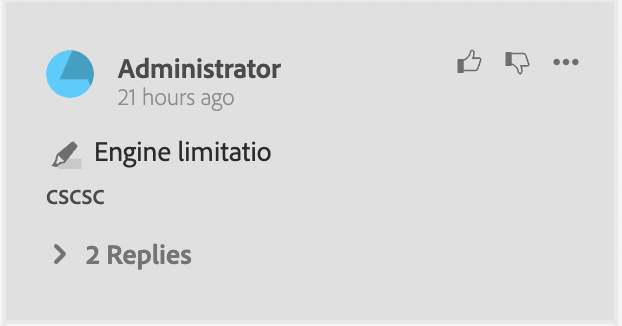

# 리뷰 앱의 구성 요소

리뷰 앱의 주요 구성 요소는 다음과 같습니다.

- 인라인 검토 패널: `id: inline_review_panel`
   - XML 편집기 측에서 검토 주석이 렌더링되는 오른쪽 패널입니다.

- 주제 검토: `id: topic_reviews`
   - 검토 앱에서 주석이 렌더링되는 오른쪽 패널.

- 리뷰 댓글: `id: review_comment`
   - 각 검토 주석에 대한 위젯.

리뷰 앱에 대한 리뷰 댓글:

XML 편집기 측의 댓글 검토:

- 댓글 회신 검토: `id: comment_reply`
   - 각 리뷰 댓글 회신에 대한 위젯입니다.

     

- 새 리뷰 댓글 회신: `id: comment_new_reply`
   - 새 리뷰 댓글 회신에 대한 위젯입니다.

     

- 주석 도구 상자: `id: annotation_toolbox`
   - 리뷰 앱의 오른쪽 상단 도구 모음

     
