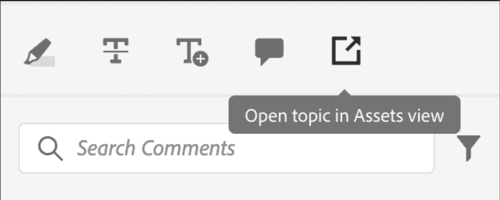

# 간단한 사용자 정의 예

이제 AEM Guides 앱에서 이러한 맞춤화를 통합하는 방법에 대해 알아보겠습니다.

예를 들어, 앱의 기존 보기에서 이 단추를 추가하려고 합니다.
이를 위해 다음과 같은 3가지 기본 사항이 필요합니다.

1. 구성 요소를 추가하려는 보기 JSON의 `id`.
2. `target`, 즉 새 구성 요소를 추가하려는 JSON의 위치입니다. `target`은(는) `key` 및 `value`을(를) 사용하여 정의됩니다. 키-값 쌍은 구성 요소를 고유하게 식별하는 데 도움이 되는 구성 요소를 정의하는 데 사용되는 모든 속성일 수 있습니다.
색인을 사용하여 타겟을 참조할 수도 있습니다.
`APPEND`, `PREPEND`, `REPLACE`의 3개 viewState가 있습니다.
3. 새로 생성된 구성 요소 및 해당 메서드의 JSON입니다.

검토에 사용된 주석 도구 상자에 버튼을 추가하여 AEM에서 파일을 열려고 합니다.

```typescript
export default {
  id: 'annotation_toolbox', 
  view: {
    items: [
      {
        component: 'button',
        icon: 'linkOut',
        title: 'Open topic in Assets view',
        'on-click': 'openTopicInAEM',
        target: {
          key: 'value',
          value: 'addcomment',
          viewState: VIEW_STATE.APPEND

        },
      },
    ],
  },
  controller: {
    openTopicInAEM: function (args) {
        const topicIndex = tcx.model.getValue(tcx.model.KEYS.REVIEW_CURR_TOPIC)
        const {allTopics = {}} = tcx.model.getValue(tcx.model.KEYS.REVIEW_DATA) || {}
        tcx.appGet('util').openInAEM(allTopics[topicIndex])
    },
  },
}
```

위의 예에는 다음이 있습니다.

1. 구성 요소를 삽입할 JSON의 `id`(예: `annotation_toolbox`)
2. 대상은 `addcomment` 단추입니다. viewState `append`을(를) 사용하여 `addcomment` 단추 뒤에 단추를 추가합니다.
3. 우리는 컨트롤러에서 버튼의 온-클릭 이벤트를 정의합니다.

&quot;annotation_toolbox&quot; `.src/jsons/review_app/annotation_toolbox.json`에 대한 JSON

사용자 지정 전에 주석 도구 상자는 다음과 같이 표시되었습니다.


사용자 지정 후 주석 도구 상자는 다음과 같습니다.



## CSS 추가

일관성을 위해 이미 스타일이 지정된 구성 요소를 제공합니다. 삽입된 JSON에는 고유한 스타일이 적용됩니다.
css를 관리하는 기본 방법은 확장의 extraClass 키를 사용하는 것입니다.

```js
{    
    "view":{
        items:[
            {
                compoenent:"button",
                extraClass:"underline bg-red",
            }
        ]
    }
}
```

clientlib에 css 파일을 추가하여 CSS 클래스로 사용자 정의 스타일을 지정할 수 있습니다. 빌드하는 동안 Tailwind의 유틸리티 클래스에 대한 [Tailwind](https://tailwindcss.com/docs/utility-first) 출력도 만듭니다. `./tailwind.config.js`의 확장 `tailwind.config.js`에서 동일한 구성을 찾을 수 있습니다.
