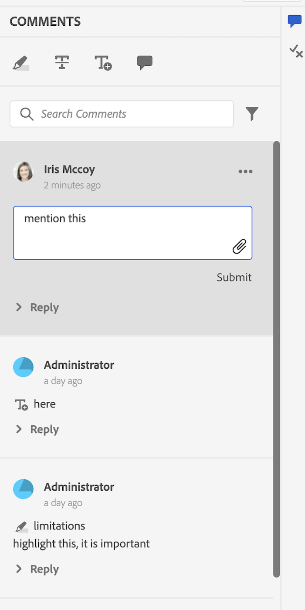

# 예

이 패키지에서는 몇 가지 사용자 지정 예제도 제공했습니다(`guides_extension/src`에서 사용 가능). 다음은 각 요소에 대한 간략한 설명입니다.

1. **컨텍스트 메뉴**: 이 예제에서는 `file_options` 컨텍스트 메뉴를 사용자 지정하여 `Delete` 및 `Edit` 옵션을 제거하고 `Duplicate` 옵션을 `Download` 옵션으로 바꾸었습니다. [컨텍스트 메뉴](./examples/file_options.ts)에 대한 코드 샘플을 다운로드하십시오.

   ```typescript
   enum VIEW_STATE {
     APPEND = 'append',
     PREPEND = 'prepend',
     REPLACE = 'replace',
   }
   
   const loadDitaFile = (filePath, uuid) =>{
     return $.ajax({
       type: 'POST',
       url: '/bin/referencelistener',
       data: {
           operation: 'getdita',
           path: filePath,
           type: uuid ? 'UUID' : 'PATH',
           cache: false,
       },
     })
   }
   
   const fileOptions = {
     id: "file_options",
     contextMenuWidget: "repository_panel",
     view: {
       items: [
         {
           component: "div",
           target: {
             key: "displayName", value: "Delete",
             viewState: VIEW_STATE.REPLACE
           }
         },
         {
           component: "div",
           target: {
             key: "displayName", value: "Edit",
             viewState: VIEW_STATE.REPLACE
           }
         },
         {
           "displayName": "Download",
           "data": {
             "eventid": "downloadFile"
           },
           "icon": "downloadFromCloud",
           "class": "menu-separator",
           target: {
             key: "displayName", value: "Duplicate",
             viewState: VIEW_STATE.REPLACE
           }
         },
       ]
     },
   
     controller: {
       downloadFile() {
         const path = this.getValue('selectedItems')[0].path
         loadDitaFile(path, true).then((file) => {
           function download_file(name, contents) {
             const mime_type = "text/plain";
   
             const blob = new Blob([contents], { type: mime_type });
   
             const dlink = document.createElement('a');
             dlink.download = name;
             dlink.href = window.URL.createObjectURL(blob);
             dlink.onclick = function () {
               // revokeObjectURL needs a delay to work properly
               const that = this;
               setTimeout(function () {
                 window.URL.revokeObjectURL(that.href);
               }, 1500);
             };
   
             dlink.click();
             dlink.remove();
           }
           download_file(path, file.xml)
   
         });
       }
     }
   }
   
   export default fileOptions
   ```

1. **왼쪽 패널**: 이 예제에서는 &quot;TEST EXTENSION&quot;이라는 다른 `tab` 및 레이블이 있는 해당 `tab panel`을(를) 포함하도록 `left tab panel`을(를) 사용자 지정했습니다. `Test Tab Panel`.
[왼쪽 패널](./examples/left_panel_container.ts)에 대한 코드 샘플을 다운로드합니다.

   ```typescript
   const tabLeftPanel = {
       "id": "left_panel_container",
       "tabView": {
           "id": "left_panel_container",
           "tabs": [
               {
                   "component": "tab",
                   "id": "new_tab_extension",
                   "extraclass": "collection-panel-tab",
                   "showClass": "@visibleTabs.collection_panel",
                   "on-click": "tabClick",
                   "icon": "collection",
                   "title": "TEST EXTENSION",
                   "label": "TEST EXTENSION",
                   "prevTabID": "condition_panel"
               },
           ],
           "tabPanels":
               [
                   {
                       "component": "tabPanel",
                       "tabId": "new_tab_extension",
                       "showClass": "@visibleTabs.citation_panel",
                       "items": [
                           {
                               "id": "annotation_toolbox"
                           }
                       ],
                   },
               ]
       }
   }
   export default tabLeftPanel
   ```

1. **오른쪽 패널**: 이 예제에서는 &quot;TEST EXTENSION&quot;이라는 다른 `tab`과(와) 레이블이 있는 해당 `tab panel`을(를) 포함하도록 `right tab panel`을(를) 사용자 지정했습니다. `New Tab Panel`. [오른쪽 패널](./examples/right_panel_container.ts)에 대한 코드 샘플을 다운로드합니다.

   ```typescript
   const rightPanel = {
       "id": "right_panel_container",
       "tabView": {
           "id": "right_panel_container_tab",
           "tabs": [
               {
                   "component": "tab",
                   "id": "new_tab_extension",
                   "on-click": "tabClick",
                   "icon": "collection",
                   "title": "TEST EXTENSION",
               },
           ],
           "tabPanels":
               [
                   {
                       "component": "tabPanel",
                       "tabId": "new_tab_extension",
                       "items": [
                           {
                               "component": "label",
                               "label": "New Tab Label",
                           }
                       ],
                   },
               ]
       }
   }
   export default rightPanel
   ```

1. **저장소 패널**: [저장소 패널](./examples/repository_panel.ts)에 대한 코드 샘플을 다운로드합니다.

   ```typescript
   export enum VIEW_STATE2 {
     APPEND = 'append',
     PREPEND = 'prepend',
     REPLACE = 'replace',
   }
   
   export default {
     class: "flex bg-red-100 bg-green-200 bg-green-300 mr-4",
     id: 'repository_panel',
     view: {
       className: '',
       items: [
         {
           target: {
             key: "id",
             value: 'respository-'
             ,
           },
           component: 'widget',
           id: 'loading_shimmer',
           viewState: VIEW_STATE2.REPLACE,
           index: 2,
         },
         {
           component: 'button',
           label: 'Close',
           'on-click': 'cancel',
           variant: 'secondary',
           quiet: true,
           index: 20,
         },
         {
           label: "@testLabel",
           component: "label"
         }
       ],
     },
     controller: {
       init: function() {
         console.log('subject: ', this.subject)      
         this.subscribe({
           key: 'rename',
           next: () => { console.log('rename using extension') }
         })
         console.log('Logging view config ', this.viewConfig)
         this.next(this.viewConfig.items[1].searchModeChangedEvent, { searchMode: true })
         this.subscribeAppEvent({
           key: 'app.active_document_changed',
           next: () => { console.log('active doc changed subs') }
         })
         this.subscribeAppModel('app.mode',
           () => { console.log('app mode subs') }
         )
         this.subscribeParentEvent({
           key: 'tabChange',
           next: () => { console.log('tab change subs') }
         })
         this.parentEventHandlerNext('tabChange', {
           data: 'map_panel'
         })
         this.appModelNext('app.mode', 'author')
         this.appEventHandlerNext('app.active_document_changed', 'active doc changed')
       },
       cancel: function (args) {
         this.setValue('testLabel', 'testlabel2')
       },
     },
     model: {
       deps: ['testLabel'],
     },
   }   
   ```

1. **도구 모음**: 이 예제에서는 `Insert Element`, `Insert Paragraph`, `Insert Numbered List`, `Insert Bulleted List` 단추를 모두 포함하는 하나의 `More Insert Options` 단추로 바꾸었습니다. [도구 모음](./examples/toolbar.ts)에 대한 코드 샘플을 다운로드하십시오.

   ```typescript
   import { VIEW_STATE } from "./review_app_examples/review_comment"
   
   const topbarExtend = {
       id: "toolbar",
       view: {
           items: [
               {
                   component: "div",
                   target: {
                       key: "title", value: "Insert Element",
                       viewState: VIEW_STATE.REPLACE
                   }
               },
               {
                   component: "div",
                   target: {
                       key: "title", value: "Insert Paragraph",
                       viewState: VIEW_STATE.REPLACE
                   }
               },
               {
                   component: "div",
                   target: {
                       key: "title", value: "Insert Numbered List",
                       viewState: VIEW_STATE.REPLACE
                   }
               },
               {
                   component: "div",
                   target: {
                       key: "title", value: "Insert Bulleted List",
                       viewState: VIEW_STATE.REPLACE
                   }
               },
               {
                   "component": "button",
                   "extraclass": "insert-multimedia",
                   "icon": "more",
                   "variant": "action",
                   "quiet": true,
                   "holdAffordance": true,
                   "title": "More Insert Options",
                   "elementID": "toolbar_insert",
                   "on-click": {
                       "name": "APP_SHOW_OPTIONS_POPOVER",
                       "args": {
                           "target": "toolbar_insert",
                           "extraclass": "new_options_buttons",
                           "items": [
                               {
                                   "component": "button",
                                   "icon": "add",
                                   "variant": "action",
                                   "quiet": true,
                                   "title": "Insert Element",
                                   "on-click": "AUTHOR_SHOW_INSERT_ELEMENT_UI"
                               },
                               {
                                   "component": "button",
                                   "icon": "textParagraph",
                                   "variant": "action",
                                   "quiet": true,
                                   "title": "Insert Paragraph",
                                   "on-click": "INSERT_P"
                               },
                               {
                                   "component": "button",
                                   "icon": "textNumbered",
                                   "variant": "action",
                                   "quiet": true,
                                   "title": "Insert Numbered List",
                                   "on-click": "AUTHOR_INSERT_REMOVE_NUMBERED_LIST"
                               },
                               {
                                   "component": "button",
                                   "icon": "textBulleted",
                                   "variant": "action",
                                   "quiet": true,
                                   "title": "Insert Bulleted List",
                                   "on-click": "AUTHOR_INSERT_REMOVE_BULLETED_LIST"
                               },
                               {
                                   "component": "button",
                                   "icon": "table",
                                   "variant": "action",
                                   "quiet": true,
                                   "title": "Insert Table",
                                   "on-click": "AUTHOR_INSERT_ELEMENT",
                               }
                           ]
                       },
                   },
                   target: {
                       key: "title", value: "Insert Table",
                       viewState: VIEW_STATE.REPLACE
                   }
               },
           ]
       },
       controller: {
           init() {
               console.log(this.proxy.getValue("canUndo"))
               this.proxy.subscribeAppEvent({
                 key: "editor.preview_rendered",
                 next: async function (e) {
                   console.log(this.proxy.getValue("canUndo"))
                 }.bind(this)
               })
           },
           INSERT_P() {
               this.next("AUTHOR_INSERT_ELEMENT", "p")
           }
       }
   }
   
   export default topbarExtend
   ```

1. **메타데이터 패널의 관리 단추**: 이 예제에서는 선택한 파일이 읽기 전용 모드에 있을 때 비활성화되도록 **관리** 단추(보고서 페이지의 메타데이터 패널에 있음)를 사용자 지정했습니다. 이렇게 하면 편집용이 아닌 파일에서 실수로 메타데이터를 편집하는 것을 방지할 수 있습니다. 메타데이터 패널의 [관리 단추](./examples/metadata_report_manage_button.ts)에 대한 코드 샘플을 다운로드합니다.

   ```typescript
   const mapConsoleActionBar = {
     id: "map_console_action_bar",
     view: {
       items: [
         {
           "key": "manageTags",
           "component": "button",
           "title": "Manage",
           "on-click": "reports.manage_report",
           "label": "Manage",
           "icon": "s2AppGear",
           "type": "secondary",
           "variant": "action",
           "quiet": true,
           "show": "@showManageTags",
           "disabled": "$$extensionMap.overrideShowManageTags",
           target: {
             key: "title", value: "Manage",
             viewState: 'replace'
           }
         },
         {
   
           "key": "selectAll",
           "component": "button",
           "title": "@selectAllTitle",
           "on-click": "SELECT_ALL",
           "label": "@selectAllTitle",
           "variant": "action",
           "extraclass": "select-all-button",
           "quiet": true,
           "show": "@showSelectAllButton",
           "hide": "$$extensionMap.overrideShowManageTags",
           target: {
             key: "key", value: "selectAll",
             viewState: 'replace'
           }
         },
       ]
     }
   }
   
   function getAutoCheckoutConfigFromAppModel() {
     const config = tcx.model.getValue(tcx.model.KEYS.EDITOR_CHECKOUT_CONFIG)
     return config === true || config === 'true'
   }
   
   const bulkMetadataEditorController = {
     id: "bulkmetadata_report_view",
     controller: {
       rowSelectionChanged() {
         const selectedItems = this.getValue('selectedItems');
         let areReadOnlyFilesSelected = false;
         let autoCheckoutConfig = getAutoCheckoutConfigFromAppModel();
   
         for (let idx = 0; idx < selectedItems.length; idx++) {
           const item = selectedItems[idx].obj;
           const isLocked = Boolean(item.isCheckedOut);
   
           if (autoCheckoutConfig && !isLocked) {
             areReadOnlyFilesSelected = true;
             break;
           }
         }
   
         this.setExtensionAppState('overrideShowManageTags', areReadOnlyFilesSelected);
       }
     }
   }
   
   export {
     mapConsoleActionBar,
     bulkMetadataEditorController
   }
   ```

## 앱 예 검토

1. **주석 도구 상자**: 이 예제에서는 AEM의 현재 검토 주제를 여는 단추를 주석 도구 상자에 추가했습니다. [Annotation Toolbox](./examples/review_app_examples/annotation_extension.ts)에 대한 코드 샘플을 다운로드합니다.

   ```typescript
   import { VIEW_STATE } from './review_comment'
   
   export default {
     id: 'annotation_toolbox',
     view: {
       items: [
         {
           component: 'button',
           icon: 'linkOut',
           title: 'openTopicInAEM',
           'on-click': 'openTopicInAEM',
           target: {
             key: 'value',
             value: 'addcomment',
             viewState: VIEW_STATE.APPEND
           },
         },
       ],
     },
     controller: {
       openTopicInAEM: function (args) {
         const topicIndex = tcx.model.getValue(tcx.model.KEYS.REVIEW_CURR_TOPIC)
         const { allTopics = {} } = tcx.model.getValue(tcx.model.KEYS.REVIEW_DATA) || {}
         tcx.appGet('util').openInAEM(allTopics[topicIndex])
       },
     },
   }
   ```

1. **댓글 검토**: 이 예제에서는 사용자 이름을 사용자 정보로 대체하고(댓글의 전체 이름 및 제목을 고려), 고유한 댓글 ID, mailTo 아이콘을 추가하고, 댓글 심각도 및 이유를 언급하는 입력 필드를 추가했습니다.
대화 상자를 여는 XMLEditor 측의 주석에 `accept with modification` 단추도 추가했습니다. [댓글 검토](./examples/review_app_examples/review_comment.ts)를 위한 코드 샘플을 다운로드하십시오.

   ```typescript
   export enum VIEW_STATE {
     APPEND = 'append',
     PREPEND = 'prepend',
     REPLACE = 'replace',
   }
   
   const reviewComment = {
     id: 'review_comment',
     view: {
       items: [
         {
           component: 'label',
           label: '@extraProps.commentUniqId',
           extraclass: 'commentUniqId',
           target: {
             key: 'extraclass',
             value: 'user-image',
             viewState: VIEW_STATE.PREPEND,
           },
         },
         {
           component: 'div',
           extraclass: 'user-info',
           items: [
             {
               component: 'label',
               "label": "@extraProps.userInfo",
               "extraclass": "reviewer-name",
             },
             {
               component: 'button',
               icon: 'email',
               extraclass: 'mailto-icon',
               "on-click": "openMailTo"
             }
           ],
           target: {
             key: 'extraclass',
             value: 'reviewer-name',
             viewState: VIEW_STATE.REPLACE,
           },
         },
         {
           component: 'div',
           extraclass: 'comment-details',
           items:
             [
               {
                 component: 'div',
                 extraclass: 'comment-type-text',
                 items:
                   [
                     {
                       component: 'label',
                       label: 'Comment Type: ',
                       "extraclass": "severity-label",
                     },
                     {
                       component: 'label',
                       label: '@extraProps.severity'
                     }
                   ],
               },
               {
                 component: 'div',
                 extraclass: 'comment-rationale',
                 items:
                   [
                     {
                       component: 'label',
                       label: 'Comment Rationale: ',
                       extraclass: 'comment-rationale-label'
                     },
                     {
                       component: 'label',
                       label: '@extraProps.commentRationale'
                     }
                   ],
               },
             ],
           target: {
             key: 'id',
             value: 'attachment_tiles',
             viewState: VIEW_STATE.PREPEND,
           },
         },
         {
           component: 'div',
           items: [
             {
               component: 'div',
               extraclass: 'edit-comment-type',
               items: [
                 {
                   component: 'label',
                   "label": "Comment Type",
                 },
                 {
                   "component": "comboBox",
                   "data": "@extraProps.labels",
                   "extraclass": "severity-combobox",
                   "multiple": false,
                   "placeholder": "",
                   'value': "@extraProps.severity",
                   "on-change": "changeSeverity",
                   "on-keyup": { "name": "changeSeverity", "eventArgs": { "keys": ["ENTER"] } },
                 },
               ],
             },
             {
               component: "div",
               extraclass: 'edit-comment-rationale',
               items: [
                 {
                   component: 'label',
                   label: 'Comment Rationale'
                 },
                 {
                   component: "textarea",
                   extraclass: "edit-textfield",
                   "id": "edit_comment_rationale",
                   "data": "@extraProps.commentRationale",
                   "on-keyup": {
                     "name": "submitEditComment",
                     "eventArgs": {
                       "keys": [
                         "ENTER"
                       ]
                     }
                   },
                   "stopKeyPropagation": true
                 },
               ],
             },
           ],
           target: {
             key: 'class',
             value: 'comment-block',
             viewState: VIEW_STATE.APPEND,
           },
         },
         {
           component: "button",
           "icon": "MultipleAdd",
           "variant": "action",
           "quiet": true,
           "extraclass": "hover-item",
           "title": "Accept with Modifications",
           "on-click": "acceptWithModification",
           target: {
             key: 'title',
             value: 'Reject comment',
             viewState: VIEW_STATE.APPEND,
           },
         }
       ],
     },
   
     controller: {
       init: function () {
         const reqComment = tcx.commentStore.getComment(this.getValue('commentId'))
         this.setValue('extraProps', reqComment.extraProps)
         this.setValue("labels", ['None', 'CRITICAL', 'MAJOR', 'SUBSTANTATIVE', 'ADMINISTRATIVE'])
       },
   
       sendAcceptWithModificationProps(args) {
         this.next('updateExtraProps', args)
       },
   
       changeSeverity: function (args) {
         this.setValue("severity", args.data)
         this.next('updateExtraProps',
           { 'severity': this.getValue("severity") }
         )
       },
   
       changeCommentRationale: function () {
         this.next('updateExtraProps',
           { 'commentRationale': this.getValue("commentRationale") }
         )
       },
   
       submitEditComment({ domEvent }: { domEvent?: KeyboardEvent } = {}) {
         if (domEvent?.key === 'Enter') {
           this.setValue('commentRationale', _.trim(this.getValue('commentRationale')))
         }
         if (this.getValue("originalCommentRationale") !== this.getValue("commentRationale")) {
           this.setValue("originalCommentRationale", this.getValue("commentRationale"))
           this.next('changeCommentRationale')
         }
       },
   
       openMailTo() {
         const mailToLink = `mailto:${this.getValue("userEmail")}`
         tcx.util.openLink(mailToLink)
       },
   
       acceptWithModification() {
         tcx.eventHandler.next(tcx.eventHandler.KEYS.APP_SHOW_DIALOG,
           {
             id: 'accept_with_modification_dialog',
             args: {
               onSuccess: (extraProps) => this.next('sendAcceptWithModificationProps', extraProps),
             }
           })
       }
     }
   }
   
   export default reviewComment
   ```

1. **댓글 회신**: 이 예제에서는 사용자 이름을 사용자 정보(댓글 작성자의 전체 이름 및 제목으로 구성)로 바꾸고 댓글 헤더에 mailTo 아이콘을 추가했습니다. [댓글 회신](./examples/review_app_examples/comment_reply.ts)에 대한 코드 샘플을 다운로드합니다.

   ```typescript
   import { VIEW_STATE } from "./review_comment"
   
   const commentReply = {
     id: 'comment_reply',
     view: {
       items: [
         {
           component: 'div',
           extraclass: 'user-info',
           items: [
             {
               component: 'label',
               label: "@extraProps.userInfo",
               "extraclass": "user-name",
             },
             {
               component: 'button',
               icon: 'email',
               extraclass: 'mailto-icon',
               "on-click": "openMailTo"
             }
           ],
   
           target: {
             key: 'extraclass',
             value: 'user-name',
             viewState: VIEW_STATE.REPLACE,
           },
         },
       ],
     },
     model: {
       deps: [],
     },
     controller: {
       init: function () {
         const reqComment = tcx.commentStore.getComment(this.getValue('commentId'))
         const reqReply = reqComment.findReply(this.getValue('replyId'))
         this.setValue('extraProps', reqReply.extraProps)
       },
   
       openMailTo(){
         const mailToLink = `mailto:${this.getValue("userEmail")}`
         tcx.util.openLink(mailToLink)
       }
     }
   }
   
   export default commentReply
   ```

1. **인라인 검토 패널**: 이 파일에서 `Review Comment` 및 `Comment Reply` 예제에 언급된 고유한 댓글 ID를 계산하고 할당합니다.
   - `setCommentId` 메서드는 댓글 수에 따라 고유한 댓글 ID를 각 댓글로 설정합니다.

   - `setUserInfo`은(는) 각 댓글에 전체 이름과 제목을 사용하여 userInfo 값을 설정합니다.

   - `onNewCommentEvent`은(는) 각 새 댓글 또는 회신에 대해 `setUserInfo` 메서드가 호출되도록 합니다.

   - `updatedProcessComments` 함수는 각 새 댓글 이벤트에 대해 실행되며 새 댓글 이벤트가 발생하면 `setCommentId`이(가) 호출되도록 합니다.

   [인라인 검토 패널](./examples/review_app_examples/inline_review_panel.ts)에 대한 코드 샘플을 다운로드합니다.

   ```typescript
   export const updatedProcessComments = function (data, topicIndex) {
     const newCommentEvents = ["highlight", "strikethrough", "addcomment", "insertext"]
     _.each(data, (event: any) => {
       const identify = _.findIndex(newCommentEvents, eventType => eventType === event.eventType)
       if (identify !== -1) {
         this.next('setCommentId', { event, topicIndex })
       }
     })
   }
   
   const inline_extend = {
     id: 'inline_review_panel',
     model: {
       deps: ['commentCount'],
     },
     controller: {
       init: function () {
         this.setValue("commentCount", {})
         tcx.model.subscribeVal(tcx.model.KEYS.REVIEW_DATA, (reviewData) => {
           for (let topicId of reviewData.topicsinReview) {
             topicId = topicId.toString()
             tcx.commentStore.onProcessEvent(topicId, (events) => updatedProcessComments.call(this, events, topicId))
           }
         })
       },
   
       onNewCommentEvent(args) {
         const events = _.get(args, "events")
         const currTopicIndex = tcx.model.getValue(tcx.model.KEYS.REVIEW_CURR_TOPIC) || this.getValue('currTopicIndex') || "0"
         const event = _.get(_.get(events, currTopicIndex), '0')
         const newComment = _.get(args, 'newComment')
         const newReply = _.get(args, 'newReply')
         if ((newComment || newReply) && event) {
           this.next('setUserInfo', event)
         }
       },
   
       setUserInfo(event) {
         tcx.api?.getUserInfo(event.user).subscribe(userData => {
           const extraProps = {
             "userFirstName": userData?.givenName || '',
             "userLastName": userData?.familyName || '',
             "userTitle": userData?.title || '',
             "userJobTitle": userData?.jobTitle || '',
             'userEmail': userData?.email || '',
           }
           const name = `${extraProps.userFirstName} ${extraProps.userLastName}, ${extraProps.userJobTitle}`
           if (_.trim(name) === ',') {
             extraProps.userInfo = userData.displayName
           }
           else {
             extraProps.userInfo = name
           }
           const data = { ...event, extraProps }
           this.next(
             'sendExtraProps',
             data
           )
         })
       },
   
       setCommentId({ event, topicIndex }) {
         const processingComments = this.getValue('processingComments')
         const modelComment = _.find(processingComments, { commentId: event.commentId })
         const reqComment = tcx.commentStore.getComment(event.commentId)
         const commentCount = this.getValue('commentCount')
         if (_.has(this.getValue('commentCount'), topicIndex)) {
           commentCount[topicIndex] += 1
           this.setValue("commentCount", commentCount)
         }
         else {
           commentCount[topicIndex] = 1
         }
         if (reqComment) {
           this.setValue("commentCount", commentCount)
           const commentUniqId = `${Number(topicIndex) + 1}.${commentCount[topicIndex]}`
           reqComment.extraProps.set("commentUniqId", commentUniqId)
           modelComment?.extraProps?.set("commentUniqId", commentUniqId)
         }
       },
     },
   }
   
   export default inline_extend  
   ```

1. **주제 검토 패널**: 이 파일은 **인라인 검토 패널**&#x200B;을 확장합니다(이전 그림 참조). 따라서 추가된 사용자 지정이 검토 앱 측에서도 작동합니다. [주제 검토 패널](./examples/review_app_examples/topic_reviews.ts)에 대한 코드 샘플을 다운로드합니다.

   ```typescript
   import inline_extend from './inline_review_panel';
   import { updatedProcessComments } from './inline_review_panel';
   
   const topic_reviews_extend = {
     id: 'topic_reviews',
     model: {
       deps: [],
     },
     controller: {
       ...inline_extend.controller,
       init: function () {
         this.setValue("commentCount", {})
         tcx.model.subscribeVal(tcx.model.KEYS.REVIEW_DATA, (reviewData) => {
           for (let topicId of reviewData.topicsinReview) {
             topicId = topicId.toString()
             tcx.commentStore.onProcessEvent(topicId, (events) => updatedProcessComments.call(this, events, topicId))
           }
         })
       },
   
     },
   }
   
   export default topic_reviews_extend
   ```

1. **수정 대화 상자로 수락**: 앱에 새 위젯을 추가하는 예입니다. `Revised Text` 및 `Adjudicator Comment Rationale` 두 개의 입력 텍스트 필드가 있는 새 대화 상자를 만들었습니다. [수정 대화 상자와 함께 수락](./examples/review_app_examples/accept_with_modification_dialog.ts)에 대한 코드 샘플을 다운로드합니다.

   ```typescript
   const acceptWithModification = {
     id: 'accept_with_modification_dialog',
     view: {
       component: "dialog",
       "header": {
         "items": [
           {
             component: 'label',
             extraclass: "header",
             label: 'Accept With Modifications',
           }
         ]
       },
       content: {
         items: [
           {
             component: 'div',
             "extraclass": "revised-text",
             items: [
               {
                 component: 'label',
                 label: 'Revised Text (Required)',
                 extraclass: 'revised-text-label'
               },
               {
                 component: "textarea",
                 "extraclass": "revised-text-textarea",
                 "data": "@extraProps.revisedText",
                 "stopKeyPropagation": true,
               }
             ]
           },
           {
             component: 'div',
             "extraclass": "adjudication-rationale",
             items: [
               {
                 component: 'label',
                 label: 'Adjudicator Comment Rationale (Required)',
                 extraclass: 'adjudication-rationale-label'
               },
               {
                 component: "textarea",
                 extraclass: "adjudication-rationale-textarea",
                 "data": "@extraProps.adjudicationRationale",
                 "on-keyup": {
                   "name": "",
                   "eventArgs": {
                     "keys": [
                       "ENTER"
                     ]
                   }
                 },
                 "stopKeyPropagation": true
               }
             ]
           },
         ],
       },
       footer: {
         "items": [
           {
             "component": "button",
             "label": "Cancel",
             "on-click": "handleClose",
             "variant": "secondary"
           },
           {
             "component": "button",
             "label": "Submit",
             "variant": "cta",
             "on-click": "submitAcceptWithModification"
           }
         ]
       }
     },
     model: {
       deps: [],
     },
     controller: {
       init: function () {
       },
   
       submitAcceptWithModification: function () {
         const extraProps = {
           'revisedText': this.getValue("revisedText"),
           'adjudicationRationale': this.getValue("adjudicationRationale"),
         }
         this.args.onSuccess(extraProps)
         this.next('handleClose')
       },
   
       handleClose() {
         tcx.eventHandler.next(tcx.eventHandler.KEYS.APP_HIDE_DIALOG, { id: 'accept_with_modification_dialog' })
       }
     }
   }
   
   export default acceptWithModification
   ```

1. **수정 버전 저장**: 기존 대화 상자를 업데이트하는 방법의 예입니다. 여기에 게시 버튼을 추가합니다. 대화 상자의 내용을 수정할 수 있습니다. [`save_revision`](./jsons/dialogs/save_revision.json)에서 해당 JSON을 참조하세요. [개정 저장](./examples/save_revision.ts)에 대한 코드 샘플을 다운로드합니다.

   ```typescript
   enum VIEW_STATE {
       APPEND = 'append',
       PREPEND = 'prepend',
       REPLACE = 'replace',
   }
   
   const saveRevision = {
       id: 'save_revision',
       view: {
           items: [
               {
                   component: "button",
                   label: 'publish',
                   target: {
                       key: 'label',
                       value: 'Save',
                       viewState: VIEW_STATE.APPEND
                   }
               }
           ]
       }
   }
   
   export default saveRevision
   ```


다음은 맞춤화 전후의 검토 패널입니다.



