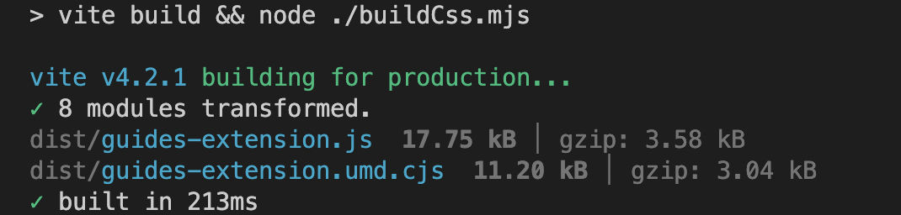

# AEM Guides 확장 패키지 설치 및 사용

확장을 사용하면 AEM Guides 앱을 사용자 요구에 맞게 사용자 지정할 수 있습니다. 이 확장 프레임워크는 AEM Guides v4.3 이상(온-프레미스) 및 2310(클라우드)에서 지원됩니다.

## 요구 사항

이 패키지를 사용하려면 [git bash](https://github.com/git-guides/install-git) 및 npm

## 설치

AEM Guides 프레임워크 설치를 부트스트랩하는 가장 쉬운 방법은 cli 를 사용하는 것입니다

```bash
npx @adobe/create-guides-extension
```

## 사용자 지정 코드 추가

1. 에서 확장할 각 구성 요소에 대한 코드 파일을 추가합니다. `src/` 디렉토리. 일부 샘플 파일이 이미 추가되었습니다.
2. 이제 `index.ts` 파일 위치: `src/` 디렉토리 :
   - 가져오기 `.ts` 빌드에 추가할 사용자 지정 내용이 포함된 파일입니다.
   - 가져오기 추가 `window.extension`
   - 사용자 지정된 구성 요소 등록 `id` 및 해당 가져오기 대상 `tcx extensions`
   - 샘플을 참조하십시오 `/src/index.ts`

## 사용자 지정된 코드 작성

- 실행 `npm run build` 루트 디렉토리에 있습니다. 디렉토리에 파일 3개가 있고 `dist/`:
   - `build.css`
   - `guides-extension.js`
   - `guides-extension.umd.cjs`



## AEM에 사용자 지정 추가

- 다음으로 이동 `CRXDE` `crx/de/index.jsp#/`
- 아래 `apps` 폴더, 유형의 새 노드 만들기 `cq:ClientLibraryFolder`


- 다음에서 `properties` 노드의 를 선택합니다. `Multi` 다음 속성 이름 추가: `categories`
유형: `String []`
값: `apps.fmdita.review_overrides`, `apps.fmdita.xml_editor.page_overrides`


- 빌드된 js를 추가하려면 다음과 같은 새 파일을 만듭니다. `tcx1.js` 위에서 만든 노드에서. 여기에서 코드를 추가합니다. `dist/guides-extension.umd.cjs` 또는 `dist/guides-extension.js`. 이제 새 파일 만들기 `js.txt`여기서 js 파일의 이름을 추가합니다. 이 경우 다음과 같습니다.

```t
#base=.
tcx1.js
```

- 빌드된 css를 추가하려면 다음과 같은 새 파일을 만듭니다. `tcx1.css` 위에서 만든 노드에서. 여기에서 코드를 추가합니다. `dist/build.css`. 이제 새 파일 만들기 `css.txt`, 여기에서 css 파일의 이름을 추가하며, 이 경우 다음과 같습니다.

```t
#base=.
tcx1.css
```

- 수행 `shift + refresh` 맞춤화를 사용하여 앱을 로드하려면 다음을 수행하십시오.

## 문제 해결

위의 모든 단계가 올바르게 수행되었는지 확인합니다.
tcx.js에 코드를 추가한 후 하드 새로 고침(shift+refresh)을 수행해야 합니다.
이제 AEM을 열고 마우스 오른쪽 단추를 클릭하여 `Inspect`
소스로 이동하여 다음을 검색하십시오. `[node_name].js` (예: extensions.js) 파일. 제어 / Cmd + D를 수행하여 파일을 검색합니다. 다음과 같은 경우 `.js` 붙여넣은 JS 코드가 있는 파일이 있습니다. `dist/guides-extension.umd.cjs` 또는 `dist/guides-extension.js`, 설정이 완료되었습니다.
