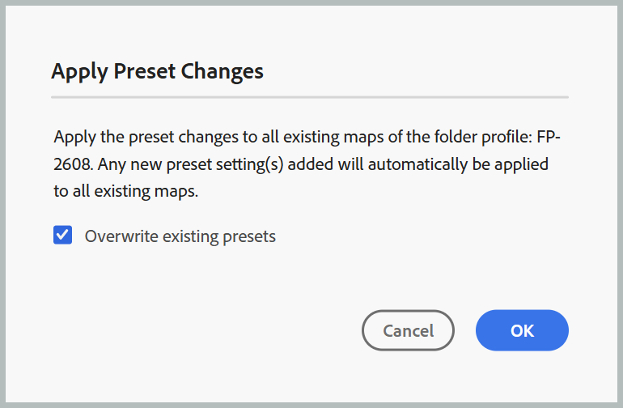

# 출력 생성을 위한 템플릿 사전 설정 구성

>[!NOTE]
>
> 템플릿 사전 설정은 Experience Manager Guides as a Cloud Service 2026.08.0 릴리스부터 사용할 수 있습니다. 이 기능을 활성화하려면 고객 지원 팀에 문의하십시오.

관리자는 템플릿 사전 설정을 사용하여 여러 DITA 맵에서 출력 사전 설정 구성을 표준화할 수 있습니다. 모든 맵에 대해 개별적으로 동일한 출력 사전 설정을 구성하는 대신, 사전 설정을 템플릿으로 정의하여 폴더 프로필과 연관된 모든 맵에 적용할 수 있습니다.

이 기능을 사용하면 프로젝트 간 일관된 게시 구성을 유지 관리하고 수동 구성 작업을 줄일 수 있습니다.

## 이점

템플릿 사전 설정을 사용하면 다음과 같은 이점이 있습니다.

- 여러 맵에서 일관된 게시 구성을 보장합니다.
- 반복적인 사전 설정 구성을 제거하여 수작업 부담을 줄입니다.
- 출력 사전 설정 설정을 중앙 집중식으로 관리할 수 있습니다.

## 지원되는 출력 유형

템플릿 사전 설정은 다음을 제외한 모든 출력 사전 설정 유형에 대해 지원됩니다.

- Edge Delivery Services
- 기술 자료
- SCORM

## 템플릿 사전 설정 만들기 및 관리

>[!NOTE]
>
> - 템플릿 사전 설정은 **관리자** 및 **폴더 프로필 관리자**&#x200B;만 만들고 관리할 수 있습니다.
> - 템플릿 사전 설정은 구성 관리를 위한 것이며 출력 생성에 직접 사용되지는 않습니다.

1. 폴더에 사용할 폴더 프로필을 구성합니다.
2. 맵 콘솔에서 연결된 폴더의 **출력 사전 설정**&#x200B;을 엽니다.
3. 템플릿으로 사용할 출력 사전 설정을 만들거나 선택합니다.

   >[!NOTE]
   >
   > 템플릿으로 사용할 출력 사전 설정을 만들거나 선택할 때 현재 폴더 프로필에 추가되어 있는지 확인하십시오.

4. 사전 설정의 **옵션** 메뉴에서 **템플릿으로 설정**&#x200B;을(를) 선택합니다.

   {width="650"}

   선택한 출력 사전 설정은 템플릿 사전 설정으로 변환됩니다. 템플릿 사전 설정은 일반 사전 설정과 구별되는 템플릿 아이콘으로 식별됩니다. 템플릿 상태를 제거하려면 언제든지 템플릿 사전 설정의 **옵션** 메뉴에서 **템플릿으로 설정 해제**&#x200B;를 선택하십시오.

   {width="650"}

5. 템플릿 사전 설정의 **옵션** 메뉴에서 **사전 설정 변경 적용**&#x200B;을 선택하여 업데이트된 사전 설정 설정을 선택한 폴더 프로필의 모든 기존 맵에 적용합니다.

   **사전 설정 변경 내용 적용** 대화 상자가 열립니다.

   {width="350"}

6. 기존 사전 설정을 덮어쓰려면 **기존 사전 설정 덮어쓰기** 확인란을 선택하고 **확인**&#x200B;을 선택합니다. 덮어쓰기는 사전 설정을 업데이트하지만 대상 사전 설정의 기준선, 조건 사전 설정, DITAVAL, 주제 목록 또는 게시 컨텍스트 설정은 수정하지 않습니다. 이러한 설정은 변경되지 않습니다.

   사전 설정 변경 내용이 적용되는 맵 수를 나타내는 **작업 확인** 대화 상자가 열립니다.

   {width="350"}

7. **확인**&#x200B;을 선택합니다.

변경 사항은 연결된 폴더 내의 모든 맵의 모든 사전 설정에 적용됩니다.

>[!NOTE]
>
> 연결된 폴더에서 새 맵을 만들 때 새로 만든 해당 맵에도 템플릿 사전 설정의 로컬 복사본을 사용할 수 있습니다.

## 출력 생성 동작

템플릿 사전 설정은 구성 템플릿이며 직접 게시를 위한 것이 아닙니다. 사전 설정이 템플릿으로 표시되는 경우:

- 출력 생성을 사용할 수 없습니다.
- 템플릿 사전 설정은 게시하는 데 사용할 수 없습니다.
- 템플릿 사전 설정에 대해 생성된 기존 출력은 사전 설정이 템플릿으로 변환되기 전에 생성된 경우 계속 액세스할 수 있습니다.

