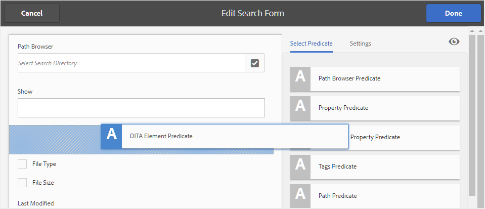

# AEM Assets UI에 대한 검색 구성 {#id192SC800MY4}

기본적으로 AEM은 DITA 콘텐츠를 인식하지 않으므로 저장소 내에서 DITA 콘텐츠를 검색하는 메커니즘을 제공하지 않습니다. AEM Guides를 사용하면 AEM 저장소에서 DITA 콘텐츠 검색 기능을 추가할 수 있습니다.

기본적으로 AEM은 DITA 콘텐츠를 인식하지 않으므로 저장소 내에서 DITA 콘텐츠를 검색하는 메커니즘을 제공하지 않습니다. 또한 UUID를 기반으로 컨텐츠를 검색하는 OOTB 기능도 없습니다. AEM Guides를 사용하면 AEM 저장소에서 DITA 콘텐츠 검색 및 UUID 기반 검색 기능을 추가할 수 있습니다.

DITA 컨텐트 검색 구성에는 다음 작업이 포함됩니다.

1. [Assets UI에서 DITA 요소 검색 구성 요소 추가](#id192SF0F50HS)
1. [자산 UI에 UUID 기반 검색 구성 요소 추가](#id2034F04K05Z)
1. [사용자에게 권한 제공](#id192SF0G0RUI)
1. [검색에서 사용자 지정 요소 또는 속성 추가](#id192SF0G10YK)
1. [기존 콘텐츠에서 메타데이터 추출](#id192SF0GA0HT)

검색 기능을 추가하는 것 외에도 검색에 포함하지 않아야 하는 폴더를 구성할 수도 있습니다. 자세한 내용은 [검색 결과에서 임시 파일 제외](#id197AHI0035Z).

## Assets UI에서 DITA 요소 검색 구성 요소 추가 {#id192SF0F50HS}

AEM Assets UI에서 DITA 콘텐츠 검색 구성 요소를 추가하려면 다음을 수행하십시오.

1. 관리자로 Adobe Experience Manager에 로그인합니다.

1. 을(를) 클릭합니다 **Adobe Experience Manager** 맨 위에 연결한 다음 **도구**.

1. 선택 **일반** 도구 목록에서 을(를) 클릭하고 **Forms 검색** 타일.

1. 다음에서 **Forms 검색** 목록에서 **에셋 관리자 검색 레일**.

1. 클릭 **편집**.
1. 다음에서 **조건자 선택** 탭을 클릭하고 목록의 끝으로 스크롤합니다.

1. 드래그 앤 드롭 **DITA 요소 조건자** 검색 양식에서 필요한 위치입니다.

   {width="650" align="left"}

1. 클릭 **완료** 변경 사항을 저장합니다.

   Assets UI에서 필터 옵션에 액세스하면 DITA 요소 검색 필터링 옵션이 제공됩니다.

   {width="350" align="left"}


## 자산 UI에 UUID 기반 검색 구성 요소 추가 {#id2034F04K05Z}

AEM Assets UI에서 UUID 기반 검색 구성 요소를 추가하려면 다음을 수행하십시오.

1. 관리자로 Adobe Experience Manager에 로그인합니다.

1. 을(를) 클릭합니다 **Adobe Experience Manager** 맨 위에 연결한 다음 **도구**.

1. 선택 **일반** 도구 목록에서 을(를) 클릭하고 **Forms 검색** 타일.

1. 다음에서 **Forms 검색** 목록에서 **에셋 관리자 검색 레일**.

1. 클릭 **편집**.
1. 다음에서 **조건자 선택** 탭, 선택 **속성 조건자** 을 클릭하고 검색 양식의 필요한 위치에 드래그 앤 드롭합니다.

1. 다음에서 **설정** 탭에서 새로 추가된 항목에 대해 다음 세부 정보를 제공합니다 **속성 조건자** 구성 요소:

   - **필드 레이블**: UUID
   - **속성 이름**: jcr:content/fmUuid

1. 클릭 **완료** 변경 사항을 저장합니다.

   Assets UI에서 필터 옵션에 액세스하면 UUIS 기반 검색 필터링 옵션을 사용할 수 있습니다.


## 사용자에게 권한 제공 {#id192SF0G0RUI}

Assets UI에서 검색 기능에 액세스할 수 있도록 작성자 및 게시자에게 명시적 권한이 제공되어야 합니다. 이러한 권한을 부여하지 않으면 사용자가 요소/속성 값 또는 UUID를 기반으로 DITA 콘텐츠를 검색할 수 없습니다.

DITA 검색 기능에 액세스하려면 다음 단계를 수행하십시오.

1. 사용자 및 그룹 권한 페이지에 액세스합니다. 페이지에 액세스하기 위한 기본 URL은 다음과 같습니다.

   `http://<server name>:<port>/useradmin.html`

1. 액세스 권한을 부여할 사용자 그룹 또는 개별 사용자를 검색합니다. 예를 들어 작성자 그룹의 모든 사용자에게 액세스 권한을 부여하려면 **쿼리 필터링** 필드 및 누르기 **입력**.

   {width="350" align="left"}

1. 다음 항목 선택 **작성자** 그룹입니다.

1. 오른쪽 창에서 **권한** 탭.

1. 다음 폴더 위치로 이동합니다.

   /conf/global/settings/dam/search

1. 다음을 제공합니다. **읽기** 검색 폴더에 대한 권한.

   {width="650" align="left"}

1. **저장**&#x200B;을 클릭합니다.


선택한 사용자 또는 사용자 그룹은 이제 Assets UI의 검색 DITA 콘텐츠 기능에 액세스할 수 있습니다.

## 검색에서 사용자 지정 요소 또는 속성 추가 {#id192SF0G10YK}

DITA 검색이 작동하려면 DITA 컨텐츠의 일부 사전 처리가 필요합니다. 이 사전 처리 단계는 개별 DITA 맵 및 주제에서 선택적 콘텐츠를 추출하여 보다 빠른 검색을 위해 색인화할 수 있습니다. 내부적으로 이 프로세스를 호출합니다. *직렬화*. DITA 파일의 직렬화는 컨텐트 업로드 중에 발생하거나 필요에 따라 실행될 수도 있습니다. 구성 파일을 사용하여 각 DITA 파일의 색인화해야 할 컨텐트의 양을 결정합니다. 직렬화 파일의 기본 위치는 다음과 같습니다.

/libs/fmdita/config/serializationconfig.xml

기본 검색 구성을 사용하면 DITA 내의 모든 요소와 속성을 검색할 수 있습니다 `prolog` 요소를 생성하지 않습니다. 다른 요소나 속성을 기준으로 검색하려면 검색 직렬화 파일을 구성해야 합니다.

>[!NOTE]
>
> 기본 검색 구성을 사용하여 `prolog` 요소를 선택한 다음 이 프로세스를 건너뛸 수 있습니다.

이 파일에는 두 개의 주 섹션 속성 세트와 규칙 세트가 포함되어 있습니다. 규칙 세트 섹션의 스니펫이 아래에 제공됩니다.

```XML
<ruleset filetypes="xml dita"><!-- Element rules --><rule xpath="//[contains(@class, 'topic/topic')]/[contains(@class, 'topic/prolog')]//*[not(*)]" text="yes" attributeset="all-attrs" /><!-- Attribute rules --><rule xpath="//[contains(@class, 'topic/topic')]/[contains(@class, 'topic/prolog')]///@[local-name() != 'class']" /></ruleset>
```

규칙 세트 섹션에서 다음을 지정할 수 있습니다.

- 요소 추출 규칙
- 속성을 추출하는 규칙


규칙은 다음과 같이 구성됩니다.

xpath : DITA 파일에서 요소나 속성을 검색하는 XPath 쿼리입니다. 요소 규칙의 기본 구성은 모두 검색합니다 `prolog` 요소. 속성 규칙의 기본 구성은 의 모든 속성을 검색합니다. `prolog` 요소. XPath 쿼리를 지정하여 검색할 요소나 특성을 직렬화할 수 있습니다.

XPath 쿼리에는 문서 유형의 클래스 이름이 들어 있습니다. 다음 `topic/topic` 클래스는 주제 유형 DITA 문서에 사용됩니다. 다른 DITA 문서에 대한 규칙을 만들려면 다음 클래스 이름을 사용해야 합니다.

| 문서 유형 | 클래스 이름 |
|-------------|----------|
| 주제 | - 주제/주제 |
| 작업 | - 주제/주제 작업/작업 |
| 개념 | - 주제/주제 개념/개념 |
| 참조 | - 주제/주제 참조/참조 |
| 맵 | - 맵/맵 |

텍스트 : 지정된 요소 내에서 텍스트를 검색하려면 yes 값을 지정합니다. no as value를 지정하면 요소 내의 속성만 일련화됩니다. 검색할 속성은 속성 세트 섹션에 지정해야 합니다.

attributeset : 이 규칙과 연결할 속성 세트의 ID를 지정합니다. all-attrs 값은 이 규칙의 모든 속성을 serialize해야 함을 나타내는 특별한 경우입니다.

속성 세트에는 DITA 컨텐트에서 검색할 속성 목록이 포함되어 있습니다. 속성 집합에는 다음이 포함됩니다.

id : 속성 세트에 대한 고유 식별자입니다. 이 ID는 규칙 세트의 속성 세트 매개 변수에 지정됩니다.

속성 : 검색할 속성 목록입니다. 각 속성에 대해 `attribute` 요소를 생성하지 않습니다.

다음 단계를 수행하여 검색 직렬화 파일에 사용자 정의 DITA 요소 또는 속성을 추가합니다.

1. AEM에 로그인하고 CRXDE Lite 모드를 엽니다.

1. 다음 위치에서 사용할 수 있는 직렬화 구성 파일로 이동합니다.

   /libs/fmdita/config/serializationconfig.xml

1. 의 오버레이 노드 만들기 `config` 폴더 내 `apps` 노드.

1. 에서 사용할 수 있는 구성 파일로 이동합니다. `apps` 노드:

   `/apps/fmdita/config/serializationconfig.xml`

1. 필수 요소 또는 속성 규칙 세트를 추가합니다.

1. 파일을 저장합니다.

1. Adobe Experience Manager 웹 콘솔 구성 페이지를 엽니다. 구성 페이지에 액세스하기 위한 기본 URL은 다음과 같습니다.

   http://&lt;server name=&quot;&quot;>:&lt;port>/system/console/configMgr

1. 을(를) 검색하고 클릭합니다. *com.adobe.fmdita.config.ConfigManager* 번들.

1. **저장**&#x200B;을 클릭합니다.


검색을 위해 새 일련화 정보가 저장되고 활성화됩니다. 그러나 검색할 수 있으려면 기존 DITA 콘텐츠에서 메타데이터를 추출해야 합니다.

## 기존 콘텐츠에서 메타데이터 추출 {#id192SF0GA0HT}

기본 검색 직렬화 파일을 변경한 후에는 *com.adobe.fmdita.config.ConfigManager* 번들로 구성한 다음 워크플로우를 실행하여 메타데이터를 추출합니다. 이렇게 하면 기존 DITA 파일에서 필요한 메타데이터가 추출되며 동일한 메타데이터를 검색할 수 있게 됩니다.

serialization 파일을 업데이트한 후 새 파일을 만들거나 파일을 편집하는 경우 해당 파일에서 메타데이터가 자동으로 추출됩니다. 메타데이터 추출 프로세스는 AEM 저장소에 이미 존재하는 파일에 대해서만 필요합니다.

기존 DITA 파일에서 메타데이터 추출에는 다음 두 가지 작업이 포함됩니다.

1. configMgr에서 메타데이터 추출 옵션 활성화
1. 메타데이터 추출 워크플로우 실행

configMgr에서 메타데이터 추출 옵션을 활성화하려면 다음 단계를 수행하십시오.

1. Adobe Experience Manager 웹 콘솔 구성 페이지를 엽니다. 구성 페이지에 액세스하기 위한 기본 URL은 다음과 같습니다.

   http://&lt;server name=&quot;&quot;>:&lt;port>/system/console/configMgr

1. 을(를) 검색하고 클릭합니다. *com.adobe.fmdita.config.ConfigManager* 번들.

1. 다음 항목 선택 **DITA 메타데이터 추출 활성화** 옵션을 선택합니다.

1. **저장**&#x200B;을 클릭합니다.


메타데이터 추출 워크플로우를 실행하려면 다음 단계를 수행하십시오.

1. 관리자로 Adobe Experience Manager에 로그인합니다.

1. 을(를) 클릭합니다 **Adobe Experience Manager** 맨 위에 연결한 다음 **도구**.

1. 선택 **안내서** 도구 목록에서 **DITA 메타데이터 추출** 타일.

1. 단일 파일 및 해당 종속성에서 메타데이터를 추출하려면 **파일 선택** 파일을 링크하고 찾아봅니다.

1. 폴더 내의 여러 파일에서 메타데이터를 추출하려면 **폴더 선택** 필요한 폴더를 링크하고 찾아본 후 선택합니다. 다음을 클릭합니다. **추가** 폴더를 serialization 작업 목록에 추가하는 단추입니다.

   >[!NOTE]
   >
   > 여러 폴더를 선택하여 직렬화 작업에 추가할 수 있습니다.

1. 클릭 **시작**.

1. 메타데이터 추출 확인 대화 상자에서 **확인**.


## 검색 결과에서 임시 파일 제외 {#id197AHI0035Z}

기본적으로 검색은 AEM의 전체 저장소에서 수행됩니다. 검색에서 제외하려는 위치가 있을 수 있습니다. 예를 들어 콘텐츠 번역 워크플로를 시작할 때 승인되지 않은 파일은 임시 폴더 위치에 유지됩니다. 검색을 수행하면 이 임시 위치의 파일도 검색 결과에 반환됩니다.

AEM Guides에서 임시 번역 폴더 위치를 검색하지 못하게 하려면 제외 목록에 임시 폴더 위치를 추가해야 합니다.

검색에서 임시 번역 폴더를 제외하려면 다음 단계를 수행하십시오.

>[!NOTE]
>
> 이 절차를 사용하여 제외 목록에 다른 폴더 위치를 추가할 수 있습니다.

1. AEM에 로그인하고 CRXDE Lite 모드를 엽니다.

1. 다음 위치에서 사용할 수 있는 damAssetLucene 노드로 이동합니다.

   /oak:index/damAssetLucene

1. damAssetLucene 노드에 다음 속성을 추가합니다.

   | 속성 이름 | 유형 | 값 |
   |-------------|----|-----|
   | excludedPath | String\[\] | 이 속성에 다음 값을 추가합니다. <br>/content/dam/projects/translation\_output |

1. 다음 위치에서 사용할 수 있는 lucene 노드로 이동합니다.

   /oak:index/lucene

1. lucene 노드에 다음 속성을 추가합니다.

   | 속성 이름 | 유형 | 값 |
   |-------------|----|-----|
   | excludedPath | String\[\] | 이 속성에 다음 값을 추가합니다. <br><ul><li>/var/dxml</li><li>/content/dam/projects/translation\_output</li></ul> |
