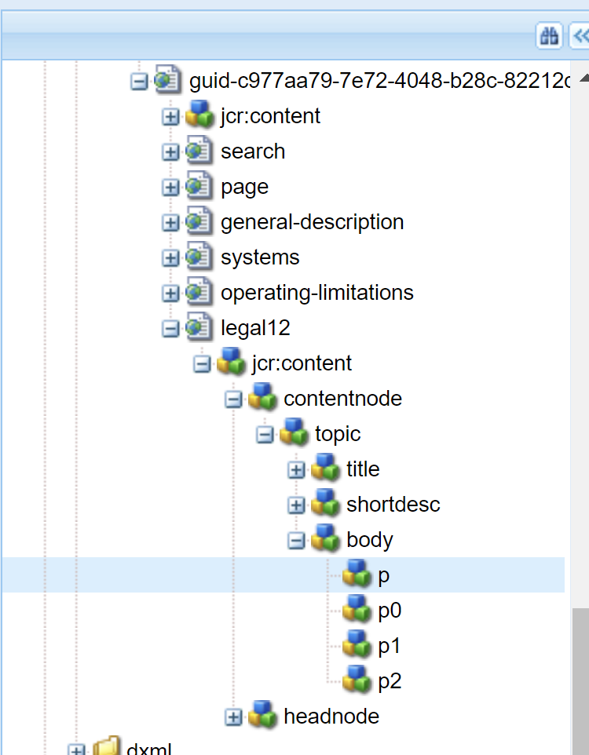
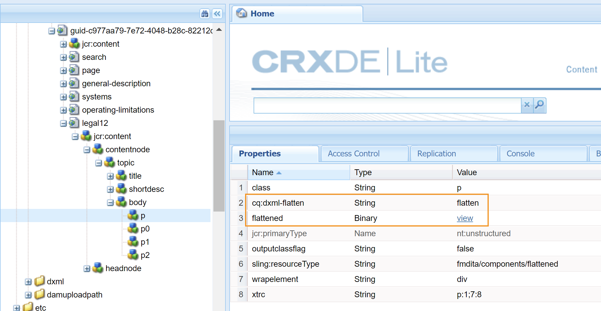

# 출력 생성 설정 구성 {#id181AI0B0E30}

AEM Guides에는 출력 생성 프로세스를 사용자 정의할 수 있는 다양한 구성 옵션이 포함되어 있습니다. 이 항목에서는 출력 생성 프로세스를 설정하는 데 도움이 되는 모든 구성 및 사용자 정의에 대해 설명합니다.

## DITA 맵 대시보드에서 기준선 탭 구성 {#id223MD0D0YRM}

맵 대시보드에서 사용할 수 있는 기준선 탭을 구성하고 숨길 수 있습니다.

다음 **기준선 탭 숨기기** 옵션은 기본적으로 활성화되어 있지 않으며 configMgr에서 활성화해야 합니다. 웹 편집기에서 기본적으로 옵션을 활성화하려면 다음 단계를 수행하십시오.

1. Adobe Experience Manager 웹 콘솔 구성 페이지를 엽니다.

   구성 페이지에 액세스하기 위한 기본 URL은 다음과 같습니다.

   ```http
   http://<server name>:<port>/system/console/configMgr
   ```

1. 을(를) 검색하고 클릭합니다. **com.adobe.fmdita.config.ConfigManager** 번들.

1. 다음 항목 선택 **기준선 탭 숨기기** 옵션을 선택합니다.

1. **저장**&#x200B;을 클릭합니다.

   >[!NOTE]
   >
   > 이 구성은 기본적으로 비활성화되어 있으며 맵 대시보드에서 기준선 탭을 사용할 수 있습니다.


## 구성 FrameMaker Publishing Server {#id1678G0Z0TN6}

FrameMaker Publishing Server \(FMPS\)를 사용하여 DITA 콘텐츠에 대한 출력을 생성할 수 있습니다. FMPS를 구성하면 FMPS에서 지원하는 다양한 형식으로 출력을 생성할 수 있습니다.

>[!NOTE]
>
> FMPS를 사용하여 출력을 생성하려면 FMPS 서버를 설정해야 합니다. 설치 및 구성에 대한 자세한 내용은 FrameMaker Publishing Server 사용 안내서 를 참조하십시오.

FMPS를 사용하도록 AEM Guides를 구성하려면 다음 속성을 업데이트합니다. `com.adobe.fmdita.config.ConfigManager` 번들로 웹 콘솔을 만듭니다.

>[!NOTE]
>
> 액세스 http://&lt;server name=&quot;&quot;>:&lt;port>/system/console/configMgr URL을 사용하여 웹 콘솔을 엽니다.

| 속성 | 설명 |
|--------|-----------|
| FrameMaker Publishing Server 로그인 도메인 | 도메인이 호스팅되는 FrameMaker Publishing Server 이름 또는 작업 그룹 이름을 지정합니다. FMPS 버전에 따라 도메인 이름을 다음과 같이 입력합니다.   **FMPS 2020**: IP 주소 192.168.1.101 <br>- **FMPS 2019 및 이전**: IP 주소 또는 도메인 이름 |
| FRAMEMAKER PUBLISHING SERVER URL | FrameMaker Publishing Server URL을 지정합니다. FMPS 버전에 따라 FMPS URL을 다음과 같이 제공합니다.<br>- **FMPS 2020**: `http://<fmps_ip>:<port>` \(http://192.168.1.101:7000\) <br> - **FMPS 2019 및 이전**: `http://<fmps_ip>:<port>/fmserver/v1/` |
| FMPS 버전 | FrameMaker Publishing Server의 버전 번호를 지정합니다. FMPS 버전에 따라 버전 정보를 다음과 같이 제공합니다. <br>- **FMPS 2020**: 2020년 <br> - **FMPS 2019 및 이전**: 2019 또는 2017 |
| FrameMaker Publishing Server 사용자 이름 및 암호 | FrameMaker Publishing Server에 액세스하기 위한 사용자 이름과 암호를 지정합니다. |
| FMPS 시간 초과 | \(*선택 사항*\) AEM Guides가 FrameMaker Publishing Server의 응답을 기다리는 시간 \(초)을 지정합니다. 지정된 시간에 응답이 없으면 AEM Guides가 게시 작업을 종료하고 작업에 실패로 플래그가 지정됩니다. <br> 기본값: 300초 \(5분\) |
| 외부 AEM URL | *\(선택 사항\)* FrameMaker Publishing Server이 생성된 출력 파일을 배치할 AEM URL입니다. 예: `http://<server-name>:<port>/` |
| AEM 관리자 사용자 이름 및 암호 | *\(선택 사항\)* AEM 설정 관리자의 사용자 이름 및 암호입니다. 이는 AEM과 통신하기 위해 FrameMaker Publishing Server에서 사용됩니다. |
| FMPS 작업 실행 대기 시간 제한 | 이 설정은 FMPS 2020에만 적용됩니다. 이 프로세스가 실행될 때까지 FMPS가 대기하지 않는 시간 \(초\)을 지정합니다. |

## 기존 AEM 사이트 내에서 혼합 게시 구성 {#id1691I0V0MGR}

DITA 콘텐츠가 포함된 AEM Site가 있는 경우 DITA 콘텐츠를 사이트 내의 사전 정의된 위치에 게시하도록 AEM Site 출력을 구성할 수 있습니다. 예를 들어 AEM Site 페이지의 다음 스크린샷에서는 `ditacontent` 노드가 DITA 콘텐츠를 저장하도록 예약되었습니다.

{width="300" align="left"}

페이지의 나머지 노드는 AEM Site 편집기에서 직접 작성합니다. DITA 콘텐츠를 사전 정의된 위치에 게시하도록 게시 설정을 구성하면 AEM Guides 게시 프로세스에서 기존의 비 DITA 콘텐츠를 수정하지 않아도 됩니다.

사전 정의된 노드에 DITA 컨텐트를 게시할 수 있도록 기존 사이트에서 다음 구성을 수행해야 합니다.

- 사이트의 템플릿 속성 구성

- 사이트에 노드를 추가하여 DITA 콘텐츠 게시


기존 사이트의 템플릿 속성을 구성하려면 다음 단계를 수행하십시오.

1. AEM에 로그인하고 CRXDE Lite 모드를 엽니다.

1. 사이트의 템플릿 구성 노드로 이동합니다. 예를 들어 AEM Guides는 다음 노드에 기본 템플릿 구성을 저장합니다.

   `/libs/fmdita/config/templates/default`

   >[!NOTE]
   >
   > 에서 사용할 수 있는 기본 구성 파일의 사용자 지정을 만들지 마십시오. `libs` 노드. 의 오버레이를 만들어야 합니다. `libs` 의 노드 `apps` 노드에 필요한 파일을 추가하고 `apps` 노드만

1. 다음 속성을 추가합니다.

   | 속성 이름 | 유형 | 값 |
   |-------------|----|-----|
   | `topicContentNode` | 문자열 | DITA 컨텐트를 게시할 노드 이름을 지정합니다. 예를 들어 AEM Guides가 DITA 콘텐츠를 게시하는 기본 노드는 다음과 같습니다. <br>`jcr:content/contentnode` |
   | `topicHeadNode` | 문자열 | DITA 콘텐츠의 메타데이터 정보를 저장할 노드 이름을 지정합니다. 예를 들어 AEM Guides가 메타데이터 정보를 저장하는 기본 노드는 다음과 같습니다. <br>`jcr:content/headnode` |


다음 스크린샷은 AEM Guides의 기본 템플릿 노드에 추가된 속성을 보여 줍니다.

{width="800" align="left"}

다음에 사이트의 템플릿 구성을 사용하여 DITA 콘텐츠를 게시하면 해당 콘텐츠가 `topicContentNode` 및 `topicHeadNode` 속성.

그러나 기존 사이트의 경우 을(를) 수동으로 추가해야 합니다. `topicContentNode` 및 `topicHeadNode` 노드.

필요한 노드를 기존 사이트에 추가하려면 다음 단계를 수행하십시오.

1. AEM에 로그인하고 CRXDE Lite 모드를 엽니다.

1. 찾기 `jcr:content` 사이트 노드 내에서 확인할 수 있습니다.

1. 추가 `topicContentNode` 및 `topicHeadNode` 사이트의 템플릿 구성에 지정한 것과 동일한 이름을 가진 노드.


## AEM 사이트 출력 사용자 지정 {#id166TG0B30WR}

AEM Guides에서는 다음 형식의 출력 만들기를 지원합니다.

- AEM 사이트

- PDF

- HTML5
- EPUB
- DITA-OT를 통한 사용자 지정 출력

AEM Site 출력의 경우 출력 작업이 다른 디자인 템플릿을 할당할 수 있습니다. 이러한 디자인 템플릿은 DITA 콘텐츠를 다른 레이아웃으로 렌더링할 수 있습니다. 예를 들어 내부 및 외부 대상에 대해 서로 다른 디자인 템플릿을 지정할 수 있습니다.

AEM Guides에서 사용자 지정된 DITA Open Toolkit \(DITA-OT\) 플러그인을 사용할 수도 있습니다. 이러한 사용자 지정 DITA-OT 플러그인을 업로드하여 특정 방식으로 PDF 출력을 생성할 수 있습니다.

>[!TIP]
>
> 다음을 참조하십시오. *AEM 사이트 게시* 모범 사례 안내서의 섹션[appendix.md\#](appendix.md#) AEM 사이트 출력 생성에 대한 우수 사례입니다.

### 출력 생성을 위한 디자인 템플릿 맞춤화 {#customize_xml-add-on}

AEM Guides는 사전 정의된 디자인 템플릿 세트를 사용하여 AEM Site 출력을 생성합니다. AEM Guides의 디자인 템플릿을 사용자 지정하여 회사 브랜딩에 맞는 출력을 생성할 수 있습니다. 디자인 템플릿은 다양한 스타일 \(CSS\), 스크립트 \(서버측과 클라이언트측\), 리소스 \(이미지, 로고 및 기타 에셋\) 및 이러한 모든 리소스를 하나로 묶는 JCR 노드의 컬렉션입니다. 디자인 템플릿은 두 개의 JCR 노드만 사용하거나 스타일, 리소스 및 JCR 노드의 복잡한 조합을 사용하는 단일 서버측 스크립트처럼 단순할 수 있습니다. 디자인 템플릿은 AEM Site 출력을 생성하는 동안 AEM Guides 게시 하위 시스템에서 사용되며 생성된 출력의 구조, 모양 및 느낌을 제어합니다.

서버에서 디자인 템플릿 리소스를 배치해야 하는 위치에는 제한이 없지만, 일반적으로 함수에 따라 논리적으로 구성됩니다. 예를 들어 기본 템플릿에는 모든 JavaScript 및 CSS 파일이 `/etc/designs/fmdita/clientlibs/siteoutput/default` 폴더를 삭제합니다. 이러한 파일은 위치에 관계없이 JCR 노드 컬렉션에 의해 함께 연결됩니다. 이러한 JCR 노드와 파일은 함께 전체 디자인 템플릿을 구성합니다.

AEM Guides와 함께 제공되는 기본 디자인 템플릿을 사용하면 랜딩, 주제 및 검색 페이지 구성 요소를 사용자 지정할 수 있습니다. 기본 설계와 해당 참조 템플릿의 복사본을 만들고 다른 구성 요소를 지정하여 원하는 출력을 생성할 수 있습니다.

다음 단계를 수행하여 AEM Site 출력 생성에 사용할 고유한 디자인 템플릿을 지정합니다.

1. AEM에 로그인하고 CRXDE Lite 모드를 엽니다.

1. 기본 디자인 템플릿 노드로 이동합니다. 기본 디자인 템플릿 노드의 위치는 다음과 같습니다.

   `/libs/fmdita/config/templates/`

   {width="300" align="left"}

   >[!NOTE]
   >
   > 에서 기본 디자인 템플릿의 사본을 만듭니다. `libs` 폴더 위치: `apps` 폴더 만들기 및 `apps` 폴더를 삭제합니다. 기본 템플릿 노드에서 참조된 템플릿도 변경해야 합니다. 참조된 템플릿은에 배치됩니다. `/libs/fmdita/templates/default/cqtemplates` 노드. 에서 참조된 템플릿의 사본을 만듭니다. `apps` 폴더를 만든 다음 변경합니다.

1. 다음을 클릭합니다. *기본값* 의 구성 요소 *템플릿* 속성을 액세스할 수 있는 노드

   다음 표에서는 AEM Guides의 디자인 템플릿 속성에 대해 설명합니다.

   | 속성 | 설명 |
   |--------|-----------|
   | `landingPageTemplate`, `searchPageTemplate`, `topicPageTemplate`, `shadowPageTemplate` | 다음을 지정합니다. `cq:Template` 해당 페이지의 노드 \(랜딩, 검색 및 주제\). 기본적으로 `cq:Template` 이러한 페이지의 노드는에서 찾을 수 있습니다. `/libs/fmdita/templates/default/cqtemplates` 노드. 이 노드는 랜딩, 검색 및 주제 페이지의 구조 및 속성을 정의합니다. <br>다음 `shadowPageTemplate` 청크된 콘텐츠를 최적화하는 데 사용됩니다. 이 속성의 값을 다음으로 설정해야 합니다. <br> `fmdita/templates/default/cqtemplates/shadowpage` <br> **참고** 다음에 대한 값을 지정해야 합니다. `topicPageTemplate`. 다음 `landingPageTemplate` 및 `searchPageTemplate` 는 선택적 속성입니다. 검색 및 랜딩 페이지를 생성하지 않으려면 이러한 속성을 지정하지 마십시오. |
   | `title` | 디자인 서식 파일을 설명하는 이름입니다. |
   | `topicContentNode` | 주제 페이지의 DITA 컨텐트를 포함할 노드의 위치입니다. 경로는 주제 페이지를 기준으로 합니다. |
   | `topicHeadNode` | DITA 콘텐츠에서 파생된 헤드 값 \(또는 메타데이터\)을 포함할 노드의 위치입니다. 경로는 주제 페이지를 기준으로 합니다. |
   | `tocNode` | 목차를 포함할 노드의 위치입니다. 경로는 랜딩 페이지 또는 대상 경로를 기준으로 합니다. |
   | `basePathProp` | 게시된 사이트의 루트 경로를 저장하는 속성 이름입니다. |
   | `indexPathProp` | 게시된 사이트의 랜딩/인덱스 페이지 경로를 저장하는 속성 이름입니다. |
   | `pdfPathProp` | 주제 PDF 생성이 활성화된 경우 주제 PDF 경로를 저장하기 위한 속성 이름입니다. |
   | `pdfTypeProp` | PDF 생성 유형을 저장하는 속성 이름입니다. 현재 이 속성은 항상 &quot;Topic&quot;을 포함합니다. |
   | `searchPathProp` | 템플릿에 검색 페이지가 포함된 경우 검색 페이지의 경로를 저장하는 속성 이름입니다. |
   | `siteTitleProp` | 게시 중인 사이트의 제목을 저장하는 속성 이름입니다. 이 제목은 일반적으로 게시 중인 맵의 제목과 동일합니다. |
   | `sourcePathProp` | 현재 페이지의 소스 DITA 주제 경로를 저장하는 속성 이름입니다. |
   | `tocPathProp` | 게시된 사이트에 대한 목차 루트 경로를 저장하는 속성 이름입니다. |


>[!NOTE]
>
> 사용자 지정 디자인 템플릿 노드를 만든 후 AEM Site 출력 사전 설정에서 디자인 옵션을 업데이트하여 사용자 지정 디자인 템플릿 노드를 사용해야 합니다.

자세한 내용은 [첫 번째 Adobe Experience Manager 6.3 웹 사이트 만들기](https://helpx.adobe.com/experience-manager/using/first_aem63_website.html) 및 [기본 사항](https://helpx.adobe.com/experience-manager/6-3/sites/developing/using/the-basics.html) AEM에서 자신의 웹 사이트를 개발할 수 있습니다.

### AEM 사이트 출력 생성에 문서 제목 사용

AEM Site 출력을 생성할 때 URL을 생성하는 방식은 콘텐츠의 검색 기능에 중요한 역할을 합니다. UUID 기반 파일 이름을 사용하는 경우 파일의 UUID를 기반으로 URL을 생성하면 검색하기 쉽지 않습니다. 관리자 또는 게시자는 AEM Site 출력에 대한 URL을 생성하는 방법을 제어할 수 있습니다. AEM Guides는 UUID 기반 파일 이름이 아닌 파일의 제목을 사용하여 AEM 사이트 출력의 URL을 생성하도록 선택할 수 있는 구성을 제공합니다. 기본적으로 UUID 기반 파일 시스템의 경우 이 옵션이 켜져 있습니다. 이는 UUID 기반 파일 시스템에 대한 AEM Site 출력을 생성할 때 파일의 제목이 파일의 UUID가 아닌 URL을 생성하는 데 사용됨을 의미했습니다.

AEM Site 출력을 생성할 때 URL을 생성하는 방식은 콘텐츠의 검색 기능에 중요한 역할을 합니다. UUID를 기반으로 하지 않는 파일 시스템의 경우 AEM 사이트 출력은 파일의 제목이 아닌 파일 이름을 사용하여 생성됩니다. 관리자 또는 게시자는 AEM Site 출력에 대한 URL을 생성하는 방법을 제어할 수 있습니다. AEM Guides는 파일 이름이 아닌 파일의 제목을 사용하여 AEM 사이트 출력의 URL을 생성하도록 선택할 수 있는 구성을 제공합니다. 기본적으로 이 옵션은 꺼져 있습니다. 이는 AEM Site 출력을 생성할 때 파일 이름이 파일 제목이 아닌 URL을 생성하는 데 사용됨을 의미했습니다. 이 옵션을 활성화하여 파일의 제목을 기반으로 URL을 생성하도록 선택할 수 있습니다.

>[!NOTE]
>
> AEM Site 출력의 URL에 문자 집합만 허용하도록 규칙을 추가로 구성할 수 있습니다. 자세한 내용은 [항목을 만들고 AEM 사이트 출력을 게시하기 위한 파일 이름 정리 규칙 구성](#id2164D0KD0XA).

AEM Site 출력에서 URL 생성을 구성하려면 다음 단계를 수행합니다.

1. Adobe Experience Manager 웹 콘솔 구성 페이지를 엽니다.

   구성 페이지에 액세스하기 위한 기본 URL은 다음과 같습니다.

   ```http
   http://<server name>:<port>/system/console/configMgr
   ```

1. 을(를) 검색하고 클릭합니다. **com.adobe.fmdita.config.ConfigManager** 번들.

1. 다음 항목 선택 **AEM 사이트 페이지 이름에 제목 사용** 옵션을 선택합니다.

   >[!NOTE]
   >
   > 파일 이름을 사용하여 출력을 생성하려면 이 옵션을 선택 취소합니다.

1. **저장**&#x200B;을 클릭합니다.


### 항목을 만들고 AEM 사이트 출력을 게시하기 위한 파일 이름 정리 규칙 구성 {#id2164D0KD0XA}

관리자는 파일 이름에 사용할 수 있는 유효한 특수 문자 목록을 정의하여 AEM Site 출력의 URL을 형성할 수 있습니다. 이전 릴리스에서는 다음과 같은 특수 문자가 포함된 파일 이름을 정의할 수 있었습니다. `@`, `$`, `>`등. 이러한 특수 문자로 인해 AEM Site 페이지를 생성할 때 URL이 인코딩되었습니다.

3.8 릴리스부터 파일 이름에 사용할 수 있는 특수 문자 목록을 정의하는 구성이 추가되었습니다. 기본적으로 유효한 파일 이름 구성에는 &quot;`a-z A-Z 0-9 - _`&quot;. 이는 파일을 만드는 동안 파일 제목에 특수 문자를 사용할 수 있지만 내부적으로 하이픈 \(`-`\) 파일 이름에 사용할 수 없습니다. 예를 들어 파일 제목을 Introduction 1 또는 Introduction@1으로 지정할 수 있습니다. 이 두 경우에 대해 생성되는 해당 파일 이름은 Introduction-1입니다.

유효한 문자 목록을 정의할 때는 이 문자 &quot;&quot;를 기억하십시오.`*/:[\]|#%{}?&<>"/+`&quot; 및 `a space` 은 항상 하이픈 \(`-`\).

>[!NOTE]
>
> 유효한 특수 문자 목록을 구성하지 않으면 파일 생성 프로세스에서 예기치 않은 결과가 발생할 수 있습니다.

파일 이름 및 AEM Site 출력에 유효한 특수 문자를 구성하려면 다음 단계를 수행하십시오.

1. Adobe Experience Manager 웹 콘솔 구성 페이지를 엽니다.

   구성 페이지에 액세스하기 위한 기본 URL은 다음과 같습니다.

   ```http
   http://<server name>:<port>/system/console/configMgr
   ```

1. 을(를) 검색하고 클릭합니다. *com.adobe.fmdita.common.SanitizeNodeNameImpl* 번들.

1. 다음에서 **AEM Sites에 게시하기 위해 허용되지 않는 문자 집합** 속성, 속성이 로 설정되어 있는지 확인 ```'<>`@$```. 이 목록에 더 많은 특수 문자를 추가할 수 있지만 필수 특수 문자가 있어야 합니다.

   >[!NOTE]
   >
   > 다음과 같은 다른 속성을 구성할 수도 있습니다. **소문자 사용** 파일 이름에서 **분리자** 잘못된 문자를 처리하고 **최대 문자 수** 파일 이름에 사용할 수 있습니다.

1. **저장**&#x200B;을 클릭합니다.

1. 을(를) 검색하고 클릭합니다. **com.adobe.fmdita.config.ConfigManager** 번들.

1. 다음에서 **유효한 문자에 대한 정규 표현식** 속성, 속성이 로 설정되어 있는지 확인 `[-a-zA-Z0-9_]`. 이 목록에 더 많은 문자를 추가할 수 있지만 기본 문자가 있어야 하며 목록은 하이픈 \(`-`\).

   >[!NOTE]
   >
   > 이 속성은 새 파일을 만드는 데 사용되는 유효한 문자 목록을 정의합니다.

1. **저장**&#x200B;을 클릭합니다.


### AEM 사이트 노드 구조의 평면화 구성

AEM Site 출력을 생성하면 주제의 모든 요소에 대한 노드가 내부적으로 생성됩니다. 수천 개의 주제가 있는 DITA 맵의 경우 이 노드 구조가 너무 깊어질 수 있습니다. 이러한 유형의 깊게 중첩된 노드 구조는 더 큰 사이트에 대해 성능 문제가 발생할 수 있습니다. 다음 스냅샷은 AEM 사이트 출력에 대해 깊게 중첩된 노드 구조를 표시합니다.

{width="300" align="left"}

위의 스냅샷에서 모든 항목에 대해 노드가 생성되었는지 확인합니다 `p` 요소와 그 후속 하위 요소 및 유사한 구조가 주제에 사용되는 다른 모든 요소에 대해 생성됩니다.

AEM Guides를 사용하면 AEM Site 출력의 노드 구조를 내부적으로 만드는 방법을 구성할 수 있습니다. 지정된 요소에서 노드 구조를 평면화할 수 있습니다. 즉, 주 요소로 간주될 요소를 정의할 수 있으며 해당 요소 내의 모든 하위 요소가 주 요소와 병합됩니다. 예를 들어 를 병합하기로 결정한 경우 `p` 요소를 선택한 다음 내에 나타나는 모든 요소를 `p` 요소가 main과 병합됩니다. `p` 요소를 생성하지 않습니다. 내의 하위 요소에 대해서는 별도의 메모가 만들어지지 않습니다. `p` 요소를 생성하지 않습니다. 다음 스냅샷은 병합된 노드 구조를 표시합니다. `p` 요소:

{width="300" align="left"}

AEM 사이트 노드 구조를 제거하려면 다음 단계를 수행하십시오.

1. 노드 구조를 평면화할 요소를 지정합니다.

   1. 오버레이 `libs` 의 노드 `apps` node를 설정하고 elementmapping.xml 파일을 엽니다.

   1. 추가 `<flatten>true</flatten>` 속성을 사용하여 노드 구조를 평면화할 요소를 정의할 수 있습니다. 예를 들어 의 노드 구조를 평면화하려는 경우 `p` 요소를 선택한 다음 의 정의에 flatten 속성을 추가합니다. `p` 요소는 아래와 같습니다.

      ```XML
      <ditaelement>
          <name>p</name>
          <class>- topic/p</class>
          <componentpath>fmdita/components/dita/wrapper</componentpath>
          <type>COMPOSITE</type>
          <target>para</target>
          <flatten>true</flatten>
          <wrapelement>div</wrapelement>
      </ditaelement>
      ```

      >[!NOTE]
      >
      > 기본적으로 플랫 노드 속성은 `p` 요소를 생성하지 않습니다.

1. configMgr에서 사이트 노드 병합 구성을 사용하도록 설정합니다.

   1. Adobe Experience Manager 웹 콘솔 구성 페이지를 엽니다.

      구성 페이지에 액세스하기 위한 기본 URL은 다음과 같습니다.

      ```http
      http://<server name>:<port>/system/console/configMgr
      ```

   1. 을(를) 검색하고 클릭합니다. *com.adobe.dxml.flattening.FlatteningConfigurationService* 번들.

   1. 다음 항목 선택 **Flattening.enabled 속성** 옵션을 선택합니다.

   1. **저장**&#x200B;을 클릭합니다.


>[!IMPORTANT]
>
> elementmapping.xml 파일을 변경한 경우 configMgr을 열고 변경 내용을 적용할 번들을 저장해야 합니다.

이제 AEM Site 출력을 생성할 때 `p` 요소가 병합되고 내부에 저장됩니다. `p` 요소 자체. 다음에 대한 새 병합 속성을 찾을 수 있습니다. `p` crxde의 요소입니다.

{width="650" align="left"}

**AEM 사이트 노트 구조의 평면화 방지**

AEM Site 출력에서 평면화할 노드를 지정하는 것과 유사하게 이 구성에서 제외할 요소를 지정할 수도 있습니다. 예를 들어 노드를 플랫하려는 경우 `body` 요소를 생성하지 마십시오. `table` 다음 내의 요소 `body` 평면화하려면 `table` 요소의 정의입니다.

제외하려면 `table` 요소를 병합하지 않고 다음 속성을 `table` 요소의 정의:

`<preventancestorflattening>true|false</preventancestorflattening>`

### AEM Site 출력에서 삭제된 페이지에 대한 버전 관리 구성

다음을 사용하여 AEM Site 출력을 생성할 때 **및 삭제**&#x200B;만들기&#x200B;****기존 출력 페이지 설정에 대해 선택한 옵션을 선택하면 삭제할 페이지에 대한 버전이 만들어집니다. 삭제하기 전에 버전 생성을 중단하도록 시스템을 구성할 수 있습니다.

삭제할 페이지에 대한 버전 만들기를 중지하려면 다음 단계를 수행하십시오.

1. Adobe Experience Manager 웹 콘솔 구성 페이지를 엽니다.

   구성 페이지에 액세스하기 위한 기본 URL은 다음과 같습니다.

   ```http
   http://<server name>:<port>/system/console/configMgr
   ```

1. 을(를) 검색하고 클릭합니다. *com.adobe.fmdita.config.ConfigManager* 번들.

1. 선택&#x200B;**삭제된 페이지에 대한 버전을 만들지 않음** 옵션을 선택합니다.

   >[!NOTE]
   >
   > 이 옵션을 선택하면 사용자는 자신의 버전을 작성하지 않고도 원하는 페이지를 직접 삭제할 수 있습니다. 옵션을 선택하지 않으면 페이지가 삭제되기 전에 버전이 작성됩니다.

1. **저장**&#x200B;을 클릭합니다.

## DITA-OT를 통해 출력을 게시할 때 메타데이터 사용 {#id191LF0U0TY4}

AEM Guides에서는 DITA-OT를 사용하여 출력을 게시하는 동안 사용자 지정 메타데이터를 전달하는 방법을 제공합니다. 관리자 및 게시자는 게시된 출력에서 사용자 지정 메타데이터를 구성하고 사용하려면 다음 작업을 수행해야 합니다.

- 관리자는 DITA 맵의 등록 정보 페이지에서 사용할 수 있도록 시스템에 필요한 메타데이터를 추가합니다.

- 관리자는 DITA 맵 콘솔에 표시되도록 메타데이터 목록에 사용자 지정 메타데이터를 추가합니다.

- Publisher로 DITA 맵으로 사용자 지정 메타데이터를 구성 및 추가하고 필요한 출력을 생성합니다.


시스템에 필요한 메타데이터를 추가하려면 다음 단계를 수행하십시오.

1. 관리자로 Adobe Experience Manager에 로그인합니다.

1. 맨 위에 있는 Adobe Experience Manager 링크를 클릭하고 **도구**.

1. 선택 **에셋** 을 클릭합니다.

1. 을(를) 클릭합니다 **메타데이터 스키마** 타일.

   [메타데이터 스키마 Forms] 페이지가 표시됩니다.

1. 다음 항목 선택 **기본값** 목록에서 양식을 가져옵니다.

   >[!NOTE]
   >
   > DITA 맵의 등록 정보 페이지에 표시되는 등록 정보는 이 양식에서 가져온 것입니다.

1. 클릭 **편집**.

1. 게시된 출력에 사용할 사용자 지정 메타데이터를 추가합니다. 예를 들어 다음 단계를 사용하여 대상 메타데이터를 추가합니다.

   1. 다음에서 **양식 작성** 구성 요소 목록, 드래그 앤 드롭 **한 줄 텍스트** 구성 요소를 폼에 추가합니다.

   1. 새 필드를 선택하여 **설정** 필드의 을 참조하십시오.

   1. 다음에서 **필드 레이블**&#x200B;메타데이터 이름을 입력합니다. 대상자

   1. 다음에서 **속성에 매핑** 설정, 지정 ./jcr:content/metadata/&lt;name of=&quot;&quot; the=&quot;&quot; metadata=&quot;&quot;>. 이 예제에서는 를 로 설정합니다./jcr:content/metadata/audience.

   다음 단계를 사용하여 필요한 모든 메타데이터 매개 변수를 추가합니다.

1. **저장**&#x200B;을 클릭합니다.


이제 모든 DITA 맵에 대한 속성 페이지에 새 매개변수가 표시됩니다.

{width="650" align="left"}

그런 다음 DITA 맵 콘솔에서 사용자 지정 메타데이터를 사용할 수 있도록 해야 합니다. DITA 맵 대시 보드에서 사용자 정의 메타데이터를 사용할 수 있도록 하려면 다음 단계를 수행하십시오.

1. AEM에 로그인하고 CRXDE Lite 모드를 엽니다.

1. 다음 위치에서 사용할 수 있는 metadataList 파일에 액세스합니다.

   /libs/fmdita/config/metadataList

   >[!NOTE]
   >
   > metadataList 파일에는 **속성** 맵 대시보드의 DITA 맵 드롭다운 목록. 기본적으로 이 파일에는 doctstate, dc:language, dc:description, dc:title 등 네 가지 속성이 나열됩니다.

1. 메타데이터 스키마 Forms 페이지에서 추가한 사용자 지정 메타데이터를 추가합니다. 이 예제에서는 기본 목록의 끝에 대상 매개 변수를 추가합니다.

1. **모두 저장**&#x200B;을 클릭합니다.


이제 사용자 지정 메타데이터가 DITA 맵 콘솔의 **속성** 드롭다운 목록입니다.

마지막으로 게시자는 게시된 출력에 사용자 지정 메타데이터를 포함해야 합니다. 출력을 생성하는 동안 사용자 지정 메타데이터를 처리하려면 다음 단계를 수행하십시오.

1. Assets UI에서 게시하려는 DITA 맵으로 이동합니다.

1. DITA 맵 파일을 선택하고 해당 특성 페이지를 엽니다.

1. 속성 페이지에서 사용자 지정 메타데이터의 값을 지정합니다. 이 예제에서는 대상 매개 변수에 대해 External 값을 지정했습니다.

   {width="650" align="left"}

1. **저장 및 닫기**&#x200B;를 클릭합니다.

1. DITA 맵 파일을 클릭하여 DITA 맵 콘솔을 엽니다.

1. 다음에서 **출력 사전 설정** 탭에서 출력을 생성하는 데 사용할 출력 사전 설정을 선택합니다.

1. 클릭 **편집**.

1. 다음에서 **속성** 드롭다운 목록에서 게시 프로세스에 전달할 속성을 선택합니다.

   {width="650" align="left"}


선택한 속성/메타데이터는 게시 프로세스에 전달되고 최종 출력에서 사용할 수 있습니다.

## AEM 구성 요소를 사용하여 DITA 요소 매핑 사용자 정의 {#id1679J600HEL}

AEM Guides의 DITA 요소는 해당 AEM 구성 요소에 매핑됩니다. AEM Guides는 게시 및 검토와 같은 워크플로에서 이 매핑을 사용하여 DITA 요소를 해당 AEM 구성 요소로 변환합니다. 매핑은에 정의되어 있습니다. `elementmapping.xml` CRXDE Lite 모드에서 액세스할 수 있는 파일입니다. CRXDE Lite 모드에서 다음 URL에 액세스합니다.

`/libs/fmdita/config/elementmapping.xml`

>[!NOTE]
>
> 에서 사용할 수 있는 기본 구성 파일의 사용자 지정을 만들지 마십시오. ``libs`` 노드. 의 오버레이를 만들어야 합니다. ``libs`` 의 노드 ``apps`` 노드에 필요한 파일을 추가하고 ``apps`` 노드만

미리 정의된 DITA 요소 매핑을 사용하거나 DITA 요소를 사용자 정의 AEM 구성 요소에 매핑할 수 있습니다. 사용자 지정 AEM 구성 요소를 사용하려면 의 구조를 이해해야 합니다 `elementmapping.xml` 파일.

### elementmapping.xml 구조

에 대한 높은 수준의 개요 `elementmapping.xml` 구조는 아래에 설명되어 있습니다.

1. 모든 DITA 요소는 먼저 요소 이름을 기반으로 해당 컴포넌트 매핑을 검색합니다. 예:

   ```XML
   <ditaelement>     
      <name>**substeps**</name>  
      <class>- topic/ol task/substeps</class>  
      <componentpath>dita/components/ditaolist</componentpath>  
      <type>COMPOSITE</type>  
      <target>para</target>
   </ditaelement>
   ```

   위의 예에서 모두 `substeps` DITA 요소는 `dita/components/ditaolist` 구성 요소.

1. DITA 요소가 이름을 기반으로 일치하는 항목을 찾지 못하면 `class` 완료되었습니다. 예:

   ```XML
   <ditaelement>  
      <name>topic</name>  
      <class>**- topic/topic**</class>  
      <componentpath>fmdita/components/dita/topic</componentpath>  
      <type>COMPOSITE</type>  
      <target>para</target>  
      <attributemap> 
         <attribute from="id" to="id" />  
      </attributemap>
   </ditaelement>
   ```

   위의 예에서, 다음에 대해 정의된 매핑이 없는 경우 `task` 요소를 선택한 다음 `task` 요소는 다음 이유로 위의 구성 요소에 매핑됩니다. `task` 에서 상속됨 `topic` 구성 요소.

1. 요소에 해당 구성 요소 매핑이 있는 경우, 하위 요소의 추가 처리는 `type`. 예:

   ```XML
   <ditaelement>  
      <name>title</name>  
      <class>- topic/title</class>  
      <componentpath>foundation/components/title</componentpath>  
      <type>**STANDALONE**</type>  
      <target>para</target>  
      <textprop>jcr:title</textprop>
   </ditaelement>
   ```

   `type` 는 다음 값을 사용합니다.

   - 합성: 요소를 구성 요소로 변환 *하위 요소에 대한 매핑 계속* 또한.

   - 독립형: 현재 요소의 하위 요소는 다음과 같습니다 *더 이상 매핑되지 않음*.

   위의 예에서 `<title>` 요소에 자식 요소가 있으면 다른 구성 요소에 매핑되지 않습니다. 에 대한 구성 요소 `<title>` 요소는 내의 모든 하위 요소를 렌더링합니다. `<title>` 요소를 생성하지 않습니다.

1. 단일 DITA 요소에 매핑된 컴포넌트가 여러 개 있는 경우 요소에 가장 잘 맞는 컴포넌트가 선택됩니다. 최상의 일치 구성 요소를 선택하기 위해 DITA 요소의 도메인 및 구조 특수화가 고려됩니다.

   도메인 특수화를 사용하는 DITA 요소가 있고 구성 요소가 도메인 특수화를 위해 매핑되는 경우 해당 구성 요소에 높은 우선 순위가 지정됩니다.

   마찬가지로, 구조 특수화가 있는 DITA 요소가 있고 구성 요소가 구조 특수화에 대해 매핑되면 해당 구성 요소에 높은 우선순위가 지정됩니다.

1. 다음을 사용할 수 있습니다. `<attributemap>` 속성 값을 해당 노드 속성에 매핑하기 위한 요소 매핑에서 를 참조하십시오.

1. `textprop` 는 DITA 요소의 텍스트 콘텐츠를 노드 속성으로 직렬화하는 데 사용할 수 있습니다. 또한 요소 태그에서 여러 번 사용하여 게시된 계층의 여러 위치에서 텍스트 콘텐츠를 직렬화할 수 있습니다. 대상 속성의 위치와 이름을 사용자 지정할 수도 있습니다. 예:

   ```XML
   <ditaelement> 
       <name>title</name> 
       <class>- topic/title</class> 
       <componentpath>foundation/components/title</componentpath> 
       <type>STANDALONE</type> 
       <target>para</target> 
       <textprop>**jcr:title**</textprop>
   </ditaelement>
   ```

   위의 요소 매핑은 의 텍스트 콘텐츠를 `<title>` 요소가 다음 속성의 값으로 저장됩니다. `jcr:title` 출력 노드에서 다음을 수행합니다.

1. `xmlprop` 는 특정 요소의 전체 XML을 노드 속성으로 serialize하는 데 사용할 수 있습니다. 그런 다음 구성 요소가 이 노드 속성을 읽고 사용자 지정 렌더링을 수행할 수 있습니다. 예:

   ```XML
   <ditaelement> 
       <name>svg-container</name> 
       <class>+ topic/foreign svg-d/svg-container</class> 
       <componentpath>fmdita/components/dita/svg</componentpath> 
       <type>STANDALONE</type> 
       <target>para</target> 
       <xmlprop>**data**</xmlprop>
   </ditaelement>
   ```

   위의 요소 매핑은 요소에 대한 전체 XML 마크업을 지정합니다 `<svg-container>` 이(가) 다음 이름의 속성 값으로 저장됩니다. `data` 출력 노드에서 다음을 수행합니다.

1. 출력 생성 프로세스에서 경로 확인을 처리하는 특수 속성 매핑이 있습니다. 예:

   ```XML
   <attributemap> 
       <attribute from="href" to="fileReference" ispath="true" rel="source" /> 
       <attribute from="height" to="height" /> 
       <attribute from="width" to="width" />
   </attributemap>
   ```

   위의 경우 `attributemap`, `href` dita 요소의 특성이 라는 노드 속성에 매핑됩니다. `fileReference`. 다음 이후 `ispath` 이(가) (으)로 설정됨 `true`: 출력 생성 프로세스에서 이 경로를 확인한 다음, `fileReference` 노드 속성입니다.

   이 해결 방법은 의 값을 기반으로 결정됩니다. `rel` 속성 매핑의 속성입니다.

   - If `rel=source`, 다음 값 `href` 는 현재 처리 중인 DITA 소스 파일과 관련하여 확인됩니다. 값: `href` 이(가) 해결되어 다음 값에 배치됩니다. `fileReference` 속성.

   - If `rel=target`, 다음 값 `href` 은 루트 게시 위치에 대해 확인됩니다. 값: `href` 이(가) 해결되어 다음 값에 배치됩니다. `fileReference` 속성.

   경로 속성에서 사전 처리 또는 확인을 수행하지 않으려면 를 지정하지 않아도 됩니다. `ispath` 특성. 값이 그대로 복사되며 컴포넌트가 필요한 해상도를 수행할 수 있습니다.


### DITA 요소 스키마

다음은 의 DITA 요소 스키마의 예입니다 `elementmapping.xml` 파일:

```XML
<ditaelement>         
    <name>element_name</name>     
    <class>element_class</class>     
    <componentpath>fmdita/components/dita/component_name</componentpath>     
    <type>COMPOSITE|STANDALONE</type>      
    <attributeprop>propname_a</attributeprop>       
    <textprop>propname_t</textprop>     
    <xmlprop>propname_x</xmlprop>      
    <xpath>xpath expression string</xpath>      
    <target>head|para</target>      
    <wrapelement>div</wrapelement>      
    <wrapclass>class_name</wrapclass>      
    <attributemap>           
    <attribute from="attrname" to="propname" ispath="true|false" rel="source|target" />     
    </attributemap>     
    <skip>true|false</skip> 
</ditaelement>
```

다음 표에서는 DITA 요소 스키마의 요소에 대해 설명합니다.

| 요소 | 설명 |
|-------|-----------|
| `<ditaelement>` | 각 매핑 요소의 최상위 노드입니다. |
| `<class>` | 구성 요소를 작성할 대상 DITA 요소의 클래스 특성입니다. <br>예를 들어 DITA 주제에 대한 클래스 속성은 다음과 같습니다. <br>`topic/topic` |
| `<componentpath>` | 매핑된 AEM 구성 요소의 CRXDE 경로입니다. |
| `<type>` | 가능한 값: <br>- **합성**: 하위 요소도 처리 <br>- **독립형**: 하위 요소의 처리를 건너뜁니다. |
| `<attributeprop>` | 직렬화된 DITA 속성 및 값을 AEM 노드에 속성으로 매핑하는 데 사용됩니다. 예를 들어 `<note type="Caution">` 요소와 이 요소에 대해 매핑된 구성 요소에는 `<attributeprop>attr_t</ attributeprop>`를 입력하면 노드의 속성 및 값이 로 일련화됩니다. `attr_t` 해당 AEM 노드의 속성 \( `attr_t->type="caution"`\). |
| `<textprop>propname_t</textprop>` | 저장 `getTextContent()` 다음에 의해 정의된 속성에 대한 출력 `propname_t.` **참고:**  최적화된 속성입니다. |
| `<xmlprop>propname_x </xmlprop>` | 이 노드의 serialize된 XML을 `propname_x.` **참고:** 최적화된 속성입니다. |
| `<xpath>` | 요소 매핑에 XPath 요소가 제공된 경우 요소 이름 및 클래스와 함께 사용할 구성 요소 매핑에 대해 XPath 조건도 충족해야 합니다. |
| `<target>` | 지정된 위치의 crx 저장소에 DITA 요소를 배치합니다. <br>가능한 값:<br>- **head**: 헤드 노드 아래 <br>- **텍스트**: 단락 노드 아래 |
| `<wrapelement>` | 내의 콘텐츠를 래핑할 HTML 요소입니다. |
| `<wrapclass>` | 속성에 대한 요소 값 `wrapclass.` |
| `<attributemap>` | 하나 이상을 포함하는 컨테이너 노드 `<attribute>` 노드. |
| `<attribute from="attrname" to="propname" ispath="true|false" rel="source|target" />` | DITA 속성을 AEM 속성에 매핑합니다.<br>- **`from`**: DITA 속성 이름<br>- **`to`**: AEM 구성 요소 속성 이름 <br>- **`ispath`**: 속성이 경로 값 \(예: *이미지*\)<br>- **`rel`**: 경로가 소스 또는 타겟인 경우 <br>**참고:** If `attrname` 다음으로 시작 `%`, 그런 다음 맵 `attrname minus '%'` 대상 &#39; `propname`&#39;. |

**추가 참고 사항**

- 기본 요소 매핑을 재정의하려면 기본에서 변경하지 않는 것이 좋습니다 `elementmapping.xml` 파일. 새 매핑 XML 파일을 만들고 다른 위치(일반적으로 사용자가 만드는 사용자 정의 앱 폴더 내)에 파일을 배치해야 합니다.

- 다음에서 `elementmapping.xml` 파일에는 fmdita/components/dita/wrapper 구성 요소를 참조하는 매핑 항목이 많습니다. 래퍼는 사이트 노드의 속성을 사용하여 비교적 간단한 DITA 구문을 렌더링하여 관련 HTML을 생성하는 일반 구성 요소입니다. 다음을 사용합니다. `wrapelement` 속성을 사용하여 바깥쪽 태그를 생성하고 하위 렌더링을 해당 구성 요소에 위임합니다. 이 기능은 컨테이너 구성 요소만 사용하려는 경우에 유용합니다. 다음과 같이 특정 컨테이너 태그를 렌더링하는 새 구성 요소를 만드는 대신 `div` 또는 `p`, 래퍼 구성 요소 를 사용할 수 있습니다. `wrapelement` 및 `wrapclass` 속성을 사용하여 동일한 효과를 얻을 수 있습니다.

- 문자열 JCR 속성에는 대량의 텍스트를 저장하지 않는 것이 좋습니다. 출력 생성에서 최적화된 속성 유형 계산은 큰 텍스트 콘텐츠가 문자열 유형으로 저장되지 않도록 합니다. 대신 특정 임계값보다 큰 콘텐츠를 저장해야 하는 경우 속성 유형이 바이너리로 변경됩니다. 기본적으로 이 임계값은 512바이트로 구성되지만 구성 관리자 \(*com.adobe.fmdita.config.ConfigManager*\) **이진 임계값으로 저장** 설정.

- 일부 \(모두는 아님\) 요소 매핑을 재정의하려는 경우 전체를 복제할 필요가 없습니다 `elementmapping.xml` 파일. 새 XML 매핑 파일을 만들고 재정의하는 요소만 정의해야 합니다.

- 사용자 지정 위치에서 XML 파일을 만든 후 `Override Element Mapping` 에서 설정 `com.adobe.fmdita.config.ConfigManager` 번들.


## DITA 맵 콘솔 사용자 정의 {#id188HC08M0CZ}

AEM Guides는 DITA 맵 콘솔의 기능을 확장할 수 있는 유연성을 제공합니다. 예를 들어 AEM Guides에서 사용할 수 있는 보고서와 다른 보고서 세트가 있는 경우 맵 콘솔에 이러한 보고서를 추가할 수 있습니다. 맵 콘솔을 사용자 정의하려면 필요한 기능을 수행하는 코드가 포함된 AEM 클라이언트 라이브러리 \(또는 ClientLib\)를 만들어야 합니다.

>[!NOTE]
>
> 페이지 구성 요소는 제품의 새 릴리스에서 덮어쓰게 되므로 직접 수정하지 않는 것이 좋습니다.

AEM Guides는 `apps.fmdita.dashboard-extn` 맵 콘솔 사용자 지정 범주 맵 콘솔이 로드될 때마다 아래에 기능이 `apps.fmdita.dashboard-extn` 범주가 실행되고 로드됩니다.

>[!NOTE]
>
> AEM 클라이언트 라이브러리 만들기에 대한 자세한 내용은 [클라이언트측 라이브러리 사용](https://helpx.adobe.com/experience-manager/6-4/sites/developing/using/clientlibs.html).

## 출력 생성 중 이미지 렌디션 처리 {#id177BF0G0VY4}

AEM에는 자산을 처리하는 기본 워크플로우 및 미디어 핸들 세트가 포함되어 있습니다. AEM에는 가장 일반적인 MIME 유형에 대한 에셋 처리를 처리하는 미리 정의된 워크플로가 있습니다. 일반적으로 업로드하는 모든 이미지에 대해 AEM은 이진 형식으로 동일한 렌디션을 여러 개 만듭니다. 이러한 렌디션은 크기가 다르고 해상도가 다르며 워터마크가 추가되거나 다른 특성이 변경될 수 있습니다. AEM이 자산을 처리하는 방법에 대한 자세한 내용은 [미디어 핸들러 및 워크플로우를 사용하여 자산 처리](https://helpx.adobe.com/experience-manager/6-5/assets/using/media-handlers.html) AEM 설명서에서 참조할 수 있습니다.

AEM Guides를 사용하면 문서에 대한 출력을 생성할 때 사용할 이미지 렌디션을 구성할 수 있습니다. 예를 들어 기본 이미지 표현물 중 하나를 선택하거나 표현물을 만들어 이를 사용하여 문서를 게시할 수 있습니다. 문서를 게시하기 위한 이미지 렌디션 매핑은에 저장됩니다. `/libs/fmdita/config/ **renditionmap.xml**` 파일. 의 코드 조각 `renditionmap.xml` 파일은 다음과 같습니다.

>[!NOTE]
>
> 의 복사본을 만드는 것이 좋습니다. `renditionmap.xml` 파일 위치: `apps` 모든 사용자 지정에 대한 폴더입니다.

```XML
<renditionmap>
   <mapelement>
      <mimetype>image/png</mimetype>
      <rendition output="AEMSITE">cq5dam.web.1280.1280.jpeg</rendition>
      <rendition output="PDF">original</rendition>
      <rendition output="HTML5">cq5dam.web.1280.1280.jpeg</rendition>
      <rendition output="EPUB">cq5dam.web.1280.1280.jpeg</rendition>
      <rendition output="CUSTOM">cq5dam.web.1280.1280.jpeg</rendition>
   </mapelement>
...
</renditionmap>
```

다음 `mimetype` element는 파일 형식의 MIME 형식을 지정합니다. 다음 `rendition output` 요소는 출력 형식 유형과 렌디션의 이름을 지정합니다. \(예: `cq5dam.web.1280.1280.jpeg`\) 지정된 출력을 게시하는 데 사용해야 합니다. AEMSITE, PDF, HTML5, EPUB 및 사용자 지정 등 지원되는 모든 출력 형식에 사용할 이미지 렌디션을 지정할 수 있습니다.

지정된 렌디션이 없으면 AEM Guides 게시 프로세스에서 먼저 지정된 이미지의 웹 렌디션을 찾습니다. 웹 렌디션도 찾을 수 없는 경우에는 이미지의 원본 렌디션이 사용됩니다.

>[!NOTE]
>
> 이러한 이미지 변환은 출력 생성만 제어합니다. 미리 보기나 검토를 위해 문서를 열 때 이미지의 웹 렌디션이 사용됩니다.

## 출력 기록에 대한 자동 삭제 기간 구성 {#id19AAI070V8Q}

출력을 생성하면 출력 로그와 함께 출력이 생성됩니다. 큰 DITA 맵의 경우 이러한 로그는 저장소에서 많은 공간을 사용할 수 있습니다. 기본적으로 로그는 저장소의 다음 위치에 저장됩니다.

/var/dxml/metadata/outputHistory/

일정 기간 동안 모든 로그 파일의 전체 크기가 GB로 증가할 수 있습니다. AEM Guides를 사용하면 이러한 로그 파일을 저장소에 보관하도록 기간을 구성할 수 있습니다. 지정된 기간이 지나면 출력 생성 기록과 함께 로그가 저장소에서 삭제됩니다.

>[!NOTE]
>
> 출력 생성 기록은 출력 탭의 생성된 출력 목록에 있는 로그 항목입니다.

기록 지우기 기능을 구성하면 저장소의 모든 DITA 맵에 대한 출력 생성에 영향을 미칩니다. DITA 맵의 출력 탭에서 기록은 지정된 일 수와 설정에 지정된 시간에 삭제됩니다.

>[!NOTE]
>
> 로그 파일 및 출력 생성 기록을 제거해도 생성된 출력에는 영향을 주지 않습니다.

출력 기록 및 로그를 제거할 날짜와 시간을 설정하려면 다음 단계를 수행하십시오.

1. Adobe Experience Manager 웹 콘솔 구성 페이지를 엽니다.

   구성 페이지에 액세스하기 위한 기본 URL은 다음과 같습니다.

   ```http
   http://<server name>:<port>/system/console/configMgr
   ```

1. 을(를) 검색하고 클릭합니다. **com.adobe.fmdita.config.ConfigManager** 번들.

1. 다음에서 **출력 내역 삭제 기간** 등록 정보, 출력 로그와 함께 출력 기록이 삭제되는 일 수를 지정합니다. 기본적으로 5일로 설정되어 있습니다. 이 기능을 비활성화하려면 이 속성을 0으로 설정합니다.

1. 다음에서 **출력 기록 삭제 시간** 등록 정보에서 제거 프로세스가 시작되는 시간을 지정합니다. 기본적으로 0:00 \(또는 12:00 자정\)으로 설정됩니다. 이 때, 퍼징 프로세스는 지정된 일 수 이전에 생성된 출력에서 실행됩니다. **출력 내역 삭제 기간** 속성.

   >[!NOTE]
   >
   > 기본적으로 지우기 기능은 5일 이상 지난 출력에서 자정마다 실행됩니다.

1. **저장**&#x200B;을 클릭합니다.


## 최근에 생성된 출력 목록 제한 변경 {#id1679JH0H0O2}

DITA 맵의 출력 탭에 표시되는 생성된 최대 출력 수를 변경할 수 있습니다. 기본적으로 마지막으로 생성된 25개의 출력 목록이 표시됩니다. 목록에 표시할 출력 수를 변경하려면 **출력 목록 제한** 에서 설정 `com.adobe.fmdita.config.ConfigManager` 번들.

>[!TIP]
>
> 다음을 참조하십시오. *출력 기록* 모범 사례 안내서의 섹션[appendix.md\#](appendix.md#) 출력 기록 작업에 대한 모범 사례입니다.

## 출력 생성 성능 최적화 {#id176LB050VUI}

AEM Guides를 사용하면 동시에 실행되는 출력 생성 프로세스의 수를 제어하는 출력 생성 프로세스 풀 크기를 구성할 수 있습니다. 기본적으로 프로세스 풀 크기는 시스템에서 사용할 수 있는 처리 코어 수와 1로 설정됩니다. 순차적 게시를 원하는 경우 이 값을 1로 변경할 수 있습니다. 이 경우 첫 번째 게시 작업이 실행되고 다음 게시 작업이 게시 큐에 저장됩니다.

출력 생성 처리 풀 크기를 변경하려면 **생성 풀 크기** 에서 설정 `com.adobe.fmdita.publish.manager.PublishThreadManagerImpl` 번들.
