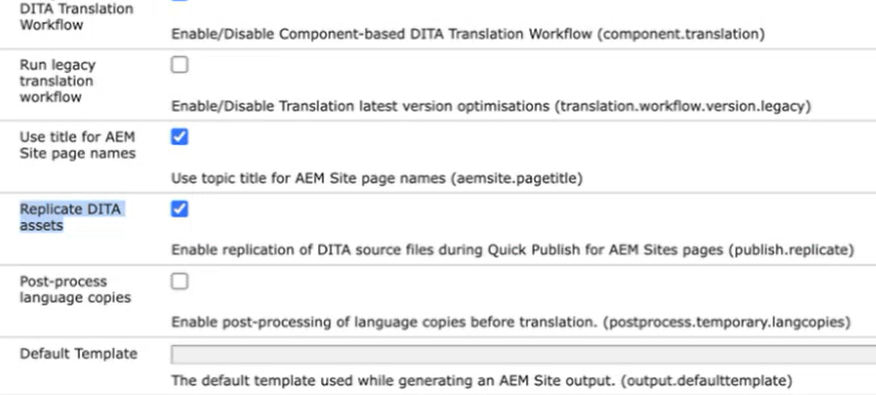

# DITA 에셋 복제 구성

자산 처리 기능을 구성하려면 다음 단계를 수행하십시오.

1. Adobe Experience Manager 웹 콘솔 구성 페이지를 엽니다.

   구성 페이지에 액세스하기 위한 기본 URL은 다음과 같습니다.

   ```http
   http://<server name>:<port>/system/console/configMgr
   ```

1. *com.adobe.fmdita.config.ConfigManager* 번들을 검색하고 선택합니다.

1. 요구 사항에 따라 `Replicate DITA assets` 설정을 구성하십시오. 이 설정은 기본적으로 활성화되어 있습니다.


   {width="350"}


1. **저장**&#x200B;을 선택합니다.
