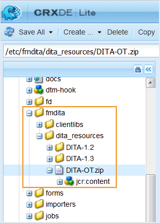

# 사용자 지정 DITA-OT 및 DITA 특수화 사용 {#id181GAJ0005Z}

DITA Open Toolkit \(DITA-OT\)는 DITA 맵 및 주제 컨텐츠를 처리하는 Java 기반 오픈 소스 도구 세트입니다. AEM Guides을 사용하면 사용자 지정 DITA-OT 플러그인을 쉽게 가져오고 사용할 수 있습니다. 가져온 후에는 사용자 지정 DITA-OT 플러그인을 사용하여 모든 형식의 출력을 생성하도록 AEM Guides을 구성할 수 있습니다. 출력을 생성할 때 DITA-OT 옵션을 선택하면 AEM Guides이 사용자 지정 DITA-OT 플러그인을 사용하여 필요한 출력을 생성합니다.

출력을 게시하는 동안 Ant 매개 변수를 처리하려는 경우 AEM Guides을 사용하면 쉽게 처리할 수 있습니다. 사용할 Ant 매개 변수를 지정하고 게시 프로세스에서 동일한 매개 변수를 처리할 수 있습니다.

>[!NOTE]
>
> AEM Guides은 DITA-OT 버전 3.3.2와 함께 제공됩니다. 그러나 AEM Guides은 DITA-OT 버전 1.7 이상을 지원합니다. 전체 DITA-OT 버전 목록은 [DITA-OT 버전](http://www.dita-ot.org/download)을 참조하십시오.

>[!TIP]
>
> 사용자 지정 DITA-OT 플러그인 사용에 대한 모범 사례를 보려면 모범 사례 안내서의 *DITA-OT 프로필 구성* 및 *사용자 지정 DITA-OT 사용* 섹션을 참조하십시오.

## 사용자 지정 DITA-OT 플러그인 사용 {#id181NH1020L7}

게시할 때 사용자 지정 DITA-OT 플러그인을 사용하는 방법에는 두 가지가 있습니다. 첫 번째 방법은 사용자 지정 DITA-OT 플러그인을 AEM 저장소에 업로드하는 것입니다. 다른 방법은 서버에 사용자 지정 DITA-OT 플러그인을 저장하고, 프로파일을 만들고, 프로파일에 사용자 지정 DITA-OT 플러그인의 위치를 제공하는 것입니다.

기본적으로 AEM Guides에는 콘텐츠 편집 및 게시에 사용할 기본 템플릿의 구성이 포함된 사전 구성된 프로필이 포함되어 있습니다. 문서 및 사용자 지정 DITA-OT 플러그인을 편집하여 콘텐츠를 게시하는 동안 사용할 사용자 지정 템플릿으로 사용자 지정 프로필을 만들 수 있습니다.

AEM Guides에서 사용할 수 있는 기본 DITA-OT 패키지에는 MathML 방정식 렌더링을 지원하지 않는 Apache FOP XSL-FO 프로세서가 함께 제공됩니다. 콘텐츠에서 MathML 방정식을 사용하는 경우 Apache FOP용 MathML 렌더링 엔진 플러그인을 통합했는지 또는 다른 XSL-FO 프로세서를 사용했는지 확인하십시오.

>[!IMPORTANT]
>
> AEM Guides을 버전 2.2에서 2.5.1 또는 2.6으로 업그레이드한 경우 구성 관리자를 통해 수행한 모든 변경 사항이 자동으로 선택되어 기본 프로필에 저장됩니다.

사용자 지정 DITA-OT 플러그인을 AEM 저장소에 업로드하려면 다음 단계를 수행하십시오.

1. AEM에 로그인하고 CRXDE Lite 모드를 엽니다.

1. `DITA-OT.ZIP` 파일을 다운로드합니다.

   `DITA-OT.ZIP` 파일의 위치는 `/libs/fmdita/dita_resources/DITA-OT.zip`입니다.

   

1. 서버에서 zip 파일의 압축을 풉니다.

1. DITA-OT 플러그인 통합자 메커니즘을 사용하여 새 버전의 DITA-OT를 사용자 지정 DITA-OT 플러그인과 통합합니다.

   >[!NOTE]
   >
   > 플러그인 ZIP 파일의 클래스 경로 구분 기호는 운영 체제에 따라 다릅니다. 즉, 서버가 Windows에서 호스팅되는 경우 클래스 경로 구분 기호는 Linux에서 사용되는 구분 기호와 다릅니다. 수동으로 플러그인을 통합하는 방법에 대한 자세한 내용은 DITA-OT 설명서의 *수동으로 플러그인 설치* 항목을 참조하십시오.

1. 같은 이름 \(`DITA-OT.ZIP`\)과 폴더 구조를 유지하면서 ZIP 파일을 다시 만듭니다.

1. 업데이트된 ZIP 파일을 다시 AEM 저장소에 업로드합니다.

   ZIP 파일을 업로드하기 전에 다음 사항을 확인하십시오.

   - Mac/Linux OS에서 통합자 \(사용자 정의 플러그인\ 설치)를 실행하여 파일 구분 기호 관련 문제를 방지합니다. Windows 및 Linux OS의 파일 구분 기호가 다르므로 Mac/Linux OS에 통합된 플러그인은 Windows 및 Linux 설치와 모두 호환됩니다.
   - `DITA-OT.ZIP` 파일에 관련된 모든 플러그인 및 파일이 있는 &quot;DITA-OT&quot;라는 폴더가 있는지 확인하십시오.
   - 만든 `DITA-OT.ZIP` 파일이 mimeType: &quot;nt:file&quot; \(AEM에 업로드할 때 ZIP 파일의 기본 유형에 해당됨)인지 확인하십시오. WebDAV 도구 또는 코드 배포를 사용하여 이 ZIP 파일을 AEM의 원하는 경로로 업로드합니다. \(이 ZIP은 AEM 컨텐츠 패키지가 아니라 아카이브 파일이므로 AEM 패키지 관리자를 사용하여 이 ZIP 파일을 배포하지 마십시오.\)
   >[!NOTE]
   >
   > 기본 DITA-OT 패키지를 덮어쓰지 않는 것이 좋습니다. 플러그 인이 들어 있는 사용자 지정 DITA-OT 패키지를 `apps` 폴더 아래의 다른 위치에 업로드해야 합니다.

1. 편집할 기본 DITA 프로파일을 열고 \(업데이트하지 않고\) 저장하여 변경 사항을 적용합니다.

새 프로파일을 만들고 서버에 저장된 사용자 지정 DITA-OT 플러그인을 사용하도록 구성하려면 다음 단계를 수행하십시오.

1. 서버에 사용자 지정 DITA-OT 플러그인을 저장합니다.

   >[!NOTE]
   >
   > 사용자 지정 DITA-OT 플러그인을 저장하는 폴더 구조는 `\*<parent-folder\>*\DITA-OT`이어야 합니다.

1. 맨 위에 있는 Adobe Experience Manager 링크를 클릭하고 **도구**&#x200B;를 선택합니다.

1. 도구 목록에서 **안내서**&#x200B;를 선택합니다.

1. **DITA 프로필** 타일을 클릭합니다.

   >[!NOTE]
   >
   > 기본 프로파일 정보가 프로파일 페이지에 표시됩니다. AEM Guides을 버전 2.2에서 2.5.1 또는 2.6으로 업그레이드한 경우 구성 관리자를 통해 수행한 모든 변경 사항이 자동으로 선택되어 기본 프로필에 저장됩니다.

1. 기본 프로파일을 편집하거나, 새 프로파일을 만들거나, 기본 프로파일에서 설정을 복제하여 새 프로파일을 만들 수 있습니다.

   >[!NOTE]
   >
   > 기본 프로파일을 업데이트할 수는 있지만 삭제할 수는 없습니다. 그러나 새로 만드는 모든 프로필은 편집하고 삭제할 수 있습니다.

1. 사용자 지정 DITA-OT 플러그인을 사용하도록 다음 속성을 구성합니다.

   | 속성 이름 | 설명 |
   |-------------|-----------|
   | **프로필 속성** |
   | 프로필 이름 | 이 프로필의 고유한 이름을 제공하십시오. |
   | 출력 재사용 | *\(선택 사항\)* 프로필이 기존 프로필을 기반으로 하는 경우 이 옵션을 선택합니다. 이 옵션을 선택하면 AEM Guides에서 DITA-OT 패키지의 내용을 다시 추출하지 않고 기존 DITA-OT 패키지를 다시 사용합니다. |
   | 프로필 추출 경로 | *\(선택 사항\)* DITA-OT가 디스크에 보관되는 경로를 지정합니다. 기본적으로 AEM Guides은 저장소의 DITA-OT 패키지를 번들로 제공하고 이 경로의 디스크에서 추출됩니다. **참고** 기존 시스템 변수 또는 속성을 사용하여 이 경로를 정의할 수 있습니다. 자세한 내용은 [DITA-OT 환경 변수](#id181NH0YN0AX) 속성에 대한 설명을 참조하십시오. |
   | 할당된 경로 | \(*선택 사항*\) 이 프로필을 적용할 수 있는 콘텐츠 저장소의 경로를 지정합니다. 여러 위치를 지정할 수 있습니다. |
   | **DITA-OT 속성** |
   | DITA-OT 시간 초과 | \(*선택 사항*\) AEM Guides이 DITA-OT 플러그인의 응답을 기다리는 시간 \(초)을 지정합니다. 지정된 시간 내에 응답이 수신되지 않으면 AEM Guides이 게시 작업을 종료하고 작업이 실패로 플래그가 지정됩니다. 또한 출력 생성 로그 파일에서 오류 로그를 사용할 수 있습니다.  기본값: 300초 \(5분\) |
   | DITA-OT PDF 인수 | PDF 출력을 생성하기 위해 사용자 지정 DITA-OT 플러그인에서 처리하는 명령줄 인수를 지정합니다. 모든 사용자 지정 DITA-OT 프로필에 대해 다음 명령줄 인수를 지정하십시오. `-lib plugins/org.dita.pdf2.fop/lib/` |
   | DITA-OT AEM 인수 | \(*선택 사항*\) AEM Site 출력을 생성하기 위해 사용자 지정 DITA-OT 플러그인에서 처리되는 사용자 지정 명령줄 인수를 지정합니다. |
   | DITA-OT 라이브러리 경로 | \(*선택 사항*\) DITA-OT 플러그인의 추가 라이브러리 경로를 지정합니다. |
   | DITA-OT 빌드 XML | \(*선택 사항*\) 사용자 지정된 DITA-OT 플러그인과 함께 번들로 제공되는 사용자 지정 Ant 빌드 스크립트의 경로를 지정합니다. 이 경로는 파일 시스템의 DITA-OT 디렉토리에 상대적입니다. |
   | DITA-OT Ant 스크립트 폴더 | \(선택 사항\) DITA-OT Ant 스크립트 폴더의 경로를 지정합니다. 이 경로는 파일 시스템의 DITA-OT 디렉토리에 상대적입니다. |
   | DITA-OT 환경 변수 | *\(선택 사항\)* DITA-OT 프로세스에 전달할 환경 변수를 지정합니다. 기본적으로 AEM Guides은 `ANT_OPTS`, `ANT_HOME`, `PATH` 및 `CLASSPATH`의 네 가지 변수를 추가합니다.   기존 시스템 환경 변수 또는 속성을 사용하여 새 환경 변수를 작성할 수 있습니다. 예를 들어 시스템에 `JAVA_HOME` 시스템 변수가 정의되어 있고 `JAVA_HOME`을(를) 사용하여 빌드된 `JAVA_BIN`이라는 새 환경 변수를 정의하려는 경우 `JAVA_BIN`의 정의를  (으)로 추가할 수 있습니다. `JAVA_BIN= ${JAVA_HOME}/bin`   **참고** Java 시스템 속성을 사용하여 환경 변수를 작성할 수도 있습니다. 예를 들어 AEM 시작 스크립트가 임시 디렉터리에 Java 시스템 속성 `java.io.tmpdir`을(를) 정의하는 경우 이 속성을 사용하여 새 변수를 정의할 수 있습니다. `${java.io.tmpdir}/fmdita/dita_ot`.   **중요** 기존 시스템 변수 또는 속성을 다시 사용하려면 `${}` 내에 묶어야 합니다. |
   | DITA-OT 출력 덮어쓰기 | *\(선택 사항\)* 이 옵션을 선택하면 로컬 시스템에서 사용할 수 있는 DITA-OT 패키지를 지정하여 DITA-OT를 사용하여 출력을 생성할 수 있습니다. 이 구성은 ConfigManager 활성화 시 설정됩니다.   AEM 서버에 저장된 DITA-OT 패키지의 경로를 지정하려면 이 옵션을 선택 취소합니다. |
   | AEM DITA-OT Zip 경로/로컬 DITA-OT 디렉토리 경로 | 덮어쓰기 DITA-OT 출력에서 선택한 내용에 따라 사용자 지정 DITA-OT.zip 파일이 저장되는 전체 경로를 지정합니다. AEM 저장소 또는 로컬 시스템의 경로일 수 있습니다. |
   | DITA-OT 플러그인 경로 | 사용자 지정 플러그인의 경로입니다. 이 플러그인은 기본 DITA-OT 패키지와 자동으로 통합됩니다. |
   | 카탈로그 통합 | \(*선택 사항*\) AEM 저장소에 있는 사용자 지정 DTD 및 XSD catalog.xml 파일의 경로입니다. DITA-OT 패키지에서 카탈로그가 누락된 경우에만 제공해야 합니다. 이러한 카탈로그는 플러그인으로서 기본 DITA-OT에 자동으로 통합됩니다. |
   | 시스템 ID 카탈로그 추가 | \(*선택 사항*\) 카탈로그에 누락된 공용 ID 항목이 있거나 DITA 파일에서 업로드된 서버 경로를 기준으로 한 시스템 ID만 사용하는 경우에만 이 옵션을 선택합니다. |
   | DITA-OT 임시 경로 | *\(선택 사항\)* 처리를 위해 DITA 파일을 복사할 임시 위치를 지정합니다. DITA-OT에서 파일을 처리하기 전에 이 임시 위치에 복사됩니다. 기본적으로 임시 저장소 위치는  입니다. **참고** 기존 시스템 변수 또는 속성을 사용하여 이 경로를 정의할 수 있습니다. 자세한 내용은 [DITA-OT 환경 변수](#id181NH0YN0AX) 속성에 대한 설명을 참조하십시오. |

   >[!NOTE]
   >
   >  AEM Guides 설치 관리자는 사용자 지정 DITA-OT 플러그인 파일의 경로를 지정하는 데 사용할 수 있는 두 개의 환경 변수를 만듭니다. 이러한 환경 변수는 파일 시스템의 DITA-OT 디렉토리 경로를 포함하는 DITAOT\_DIR과 파일 시스템의 DITA 맵 컨텐트를 추출하는 경로를 포함하는 DITAMAP\_DIR입니다.

1. **완료**&#x200B;를 클릭하여 프로필을 저장합니다.

>[!NOTE]
>
> 사용자 지정 DITA 프로필을 패키지로 내보내고 다른 AEM Guides 인스턴스에 업로드하여 시간을 절약할 수 있습니다. 자세한 내용은 [부록](appendix.md)을 참조하세요.

## DITA 특수화 통합 {#id211MB0E00XA}

DITA 특수화는 새 요소를 추가하거나 기존 요소를 제거하여 새 DITA 구조를 만드는 프로세스입니다. 새 DITA 요소를 만들려면 기존 DITA 요소를 기준으로 사용하고 작성 요구 사항에 따라 수정할 수 있습니다. 본질적으로 DITA 특수화를 사용하면 기존 DITA 아키텍처의 이점을 유지하면서 비즈니스 요구 사항을 충족하는 사용자 정의 정보 모델을 만들 수 있습니다.

프로파일 기능을 사용하여 사용자 정의 DITA 특수화 설정을 저장할 수 있습니다. 그런 다음 사용자 지정 DITA 콘텐츠를 작성 및 게시할 때 이러한 설정을 사용할 수 있습니다. AEM Guides에서는 사용자 지정 DTD/XSD에서 공용 ID와 시스템 ID를 사용할 수 있습니다.

>[!NOTE]
>
> AEM Guides 웹 편집기는 XSD를 지원하지 않습니다.

새 프로파일을 만들고 특수 DTD 및 XSD AEM Guides을 사용하도록 구성하려면 다음 단계를 수행하십시오.

1. 특수 DTD 및 XSD가 포함된 로컬 컴퓨터에 특수 폴더를 만듭니다.

1. `catalog.xml` 파일에 특수화 폴더에도 포함되어야 하는 DTD 세부 정보를 지정합니다.

   >[!NOTE]
   >
   > DITA 1.3의 경우 AEM 저장소의 DTD `catalog.xml` 파일에 대한 기본 위치는 `/libs/fmdita/dita_resources/DITA-1.3/dtd/catalog.xml`입니다.

1. `catalog.xml` 파일에서 특수화 폴더에도 포함되어야 하는 XSD 세부 정보를 지정하십시오.

   >[!NOTE]
   >
   > DITA 1.3의 경우 AEM 저장소의 XSD catalog.xml 파일에 대한 기본 위치는 `/libs/fmdita/dita_resources/DITA-1.3/xsd/catalog.xml`입니다.

1. 폴더를 다음 위치에 업로드합니다.

   `/apps/fmdita/dita_resources`

1. 맨 위에 있는 Adobe Experience Manager 링크를 클릭하고 **도구**&#x200B;를 선택합니다.

1. 도구 목록에서 **안내서**&#x200B;를 선택합니다.

1. **DITA 프로필** 타일을 클릭합니다.

   >[!NOTE]
   >
   > 기본 프로파일 정보가 프로파일 페이지에 표시됩니다. AEM Guides을 버전 2.2에서 2.5.1 또는 2.6으로 업그레이드한 경우 구성 관리자를 통해 수행한 모든 변경 사항이 자동으로 선택되어 기본 프로필에 저장됩니다.

1. 기본 프로파일을 편집하거나, 새 프로파일을 만들거나, 기본 프로파일에서 설정을 복제하여 새 프로파일을 만들 수 있습니다.

   >[!NOTE]
   >
   > 기본 프로파일은 삭제할 수 없습니다. 그러나 새로 만드는 모든 프로필은 편집하고 삭제할 수 있습니다.

1. **스키마** \> **카탈로그** 설정에서 AEM 저장소에 있는 사용자 지정 DTD 및 XSD `catalog.xml` 파일의 경로를 지정하십시오.

   >[!NOTE]
   >
   > 사용자 지정 스키마를 사용하는 경우 **카탈로그 통합** 옵션의 AEM 저장소에 있는 사용자 지정 DTD 및 XSD catalog.xml 파일의 경로를 정의해야 합니다.

1. **시스템 ID 카탈로그 추가** 옵션을 선택하십시오.

   >[!NOTE]
   >
   > 카탈로그에 누락된 공용 ID 항목이 있거나 DITA 파일이 업로드된 로컬 파일 경로를 기준으로 하는 시스템 ID만 사용하는 경우에만 이 옵션을 선택합니다.

   프로필 페이지의 다른 속성에 대한 자세한 내용은 [사용자 지정 DITA-OT 플러그인 사용](#id181NH1020L7) 섹션의 [6](#id17A9F0D075Z)단계에서 속성 표를 참조하십시오.

1. **완료**&#x200B;를 클릭하여 프로필을 저장합니다.

>[!NOTE]
>
> 사용자 지정 DITA 프로필을 패키지로 내보내고 다른 AEM Guides 인스턴스에 업로드하여 시간을 절약할 수 있습니다. 자세한 내용은 [Appendix.md](appendix.md)을(를) 참조하십시오.
