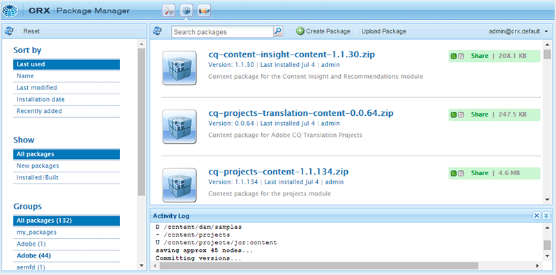

# 처음으로 AEM Guides 다운로드 및 설치 {#id213BCL00KEV}

컴퓨터에서 처음으로 AEM Guides을 다운로드하여 설치하려면 다음 단계를 수행하십시오.

>[!IMPORTANT]
>
> Livefyre와 AEM Guides을 함께 사용하려면 AEM Guides을 설치하기 전에 Livefyre 3.0 이전 버전을 설치해야 합니다. Livefyre 버전 3.0 이상을 사용 중인 경우 이러한 제한이 없습니다.

1. Adobe 소프트웨어 배포 포털에서 AEM Guides을 다운로드합니다.

1. AEM 인스턴스에 로그인하고 CRX 패키지 관리자로 이동합니다. 패키지 관리자에 액세스할 수 있는 기본 URL은 다음과 같습니다.

   ```http
   http://<server name>:<port>/crx/packmgr/index.jsp
   ```

   패키지 관리자는 로컬 AEM 설치에서 패키지를 관리합니다. 패키지 관리자 작업에 대한 자세한 내용은 AEM 설명서에서 [패키지 작업 방법](https://helpx.adobe.com/experience-manager/6-5/sites/administering/using/package-manager.html)을 참조하십시오.

   {width="650" align="left"}

1. AEM Guides 패키지를 업로드하려면 **패키지 업로드**&#x200B;를 클릭하세요.

1. 패키지 업로드 대화 상자에서 1단계에서 다운로드한 AEM Guides 파일로 이동하여 **확인**&#x200B;을 클릭합니다.

   패키지가 AEM 인스턴스에 업로드됩니다.

1. 패키지를 설치하려면 **설치**&#x200B;를 클릭합니다.

   {width="650" align="left"}

1. 패키지 설치 대화 상자에서 **설치**&#x200B;를 클릭합니다.

1. AEM Guides을 시작하려면 CRX 패키지 관리자의 왼쪽 상단 모서리에 있는 홈 단추 을(를) 클릭합니다.


>[!NOTE]
>
> 설치 시 AEM 서버의 모든 인스턴스에 설치 절차를 수행합니다.

**상위 항목:**[&#x200B;다운로드 및 설치](download-install.md)
