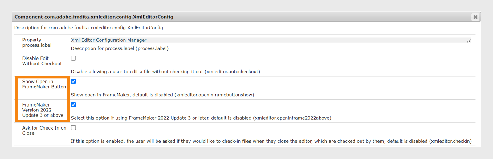

# 데스크탑 기반 XML 편집기 통합 {#id181GB01G0HS}

다양한 XML 편집기가 시판되고 있으며 이미 사용하고 있을 수도 있습니다. Adobe FrameMaker은 AEM 커넥터와 함께 제공되는 가장 강력한 XML 편집기 중 하나입니다. FrameMaker에서 AEM 커넥터를 사용하면 AEM 리포지토리와 쉽게 연결하고, 파일을 체크 아웃 및 체크 인하고, FrameMaker에서 직접 파일을 편집할 수 있습니다. 웹 편집기에서 FrameMaker을 실행하도록 AEM Guides을 구성할 수도 있습니다. 파일을 FrameMaker에서 열면 파일을 편집하고 AEM 저장소에 다시 체크 인할 수 있습니다.

## 웹 편집기의 FrameMaker에서 파일 편집 사용

FrameMaker 또는 다른 DITA 편집기를 사용하여 DITA 컨텐트를 만들고 업데이트할 수 있습니다. 그러나 조직에서 FrameMaker을 DITA 편집기로 사용하는 경우 AEM의 FrameMaker에서 직접 DITA 문서를 열 수 있는 옵션을 사용자에게 제공할 수 있습니다.

기본적으로 사용자는 AEM 도구 모음에 **FrameMaker에서 열기** 단추가 표시되지 않습니다. 다음 단계를 수행하여 AEM 도구 모음에 이 단추를 추가합니다.

1. Adobe Experience Manager 웹 콘솔 구성 페이지를 엽니다.

   구성 페이지에 액세스하기 위한 기본 URL은 다음과 같습니다.

   ```http
   http://<server name>:<port>/system/console/configMgr
   ```

1. **com.adobe.fmdita.xmleditor.config.XmlEditorConfig** 번들을 검색하고 클릭합니다.

   {width="550" align="left"}

1. **FrameMaker 단추에서 열기 표시** 옵션을 선택합니다.

1. **저장**&#x200B;을 클릭합니다.


**FrameMaker에서 열기 단추 표시** 옵션을 활성화하면 AEM 리포지토리에서 DITA 파일을 선택할 때 **FrameMaker에서 열기** 단추가 표시됩니다. 이 옵션이 *활성화되지 않음*&#x200B;인 경우 **FrameMaker에서 열기** 단추는 리포지토리에서 .fm 또는 .book 파일을 선택한 경우에만 표시됩니다.
