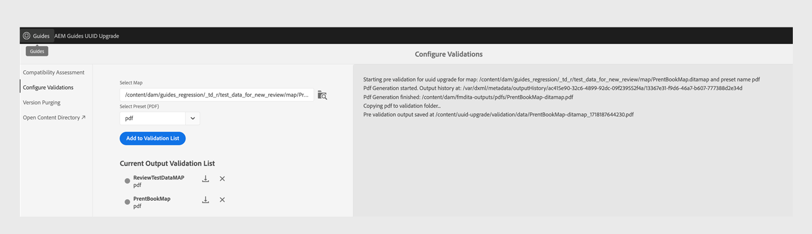
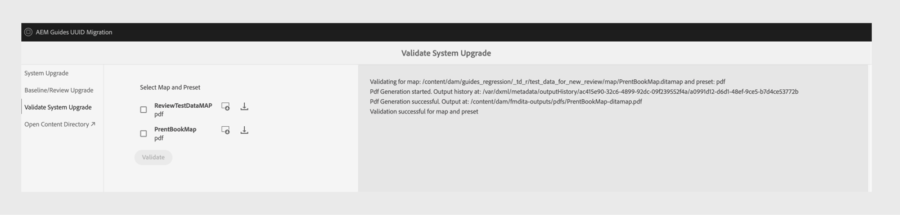

# 4.3.1 비 UUID에서 4.3.2 UUID로 콘텐츠 마이그레이션

다음 단계를 수행하여 UUID가 아닌 버전 4.3.1에서 UUID 버전 4.3.2로 콘텐츠를 마이그레이션합니다.

>[!IMPORTANT]
>
> * 마이그레이션 프로세스를 시작하기 전에 다음을 확인하십시오.
>
>   1. 모든 활성 검토를 닫았습니다.
>   1. 모든 번역 작업을 마감했습니다.
> * UUID 서버로 콘텐츠를 마이그레이션하기 전에 호환되는 AEM Guides 버전이 설치된 비 UUID 서버가 있는지 확인하십시오.
> * 4.3.1 이전 버전을 사용 중인 경우 버전 4.3.1로 업그레이드하십시오. 사용 허가된 버전의 제품에 해당하는 [업그레이드 지침](./upgrade-xml-documentation.md)을(를) 따르십시오.
> * 현재 4.3.1 이상 버전은 마이그레이션에 지원되지 않습니다.

## 패키지 설치

사용 중인 버전에 따라 Adobe 소프트웨어 배포 포털에서 필요한 패키지를 다운로드합니다.

1. **마이그레이션 사전**: [com.adobe.guides.pre-uuid-migration-1.2.27.zip](https://experience.adobe.com/#/downloads/content/software-distribution/en/aem.html?package=%2Fcontent%2Fsoftware-distribution%2Fen%2Fdetails.html%2Fcontent%2Fdam%2Faem%2Fpublic%2Faemdox%2Fother-packages%2Fuuid-migration%2F3-0%2Fcom.adobe.guides.pre-uuid-migration-1.2.27.zip)
1. **UUID 버전 4.3.2** 다운로드: [com.adobe.fmdita-6.5-uuid-4.3.2.1977.zip](https://experience.adobe.com/#/downloads/content/software-distribution/en/aem.html?package=%2Fcontent%2Fsoftware-distribution%2Fen%2Fdetails.html%2Fcontent%2Fdam%2Faem%2Fpublic%2Faemdox%2Fother-packages%2Fuuid-migration%2F3-0%2Fcom.adobe.fmdita-6.5-uuid-4.3.2.1977.zip)
1. **마이그레이션**: [com.adobe.guides.uuid-upgrade-1.2.110.zip](https://experience.adobe.com/#/downloads/content/software-distribution/en/aem.html?package=%2Fcontent%2Fsoftware-distribution%2Fen%2Fdetails.html%2Fcontent%2Fdam%2Faem%2Fpublic%2Faemdox%2Fother-packages%2Fuuid-migration%2F3-0%2Fcom.adobe.guides.uuid-upgrade-1.2.110.zip)

## 마이그레이션 사전 확인

UUID가 아닌 버전 4.3.1에서 다음 검사를 수행합니다.

1. 버전 4.3.1에서 마이그레이션 전 패키지 [com.adobe.guides.pre-uuid-migration-1.2.27.zip](https://experience.adobe.com/#/downloads/content/software-distribution/en/aem.html?package=%2Fcontent%2Fsoftware-distribution%2Fen%2Fdetails.html%2Fcontent%2Fdam%2Faem%2Fpublic%2Faemdox%2Fother-packages%2Fuuid-migration%2F3-0%2Fcom.adobe.guides.pre-uuid-migration-1.2.27.zip)을(를) 설치합니다.

   >[!NOTE]
   >
   >* 마이그레이션을 실행하려면 관리자 권한이 필요합니다.
   >* 마이그레이션을 계속하기 전에 오류가 있는 파일을 수정하는 것이 좋습니다.

1. 시스템에 100,000개 이상의 DITA 파일이 있는 경우 스크립트가 작동하도록 쿼리 제한 구성을 업데이트합니다.

   * `/system/console/configMgr and increase both the configs to more than number of assets - queryLimitInMemory` 및 `queryLimitReads under org.apache.jackrabbit.oak.query.QueryEngineSettingsService`(으)로 이동

1. `http://<server-name>/libs/fmdita/clientlibs/xmleditor_uuid_upgrade/page.html`을(를) 시작합니다.
1. 왼쪽 패널에서 **호환성 평가**&#x200B;를 선택하고 모든 자산의 `/content/dam` 폴더 경로를 찾습니다.
1. 다음 정보를 나열하려면 호환성을 확인하십시오.
   * 총 파일 수
   * 예상 마이그레이션 시간
   * 오류가 발생한 파일 수
   * GUID 파일 이름을 가진 파일

   

1. 오류가 표시되면 로그를 분석하여 해당 오류를 수정합니다. 오류를 수정한 후 호환성 매트릭스를 다시 실행할 수 있습니다.

1. 왼쪽 패널에서 **유효성 검사 구성**&#x200B;을 선택합니다. 그런 다음 맵의 **맵을 선택**&#x200B;하고 **사전 설정을 선택**&#x200B;하여 구성하십시오. 현재 출력 유효성 검사 목록에는 마이그레이션 전에 존재하는 출력 파일이 표시되며, 나중에 마이그레이션 후에 생성된 출력 파일에 대해 유효성 검사를 수행할 수 있습니다.

   여러 개의 큰 DITA 맵을 선택하면 모든 콘텐츠가 문제 없이 성공적으로 마이그레이션되었는지 확인할 수 있습니다. 기준선이 있는 사전 설정을 선택하면 기준선과 버전도 성공적으로 마이그레이션됩니다.

   

1. (선택 사항) 콘텐츠에 대해 버전 지우기를 수행하여 불필요한 버전을 제거하고 마이그레이션 프로세스를 가속화합니다. 버전 삭제를 수행하려면 마이그레이션 화면에서 **버전 제거** 옵션을 선택하고 URL `http://<server- name>/libs/fmdita/clientlibs/xmleditor_uuid_upgrade/page.html`을(를) 사용하여 사용자 인터페이스로 이동합니다.
   >[!NOTE]
   >
   >이 유틸리티는 기준선 또는 검토에 사용된 버전을 제거하지 않으며 레이블이 없습니다.

자세한 내용은 [이전 버전 제거](../install-guide/version-management.md#purge-older-versions-of-dita-files)를 참조하십시오.

## 마이그레이션 사전 요구 사항

1. 작성자 인스턴스에서만 UUID 마이그레이션을 실행합니다.
1. 다음 인프라 준비 상태를 확인합니다.
   * 작성자 인스턴스는 빠른 처리와 벌크 활동에 필요한 추가 메모리를 지원하기 위해 CPU 및 메모리 측면에서 확장되었습니다. 예를 들어 현재 할당된 CPU 및 메모리가 8개의 vCPU와 24GB 힙인 경우 이 작업에 두 배의 크기를 사용합니다.
   * 전체 디스크 공간 및 임시 디스크 공간 `(crx-quickstart directory)`에 이미 사용된 버퍼 수의 10배가 있어야 합니다. 마이그레이션을 완료하면 압축을 실행하여 대부분의 디스크 공간을 다시 확보할 수 있습니다.
   * 이 활동을 시작하기 전에 **오프라인 Tar 압축**&#x200B;을(를) 실행하십시오.
   * 이 마이그레이션이 진행되는 동안 색인화나 시스템 유지 관리가 계획되어 있지 않은지 확인하십시오.

1. 지원되는 릴리스의 UUID 버전을 UUID가 아닌 버전에 설치합니다. 예를 들어 4.3.1 비 UUID 빌드를 사용하는 경우 UUID 버전 4.3.2 [com.adobe.fmdita-6.5-uuid-4.3.2.1977.zip](https://experience.adobe.com/#/downloads/content/software-distribution/en/aem.html?package=%2Fcontent%2Fsoftware-distribution%2Fen%2Fdetails.html%2Fcontent%2Fdam%2Faem%2Fpublic%2Faemdox%2Fother-packages%2Fuuid-migration%2F3-0%2Fcom.adobe.fmdita-6.5-uuid-4.3.2.1977.zip))을 설치하고 마이그레이션을 실행해야 합니다.

1. uuid 마이그레이션 업그레이드 패키지 [com.adobe.guides.uuid-upgrade-1.2.110.zip](https://experience.adobe.com/#/downloads/content/software-distribution/en/aem.html?package=%2Fcontent%2Fsoftware-distribution%2Fen%2Fdetails.html%2Fcontent%2Fdam%2Faem%2Fpublic%2Faemdox%2Fother-packages%2Fuuid-migration%2F3-0%2Fcom.adobe.guides.uuid-upgrade-1.2.110.zip)을(를) 설치합니다.
1. URL을 사용하여 `http://<server-name>/libs/cq/workflow/content/console.html` 워크플로에 대한 런처를 사용하지 않도록 설정하십시오.

   * DAM 자산 업데이트 워크플로우
   * DAM 메타데이터 원본에 쓰기 워크플로우

   >[!NOTE]
   >
   >`content/dam` 내의 모든 경로에서 실행되는 모든 워크플로우 시작 관리자를 비활성화하는 것이 좋습니다.

1. 제안된 변경 사항에 따라 다음 구성을 업데이트합니다.

   | 구성 | 속성 | 값 |
   |---|---|---|
   | `com.adobe.fmdita.config.ConfigManager` | 사후 처리 워크플로 런처 활성화 | 비활성화 |
   | `com.adobe.fmdita.config.ConfigManager` | uuid. 정규 표현식 | `^GUID-(?<id>.*)` |
   | `com.adobe.fmdita.postprocess.version.PostProcessVersionObservation` | 버전 사후 처리 활성화 | 비활성화 |
   | 일별 CQ 태깅 서비스 | 유효성 검사 활성화(validation.enabled) | 비활성화 |

1. 다음에 대한 별도의 로거 추가:
   * `com.adobe.fmdita.uuid`
   * `com.adobe.guides.uuid`

1. (이전에 수행하지 않은 경우) 시스템에 100,000개 이상의 DITA 파일이 있는 경우 `queryLimitReads`의 `org.apache.jackrabbit.oak.query.QueryEngineSettingsService`을(를) 더 큰 값(존재하는 에셋 수보다 큰 값(예: 200,000))으로 업데이트합니다.

   | PID | 속성 키 | 속성 값 |
   |---|---|---|
   | org.apache.jackrabbit.oak.query.QueryEngineSettingsService | queryLimitReads | 값: 200000   기본값: 100000 |

## 마이그레이션

1. `http://<server-name>/libs/fmdita/clientlibs/xmleditor_uuid_upgrade/page.html`을(를) 시작합니다.

   
   >[!NOTE]
   >
   > &quot;DITA 자산 백업 사용&quot;을 선택하면 임시 백업 파일이 `/content/uuid-upgrade`에 저장되고 파일 마이그레이션이 완료되면 DITA 파일 백업이 삭제됩니다.

1. 마이그레이션을 실행하려면 왼쪽 패널에서 **시스템 업그레이드**&#x200B;를 선택하십시오. 시스템이 내부적으로 일괄 처리를 최적으로 처리하므로 모든 데이터를 한 번에 마이그레이션하는 것이 좋습니다. DITA 에셋이 아니고 DITA 에셋에서 사용되지 않는 파일만 마이그레이션을 위해 건너뛸 수 있습니다.

1. (선택 사항) 마이그레이션을 건너뛸 폴더를 선택합니다. 이 옵션을 사용하여 나중에 이러한 폴더를 마이그레이션하거나 마이그레이션을 건너뜁니다. 이러한 폴더에 DITA 자산이 없고 DITA 자산이 참조되지 않았는지(그리고 향후에는 참조되지 않는지) 확인합니다. 예: `content/dam/projects`

1. 마이그레이션 전에 자산 백업을 만들려면 *DITA 자산 백업 사용*&#x200B;을 선택하십시오. 이 백업은 파일을 마이그레이션하는 동안 오류가 발생하는 경우 롤백하는 데 사용됩니다. 마이그레이션이 성공하면 백업이 삭제됩니다. 그러나 이렇게 하면 마이그레이션 프로세스가 느려집니다.

1. 마이그레이션을 시작합니다.
   >[!NOTE]
   >
   > 전체 로그를 다운로드하고 오류가 있는지 확인합니다. 오류 또는 예외가 발견되면 *계속 진행하지 마십시오* 먼저 오류를 수정하십시오. 일반적인 오류는 이 문서의 끝에 나열되어 있습니다.

1. 마이그레이션이 완료되면 보고서를 다운로드할 수 있으며 전체 로그를 다운로드할 수도 있습니다.

1. 마이그레이션이 실행되는 동안 **보고서 다운로드**&#x200B;를 선택하여 폴더의 모든 파일이 올바르게 업그레이드되었는지 여부와 해당 폴더에만 모든 기능이 작동하는지 확인합니다.

   >[!NOTE]
   >
   > 콘텐츠 마이그레이션은 폴더 수준, 전체 `/content/dam` 또는 동일한 폴더에서 실행할 수 있습니다(마이그레이션 다시 실행).

   또한 DITA 콘텐츠에 사용한 이미지 및 그래픽과 같은 모든 미디어 에셋에 대해 콘텐츠 마이그레이션이 수행되었는지 확인해야 합니다.

1. 모든 파일이 마이그레이션되면 왼쪽 패널에서 **기준선/검토 업그레이드**&#x200B;를 선택하여 기준선을 마이그레이션하고 폴더 수준에서 검토하십시오.

>[!NOTE]
>
>시스템을 다시 시작하거나 마이그레이션이 중단되면 이전과 동일한 매개 변수로 다시 실행할 때 스크립트가 다시 시작됩니다. 종료로 인해 문제가 발생하면 고객 지원 팀에 문의하십시오.

## 각 단계의 보고서 분석

**단계: 시스템 업그레이드**

| 프로세스 완료 후 요약 | 어떻게 해석합니까? | 작업 |
|---|---|---|
| 총 파일 수: 345997 | 지정된 폴더 집합에서 처리된 총 파일 수입니다. | NA |
| 성공적으로 업그레이드된 파일 수: 344516 | UUID로 성공적으로 마이그레이션된 파일 수입니다. | NA |
| 오류로 업그레이드된 파일 수: 29 | 이러한 파일에서 오류가 발생했으며 이전 마이그레이션 단계에서 보고된 오류와 동일해야 합니다. | NA |
| 건너뛴 파일 수: 1452 | DAM 저장소의 일부 파일에 하위 자산이 있을 수 있으며 이러한 하위 자산은 UUID 마이그레이션에 적합하지 않으므로 건너뜁니다. | NA |
| 업그레이드하지 못한 파일 수: 0 | 카운트가 0이 아니면 모든 문제에 대해 로그를 분석해야 합니다. | 예외를 확인합니다. 오류를 수정하고 마이그레이션을 다시 실행해야 할 수 있습니다. |
| 총 소요 시간: 2:40:06.157 |  |  |

**단계: 기준선 업그레이드**

| 프로세스 완료 후 요약 | 어떻게 해석합니까? | 작업 |
|---|---|---|
| 총 파일 수: 4833 | 기준선이 1개 이상인 DITA 맵 수. |  |
| 성공적으로 업그레이드된 파일 수: 4705 | 모든 기준선을 사용하여 성공적으로 업그레이드된 DITA 맵 수입니다. |  |
| 오류가 발생하여 업그레이드된 파일 수: 0 | 기준선이 업그레이드되지 않은 DITA 맵 수입니다. |  |
| 건너뛴 파일 수: 1647 | 기준선이 없는 DITA 맵 수입니다. |  |
| 업그레이드하지 못한 파일 수: 128 | 유효하지 않은(비어 있는) 기준선 개체의 수가 보고서(Excel)에 나열됩니다. | `baselineObj not found on` 이외의 오류가 있는지 확인 |

## 마이그레이션 후

1. 마이그레이션이 완료되면 왼쪽 패널에서 **시스템 업그레이드 유효성 검사**&#x200B;를 선택하고 마이그레이션 전후에 출력 파일의 유효성을 검사하여 마이그레이션이 성공적으로 이루어지도록 하십시오.

   

1. 서버를 성공적으로 마이그레이션한 후 다음 워크플로 및 구성(마이그레이션 중에 비활성화되었던 다른 모든 워크플로 포함)을 활성화하여 서버에서 계속 작업할 수 있습니다.

   * DAM 자산 업데이트 워크플로우
   * DAM 메타데이터 워크플로우

   >[!NOTE]
   >
   >마이그레이션하기 전에 `content/dam` 내의 모든 경로에서 실행 중인 모든 워크플로우 시작 프로그램이 이상적입니다.

1. 다음 구성을 활성화합니다.

   | 구성 | 속성 | 값 |
   |---|---|---|
   | `com.adobe.fmdita.config.ConfigManager` | *사후 처리 워크플로 시작 사용* | 활성화 |
   | `com.adobe.fmdita.postprocess.version.PostProcessVersionObservation` | *버전 사후 처리 사용* | 활성화 |
   | 일별 CQ 태깅 서비스 | *유효성 검사 사용(validation.enabled)* | 활성화 |

1. 마이그레이션 후 검토할 Assets 속성:

   | 구성 | 속성 | 비UUID의 사전 마이그레이션 값 | UUID에서 마이그레이션 후 값 |
   |---|---|---|---|
   | `com.adobe.fmdita.config.ConfigManager` | **AEM 사이트 페이지 이름에 제목 사용** | False(기본값) | 참 |

   >[!NOTE]
   >
   > 마이그레이션 전에 **내의** AEM 사이트 페이지 이름에 제목 사용`com.adobe.fmdita.config.ConfigManager` 속성이 *False*(으)로 설정된 경우 마이그레이션 후에 이 속성을 업데이트해야 합니다.

1. 유효성 검사가 완료되면 압축을 실행하여 대부분의 디스크 공간을 회수할 수 있습니다(`https://experienceleague.adobe.com/docs/experience-manager-65/deploying/deploying/revision-cleanup.html?lang=en` 참조).

