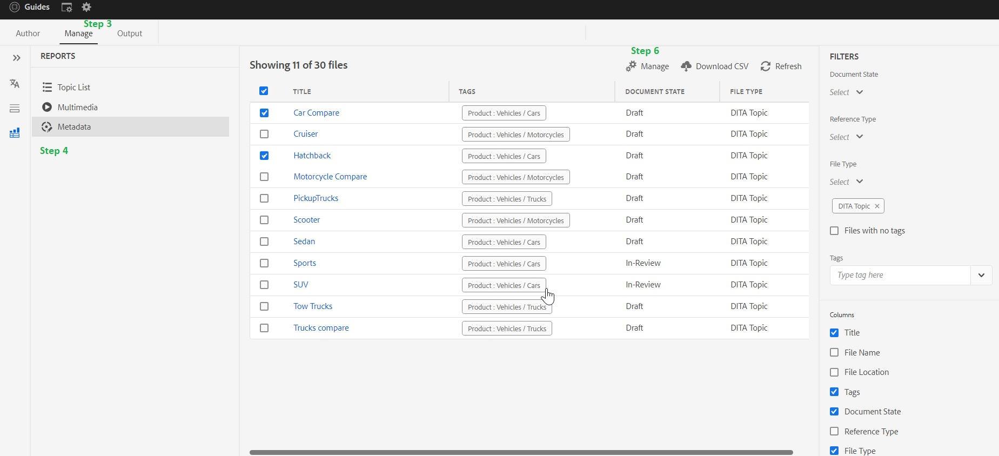

# DITA 콘텐츠의 태그를 추가 , 제거 및 관리하는 방법

태그는 콘텐츠를 분류하는 데 유용합니다. 콘텐츠에 적절한 태그가 지정되는 경우 디태깅에서 정확한 주제를 찾는 데 도움이 될 수 있으며 최종 사용자는 게시된 출력에서 적절한 콘텐츠를 보다 빠르게 찾을 수 있습니다

> **_참고:_**  다음 문서는 AEM Guides 빌드 4.2(온-프레미스)/2023년 2월(클라우드 버전 ) 이상 버전에 대한 것입니다

## 태그 만들기

태깅은 기본 AEM 기능이며 AEM 관리자가 이러한 태그를 처음 만들고 구성하는 데 도움을 줄 수 있습니다.

## DITA 콘텐츠의 태그 추가, 제거 및 관리

**AEM cq에서 만든 모든 태그: DITA 콘텐츠에 대해 태그를 추가, 제거 및 관리할 수 있습니다**

태그를 DITA 콘텐츠에 추가하는 방법은 다양하지만, 이 문서는 AEM Guides 웹 편집기 UI에 중점을 둡니다.

### 단계:

1. 안내서 UI의 저장소 보기로 이동
2. ditamap을 두 번 클릭하고 맵 보기에서 열기
3. 관리 탭으로 이동
4. 관리 탭에서 메타데이터로 이동 옵션
5. 모든 직접 및 간접 Ditamap 파일이 여기에 로드됩니다.
6. 하나 이상의 파일을 선택하고 &#39;관리&#39; 아이콘을 클릭합니다. 여기에서 선택한 파일에 태그를 추가할 수 있습니다.
선택한 파일에서 일반적인 기존 태그를 제거할 수도 있습니다.

## 문제 해결 및 FAQ

### 관리->메타데이터의 목록이 비어 있거나 완료되지 않았습니다.

목록이 비어 있거나 불완전한 경우 Ditamap에서 색인화를 실행해야 할 수 있습니다. [업그레이드 지침(콘텐츠 색인화)](/help/product-guide/install-guide/upgrade-xml-documentation.md#steps-to-index-the-existing-content-to-use-the-new-find-and-replace%3A)

### 사용자 지정 메타데이터가 목록에 표시되지 않음

`Only Tags present in cq:tags can be managed from here and custom metadata is not supported`

## 기타 유용한 리소스

- [맵 대시보드를 사용한 벌크 태그 지정(자산 UI)](/help/product-guide/user-guide/map-editor-bulk-tagging.md)
- [웹 편집기의 Ditamap 보고서](/help/product-guide/user-guide/reports-web-editor.md)
- [AEM의 태그 지정](https://experienceleague.adobe.com/docs/experience-manager-learn/assets/configuring/tagging.html?lang=en)

**기타 문의 사항은 해당 CSM에 문의하십시오**
