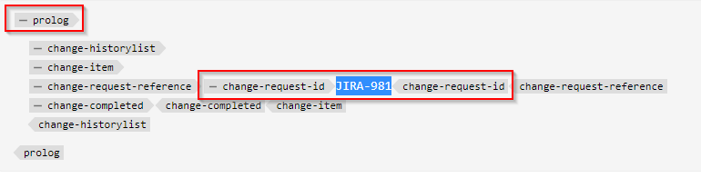

# 웨비저 도구 모음에 실행 가능한 새 사용자 지정 단추 추가

이 문서에서는 웨비저 도구 모음에 새 사용자 지정 단추를 추가하고 javascript를 호출하여 원하는 사용자 지정 작업을 수행하는 방법에 대해 알아봅니다.

웨비터기에 실행 가능한 버튼을 추가하는 단계는 다음과 같습니다.
- 필요한 위치에서 *ui_config.json*&#x200B;에 단추 추가
- 사용자가 단추를 클릭할 때 작업을 수행할 수 있도록 웹 편집기에서 단추 클릭 시 이벤트를 등록합니다


## 예를 들어 구현

작성자가 주제 프롤로그 섹션에 jira 참조를 추가하려는 예를 통해 이를 이해하겠습니다. jira 참조 ID가 포함된 프롤로그 섹션은 다음과 같을 수 있습니다.



JIRA ID가 포함된 &quot;change-request-id&quot; 요소는 API에서 검색해야 합니다(예: 애플리케이션에서 설명하는 특정 JIRA 쿼리에 따라 검색). 사용자가 프롤로그 섹션을 작성할 때 버튼을 클릭하고 웹 편집기 도구 모음에서 jira 참조 id를 삽입할 수 있어야 합니다.


그리고 사용자가 버튼을 클릭하면 가능한 옵션을 가져오고 사용자가 원하는 JIRA ID를 선택할 수 있는 대화 상자가 표시됩니다.


그런 다음 &quot;change-request-id&quot;를 프롤로그에 추가해야 합니다.


## 구현


### *ui_config.json*&#x200B;에서 구성하여 웨비터리에 단추를 추가합니다.

폴더 프로필을 사용하여 &quot;XML 편집기 구성&quot; 탭에서 *ui_config.json*&#x200B;을(를) 확인하고 버튼 구성 JSON을 &quot;도구 모음&quot; 그룹의 원하는 섹션에 추가하십시오

```
{
    "on-click":"insertJIRARef",
    "icon":"linkCheck",
    "variant":"quiet",
    "type":"button",
    "title":"Insert JIRA Reference"
}
```

[이 링크를 사용하여 폴더 프로필 및 ui_config.json 구성에 대해 자세히 알아보세요](https://experienceleague.adobe.com/docs/experience-manager-guides-learn/videos/advanced-user-guide/editor-configuration.html?lang=en)


### 새 단추에 대한 클릭 이벤트를 처리합니다.

    참고: 아래에 언급된 단계는 이 게시물에 첨부된 패키지로 사용할 수 있습니다


- 폴더 프로필을 저장한 후 프로젝트 디렉터리(*/apps*에 있을 수 있음) 아래에 &quot;cq:ClientLibraryFolder&quot;를 만들고 아래 스크린샷과 같이 속성을 추가합니다.
  

```
This example uses "coralui3" library to show a dialog as it is used in the Javascript sample we presented.
You may use different library of your choice.
```

- 이 클라이언트 라이브러리 폴더에서 아래에 설명된 대로 두 개의 파일을 만듭니다.
   - *overrides.js*: &quot;insertJIRARef&quot;에 대한 클릭 이벤트를 처리하는 javascript 코드가 있습니다(이 javascript 콘텐츠를 가져오려면 첨부된 패키지 사용).
   - *js.txt*: 이 javascript를 사용하려면 &quot;overrides.js&quot;가 포함됩니다.

- 변경 사항을 저장하면 테스트할 준비가 되었습니다.


### 테스트

- 웹 편집기 열기
- 사용자 환경 설정에서 사용자 지정 *ui_config.json*&#x200B;을(를) 추가한 폴더 프로필을 선택합니다. 글로벌 프로필에 추가한 경우 이미 사용하고 있을 수 있습니다.
- 항목을 열면 도구 모음에 &quot;Jira 참조 삽입&quot; 버튼이 새로 표시됩니다.
- 그런 다음 아래 주제에 프롤로그 섹션을 추가하고 프롤로그 요소 &quot;change-request-reference&quot; 내에 있는 &quot;Jira 참조 삽입&quot; 버튼을 클릭해 보십시오.

```
<prolog>
    <change-historylist>
        <change-item>
            <change-request-reference>
            </change-request-reference>
            <change-completed></change-completed>
            <change-summary></change-summary>
        </change-item>
    </change-historylist>
</prolog>
```

아래 스크린샷을 참조하여 어떻게 표시되는지 확인하십시오.


### 첨부

- 도구 모음 단추 작업에 Javascript 코드가 있는 웨비저 클라이언트 라이브러리를 설치하는 샘플 clientlibs 패키지: [이 링크를 사용하여 다운로드](../../../assets/authoring/webeditor-addbuttonontoolbar-insertjira-clientlib.zip)
- 폴더 프로필에 업로드할 수 있는 샘플 *ui_config.json*: [샘플 ui_config.json 다운로드](../../../assets/authoring/sample_ui_config_Guides4.2-InsertJiraReference.json)

```
Please note this is compatible to AEM 6.5 and AEM Guides version 4.2.
If you are using a different version please add the toolbar button to the ui_config.json manually.
```
