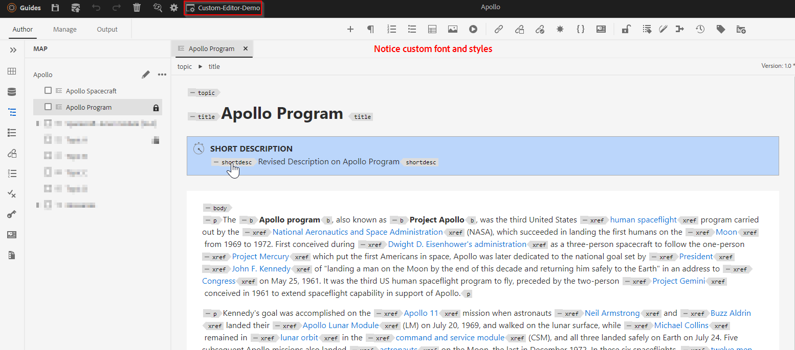

# Guides webeditor에 사용자 정의 스타일 추가

이 문서에서는 웨비터 기본 모양과 느낌을 변경하기 위해 사용자 정의 스타일을 추가하는 방법에 대해 알아봅니다.

여기에는 다음 단계가 포함됩니다.
- 폴더 프로필 XML 편집기 구성을 통해 맞춤형 스타일 추가
- 웨비터서에서 해당 폴더 프로필을 선택하고 변경 내용 테스트


## 예를 들어 구현

간단한 설명과 제목을 편집기의 스타일 측면과 함께 별도의 블록으로 표시하는 예를 들어 보겠습니다.




## 구현


### 폴더 프로필에 사용자 지정 CSS 추가

폴더 프로필을 사용하여 다음을 확인합니다. *css_layout.css* &quot;XML 편집기 구성&quot; 탭에서 사용자 지정 스타일이 있는 CSS를 추가합니다.

[이 링크를 사용하여 폴더 프로필 및 CSS 템플릿 레이아웃 구성에 대해 자세히 알아보십시오](https://experienceleague.adobe.com/docs/experience-manager-guides-learn/videos/advanced-user-guide/editor-configuration.html?lang=en#customize-the-css-template-layout)

다음 명령을 사용하여 웨비터에서의 위 스타일을 설정하십시오.
- 사용 [css_layout.css](../../../assets/authoring/webeditor-customstyles-css_layout.css) 원하는 폴더 프로필에 업로드합니다
- 첨부된 패키지 설치 [webeditor-styles-resources.zip](../../../assets/authoring/webeditor-styles-resources.zip) AEM 패키지 관리자를 사용하여 위의 CSS 파일에 사용된 리소스 설치

```
This will install the resources at path "/content/dam/resources" which will include sub-folders "fonts" and "images"
```


### 테스트

- 웹 편집기 열기
- 사용자 환경 설정에서 사용자 정의 스타일을 추가한 폴더 프로필을 선택합니다. 글로벌 프로필에 추가한 경우 이미 사용하고 있을 수 있습니다.
- 항목을 열면 편집 영역에 사용자 지정 UI가 있어야 합니다

```
Please note this is compatible to AEM Guides version 4.2 and AEM Guides cloud version 2303 (March)
```


## 참조

또한 위에서 다룬 웨비터 구성 및 맞춤화에 대한 전문가 세션에 관심이 있을 수 있습니다 [웨비저 전문가 세션](https://experienceleague.adobe.com/docs/experience-manager-guides-learn/tutorials/knowledge-base/expert-session/webbased-authoring-jan2023.html?lang=en)
