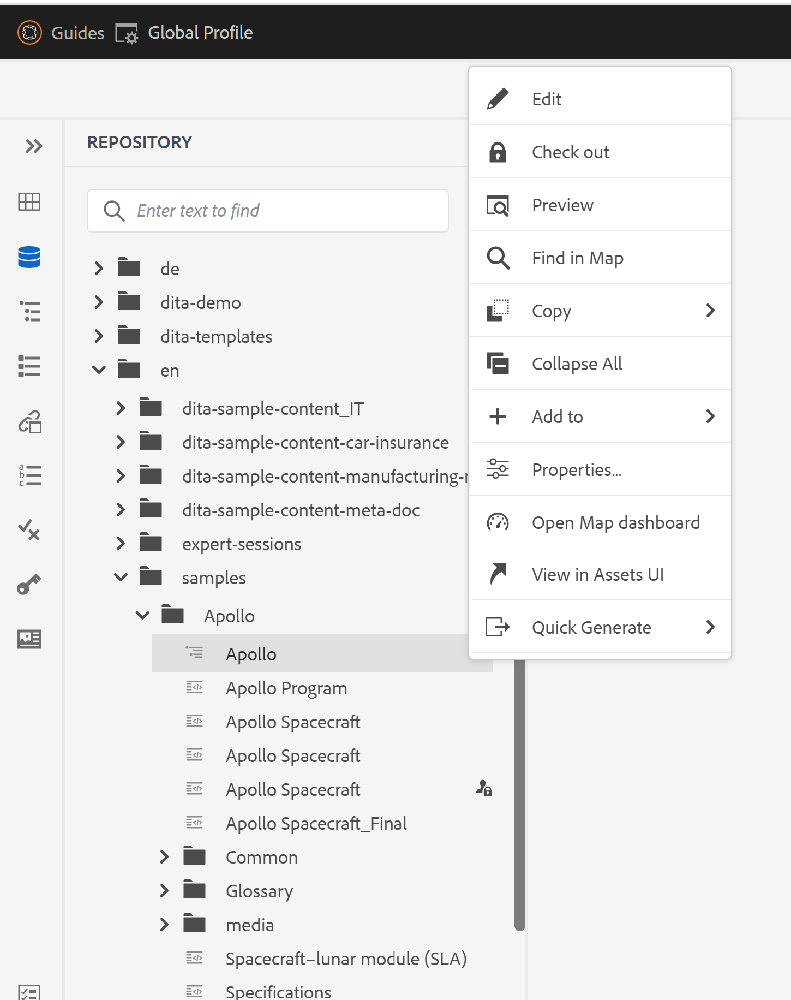

# 웹 편집기의 파일 상황에 맞는 메뉴에서 &#39;삭제&#39; 옵션 제거

이 문서에서는 특정 사용자 또는 그룹을 위해 AEM Guides 웹 편집기의 파일 컨텍스트 메뉴에서 &#39;삭제&#39; 옵션을 숨기는 방법에 대해 알아봅니다. 파일 컨텍스트 메뉴 옵션의 기타 사용자 지정에 대해서는 Guides Extension Framework 를 확인하십시오. 자세한 내용은 [여기](https://github.com/adobe/guides-extension/tree/main).

아래 코드 조각에서 볼 수 있듯이 파일 컨텍스트 메뉴에는 이 특정 사용자에게 사용할 수 있는 &#39;삭제&#39; 옵션이 있습니다.


이제 이 사용자에 대한 &#39;삭제&#39; 옵션을 숨길 수 있는 방법을 살펴보겠습니다.

## 구현 단계:

- AEM 홈 페이지에서 도구 > 보안 > 권한으로 이동합니다.
- 검색 상자에서 그룹 또는 사용자를 선택합니다.
- 오른쪽 상단에서 &#39;ACE 추가&#39;를 클릭합니다.
- 폴더 경로를 선택합니다.
- 권한 &quot;jcr:removeChildNodes&quot; 및 &quot;jcr:removeNode&quot;를 포함합니다.
- &#39;권한 유형&#39;을 &#39;거부&#39;로 선택하고 아래와 같이 &#39;추가&#39;를 클릭합니다.


### 테스트

- ACE가 추가된 사용자로 AEM에 로그인합니다.
- 웹 편집기를 엽니다.
- 저장소 보기로 이동하여 ACE가 추가된 폴더를 선택합니다.
- 파일 컨텍스트 메뉴를 엽니다.
- &#39;삭제&#39; 옵션은 컨텍스트 메뉴에 나타나지 않습니다.

파일 컨텍스트 메뉴는 이제 다음과 같이 표시됩니다.



```
Please note that these steps would also remove 'move' and 'rename' options from the Web Editor as they are also tied to delete process at the backend.
```
