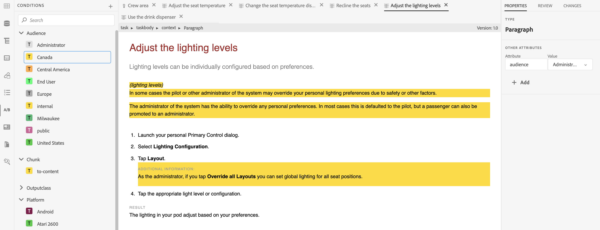

# 조건부 콘텐츠 작업

**사용 사례**

* 작성자는 콘텐츠에 대한 조건을 설정하여 콘텐츠에 표시되는지 여부를 제어할 수 있습니다.

* 작성자는 게시할 때 다른 조건을 표시하거나 숨길 수 있습니다.

* 예를 들어 작성자는 콘텐츠에 버전 1.0 및 버전 2.0으로 속성을 추가하고, 조건을 사용하여 릴리스 1.0의 버전 1.0을 포함하고 버전 2.0을 제외할 수 있습니다.

**1단계**

[!UICONTROL 폴더 프로필]에서 설명서와 관련된 조건을 정의합니다.
설치 및 구성 가이드의 [69페이지](https://helpx.adobe.com/content/dam/help/en/xml-documentation-solution/4-2/Adobe-Experience-Manager-Guides_Installation-Configuration-Guide_EN.pdf)에서 **전역 또는 폴더 수준 프로필에 대한 조건부 특성 구성** 섹션을 참조하십시오.

**2단계**

XML 편집기의 **사용자 환경 설정**&#x200B;에서 1단계에 정의된 **[!UICONTROL 폴더 프로필]**을 선택하십시오.
사용 안내서 [41페이지](https://helpx.adobe.com/content/dam/help/en/xml-documentation-solution/4-2/Adobe-Experience-Manager-Guides_User-Guide_EN.pdf)의 **사용자 환경 설정** 섹션을 참조하세요.

**3단계**

조건을 사용하여 콘텐츠 섹션을 조건화합니다.
사용 안내서 [90페이지](https://helpx.adobe.com/content/dam/help/en/xml-documentation-solution/4-2/Adobe-Experience-Manager-Guides_User-Guide_EN.pdf)의 **조건** 섹션을 참조하세요.

**4단계**

맵 수준에서 조건 사전 설정을 정의하여 출력에서 활성화할 조건을 선택합니다.
사용 안내서 [249페이지](https://helpx.adobe.com/content/dam/help/en/xml-documentation-solution/4-2/Adobe-Experience-Manager-Guides_User-Guide_EN.pdf)의 **조건 사전 설정 사용** 섹션을 참조하세요.
