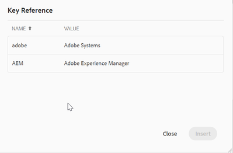

# 키 만들기

여러 곳에서 사용되지만 쉽게 변경될 수 있는 제품 이름 또는 제품 소개와 같이 결과 가능하고 일반적인 텍스트가 있는 경우 키를 사용해야 합니다. 이러한 재사용 가능한 텍스트에 키를 사용하면 키 값과 같은 단일 위치에서 변경을 통해 여러 위치에서 업데이트를 푸시할 수 있습니다.

## 1단계: 키 저장을 위한 글로벌 맵 만들기

맵을 만들고 [!UICONTROL keyref] 요소를 추가합니다.

```
<?xml version="1.0" encoding="UTF-8"?>
<!DOCTYPE map PUBLIC "-//OASIS//DTD DITA Map//EN" "technicalContent/dtd/map.dtd">
<mapid="map.ditamap_ffbdbf06-8658-4311-ad84-1c631bba904f">
  <title>global-keys-map</title>
  <keydefkeys="adobe">
    <topicmeta>
      <linktext>Adobe Systems</linktext>
    </topicmeta>
  </keydef>
  <keydefkeys="AEM">
    <topicmeta>
      <linktext>Adobe Experience Manager</linktext>
    </topicmeta>
  </keydef>
</map>
```

여기에서 위에 표시된 대로 두 개의 정의를 정의했습니다. [!UICONTROL keyref] 다음으로: _AEM_ 대상: _Adobe Experience Manager_ 텍스트를 입력하십시오.

## 2단계: 발행 맵에 이 맵 추가

```
<?xml version="1.0" encoding="UTF-8"?>
<!DOCTYPE map PUBLIC "-//OASIS//DTD DITA Map//EN" "technicalContent/dtd/map.dtd">
<mapid="map.ditamap_cbf4a96d-e382-4e8c-8830-bcc093fe6638">
  <title>sample-map</title>
  <topicrefhref="sample-topic-using-the-keys.dita"type="topic">
  </topicref>
  <maprefformat="ditamap"href="global-keys-map.ditamap"type="map">
  </mapref>
</map>
```

## 3단계: 키를 사용하여 글로벌 키 맵에 정의된 변수를 참조합니다.

+ 항목을 편집하고 다음을 사용하여 키 값 추가 [!UICONTROL keyref].
+ 스크린샷에 표시된 대로 키워드를 선택할 수 있는 작은 창이 나타납니다. &quot;keyword&quot; 요소를 추가하면 표시됩니다.
  
  

```
<?xml version="1.0" encoding="UTF-8"?>
<!DOCTYPE topic PUBLIC "-//OASIS//DTD DITA Topic//EN" "technicalContent/dtd/topic.dtd">
<topicid="topic.dita_31b00e61-04b5-4193-af7a-68503e88b087">
  <title>sample-topic-using-the-keys</title>
  <shortdesc></shortdesc>
  <body>
    <p>This is a sample topic using the keys defined in the global map</p>
    <p>here i am using the key definition for AEM :<keywordkeyref="AEM"></keyword></p>
  </body>
</topic>
```
