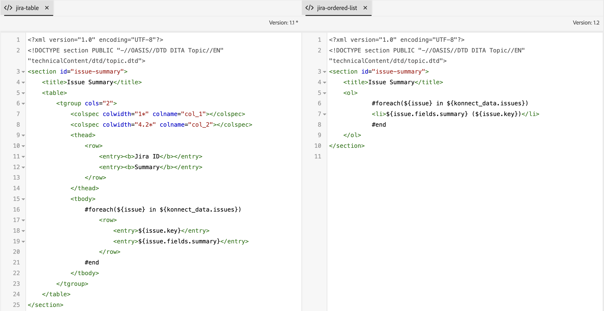

# 외부 데이터 소스 통합

외부 시스템의 데이터를 Experience Manager Guides 인스턴스에 쉽게 통합할 수 있습니다. 외부 데이터 소스에 연결하면 콘텐츠 관리 시스템의 기능과 유용성이 크게 향상될 수 있습니다.


데이터 통합을 사용하여 외부 소스에서 데이터를 효율적으로 연결하고 가져올 수 있습니다. 이 기능을 사용하면 IT 팀에 의존하여 데이터를 가져온 다음 수동으로 복사하여 붙여넣거나 외부 시스템의 변경 사항을 지속적으로 업데이트할 필요가 없습니다.

이 기능을 사용하면 원본 소스와의 동기화가 보장되고 수동 복사-붙여넣기 작업에 의존하지 않고 설명서를 조화롭게 업데이트할 수 있습니다. 또한 Experience Manager Guides과 외부 데이터 소스 간의 데이터 일관성을 유지하는 데 도움이 됩니다.

또한 외부 데이터 소스에서 컨텐츠를 가져온 후 DITA 형식으로 작성하고 통합된 컨텐츠도 재사용할 수 있습니다.


## 데이터 소스 통합 프레임워크

데이터 소스의 통합 프레임워크는 주로 외부 데이터 소스와 Experience Manager Guides 인스턴스로의 통합이라는 두 가지 주요 구성 요소를 포함합니다.

### 외부 데이터 소스

Experience Manager Guides에서 연결할 수 있는 일부 데이터 소스는 다음과 같습니다.

- 관계형 데이터베이스(RDBMS)
   - PostgreSQL, MySQL, Microsoft SQL Server, MariaDB 및 SQLite
- 비관계형 데이터베이스
   - MongoDB, Apache Cassandra, Apache CouchDB 및 Redis
- PIM(제품 정보 관리) / PLM(제품 수명주기 관리)
   - Pimcore, Salsify, Akeneo 및 Informatica
- 제품 관리 시스템
   - JIRA 및 Microsoft Azure DevOps 보드(ADO)
- OLAP(온라인 분석 처리) 및 Analytics 시스템

### Experience Manager Guides의 통합


인증된 커넥터를 사용하면 외부 시스템에서 데이터가 전송되고 Experience Manager Guides 내에서 데이터가 생성됩니다.


### Experience Manager Guides의 통합

콘텐츠를 Experience Manager Guides에 통합하려면 다음 단계를 수행하십시오.

1. **데이터 원본 커넥터 설정**
   - 데이터 소스 커넥터는 외부 데이터 소스와의 연결을 설정하는 인터페이스 역할을 합니다. 연결을 설정하고 `Basic Auth` 또는 `API key Auth`과(와) 같은 인증 방법을 포함하도록 커넥터를 구성해야 합니다. 암호화된 정보를 포함한 모든 구성 세부 정보는 Adobe Experience Manager에 안전하게 저장됩니다.
   - 커넥터 계층은 확장 가능하도록 설계되어 Experience Manager Guides에서 즉시 제공하지 않는 다양한 시스템에 연결하기 위한 구현을 만들 수 있습니다.
     
   >[!NOTE]
   >
   > 커넥터 정의 모듈에 액세스하고 커넥터 인터페이스를 구현하여 사용자 지정 커넥터를 만듭니다. [사용자 지정 데이터 원본 커넥터를 구성](./conf-custom-data-source-connector.md)하는 방법에 대해 자세히 알아보세요.

1. **속도 템플릿 사용자 지정**

   - Experience Manager Guides은 JSON 파일의 데이터를 DITA 콘텐츠로 변환하는 강력한 템플릿 엔진인 Velocity(https://velocity.apache.org/)를 지원합니다. Velocity는 중첩 수준에 관계없이 JSON 구조를 탐색할 수 있는 유연성을 제공합니다.
   - 다음 예제에서는 Velocity 템플릿과 Jira에서 가져온 데이터를 통합하여 테이블 또는 순서가 지정된 목록을 손쉽게 생성하는 방법을 보여 줍니다.
      - Jira 응답

        ```
        {
            "expand": "schema,names",
            "total": 5,
            "hostname": "https://jira.corp.adobe.com",
            "maxResults": "200",
            "issues": [
                {
                    "key": "DXML-12756",
                    "fields": {
                        "description": "Implement the snippet generator in External Data Source integration",
                        "summary": "Implement the snippet generator in External Data Source integration"
                    }
                },
                {
                    "key": "DXML-12755",
                    "fields": {
                        "description": "Implement the topic generator in External Data Source integration",
                        "summary": "Implement the topic generator in External Data Source integration"
                    }
                },
                {
                    "key": "DXML-12745",
                    "fields": {
                        "description": "Implement the ability to register a new connector",
                        "summary": "Implement the ability to register a new connector"
                    }
                }
            ],
            "startAt": 0
        }
        ```

      - 템플릿
        {width="800" align="left"}
      - 동일한 데이터 소스에서 생성되었지만 다른 템플릿에서 생성된 데이터
        {width="800" align="left"}

1. **템플릿을 사용하여 콘텐츠 생성**
   - 작성한 템플릿에서 콘텐츠를 생성할 수 있습니다.
   - 다양한 유형의 콘텐츠를 생성할 수 있습니다.
      - 코드 조각: 일회성 사용 가능한 콘텐츠입니다. 커넥터에서 정의된 템플릿으로 데이터를 생성한 다음 원하는 태그에 포함할 수 있습니다.
      - DITA 주제: 콘텐츠에서 그대로 사용하거나 *재사용 가능한 구성 요소*(으)로 재사용할 수 있는 다양한 주제를 생성합니다.
      - DITA 주제 + 맵: 주제와 함께 전체 맵을 생성한 다음 데이터를 직접 게시하거나 다른 데이터에서 *재사용 가능한 구성 요소*(으)로 사용할 수도 있습니다.


1. **통합 콘텐츠 Publish**
   - 게시는 Experience Manager Guides의 OOTB 기능이며 외부 시스템에서 생성된 모든 데이터를 PDF 또는 AEM Site 출력으로 직접 게시할 수 있습니다.

>[!MORELIKETHIS]
>
> 다음 문서에서는 커넥터 구성 및 인스턴스에서 사용하는 방법에 대한 자세한 내용을 제공합니다.
> - [데이터 원본 커넥터 구성](../../../install-guide/conf-data-source-connector-tools.md)
> - [조각 또는 주제를 사용하여 콘텐츠 생성](../../../user-guide/web-editor-content-snippet.md)