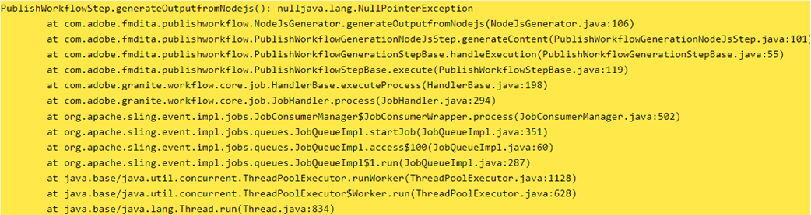

# 기본 PDF 게시를 위한 AEM 환경 구성

AEM Guides에는 사용자가 PDF 형식으로 컨텐츠를 디자인, 개발 및 게시할 수 있도록 하는 기본 PDF 게시 엔진이 포함되어 있습니다.

다양한 페이지 레이아웃, CSS 템플릿을 만들고 페이지 레이아웃 및 CSS와 함께 PDF 템플릿을 디자인하는 기능을 제공합니다.

AEM Guides에서 이 기본 PDF을 구성하는 단계는 운영 체제에 따라 다릅니다. AEM이 설치된 운영 체제에 따라 아래 구성 단계를 사용하십시오.

## 사전 요구 사항

기본 PDF 설정을 위한 최소 요구 사항:

- 설치된 Java Platform, Standard Edition 8 또는 11 JDK(Java SE Development Kit) 및 JRE(Java SE Runtime Environment)
- AEM 6.5 SP13, SP12, SP11 또는 SP10
- Guides 4.1 이상 버전 (비 UUID 또는 UUID)

기본 PDF 게시 엔진은 AEM crx-quickstart 폴더에 노드 모듈을 생성하려면 Oracle JDK가 필요합니다. 기본적으로 다음 운영 체제를 지원합니다.

- Windows 10, windows 2019 서버 이상.
- Linux - (RHEL 8 이상, CentOS 7 이상, Ubuntu 18 이상 버전)
- Mac OS(Intel 기반)

## Windows Server(JAVA 11/8)용 구성 단계

1. AEM 서버가 다운되었는지 확인합니다.
2. Windows 작업 표시줄에서 Windows 아이콘을 마우스 오른쪽 단추로 클릭하고 시스템을 선택합니다.
3. 설정 창의 관련 설정에서 고급 시스템 설정을 클릭합니다.
4. 고급 탭에서 환경 변수를 클릭합니다.
5. 시스템 변수 섹션에서 다음을 클릭합니다._신규_&quot;새 환경 변수를 생성합니다.
6. 변수 이름을 JAVA_HOME으로 입력합니다.
7. 값 필드에서 Java 설치 경로를 입력하고 확인을 클릭합니다.

   예:

   JAVA 11:

   C:\Program Files\JAVA\jdk-11.0.15.1

   JAVA 8:

   C:\Program Files\JAVA\ jdk1.8.0_144

8. 추가 시스템 변수에서 경로 선택을 클릭하고 편집 을 클릭합니다.

9. 이제 경로 변수 내에서 서버 경로의 값을 제공하고 확인을 클릭합니다.

   예:

   JAVA 11:

   %JAVA_HOME%\bin\server\

   JAVA 8:

   %JAVA_HOME%\jre\bin\server\

10. 환경 변수 대화 상자에서 &#39;확인&#39;을 다시 클릭합니다.
11. 시스템 속성 대화 상자에서 &#39;확인&#39;을 다시 클릭합니다.
12. 이제 AEM 서버를 시작합니다.
13. 웹 편집기의 사전 설정에서 기본 PDF을 생성합니다.

## Linux 서버용 구성 단계(RHEL7/centOS 7)

1. AEM 서버가 다운되었는지 확인합니다.
2. echo $JAVA_HOME을 수행하여 JAVA_HOME 변수를 확인합니다.
3. JAVA_HOME 변수가 설정되지 않은 경우 4단계를 따릅니다. 그렇지 않으면 5단계로 바로 이동합니다.
4. 설치된 Java 버전을 기반으로 하는 아래 명령을 사용하여 JAVA_HOME 변수를 설정합니다

   예:

   JAVA 11:

   1. export JAVA\_HOME=/usr/lib/jvm/java-11.0.15.1
   2. 내보내기 경로=$PATH: $JAVA\_HOME/bin
   3. export LD\_LIBRARY\_PATH=/usr/lib/jvm/jdk-11.0.15.1/lib/server:/usr/java/jdk-11.0.15.1/lib/server

   JAVA 8:

   1. export JAVA\_HOME=/usr/lib/jvm/java-11.0.15.1
   2. 내보내기 경로=$PATH: $JAVA\_HOME/bin

5. Guides 버전 4.2 이상을 사용하는 경우 AEM Server를 다시 시작하고 12단계로 이동합니다.
6. 를 복사합니다._node_modules.zip_&#x200B;이 문서 하단에 있는 &quot; crx-quickstart/profiles/nodejs—b1aad0a7-9079-e56c-1ed8-6fcabe8166/ 디렉토리에 첨부되었습니다.
7. crx-quickstart/profiles/nodejs—b1aad0a7-9079-e56c-1ed8-6fcabe8166/ 위치의 터미널 열기
8. 아래 명령을 사용하여 node_modules 디렉터리 삭제

   **rm -rf node_modules**

9. 아래 명령을 사용하여 node_modules.zip 압축 해제

   **unzip node_modules.zip**

10. unzip 명령이 설치/인식되지 않으면 다음 명령을 사용하여 설치할 수 있습니다

   **yum install unzip**

11. fontconfig 패키지를 설치합니다.
명령: yum install fontconfig
12. 웹 편집기의 사전 설정에서 기본 PDF을 생성합니다.

**참고** : node_modules.zip 패키지를 다운로드할 수 있습니다. [여기](https://acrobat.adobe.com/link/track?uri=urn:aaid:scds:US:295d8f03-41e1-429b-8465-2761ce3c2fb3).

Linux 운영 체제용 다운로드한 노드 모듈을 수동으로 가져오는 것은 Guides 4.1 이하 버전(6-12단계)을 사용하는 사용자를 위한 해결 방법입니다

## Mac 시스템에 대한 구성 단계(JAVA 11/8)

1. oracle JAVA 11 또는 Oracle JAVA 8을 설치합니다.
2. JAVA_HOME 환경 변수를 설치된 JAVA 디렉토리로 설정합니다.
3. Unix 셸을 엽니다.
(여기서 Bash는 구성 설정에 사용됩니다.)

   명령: nano ~/.bashrc

4. 설치된 Java 버전을 기반으로 하는 아래 명령을 사용하여 JAVA_HOME 변수를 설정합니다

   예:

   JAVA 11:

   export JAVA\_HOME= /Library/Java/JavaVirtualMachines/jdk-11.0.15.1.jdk/Contents/Home

5. 기본 다시 로드

   명령: source ~/.bashrc.

6. 명령 echo $JAVA_HOME을 사용하여 JAVA_HOME이 설정되었는지 확인

7. AEM 설치 경로에서 아래 세 가지 명령 실행

   C:/{aem-installation-folder}/crx-quickstart/profiles/nodejs—b1aad0a7-9079-e56c-1ed8-6fcabe8166

   i) 찾기 . -type d -exec chmod 0755 {} \; ii) 을(를) 찾습니다. -type f -exec chmod 0755 {} \; iii) 을 참조하십시오./node-darwin/bin/node node-darwin/lib/node_modules/npm/bin/npm-cli.js —접두사 . install —unsafe-perm —scripts-prepend-node-path

8. 아래 명령을 사용하여 Java가 설치되었는지 확인합니다

   i) 실행 **./node-darwin/bin/node** /crx-quickstart/profiles/nodejs—b1aad0a7-9079-e56c-1ed8-6fcabe8166 폴더의 명령

   

   ii) a = require(&#39;java&#39;)

9. fontconfig 패키지를 설치합니다.
명령: apt install fontconfig

10. 웹 편집기의 사전 설정에서 기본 PDF을 생성합니다.

## 문제 해결

다음은 환경 변수가 제대로 설정되지 않은 경우 PDF 생성 중에 발생할 수 있는 일반적인 오류입니다.

### Windows/Mac OS에서 Null 포인터 예외

Java 환경 설정을 수정한 후에도 문제가 지속되면 다음 사항을 다시 확인하십시오.

1. 출력 사전 설정이 올바르게 정의되었는지 확인하거나 공백 없이 새 출력 사전 설정을 만듭니다.

2. /libs/fmdta/node_resources에서 노드 리소스 디렉토리를 확인하여 설치 중에 필요한 모든 라이브러리가 설치되었는지 확인합니다.

### RHEL 7 Linux OS에 누락된 라이브러리

### 게시 프로세스 시간 초과. 지정된 시간 0ms 내에 프로세스가 완료되지 않았습니다.

CRX 저장소의 /var/dxml/profiles/b1aad0a7-9079-e56c-1ed8-6fcabe8166/nodejs에 있는 nodejs 노드에 대한 시간 초과 속성 값의 유효성을 검사합니다. 기본값은 300입니다.

위의 단계를 수행하는 동안 문제가 발생하면 AEM Guides 커뮤니티에 질문을 게시하십시오 [포럼](https://experienceleaguecommunities.adobe.com/t5/experience-manager-guides/ct-p/aem-xml-documentation) 도움이 필요하신가요?
