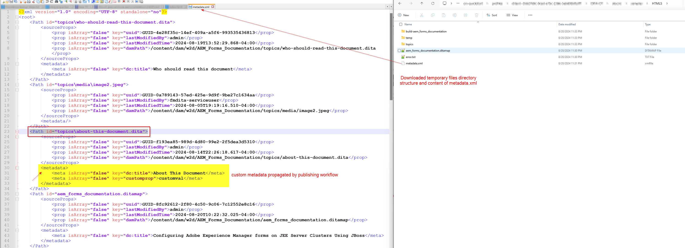

# 이 문서 정보

이 문서에서는 metadata.xml _(임시 파일에서 사용 가능)_&#x200B;을(를) 읽고 AEM Guides 게시 워크플로에서 전달된 속성을 DITA-OT 플러그인으로 활용하는 DITA-OT 플러그인 변경 사항을 구현하고 생성된 출력에서 설정하는 방법에 대해 설명합니다.

다음은 이 문서에서 배울 단계입니다.
- AEM Guides에서 ditamap의 출력 사전 설정에 메타데이터 설정
- 출력 생성 시 DITA-OT 임시 디렉터리에서 이 metadata.xml에 액세스합니다
- 이 _metadata.xml_&#x200B;을 읽고 생성된 출력에서 사용 가능한 속성을 사용하도록 DITA-OT 플러그인의 구현입니다.
- 생성된 출력을 확인하여 전파된 메타데이터 확인

## 배경

AEM Guides에서는 DITA-OT 플러그인을 사용하여 구성된 플러그인을 사용하여 원하는 출력 형식으로 게시할 수 있습니다.
AEM DAM에서 관리되는 에셋의 메타데이터를 DITA-OT 프로세스에 전달하여 생성된 출력에서 사용할 수도 있습니다. [ditamap/topics를 설정하여 출력 사전 설정을 통해 메타데이터를 전달하는 방법](https://experienceleague.adobe.com/en/docs/experience-manager-guides/using/user-guide/output-gen/pass-metadata-dita-ot)에 대한 설명서를 참조하십시오.


## 가정

AEM Guides 버전 4.4.0/2024.6 이상의 AEM 설정이 있습니다.
DITA-OT 작동 방식과 디렉터리 구조에 대한 사전 지식이 있습니다


## 단계 설명

### 에셋에 대한 메타데이터 설정 중

AEM Assets 메타데이터 스키마를 사용하면 AEM에서 Assets에 대한 사용자 지정 속성 필드를 만들 수 있으며 사용자는 에셋에 메타데이터를 할당할 수 있습니다. _customprop_(이)라는 메타데이터를 설정할 수 있는 _topic_ 에셋의 예 - 아래 스크린샷을 참조하십시오.


### DITA-OT에 전달하기 위해 ditamap 출력 사전 설정에서 메타데이터 구성

맵에서 원하는 출력 사전 설정을 구성하여 메타데이터를 내보내고 DITA-OT로 전달
DITA-OT 플러그인을 사용하여 HTML5 출력을 생성하고 있다고 가정해 보겠습니다. _adobe.html_.
DITA-OT 플러그인에 메타데이터를 전달하기 위해 맵의 출력 사전 설정을 구성하는 방법을 이해하려면 아래 스크린샷을 참조하십시오.
1. 맵을 열고 이 맵의 _출력_ 탭으로 이동한 다음 HTML5 사전 설정을 열고 _고급_ 탭을 클릭합니다. 이 탭에서 변형 이름을 _adobe.html_(이 예제를 위해 구성하고 사용하는 플러그인이므로 사용자 지정 플러그인도 정의할 수 있음)로 설정합니다.
2. 임시 파일을 다운로드하고 metadata.xml의 형성 방법을 확인하려면 _임시 파일 유지_&#x200B;를 설정하십시오. 이 작업은 개발에 사용할 수 있습니다.
3. metadata.xml을 통해 DITA-OT에 전달할 메타데이터 등록 정보를 선택합니다. 이 예제에서는 _dc:title_ 및 _customprop_&#x200B;을(를) 전달하려고 한다고 가정합니다.
4. 사전 설정을 저장하고 출력 생성
5. 사전 설정에 표시된 버튼을 사용하여 임시 파일 다운로드

위의 단계를 이해하려면 아래 스크린샷을 참조하십시오.


### DITA-OT 플러그인 구현

#### 임시 디렉터리의 metadata.xml 액세스

다운로드한 임시 파일 패키지에는 속성 및 값의 구조를 볼 수 있는 metadata.xml 파일이 표시됩니다(아래 스크린샷 참조)


##### metadata.xml 이해

- 이 파일에는 게시된 모든 에셋 목록이 포함되어 있으며 각 에셋에는 다음이 포함되어 있습니다.
   - DITA 디렉터리 [Path 요소의 id 특성]에 있는 파일의 경로
   - _metadata_ 요소]의 메타데이터 속성 값 쌍 [ 목록

```
        <Path id="topics\about-this-document.dita">
            <sourceProps>
                ...
            </sourceProps>
            <metadata>
                <meta isArray="false" key="dc:title">About This Document</meta>
                <meta isArray="false" key="customprop">customval</meta>
            </metadata>
        </Path>
```

#### DITA-OT 플러그인의 각 에셋에 대한 메타데이터 액세스

DITA-OT 플러그인이 _metadata.xml_ 및 이 플러그인에서 사용할 수 있는 속성을 읽으려면 다음을 수행해야 합니다.
- _plugins.xml_&#x200B;에서 사용자 지정 플러그인 설정을 정의합니다. 여기서 플러그인 초기화에 대한 매개 변수 및 통합자를 정의합니다. 샘플 플러그인 파일은 다음과 같습니다.

```
<?xml version="1.0" encoding="UTF-8"?>
<plugin id="com.adobe.html">
    <require plugin="org.dita.html5"/>
    <feature extension="dita.conductor.transtype.check" value="adobe.html"/>
    <feature extension="ant.import" file="integrator.xml"/>
    <feature extension="dita.conductor.html5.param" file="params.xml"/>
    <feature extension="package.version" value="2024.1"/>
</plugin>
```

- 플러그인 시작 시:
   - plugin 아래의 _integrator.xml_&#x200B;에 있는 metadata.xml 파일을 가리키도록 변수를 설정하고 속성을 설정하여 메타데이터 파일의 경로를 정의합니다.
   - 사용자 지정 xsl 변환 규칙을 실행하는 파일, 즉 _args.xsl_&#x200B;을(를) 정의합니다. 이 경우 _xsl/adobe-html5.xsl_ 파일을 가리킵니다.
아래 코드를 참조하십시오.

```
    <property name="adobe.html.xsl.dir" value="${dita.plugin.com.adobe.html.dir}${file.separator}xsl${file.separator}"/>
    <property name="args.xsl" location="${adobe.html.xsl.dir}adobe-html5.xsl" />
    <dirname property="input.dirname" file="${args.input}"/>
    <makeurl file="${input.dirname}/metadata.xml" property="metadata.url"/>
```

- 필요에 따라 활용하려면 변수 _metadata.url_&#x200B;의 값을 사용자 지정 XSL에 전달합니다. 즉, 기존/생성된 _param.xml_&#x200B;에서 매개 변수를 플러그인에 전달합니다. 샘플 params.xml 파일 아래를 참조하십시오.

```
    <?xml version="1.0" encoding="UTF-8"?>
    <params xmlns:if="ant:if">
        <param name="metadata.url" expression="${metadata.url}" if:set="metadata.url"/>
    </params>
```

- 사용자 지정 XSL 변환 파일 _xsl/adobe-html5.xsl_&#x200B;에서 메타데이터 파일의 메타데이터 값을 읽고 원하는 방식으로 출력에서 설정할 수 있습니다. 이 예제에서는 메타데이터 값을 html head > meta 태그에 추가합니다. 아래 코드를 참조하십시오.

```
<xsl:import href="plugin:org.dita.html5:xsl/dita2html5.xsl"/>
    <xsl:param name="metadata.url"/>
    <xsl:template name="copyright">
        <xsl:if test="doc-available( $metadata.url )">
            <xsl:variable name="docName" select="tokenize( base-uri(), '/' )[ last() ]"/>
            <xsl:variable name="doc" select="doc( $metadata.url )"/>
            <xsl:for-each select="$doc//Path[ ends-with( @id, concat( '\', $docName ) ) ]/metadata/meta">
                <meta name="{ @key }" content="{ . }"/>
            </xsl:for-each>
        </xsl:if>
    </xsl:template>
```

위의 단계를 강조 표시하는 아래 스크린샷을 참조하십시오.


### 플러그인 구현 테스트

다음 명령을 실행하여 AEM(맵 콘텐츠 및 해당 metadata.xml)에서 다운로드한 임시 파일로 플러그인을 테스트할 수 있습니다

```
./dita --input=docsrc/samples/HTML5/aem_forms_documentation.ditamap --format=adobe.html
```

다운로드한 임시 파일을 &quot;DITA-OT/docsrc/samples/HTML5&quot; 디렉토리에 복사했다고 가정합니다.
아래 리소스 섹션에 제공된 샘플도 다운로드할 수 있습니다.

위의 명령을 실행하면 &quot;DITA-OT/bin/out&quot; 디렉터리에서 출력을 확인할 수 있습니다. 이 디렉터리에서는 _head_ 요소에 사용자 지정 메타데이터가 있는 &quot;about-this-document.dita&quot; 주제에 대해 생성된 html 파일을 확인할 수 있습니다

```
<head>
    <meta http-equiv="Content-Type" content="text/html; charset=UTF-8">
    <meta charset="UTF-8">
    <meta name="copyright" content="(C) Copyright 2024">
    <meta name="DC.format" content="HTML5">
    <meta name="DC.identifier" content="GUID-f193ea85-989d-4d80-99e2-2f5dea3d5310">
    <meta name="DC.language" content="en-US">
    <meta name="dc:title" content="About This Document">
    <meta name="customprop" content="customval">
    <title>About This Document</title>
</head>
```

### 배포

DITA-OT 플러그인을 개발했으면 DITA-OT 디렉터리 아래의 _dita —install_ 명령을 사용하여 DITA-OT에 이 플러그인을 통합하고 AEM 서버에 배포할 수 있습니다. [자세한 내용은 이 문서를 참조하십시오.](https://experienceleaguecommunities.adobe.com/t5/experience-manager-guides/steps-to-setup-a-custom-dita-ot/td-p/407659)


## 리소스

1. 샘플 ditamap - [이 링크를 사용하여 다운로드](../../assets/publishing/sample-temp-html5-adobe.html-content.zip)에서 다운로드한 샘플 임시 파일
2. 위에서 설명한 구현이 포함된 DITA-OT 플러그인 [이 링크를 사용하여 다운로드](../../assets/publishing/sample-custom-plugin-com.adobe.html.zip)