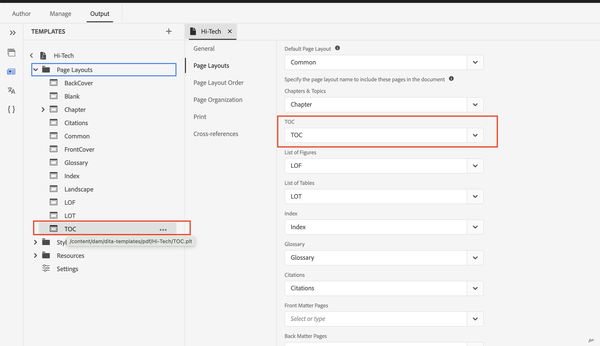

# PDF 게시에서 북맵의 TOC 생성

## 북맵 설정

`<toc>` 요소 포함:
북맵의 `<frontmatter>`요소 내에서 `<booklists>` 요소를 찾습니다.  다음과 같이 `<booklists>` 내에 `<toc>` 요소를 중첩합니다.

```
<frontmatter>
  <booklists>
    <toc/>  <figurelist/>
    <tablelist/>
  </booklists>
</frontmatter>
```

DITA 사양을 사용하면 목차와 책 목록을 `<backmatter>` 섹션 내에 배치할 수도 있습니다.


```
<backmatter>
    <booklists>
      <toc/>
      <figurelist/>
      <indexlist/>
    </booklists>
  </backmatter>
```

TOC , 그림 목록 및 표 목록(앞쪽)과 색인 목록(뒷쪽)이 있는 북맵의 샘플 구조.

```
<bookmap>
  <title>My Bookmap Title </title>
  <frontmatter>
    <booklists>
      <toc/>
      <figurelist/>
      <tablelist/>
    </booklists>
  </frontmatter>

  <chapter href="chapter1.ditamap">
  <chapter href="chapter2.ditamap">
  </chapter>

  <backmatter>
    <booklists>
      <indexlist/>
    </booklists>
  </backmatter>
</bookmap>
```

TOC 및 북리스트는 북맵에 정의된 구조를 기반으로 자동으로 생성됩니다.

북맵이 설정되면 기본 PDF을 사용하여 PDF 출력을 생성합니다. 이 템플릿은 TOC 및 북리스트를 비롯한 북맵 구조 및 참조를 처리합니다.

## PDF의 TOC 디자인 및 순서

기본 PDF 기능은 목차의 레이아웃 및 디자인을 맞춤화하는 편리한 방법을 제공합니다.

layout.css를 통해 TOC 및 스타일에 대한 별도의 페이지 레이아웃을 통해 디자인을 제어할 수 있습니다.

PDF의 TOC 및 기타 북리스트 순서는 북맵의 구조만 기반으로 합니다.




## FAQ

### PDF에 Ditamap의 TOC를 포함하는 방법

Ditamaps 자체는 북맵처럼 목차(TOC)를 직접 가지고 있지 않습니다. 그러나 ditamaps는 콘텐츠의 구조를 정의하는 데 중요한 역할을 하며 TOC 생성 프로세스에 간접적으로 기여합니다.

Ditamap을 게시하는 경우 기본 PDF은 TOC 및 북리스트를 자동으로 생성하는 기능을 제공합니다. 기본 PDF 설정에서 ditamap의 TOC 생성을 활성화/비활성화할 수 있습니다.


## 추가 리소스 :

- [기본 PDF 디자인 페이지 레이아웃 설명서](https://experienceleague.adobe.com/en/docs/experience-manager-guides/using/install-guide/on-prem-ig/output-gen-config/config-native-pdf-publish/design-page-layout)
- [기본 PDF essentials 사전 기록된 전문가 세션](https://experienceleague.adobe.com/en/docs/experience-manager-guides/using/knowledge-base/expert-session/native-pdf-publishing-essentials-feb23)

<br>
<br>

모든 쿼리를 위해 AEM Guides 커뮤니티 [포럼](https://experienceleaguecommunities.adobe.com/t5/experience-manager-guides/ct-p/aem-xml-documentation)에 게시하십시오.


