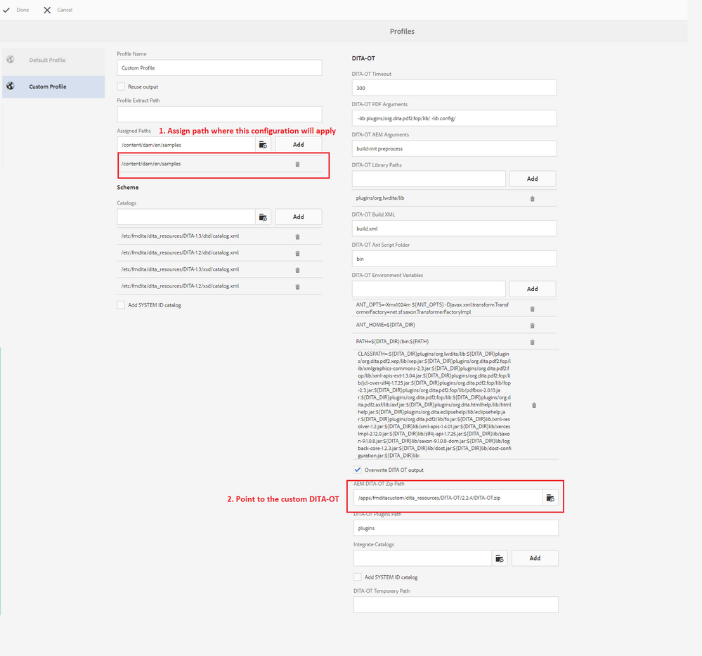

# AEM용 [!DNL AEM Guides]에서 사용자 지정 DITA-OT 설정

사용자 지정 DITA-OT를 추가하는 단계는 _설치 및 구성 안내서_&#x200B;의 _사용자 지정 DITA-OT 플러그인 사용_ 섹션에 설명되어 있습니다.

높은 수준에서 단계는 다음과 같습니다.

+ 기본 DITA-OT 가져오기
   + [!DNL AEM Guides]에서 기본 DITA-OT의 복사본을 가져오려면 `/etc/fmdita/dita_resources/DITA-OT.zip` 경로에서 다운로드하십시오
   + 다른 버전을 얻으려면 [dita-ot 저장소](https://www.dita-ot.org/download)에서 다운로드할 수 있습니다.
+ [새 플러그인 추가](https://www.dita-ot.org/dev/topics/plugins-installing.html) 또는 기존 플러그인 사용자 지정과 같이 DITA-OT를 변경합니다(아래 관련 링크 섹션의 예 참조).
+ `DITA-OT.zip` 업로드가 `/apps/<project-folder>/dita_resources`에 수신되었습니다. 사용자 지정 프로젝트 폴더를 만드는 것이 좋습니다.
+ **[!UICONTROL 도구]** > **[!UICONTROL 안내서]** > **[!UICONTROL DITA 프로필]**&#x200B;을 통해 DITA 프로필을 추가합니다(사용자 지정 DITA-OT가 업로드되는 DITA-OT 경로 사용, 아래 스크린샷 참조).
  

>[!MORELIKETHIS]
>
>+ [DITA-OT 플러그인 샘플 사용자 지정](https://www.dita-ot.org/dev/topics/pdf-customization.html)
