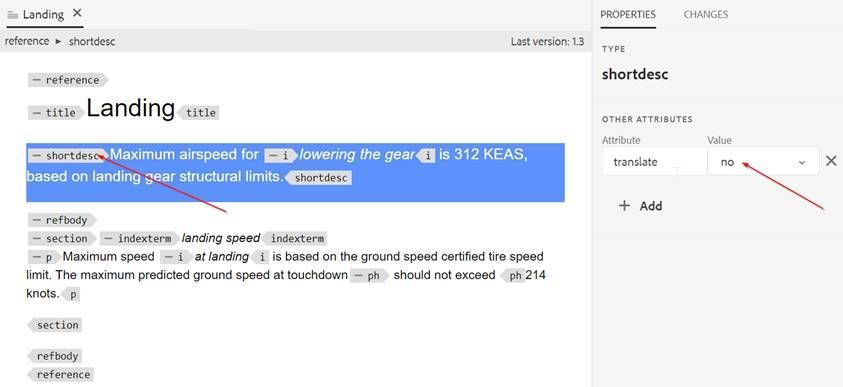
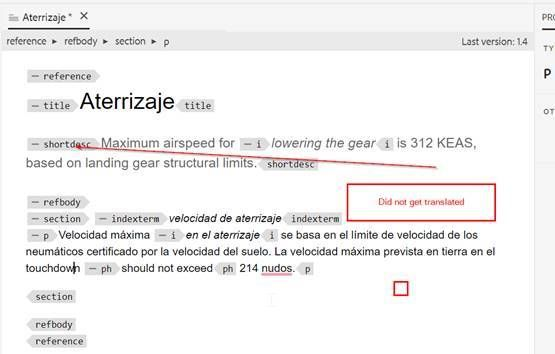

# 항목 내의 단락을 번역에서 제외하는 방법

가장 쉬운 방법은 translation=no attribute 를 사용하는 것입니다.

+ 작성자는 번역하지 않으려는 단락에 추가 특성을 **translation=no**(으)로 삽입할 수 있습니다. 번역 공급업체에 정보를 제공하고 마지막에서 이 특성이 있는 텍스트를 무시하도록 구성할 수 있습니다.
+ OOTB 기계 번역(체험판 Microsoft 번역 커넥터 사용)에도 동일한 동작이 표시됩니다.
+ Microsoft 번역을 사용하여 테스트 : 단락 수준에서 **translate=no** 특성을 정의하면 전체 단락이 번역되지 않습니다. 이 속성은 모든 요소에서 정의할 수 있으며 해당 요소 내의 콘텐츠는 번역되지 않습니다.

다음은 이를 자세히 설명하는 몇 가지 스크린샷입니다.

**Source 컨텐츠**

**스페인어로 번역된 콘텐츠**

