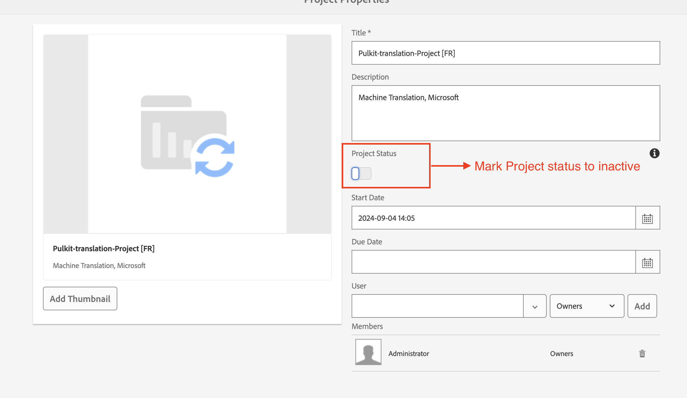

# AEM Guides에서 번역을 위해 따라야 할 모범 사례

시간이 지남에 따라 시스템의 번역 활동이 증가함에 따라 번역 프로젝트의 성능이 감소할 수 있습니다.

각 번역 프로젝트는 액세스를 위해 여러 사용자 그룹을 생성하여 시스템 내 사용자 그룹 수를 증가시킵니다. 사용자 그룹 수가 확장되면 사용자 권한과 관련된 CRUD 작업 속도가 점차 느려질 수 있으므로 전체 AEM 성능에 영향을 줄 수 있습니다. 또한 완료 후에도 번역 프로젝트가 활성 상태를 유지하는 경우 AEM과 번역 공급업체 간 번역 동기화 성능에 부정적인 영향을 줄 수 있습니다.

**아래 설명된 모범 사례를 따르면 효율적인 환경을 유지하는 데 도움이 됩니다.**

## 4.6(온-프레미스) 또는 2404(클라우드)보다 이전 빌드를 사용하는 경우:

- 번역이 완료되고 승인되면 모든 프로젝트를 &quot;비활성&quot;으로 표시합니다. 프로젝트는 검토 가능한 상태로 유지되며 단순히 비활성 상태로 표시됩니다.
   - 이러한 단계를 수행하면 전반적인 번역 성능을 양호한 상태로 유지하는 데 도움이 됩니다.

     

- 비활성, 승인 및 검토됨으로 표시된 이전 프로젝트 폴더의 경우 삭제해야 합니다.
   - 이러한 단계를 수행하면 이 프로젝트 폴더와 연결된 임시 번역 파일 및 사용자 그룹을 정리하여 전체 번역 성능을 정상적으로 유지할 수 있습니다.

      삭제

## 를 켜면 빌드 4.6 또는 2404 이상:

위에서 언급한 것과 동일한 단계를 계속 따를 수 있습니다. 버전 4.6/2404부터 AEM Guides에서는 관리자가 번역 프로젝트의 자동 삭제를 비활성화할 수 있는 편집기 설정을 도입했습니다.

참조: [완료된 번역 프로젝트를 자동으로 삭제하거나 사용하지 않도록 설정](https://experienceleague.adobe.com/en/docs/experience-manager-guides/using/user-guide/author-content/create-preview-topics/author-content-aem-guides/work-with-web-editor/translate-documents-web-editor#automatically-delete-or-disable-a-completed-translation-project)

에서 번역 프로젝트를 삭제하고 사용하지 않도록 설정하는 자동화된 설정
